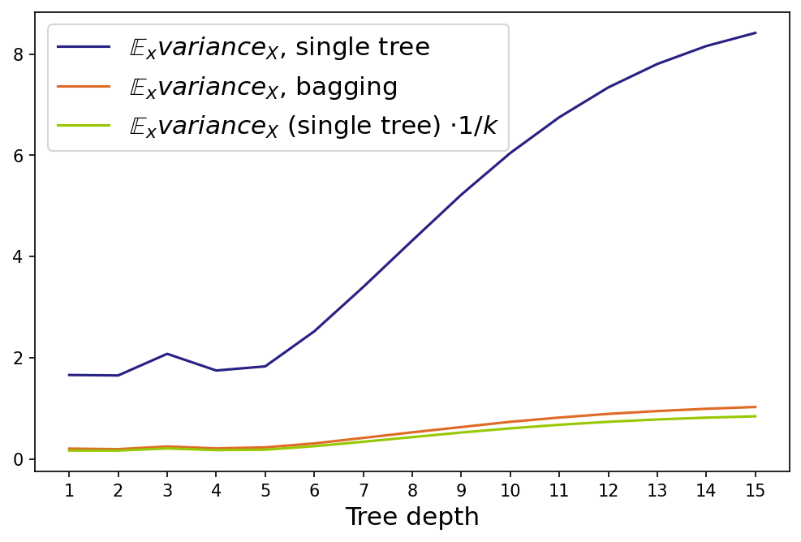

$\newcommand{\Var}{\operatorname{\mathbb{V}\text{ar}}}$
$\newcommand{\Exp}{\operatorname{\mathbb{E}}}$
$\newcommand{\eps}{\varepsilon}$

Представим, что у вас есть несколько моделей, обученных на ваших данных. Можно ли придумать процедуру, которая позволит использовать все имеющиеся модели и при этом получить на тестовых данных качество выше, чем могла показать каждая из этих моделей в отдельности?

# Смещение и разброс

Предположим, что мы решаем задачу регрессии с квадратичной функцией потерь. При использовании квадратичной функции потерь для оценки качества работы алгоритма $a$ можно использовать следующий функционал:

$$
    Q(a) = \Exp_x \Exp_{X, \eps} [y(x, \eps) - a(x, X)]^2,
$$

где

- $X$ -- обучающая выборка
- $x$ -- точка из тестового множества
- $y = f(x) + \eps$ -- целевая зависимость, которую мы можем измерить с точностью до случайного шума $\eps$
- $a(x, X)$ -- значение алгоритма, обученного на выборке $X$, в точке $x$
- $\Exp_x$ -- среднее по всем тестовым точкам и $\Exp_{X, \eps}$ -- среднее по всем обучающим выборкам $X$ и случайному шуму $\eps$

Для $Q(a)$ существует разложение на три компоненты -- шум, смещение и разброс. Это разложение называется bias-variance decomposition, и оно является одним из мощных средств для анализа работы ансамблей. О, том как его вывести, вы узнаете в соответствующей [главе](../ml_theory/bias_variance_decomposition), а здесь мы приведём его формулировку.

<u> Bias-variance decomposition </u>. Существует представление $Q(a)$ в виде трёх компонент:

$$
    Q(a) = \Exp_x \text{bias}_X^2 a(x, X) + \Exp_x \Var_X[a(x, X)] + \sigma^2,
$$

где

$$
    \text{bias}_X a(x, X) = f(x) - \Exp_X[a(x, X)]
$$

-- **смещение** предсказания алгоритма в точке $x$, усреднённого по всем возможным обучающим выборкам, относительно истинной зависимости $f$,

$$
    \Var_X[a(x, X)] = \Exp_X \left[ a(x, X) - \Exp_X[a(x, X)] \right]^2
$$

-- **дисперсия (разброс)** предсказаний алгоритма в зависимости от обучающей выборки $X$,

$$
    \sigma^2 = \Exp_x \Exp_\eps[y(x, \eps) - f(x)]^2
$$

-- неустранимый **шум** в данных.

Раз нам известно, что ошибка алгоритма раскладывается на шум, смещение и разброс, можно подумать над способом сократить ошибку. Будет разумно попытаться сначала уменьшить одну из составляющих. Понятно, что с шумом уже ничего не сделать -- это минимально возможная ошибка. Какую можно придумать процедуру, чтобы, например, сократить разброс, не увеличивая смещение?

Пример приходит из жизни древних греков. Если много древних греков соберутся на одном холме и проголосуют независимо друг от друга, то вместе они придут к разумному решению несмотря на то, что опыт каждого из них субъективен. Аналогом голосования в мире машинного обучения является бэггинг.

# Бэггинг

Идея **бэггинга** (bagging, bootstrap aggregation) заключается в следующем. Выберем из обучающей выборки $n$ примеров. Будем выбирать примеры равновероятно, с повторением. Получим новую выборку $X^1$, в которой некоторых элементов исходной выборки не будет, а какие-то могут войти несколько раз. С помощью некоторого алгоритма $b$ обучим на этой выборке модель $b_1(x) = b(x, X^1)$. Повторим процедуру: сформируем вторую выборку $X^2$ из $n$ элементов с возвращением и с помощью того же алгоритма обучим на ней модель $b_2(x) = b(x, X^2)$. Повторив так $k$ раз, получим $k$ моделей, обученных на $k$ выборках. Чтобы получить одно предсказание, усредним предсказания всех моделей:

$$a(x) = \frac{1}{k}(b_1(x) + \dots + b_k(x)).$$

Процесс генерации подвыборок с помощью семплирования с возвращением называется **бутстрепом** (bootstrap), а модели $b_1(x), \ldots, b_k(x)$ часто называют **базовыми алгоритмами** (хотя, наверное, лучше было бы назвать их базовыми моделями). Модель $a(x)$ называется ансамблем этих моделей.

Посмотрим, что происходит с качеством предсказания при переходе от одной модели к ансамблю. Сначала убедимся, что смещение ансамбля не изменилось по сравнению со средним смещением отдельных моделей. Будем считать, что когда мы берём матожидание по всем обучающим выборкам $X$, то в эти выборки включены также все подвыборки, полученные бутстрепом.

$$
    \text{bias}_X a(x, X) = f(x) - \Exp_X[a(x, X)] = f(x) - \Exp_X \left[ \frac{1}{k} \sum_{i = 1}^k b(x, X^i) \right] =
$$

$$
    = f(x) - \frac{1}{k} \sum_{i = 1}^k \Exp_X \left[ b(x, X^i) \right] = f(x) - \frac{1}{k} \sum_{i = 1}^k \Exp_X \left[ b(x, X) \right] = f(x) - \Exp_X b(x, X)
$$

Получили, что смещение композиции равно смещению одного алгоритма. Теперь посмотрим, что происходит с разбросом.

$$
    \Var_X[a(x, X)] = \Exp_X \left[ a(x, X) - \Exp_X[a(x, X)] \right]^2 = \\
    = \Exp_X \left[ \frac{1}{k} \sum_{i = 1}^k b(x, X^i)- \Exp_X \left[ \frac{1}{k} \sum_{i = 1}^k b(x, X^i) \right] \right]^2 = \\
    = \frac{1}{k^2} \Exp_X \left[ \sum_{i = 1}^k \left( b(x, X^i) - \Exp_X b(x, X^i) \right) \right]^2 = \\
    = \frac{1}{k^2} \sum_{i = 1}^k \Exp_X (b(x, X^i) - \Exp_X b(x, X^i))^2 + \\
    + \frac{1}{k^2} \sum_{k_1 \ne k_2} \Exp_X \left[ \left( b(x, X^{k_1}) - \Exp_X b(x, X^{k_1}) \right) \left( b(x, X^{k_2}) - \Exp_X b(x, X^{k_2}) \right) \right] = \\
    = \frac{1}{k^2} \sum_{i = 1}^k \Var_X b(x, X^i) + \frac{1}{k^2} \sum_{k_1 \ne k_2} \text{cov} \left( b(x, X^{k_1}), b(x, X^{k_2}) \right)
$$

Если предположить, что базовые алгоритмы некоррелированы, то:

$$
    \Var_X[a(x, X)] = \frac{1}{k^2} \sum_{i = 1}^k \Var_X b(x, X^i) = \\
    = \frac{1}{k^2} \sum_{i = 1}^k \Var_X b(x, X) = \frac{1}{k} \Var_X b(x, X)
$$

Получилось, что в этом случае дисперсия композиции в $k$ раз меньше дисперсии отдельного алгоритма.

## Пример: бэггинг над решающими деревьями

Пусть наша целевая зависимость $f(x)$ задаётся как

$$
    f(x) = x \sin x,
$$

и к ней добавляется нормальный шум $\eps \sim \mathcal{N}(0, 9)$.  Пример семпла из таких данных:

Попробуем посмотреть, как выглядят предсказания решающих деревьев глубины 7 и бэггинга над такими деревьями в зависимости от обучающей выборки. Обучим решающие деревья 100 раз на различных случайных семплах размера 20. Возьмём также бэггинг над 10 решающими деревьями глубины 7 в качестве базовых классификаторов и тоже 100 раз обучим его на случайных выборках размера 20. Если изобразить предсказания обученных моделей на каждой из 100 итераций, то можно увидеть примерно такую картину:

По этому рисунку видно, что общая дисперсия предсказаний в зависимости от обучающего множества у бэггинга значительно ниже, чем у отдельных деревьев, а в среднем предсказания деревьев и бэггинга не отличаются.

Чтобы подтвердить это наблюдение, мы можем изобразить смещение и разброс случайных деревьев и бэггинга в зависимости от максимальной глубины:

На графике видно, как значительно бэггинг сократил дисперсию. На самом деле, дисперсия уменьшилась практически в 10 раз, что равняется числу базовых алгоритмов ($k$), которые бэггинг использовал для предсказания:

Код для отрисовки картинок и подсчёта смещения и разброса можно найти в данном [ноутбуке](https://github.com/yandexdataschool/ML-Handbook-materials/blob/main/chapters/ensembles/bias_variance.ipynb).

# Random Forest

В предыдущем разделе мы сделали предположение, что базовые алгоритмы некоррелированы, и за счёт этого получили очень сильное уменьшение дисперсии у ансамбля относительно входящих в него базовых алгоритмов. Однако в реальной жизни добиться этого сложно: ведь базовые алгоритмы учили одну и ту же зависимость на пересекающихся выборках. Поэтому будет странно, если корреляция на самом деле нулевая. Но на практике оказывается, что **строгое выполнение этого предположения не обязательно**. Достаточно, чтобы алгоритмы были в некоторой степени не похожи друг на друга. На этом строится развитие идеи бэггинга для решающих деревьев — случайный лес.

Построим ансамбль алгоритмов, где базовый алгоритм — это решающее дерево. Будем строить по следующей схеме.
1. Для построения $i$-го дерева:
   а. Сначала, как в обычном бэггинге, из обучающей выборки $X$ выбирается с возвращением случайная подвыборка $X^i$ того же размера.
   б. Затем случайно выбираются $n < N$ признаков, где $N$ — полное число признаков (метод случайных подпространств). Так же, как и подвыборка для каждого дерева, набор признаков свой для каждого из деревьев. Такой приём как раз позволяет управлять степенью скоррелированности базовых алгоритмов.
   в. На $n$ выбранных признаках подвыборки $X^i$ строится $i$-е дерево.
2. Чтобы получить предсказание ансамбля на тестовом объекте, усредняем отдельные ответы деревьев (для регрессии) или берём самый популярный класс (для классификации).
3. Profit. Мы построили **Random Forest (случайный лес)** -- комбинацию бэггинга и метода случайных подпространств над решающими деревьями.

Построение леса:

Применение леса:

Внимательный читатель мог заметить, что при построении случайного леса у специалиста по машинному обучению есть несколько степеней свободы.

## Какая должна быть глубина деревьев в случайном лесе?
Ошибка модели (на которую мы можем повлиять) состоит из смещения и разброса. Разброс мы уменьшаем с помощью процедуры бэггинга. На смещение бэггинг не влияет, а хочется, чтобы у леса оно было небольшим. Поэтому смещение должно быть небольшим у самих деревьев, из которых строится ансамбль.
У неглубоких деревьев малое число параметров, то есть дерево способно запомнить только верхнеуровневые статистики обучающей подвыборки. Они во всех подвыборках будут похожи, но будут не очень подробно описывать целевую зависимость. Поэтому при изменении обучающей подвыборки предсказание на тестовом объекте будет стабильным, но не точным (низкая дисперсия, высокое смещение).
Наоборот, у глубоких деревьев нет проблем запомнить подвыборку подробно. Поэтому предсказание на тестовом объекте будет сильнее меняться в зависимости от обучающей подвыборки, зато в среднем будет близко к истине (высокая дисперсия, низкое смещение).
Вывод: используем глубокие деревья.

## Сколько признаков надо подавать дереву для обучения?
Ограничивая число признаков, которые используются в обучении одного дерева, мы также управляем качеством случайного леса. Чем больше признаков, тем больше корреляция между деревьями и тем меньше чувствуется эффект от ансамблирования. Чем меньше признаков, тем слабее сами деревья. Практическая рекомендация -- брать корень из числа всех признаков для классификации и треть признаков для регрессии.

## Сколько должно быть деревьев в случайном лесе?
Выше было показано, что увеличение числа элементарных алгоритмов в ансамбле не меняет смещения и уменьшает разброс. Так как число признаков и варианты подвыборок, на которых строятся деревья в случайном лесе, ограничены, уменьшать разброс до бесконечности не получится. Поэтому имеет смысл построить график ошибки от числа деревьев и ограничить размер леса в тот момент, когда ошибка перестанет значимо уменьшаться.

Вторым практическим ограничением на количество деревьев может быть время работы ансамбля. Однако есть положительное свойство случайного леса: случайный лес можно строить и применять параллельно, что сокращает время работы, если у нас есть несколько процессоров. Но процессоров, скорее всего, всё же сильно меньше числа деревьев, а сами деревья обычно глубокие. Поэтому на большом числе деревьев Random Forest может работать дольше желаемого и количество деревьев можно сократить, немного пожертвовав качеством.

# Бустинг

**Бустинг (boosting)** -- это ансамблевый метод, в котором так же, как и в методах выше, строится множество базовых алгоритмов из одного семейства, объединяющихся затем в более сильную модель. Отличие состоит в том, что в бэггинге и случайном лесе базовые алгоритмы учатся независимо и параллельно, а в бустинге -- последовательно:

Каждый следующий базовый алгоритм в бустинге обучается так, чтобы уменьшить общую ошибку  всех своих предшественников. Как следствие, итоговая композиция будет иметь меньшее смещение, чем каждый отдельный базовый алгоритм (хотя уменьшение разброса также может происходить). Поскольку основная цель бустинга -- уменьшение смещения, в качестве базовых алгоритмов часто выбирают алгоритмы с высоким смещением и небольшим разбросом. Например, если в качестве базовых классификаторов выступают деревья, то их глубина должна быть небольшой -- обычно не больше 2-3 уровней. Ещё одной важной причиной для выбора моделей с высоким смещением в качестве базовых является то, что такие модели, как правило, быстрее учатся.  Это важно для их последовательного обучения, которое может стать очень дорогим по времени, если на каждой итерации будет учиться сложная модель. На текущий момент основным видом бустинга с точки зрения применения на практике является *градиентный бустинг*, о котором подробно рассказывается в соответствующей [главе](../grad_boost/intro). Хотя случайный лес -- мощный и достаточно простой для понимания и реализации алгоритм, на практике он чаще всего уступает градиентному бустингу. Поэтому градиентный бустинг сейчас -- основное продакшн-решение, если работа происходит с табличными данными (в работе с однородными данными -- картинками, текстами -- доминируют нейросети).

# Стекинг

**Стекинг (stacking)** -- алгоритм ансамблирования, основные отличия которого от предыдущих состоят в следующем:

1. он может использовать алгоритмы разного типа, а не только из какого-то фиксированного семейства. Например, в качестве базовых алгоритмов могут выступать метод ближайших соседей и линейная регрессия
2. результаты базовых алгоритмов объединяются в один с помощью обучаемой мета-модели, а не с помощью какого-либо обычного способа агрегации (суммирования или усреднения)

Обучение стекинга проходит в несколько этапов:

- общая выборка разделяется на тренировочную и тестовую
- тренировочная выборка делится на $n$ фолдов. Затем эти фолды перебираются тем же способом, что используется при кросс-валидации: на каждом шаге фиксируются $(n - 1)$ фолдов для обучения базовых алгоритмов и один -- для их предсказаний (вычисления мета-факторов). Такой подход нужен для того, чтобы можно было использовать всё тренировочное множество, и при этом базовые алгоритмы не переобучались

- на полученных мета-факторах обучается мета-модель. Кроме мета-факторов, она может принимать на вход и фичи из исходного датасета. Выбор зависит от решаемой задачи

Для получения мета-факторов на тестовом множестве базовые алгоритмы можно обучить на всём тренировочном множестве -- переобучения в данном случае возникнуть не должно.

Если данных достаточно много, то можно просто разделить обучающие данные на две непересекающиеся части -- ту, на которой учатся базовые алгортимы, и ту, на которой они делают свои предсказания и обучается мета-модель. Использование такого простого разбиения вместо кросс-валидации на тренировочных данных иногда называют **блендингом (blending)**. Если данных совсем много, то тестовое множество тоже можно разделить на две части -- тестовую и валидационную, и использовать последнюю для подбора гиперпараметров моделей-участников :)

С точки зрения смещения и разброса стекинг не имеет прямой интерпретации, так как не минимизирует напрямую ни ту, ни другую компоненту ошибки. Удачно работающий стекинг просто уменьшает ошибку, и, как следствие, её компоненты тоже будут убывать.

# Список литературы
- [Лекция](https://github.com/esokolov/ml-course-hse/blob/master/2020-fall/lecture-notes/lecture08-ensembles.pdf) Евгения Соколова про bias-variance decomposition и бэггинг
- [Блог-пост](https://towardsdatascience.com/ensemble-methods-bagging-boosting-and-stacking-c9214a10a205) про ансамбли от Joseph Rocca
- [Блог-пост](https://medium.com/@stevenyu530_73989/stacking-and-blending-intuitive-explanation-of-advanced-ensemble-methods-46b295da413c) про стекинг и блендинг от Steven Yu

