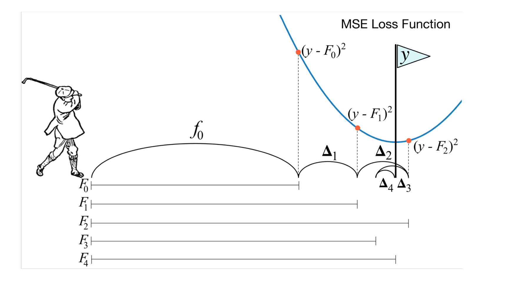
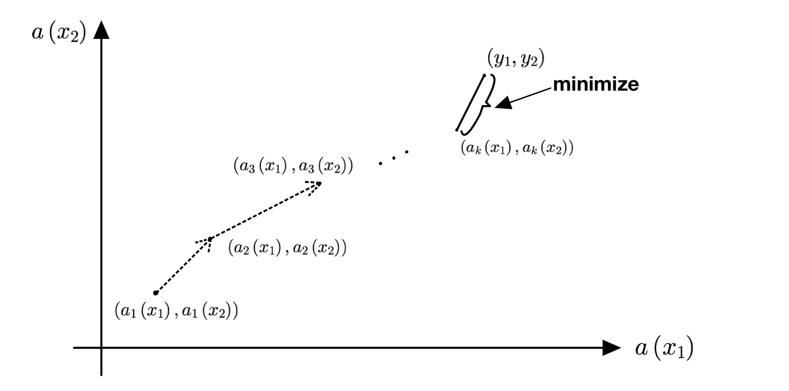
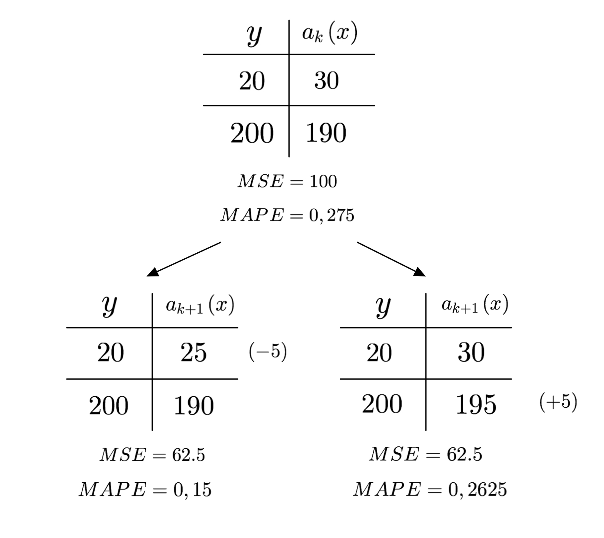
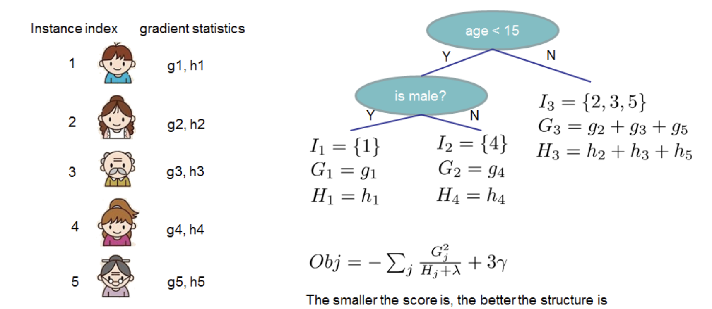

* Этот список будет заменен оглавлением, за вычетом заголовка "Contents",
к которому добавлен класс `no_toc`.
{:toc}

В прошлых разделах мы научились соединять базовые алгоритмы в ансамбль с помощью бэггинга (и, в частности, строить из решающих деревьев случайные леса). Теперь мы рассмотрим другой способ объединять базовые алгоритмы в композицию -- градиентный бустинг.

В ходе обучения случайного леса каждый базовый алгоритм строится независимо друг от друга. Бустинг, в свою очередь, воплощает идею последовательно строить линейную комбинацию алгоритмов. Каждый следующий алгоритм уточняет ансамбль, стараясь уменьшить ошибку ансамбля.

Бустинг, использующий деревья решений в качестве базовых алгоритмов (который в этом случае называют *градиентным бустингом над решающими деревьями*, *Gradient Boosting on Decision Trees*, *GBDT*), отлично работает на выборках с <<табличными>>, неоднородными данными. Примером таких данных является описание пользователя Яндекса через его возраст, пол, среднее число запросов в поиск в день, число заказов в такси, предпочитаемые музыкальные направления и жанры кино и другие признаки. Такой бустинг над решающими деревьями способен эффективно находить нелинейные зависимости в данных различной природы. Этим свойством обладают все алгоритмы, использующие деревья решений, однако именно бустинг обычно выигрывает в подавляющем большинстве задач, и поэтому он широко применяется во многих конкурсах по машинному обучению и в задачах из индустрии (поисковом ранжировании, рекомендательных системах, таргетировании рекламы, предсказании погоды, пункта назначения такси и многих других).

Не так хорошо бустинг проявляет себя на однородных данные: текстах, изображениях, звуке, видео. В таких задачах нейросетевые подходы почти всегда демонстрируют лучшее качество.

Хотя деревья решений и являются традиционным выбором для объединения в ансамбли, никто не запрещает использовать и другие алгоритмы, например, линейные модели в качестве базовых (эта возможность реализована в пакете XGBoost). Стоит только понимать, что построенная композиция по сути окажется линейной комбинацией линейных моделей, то есть опять-таки линейной моделью (или нейросетью с одним полносвязным слоем). Это уменьшает возможности ансамбля эффективно определять нелинейные зависимости в данных. В рамках данной главы мы будем рассматривать только бустинг над решающими деревьями.

# Интуиция
Рассмотрим задачу регрессии с квадратичной функцией потерь:

$$\mathcal{L}(y, x) = \frac{1}{2}\sum^{n}_{i=1}\left(y_i -  a(x_i)\right)^{2} \rightarrow min$$

Для решения будем строить композицию из $K$ базовых алгоритмов

$$a(x) = a_K(x) = b_1(x) + b_2(x) + \dots +b_K(x),$$

Если мы обучим единственное решающее дерево, то качество такой модели скорее всего будет низким. Однако, у нас появляется информация про построенное дерево: на каких объектах предсказание совпадает с целевой переменной, а на каких оно сильно больше или меньше, чем истинное значение.

Попробуем использовать эту информацию и обучим еще одну модель. Допустим, что предсказание первой модели на объекте $x_l$ на 10 больше, чем необходимо (т.е. $b_1(x_l) = y_l + 10$). Если бы мы могли обучить новую модель, которая на $x_l$ будет выдавать ответ $-10$, то сумма ответов этих двух моделей на объекте $x_l$ в точности совпала бы с истинным значением:

$$ b_1(x_l) + b_2(x_l) = (y_l + 10) + (-10) = y_l $$

Другими словами, если вторая модель научится предсказывать разницу между реальным значением и ответом первой, то это позволит уменьшить ошибку композиции.

В реальности вторая модель тоже не сможет обучиться идеально, поэтому обучим третью, которая будет <<компенсировать>> неточности первых двух. Будем продолжать так, пока не построим композицию из $K$ алгоритмов.

Для объяснения метода градиентного бустинга полезно воспользоваться следующей аналогией. Бустинг можно представить как гольфиста, цель которого -- загнать мяч в лунку с координатой $y_{ball}$. Положение мяча здесь -- ответ композиции $a(x_{ball})$. Гольфист мог бы один раз ударить по мячу, не попасть в лунку и пойти домой, но настырность заставляет его продолжить.

{:.center style="width:55vw"}

По счастью, ему не нужно начинать каждый раз с начальной позиции. Следующий удар гольфиста переводит мяч из текущего положения $a_k(x_{ball})$ в положение $a_{k+1}(x_{ball})$. Каждый следующий удар -- это та поправка, которую вносит очередной базовый алгоритм в композицию. Если гольфист все делает правильно, то функция потерь будет уменьшаться:
$$\mathcal{L}(y, a_{k+1}(x)) < \mathcal{L}(y, a_{k}(x)),$$
то есть мяч постепенно будет приближаться к лунке.

Удары при этом делаются не хаотично. Гольфист оценивает текущее положение мяча относительно лунки и следующим ударом старается нивелировать те проблемы, которые он создал себе всеми предыдущими.  Подбираясь к лунке, он будет бить всё аккуратнее и, возможно, даже возьмет другую клюшку, но точно не будет лупить так же, как из первоначальной позиции. В итоге комбинация всех ударов рано или поздно перенесет мяч в лунку.

Подобно тому, как гольфист постепенно подводит мяч к цели, бустинг с каждым новым базовым алгоритмом поправляет предсказание для объекта к его реальному значению.

Рассмотрим теперь другую аналогию с разложением функции в ряд Тейлора.
Из курса математического анализа известно, что бесконечно дифференцируемую функцию $f(x)$ в на интервале $x \in \left(a - R, a + R\right)$ можно представить в виде бесконечной суммы степенных функций

$$f(x) = \sum\limits_{n = 1}^{\infty}\frac{f^{(n)}\left(a\right)}{n!}\left(x - a\right)^{n}.$$

Одна, самая первая степенная функция в разложении, очень грубо приближает $f(x)$. Прибавляя к ней следующую, получим более точное приближение. Каждая следующая элементарная функция увеличивает точность приближения, но менее заметна в общей сумме. Если нам не требуется абсолютно точное разложение, вместо бесконечного ряда Тейлора мы можем ограничиться суммой его первых $k$ элементов. Таким образом интересующую нас функцию мы с некоторой точностью представили в виде суммы <<простых>> функций.

Перенесём эту идею на задачи машинного обучения. В машинном обучении мы пытаемся по выборке $(x_i, y_i)$ восстановить неизвестную истинную зависимость. Предже всего мы выбираем подходящий алгоритм. Мы можем выбрать <<сложный>> алгоритм, который сразу хорошо выучит истинную зависимость. А можем обучить <<простой>>, который выучит истинную зависимость посредственно. Затем мы добавим к нему ещё один такой простой алгоритм, чтобы уточнить предсказание первого алгоритма. Продолжая этот процесс, получим сумму простых алгоритмов, где первый алгоритм грубо приближает истинную зависимость, а каждый следующий делает приближение всё точнее.

# Пример с задачей регрессии: формальное описание

Рассмотрим тот же пример с задачей регрессии и квадратичной функцией потерь:

$$\mathcal{L}(y, x) = \frac{1}{2}\sum\limits^{n}_{i=1}\left(y_i -  a(x_i)\right)^{2} \rightarrow min$$

Для решения также будем строить композицию из $K$ базовых алгоритмов семейства $\mathcal{B}$:

$$a(x) = a_K(x) = b_1(x) + b_2(x) + \dots +b_K(x),$$

В качестве базовых алгоритмов выберем, как и условились в начале главы, семейство $\mathcal{B}$ решающих деревьев некоторой фиксированной глубины.

Используя известные нам методы построения решающих деревьев, обучим алгоритм $b_1(x) \in \mathcal{B}$, который наилучшим образом приближает целевую переменную:

$$ b_1(x) = \underset{b\in \mathcal{B}}{\mathrm{argmin}} \mathcal{L}(y, b(x))$$

Построенный алгоритм $b_1(x)$ скорее всего работает не идеально. Более того, если базовый алгоритм работает слишком хорошо на обучающей выборке, то высока вероятность переобучения (низкий уровень смещения, но высокий уровень разброса). Далее вычислим, насколько сильно различаются предсказания этого дерева от истинных значений:

$$s_i^{1} = y_i - b_1(x_i)$$

Теперь мы хотим скорректировать $b_1(x)$ с помощью $b_2(x)$; в идеале так, чтобы $b_2(x)$ идеально предсказывал величины $s_i^{1}$, ведь в этом случае
$$ a_2(x_i) = b_1(x_i) + b_2(x_i) = b_1(x_i) + s_i^1 = b_1(x_i) + (y_i - b_1(x_i)) = y_i $$

Найти совершенный алгоритм скорее всего не получится, но по крайней мере мы можем выбрать из семейства наилучшего представителя для такой задачи. Итак, второе решающее дерево обучим предсказывать разность $s_i^1$:

$$ b_2(x) = \underset{b\in \mathcal{B}}{\mathrm{argmin}} \mathcal{L}(s^1, b(x))$$

Ожидается, что композиция из двух таких моделей $a_2(x) = b_1(x) + b_2(x)$ станет более качественно предсказывать целевую переменную $y$.

Далее рассуждения повторяются до построения всей композиции. Сначала вычисляется разность между правильным ответом и текущим предсказанием композиции из $k$ алгоритмов:

$$ s_i^k = y_i - \sum_{i=1}^{k} b_k(x_i) = y_i - a_k(x_i)$$

Затем происходит обучение $(k+1)$-го алгоритма на предсказание этой разности:

$$ b_{k+1}(x) = \underset{b\in \mathcal{B}}{\mathrm{argmin}} \mathcal{L}(s^{k}, b(x))$$

а композиция в целом обновляется по формуле

$$a_{k+1}(x) = a_k(x) + b_{k+1}(x)$$

Обучение $K$ базовых алгоритмов завершает построение композиции.

# Скорость обучения

Обучение композиции описанным выше методом может привести к переобучению, если базовые алгоритмы слишком сложные. Например, если сделать решающие деревья слишком глубокими (более 10 уровней), то при обучении бустинга ошибка на обучающей выборке даже при довольно скромном $K$ может приблизиться к нулю, то есть предсказание будет почти идеальным, но на тестовой выборке всё будет плохо.

Существует два решения этой проблемы. Во-первых, необходимо упростить базовую модель, уменьшив глубину дерева (либо примерив какие-либо ещё техники регуляризации). Во-вторых, мы можем ввести параметр скорости обучения (learning rate)  $\eta \in (0, 1]$:

$$ a_{k+1}(x) = a_{k}(x) + \eta b_{k+1}(x) $$

Присутствие этого параметра означает, что каждый базовый алгоритм вносит относительно небольшой вклад во всю композицию: если расписать сумму целиком, она будет иметь вид

$$a_{k+1}(x) = b_1(x) + \eta b_2(x) + \eta b_3(x) + \ldots + \eta b_{k+1}(x)$$

Таким образом, новый базовый алгоритм добавляется, чтобы **немного уменьшить** разницу между предсказанием и истинным значением, но не занулить ее совсем.

Значение параметра обычно определяется эмпирически по входным данным. В библиотеке CatBoost скорость обучения может быть выбрана автоматически по набору данных (для этого используется заранее обученная линейная модель, предсказывающая скорость обучения по мета-параметрам выборки данных: числу объектов, числу признаков и другим).

# Функция потерь
Отметим теперь важное свойство функции потерь в рассмотренном выше примере с регрессией. Для этого посчитаем производную функции потерь по предсказанию $z = a_k(x_i)$ модели для $i$-го объекта:

$$ \frac{\partial{\mathcal{L}(y_i,z)}}{\partial{z}}\bigg|_{z=a_k(x_i)} = \frac{\partial{}}{\partial{z}}\frac{1}{2}\left(y_i -  z\right)^{2}\bigg|_{z=a_k(x_i)} = a_k(x_i) - y_i $$

Видим, что разность, на которую обучается $k$-й алгоритм, выражается через производную:

$$s_i^{k} = y_i -a_k(x_i) = -\frac{\partial{\mathcal{L}(y_i,z)}}{\partial{z}}\bigg|_{z=a_k(x_i)}$$

Таким образом, для каждого объекта $x_i$ очередной алгоритм в бустинге обучается предсказывать антиградиент фукции потерь по предсказанию модели $-\frac{\partial{\mathcal{L}(y_i,z)}}{\partial{z}}$ в точке $a_k(x_i)$ предсказания текущей части композиции на объекте $x_i$.

**Почему же это важно?** Дело в том, что это наблюдение позволяет обобщить подход построения бустинга на произвольную дифференцируемую функцию потерь. Для этого мы заменяем обучение на разность $s_i^k$ обучением на антиградиент функции потерь $(-g_i^k)$, где

$$g_i^k =\frac{\partial{\mathcal{L}(y_i,z)}}{\partial{z}}\bigg|_{z=a_k(x_i)}$$

Обучение композиции можно представить (вспомните аналогию с гольфистом), как перемещение предсказания ($N$ -- размер обучающей выборки) из точки $(a_k(x_1), a_k(x_2), \dots, a_k(x_N))$ в точку $(a_{k+1}(x_1), a_{k+1}(x_2), \dots, a_{k+1}(x_N))$. В конечном итоге мы ожидаем, что точка $(a_K(x_1), a_K(x_2), \dots, a_K(x_N))$ будет располагаться как можно ближе к точке с истинными значениями $(y_1, y_2, \dots, y_N)$. Мы стараемся сделать шаг в любом направлении; при этом параметр $\eta$ ограничивает длину этого шага.

{:.center style="width:50vw"}

В случае квадратичной функции потерь интуиция вполне подкрепляется математикой. Изменится ли что-либо в наших действиях, если мы поменяем квадратичную функцию потерь на любую другую? С одной стороны, мы, как и прежде, можем двигаться в направлении уменьшения разности предсказания и истинного значения: любая функция потерь поощряет такие шаги для каждого отдельного объекта, ведь для любой адекватной функции потерь выполнено $\mathcal{L}(y, y) = 0$.

Но мы можем посмотреть на задачу и с другой стороны: не с точки зрения уменьшения расстояния между вектором предсказаний и вектром истинных значений, а с точки зрения уменьшения значения функции потерь. Для наискорейшего уменьшения функции потерь нам необходимо шагнуть в сторону её антиградиента по вектору предсказаний текущей композиции, то есть как раз таки в сторону вектора $(g_1^k,\dots,g_N^k)$.

Итак, использованная нами интуиция шага в сторону <<уменьшения остатка>> удивительным образом совпала с идеей оптимального шага по антиградиенту в случае квадратичной функции потерь, но для других функций потерь это не так: для них смещение происходит в сторону антиградиента.

Проиллюстрируем на примере с двумя объектами. Текущее предсказание для объектов -- $((a_k(x_1), a_k(x_2))$, окружность определяет варианты следующего шага: первый вариант -- пойти в направлении $(s_1^k, s_2^k)$, как делалось ранее; второй -- пойти в направлении антиградиента. Также показаны линии уровня значений функции потерь. Функция потерь устроена таким образом, что $L_{II} < L_{I}$. Это делает шаг по антиградиенту более выгодным.

{:.center style="width:50vw"}

Используя шаги по антиградиенту, можно получить лучшее качество за меньшее число итераций, а также сойтись в итоге к меньшему значению функции потерь.

Проиллюстрируем тот факт, что шаг по антиградиенту может не совпадать с шагом по остатку.
Это зависит от природы используемой функции потерь. Рассмотрим простой пример: задача регрессии с функцией потерь [Mean absolute percentage error (MAPE)](https://en.wikipedia.org/wiki/Mean_absolute_percentage_error), в которой учитывается относительное значение ошибки. Допустим, выборка состоит из двух объектов с истинными значениями $(20, 200)$. На $k$-ой итерации предсказание композиции -- это $(30, 190)$. На следующей итерации есть выбор между двумя алгоритмами: один приближает на 5 значение на первом объекте к целевому, второй -- на втором объекте.

{:.center style="width:40vw"}

С точки зрения обучения на <<разность>> эти варианты одинаковы, поскольку оба уменьшают расстояние между истинным значением и предсказанием на одном объекте на 5, а на другом не изменяют. Это подтверждается и новым значением квадратичной ошибки: в обоих случаях оно одно и то же.

Значение MAPE сильнее уменьшается в случае изменения ответа для первого объекта, поскольку сильнее уменьшается относительная ошибка. Антиградиент позволяет определить такое направление.

Отметим еще, что обучение на <<разность>> хоть и не позволяет выделить лучший из двух вариантов, но любой из них улучшает и квадратичную ошибку, и значение MAPE. Другими словами, если алгоритм из двух равных для него вариантов выберет второй, то он хоть и не будет оптимальным, но все-таки уменьшит значение выбранной функции потерь MAPE.

Использование антиградиента позволяет приоритезировать одни объекты по отношению к другим при обучении следующего базового алгоритма при фиксированном по длине шаге. Иначе говоря, уделить больше внимания тем объектам, на которых можно сильнее уменьшить ошибку.

На практике, тем не менее, использование в качестве функции потерь той метрики, по которой вычисляется качество, не всегда приводит к наилучшему результату. Причиной может быть недифференцируемость такой метрики или сходимость к локальному (не глобальному) минимуму. Ярким примером служит задача ранжирования, в которой зачастую обучение на ранжирующую функцию потерь дает по ранжирующей метрике результат хуже, чем модель, обученная на квадратичную ошибку. Поэтому в ходе настройки модели необходимо пробовать различные функции потерь и выбирать лучшую по заданной метрике.

Итак, теперь мы знаем, что для построения градиентного бустинга достаточно уметь считать градиент функции потерь по предсказаниям. Это позволяет с помощью бустинга решать широкий спектр задач. В библиотеках градиентного бустинга даже реализована возможность создавать свои функции потерь: для этого достаточно уметь вычислять ее градиент, зная истинные значения и текущие предсказания для элементов обучающей выборки.

# Обучение базового алгоритма

При построении очередного базового алгоритма $b_{k+1}$ мы решаем задачу регрессии с таргетом, равным антиградиенту функции потерь исходной задачи на предсказании $a_k = b_1 + \ldots + b_k$.

Теоретически, можно воспользоваться любым методом построения регрессионного дерева. Важно выбрать оценочную функцию $S$ (ей предстоит играть роль функции потерь при обучении дерева $b_{k+1}$), которая показывает, насколько текущая структура дерева хорошо приближает антиградиент.

Например, можно использовать следующие оценочные функции:

$$ L_2(g, p) = \sum\limits_{i=1}^N\left(p_i - g_i\right)^2,\\
Cosine(g, p) = -\frac{\sum\limits_{i=1}^N(p_i \cdot g_i)}{\sqrt{\sum\limits_{i=1}^Np_i^2} \cdot \sqrt{\sum\limits_{i=1}^Ng_i^2}},
$$

где $p_i$ - предсказание дерева на объекте $x_i$, $g_i$ -- антиградиент, на который учится дерево, $$ p = \{ p_i \}_{i=1}^N $$, $$ g = \{ g_i \}_{i=1}^N $$.

Функция $L_2$ представляет собой среднеквадратичную ошибку, а функция $Cosine$ определяет близость через косинусное расстояние между векторами предсказаний и антиградиентов.

В ходе построения выбирается такой предикат, который минимизирует выбранную функцию $S$. Другими словами, оценочную функцию $S$ можно использовать в качестве критерия информативности при построении:

$$ S(R) - S(R_{right}) - S(R_{left}) \rightarrow max,$$

где $S(R)$ -- значение функции $S(g, p)$ в вершине $R$, а $S(R_{left}), S(R_{right})$ -- значения в левом и правом сыновьях $R$ после добавления предиката.

В итоге, обучение базового алгоритма проходит в два шага:
- по **функции потерь** вычисляется целевая переменная для обучения следующего базового алгоритма:

$$g_i^k =\frac{\partial{\mathcal{L}(y_i,z)}}{\partial{z}}\bigg|_{z=a_k(x_i)}$$

- минимизируя выбранную **оценочную функцию**, строится регрессионное дерево на обучающей выборке $(x_i, -g_i^k)$.

Подводя итог, получаем, что градиентный бустинг называется градиентным, потому что базовые алгоритмы обучаются на (анти)градиент функции потерь.

# Методы оптимизации второго порядка: интуиция
До этого момента мы рассматривали только первую производную функции потерь для нахождения ее минимума, но возможно ли это делать более эффективно? Оказывается, что да. Решение кроется в использовании методов оптимизации второго порядка.

Для начала вспомним, чем отличаются методы первого и второго порядках в задаче оптимизации. Для нахождения минимума функции $f(x)$ градиентным спуском (методом первого порядка), мы итеративно двигаемся в сторону антиградиента:

$$x_{k+1} = x_{k} - f'(x_{k}).$$

В случае метода Ньютона (метода второго порядка) для более быстрой сходимости используется следующая формула:

$$ x_{k+1} = x_{k} - \frac{f'(x_k)}{f''(x_k)} $$

Вторая производная позволяет более точно аппроксимировать исходную функцию, поэтому методы второго порядка сходятся значительно быстрее. Однако, это влечет дополнительные расходы, связанные с вычислением этих самых вторых производных, поэтому каждая итерация занимает больше времени. Тем не менее, на практике адаптация вторых производных под решаемую задачу зачастую дает лучшее качество.

Давайте теперь поймем, как переложить эту идею на градиентный бустинг. Весьма иронично: не успели мы разобраться с тем, почему градиентный бустинг называется градиентным, и вот уже хотим отойти от его "градиентности", ведь в этом случае его стоило бы назвать ньютоновским или гессианным бустингом.

Ранее мы говорили, что $k$-ый базовый алгоритм обучается предсказывать антиградиент функции потерь по текущим предсказаниям композиции:

$$g_i = \frac{\partial{}}{\partial{z}}\mathcal{L}(y_i,z)\bigg \vert_{z=a_{k-1}(x_i)}$$

В случае методов второго порядка, глядя на метод Ньютона, логично было бы потребовать от базового алгоритма для каждого объекта приближать величину $(-g_i/h_i)$, где:

$$h_i = \frac{\partial^2{}}{\partial{z^2}}\mathcal{L}(y_i,z)\bigg \vert_{z=a_{k-1}(x_i)}$$

Более подробно формула для $h_i$ объясняется в следующем разделе, где будет дано формальное описание процесса. Сейчас достаточно понимать, что мы теперь считаем вторые производные, и хотим их учитывать примерно в том же ключе, как это делается в методе Ньютона в оптимизации.

В этом случае обучение базового алгоритма претерпит минимальные изменения:

- по **функции потерь** вычисляется  значения $g_i^k, h_i^k$

- минимизируя выбранную **оценочную функцию**, строится регрессионное дерево на обучающей выборке $(x_i, -g_i^k/h_i^k)$.

Забегая вперед, отметим еще одно изменение в ходе обучения: если раньше мы ставили в лист дерева среднее значение целевой переменной по всем объектам, попавшим в этот лист:

$$w_{leaf} = - \frac{\sum_{i: x_i \in leaf} g_i}{\sum_{i: x_i \in leaf} 1}, $$

то теперь "нормироваться" выражение будет на значения $h_i$ (оптимальность таких формул доказывается в следующем разделе):

$$ w_{leaf} = - \frac{\sum_{i: x_i \in leaf} g_i}{\sum_{i: x_i \in leaf} h_i}$$

На этом, собственно, все. Изменения, связанные с использованием второй производной, заключаются в двух небольших модификациях алгоритма:
1. меняется целевая переменная для обучения базового алгоритма;
2. меняется формула, по которой определяется значение в листе дерева.

Кроме того, первый пункт в существующих реализациях обычно упускается. Другими словами, обучение по-прежнему происходит на значения антиградиентов, а вот в лист дерева пишется значение, которое зависит и от первой, и от второй производных. Эксперименты показали, что обучение на $(-g_i/h_i)$ значительно замедляет процесс обучения, качество при этом улучшается слабо.

# Методы оптимизации второго порядка

В этом разделе мы попробуем модифицировать алгоритм бустинга, сделав его похожим на методы второго порядка, поймем откуда берутся формулы, описанные в разделе с интуицией, а также добавим в оптимизационную задачу регуляризацию, чтобы метод стал более устойчивым.

Итак, будем искать базовый алгоритм $b(x) = b_k(x)$, минимизирующий следующий функционал:

$$ Obj = \sum_{i=1}^N \mathcal{L}(y_i, a_{k-1}(x_i) + b(x_i) ) + \Omega(b),$$

где $\Omega(b)$ -- некоторый регуляризатор, который в случае бустинга над решающими деревьями обычно имеет следующий вид:

$$ \Omega(b) = \gamma T + \frac{1}{2}\lambda\sum_{j=1}^{T}w_j^2,$$

где
 - $T$ -- количество листьев в дереве;
 - $w_j$ -- значение в $j$-ом листе дерева (напомним, что в каждом листе регрессионного дерева обычно предсказывается константа);
 - $\lambda, \gamma$ -- гиперпараметры.

Регуляризатор $\Omega$ является стандартным для решающих деревьев (более подробно описано в главе про решающие деревья). Такая регуляризация вносит ограничение как на число листьев, так и на максимальные значения в них. Это не позволяет алгоритму строить слишком <<сложные>> деревья.

Разложим функционал потерь $Obj$ в ряд Тейлора в точке $t_0 = \left(a_{k-1}(x_1),\ldots,a_{k-1}(x_N)\right)$ (текущем предсказании композии). Распишем этот ряд до второго члена. Для $i$-го объекта получаем:

$$ Obj(y, t) \approx Obj + \left[\nabla_{z=t_0}Obj\right]^T
(t-t_0) + \frac{1}{2}(t-t_0)^T\left[\nabla^2_{z=t_0}Obj\right](t-t_0)$$

Таким образом, мы переходим от произвольного функционала потерь к квадратичной аппроксимации с хорошими математическими свойствами. Теперь попробуем аналитически вывести минимум для этого функционала по $b(x)$.

Отметим, что вторые производные (гессиан) $H = \nabla_{z=t_0}^2Obj$, вообще говоря, представляют собой матрицу $N \times N$. Но вычислять её целиком долго, да и хранить дорого, поэтому при решении оптимизационных задач нередко пренебрегают недиагональными элементами этой матрицы. Мы поступим так же, и вместо матрицы $H$ будем работать с её диагональю -- вектором $h = \left(\frac{\partial{}^2}{\partial{z}^2}\mathcal{L}(y_i, z)\bigg \vert_{z = a_{k-1}(x_i)}\right)_{i=1}^N$ длины $N$.

Подставим $$t = a_{k-1}(x_i) + b(x_i)$$

Тогда, соответственно:
$$t-t_0 = (a_{k-1}(x_i) + b(x_i)) - a_{k-1}(x_i) = b(x_i)$$

Разложение всего функционала примет вид:

$$ Obj = \sum_{i=1}^N\mathcal{L}(y_i, a_{k-1}(x_i) + b(x_i)) \approx \sum_{i=1}^N\left[\mathcal{L}(y_i, a_{k-1}(x_i)) + g_{i}\cdot b(x_i) + \frac{1}{2}h_{i}\cdot b^2(x_i)\right] ,$$

где

$g_i = \frac{\partial{}}{\partial{z}}\mathcal{L}(y_i,z)\bigg \vert_{z=a_{k-1}(x_i)},$
$h_i = \frac{\partial^2{}}{\partial{z^2}}\mathcal{L}(y_i,z)\bigg \vert_{z=a_{k-1}(x_i)}$
-- первые и вторые производные оптимизируемой функции потерь.

Отбрасывая константные слагаемые $\mathcal{L}(y_i, a_{k-1}(x_i))$, не зависящее от $b(x_i)$ (а следовательно, не влияющее на точку минимума функционала), приходим к форме:

$$ Obj \approx \sum_{i=1}^N \left[g_i b(x_i) + \frac{1}{2} h_i b^2(x_i)\right] + \gamma T + \frac{1}{2}\lambda\sum_{j=1}^{T}w_j^2$$

Заметим, что каждое из значений $b(x_i)$ попадает в один из $T$ листьев дерева. Сгруппируем слагаемые по объектам, попавшим в один лист:

$$ Obj \approx \sum\limits_{j=1}^{T}\left[\sum\limits_{i \in I_j} g_i w_j + \frac{1}{2}\sum\limits_{i \in I_j} (h_i + \lambda)w_j^2 \right] + \gamma T
 = \sum\limits_{j=1}^{T}\left[G_jw_j + \frac{1}{2}(H_j + \lambda)w_j^2 \right] + \gamma T, $$

где
 - $I_j$ - множество объектов обучающей выборки, попавших в $j$-ый лист дерева;
 - $G_j = \sum\limits_{i \in I_j} g_i$;
 - $H_j = \sum\limits_{i \in I_j} h_i$.

Задачу оптимизации теперь можно решить аналитически по переменным $w_j$, решая квадратное уравнения относительно $w_j$. Получаем следующее решение:

$$ w_j = -\frac{G_j}{H_j + \lambda}.$$

Если занулить гиперпараметр $\lambda$ и заменить гессиан на единичный вектор, мы получаем среднее значение градиентов, объекты которых попали в данный лист. Именно это значение мы записываем в лист во время обучения решающего дерева на градиент. Это приводит нас к задаче оптимизации первого порядка, рассмотренной ранее.

Значение же функционала при оптимальных $w_j$ равно:

$$ Obj = -\frac{1}{2}\sum\limits_{j=1}^T \frac{G_j^2}{H_j + \lambda} + \gamma T .$$

Теперь попробуем разобраться в последних двух формулах. Для того, чтобы определить оптимальную $b(x)$, нам нужно проделать два шага: задать структуру дерева (какие предикаты используются на каждом уровне) и определить значения в каждом листе. Предположим, что мы уже выбрали структуру дерева. Какие значения следует записать в листья такого дерева? Их определяет формула для $w_j$. Поставив в листья эти значения, мы получим минимальное значение $Obj$ для выбранной структуры дерева. Само это значение $Obj$ определяется последней формулой.

Отметим также связь с косинусной оценочной функцией. Пусть $\lambda = 0$ и $\gamma = 0$. Тогда

$$ Obj = -\frac{1}{2}\sum\limits_{j=1}^T \frac{G_j^2}{H_j} $$

Рассмотрим одно из слагаемых в формуле выше:

$$- \frac{G_j^2}{H_j} = -\frac{G_j}{H_j} \cdot G_j = w_j \cdot G_j = w_j \cdot \sum\limits_{i \in I_j} g_i = \sum\limits_{i \in I_j} w_j \cdot g_i $$

Заметим теперь, что полученная формула это не что иное, как скалярное произведение **предсказаний** на **градиенты** на объектах, попавших в лист $j$ (все объекты, попавшие в лист $j$, получают одно и то же предсказание $w_j$). Рассмотрев все листья, получим скалярное произведение всех предсказаний на все градиенты - это значение стоит в числителе косинусной оценочной функции.

Другими словами, можно сказать, что описанные выше формулы склонны оптимизировать косинусное расстояние между вектором предсказаний и вектором антиградиентов $-g_i$.

Эти теоретические выкладки не мешают, однако, использовать вместе с формулами для $w_j$ любые другие оценочные функции, либо пробовать приближать базовым алгоритмом значение $-g_i/h_i$ (как было предложено в предыдущем разделе с интуицией) - на практике неясно, что сработает лучше.

{:.center style="width:50vw"}

Остается только понять, как определить структуру дерева. Для этого мы можем использовать формулу для Obj в качестве оценочной при построении дерева:

$$ Obj(R) - Obj(R_{right}) - Obj(R_{left}) \rightarrow max,$$

где $Obj(R)$ -- значение $Obj$ в вершине $R$, а $Obj(R_{left}), Obj(R_{right})$ -- значения $Obj$ в левом и правом потомках $R$ после добавления предиката.

Наша задача, как и прежде, выбирать такие предикаты, которые сильнее всего уменьшат значение оценочной функции (то есть уменьшат $Obj$). Делаем это до тех пор, пока структура не будет полностью задана. Далее в листья записываем оптимальные значения $w_j$, которые мы определили.

Итак, для использования методов оптимизации второго порядка на каждой итерации делается следующее шаги.
 - По функции потерь $\mathcal{L}$, вектору ответов $y$ и вектору текущих предсказаний $a_{k-1}$ вычисляются градиент и диагональ гессиана (векторы $g$, $h$).
 - Определяется структура дерева (по некоторому алгоритму). Для каждого рассматриваемого предиката вычисляются:
     - значения $G_{parent}, H_{parent}$ и $Obj(R)$ в текущей вершине;
     - значения $G_{left}, H_{left}$ и $Obj(R_{left})$ в левом потомке;
     - значения $G_{right}, H_{right}$ и $Obj(R_{right})$ в правом потомке;
     - изменение оценочной функции при добавлении этого предиката;
     - выбирается тот предикат, который сильнее всего уменьшает значение оценочной функции.
  - Определяется значения в листьях по формулам для $w_j$.

Такой подход реализован во многих библиотеках градиентного бустинга. На практике методы второго порядка более эффективно решают задачу оптимизации произвольной функции потерь. Для этого достаточно уметь по векторам $y$ и $a_{k-1}$ считать градиент (вектор $g$) и гессиан (вектор $h$). Это позволяет решать широкий спектр задач с помощью градиентного бустинга, начиная от экзотических функций потерь в задачах классификации и регрессии и заканчивая задачами ранжирования, попарного ранжирования и многими другими.

# На практике

Типичный градиентный бустинг имеет в составе несколько тысяч деревьев решений, которые необходимо строить последовательно. Построение решающего дерева на выборках типичного размера и современном железе, даже с учетом всех оптимизаций про которые мы рассказывали в главе про деревья, требует небольшого, но всё-таки заметного времени (0.1-1c), которые для всего ансамбля превратятся в десятки минут. Это не так быстро, как обучение линейных моделей, но всё-таки значительно быстрей, чем обучение типичных нейросетей.

## Где используется

Везде:) На сегодня это, фактически, один из двух подходов которые используются на практике (второй -- это нейронные сети, конечно). Он формально слабее и менее гибок, чем сети, но выигрывает в простоте настройки, скорости обучения и применения, размере и интерпретируемости модели.

Во многих компаниях, так или иначе связанных с ML, он используется для всех задач, которые не связаны с однородными данными (картинками, текстами etc). Типичный поисковый запрос в Яндексе, выбор отеля на Booking.com или сериала на вечер в Netflix задействует несколько десятков моделей GBDT.

Впрочем, в будущем можно ожидать плавного исчезновения этого подхода, так как улучшение фреймоворков глубинного обучения и далнейшее развитие железа нивелирует его преимущество по сравнению с нейросетями.

## Реализации
Для общего развития имеет смысл посмотреть реализацию в [sklearn](https://scikit-learn.org/stable/modules/generated/sklearn.ensemble.GradientBoostingClassifier.html), но на практике она весьма медленная и не такая уж умная.

Хороших реализаций 	GBDT есть, как минимум, три: [lightgbm](https://lightgbm.readthedocs.io/en/latest/), [XGBoost](https://xgboost.readthedocs.io/en/latest/) и [Catboost](https://catboost.ai/).

Исторически они отличались довольно сильно, но за последние годы успели скопировать друг у друга все хорошие идеи. Из патриотических соображений использовать следует конечно же Catboost (к его разработке приложили свою руку многие бывшие студенты ШАДа).
