Мы начнем с, пожалуй, самых простых и понятных моделей машинного обучения: линейных. Нам предстоит понять, что это вообще такое, почему они работают и в каких случаях их стоит использовать. Так как это первый класс моделей, с которым вы столкнётесь, мы постараемся подробно проговорить все важные моменты.

# Почему модели линейные?

Задачи классификации и регрессии можно сформулировать как поиск отображения из множества всех на свете объектов $\mathbb{X}$ в множество возможных таргетов:
- **классификация**: $$\mathbb{X}  \to \{0, 1, \ldots, K\}$$, где $0, \ldots, K$ – номера классов,
- **регрессия**: $\mathbb{X} \to \mathbb{R}$,

которое лучше всего приближает истинное соответствие между объектами и таргетами. Что значит «лучше всего» – сложный вопрос, к нему мы будем много раз возвращаться. Пока попробуем понять, среди каких отображений мы будем искать самое лучшее. Давайте ограничимся каким-то параметризированным семейством функций и будем искать в нём. И начнём мы с самого простого – семейства линейных функций:

$$
    y = w_1 x_1 + \ldots + w_D x_D + w_0,
$$

где $y$ – целевая переменная, $(x_1, \ldots, x_D)$ – вектор, соответствующий объекту выборки (вектор признаков), а $w_1, \ldots, w_D, w_0$ – параметры модели (**вектор весов**). Теперь мы можем искать не какое-то непонятное отображение, а вектор $w\in\mathbb{R}^{D+1}$, что можно делать с помощью многочисленных известных нам методов оптимизации.

**Замечание**. Чтобы применять линейную модель, нужно, чтобы каждый объект уже был представлен вектором из вещественных чисел $x_1,\ldots,x_D$ (вещественных признаков). Конечно, просто текст или граф в линейную модель не положить, придётся сначала придумать для него численные фичи. Модель называют линейной, если она является линейной по этим вещественным признакам.

Разберёмся, как будет работать такая модель в случае, если $$D = 1$$ (один-единственный признак). Для регрессии функция $$y = w_1 x_1 + \ldots + w_D x_D + w_0$$ задает предсказание значения в точке (зависимость приближается линейной), а для бинарной классификации – разделяющее правило: там, где значение функции положительно, мы предсказываем один класс, где отрицательно – другой, а множество нулей функции становится разделяющей границей между классами.

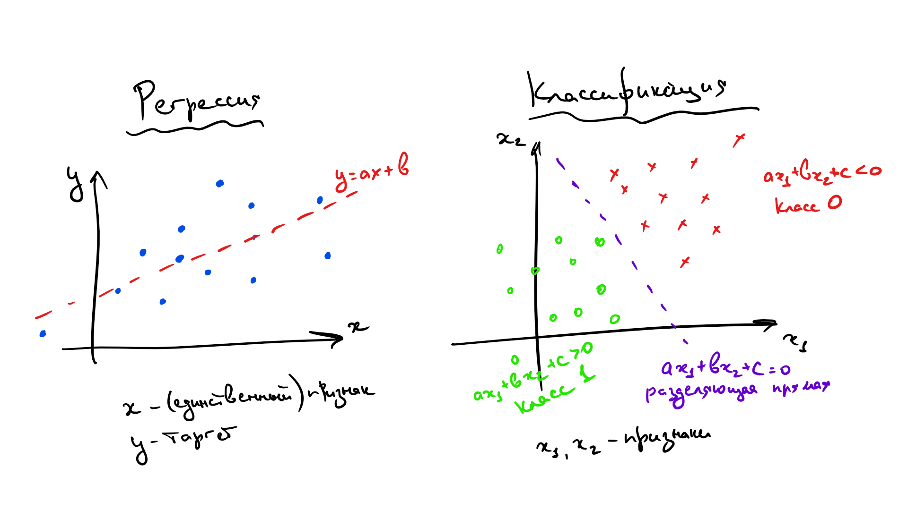

В случае более высоких размерностей вместо прямой будет гиперплоскость с аналогичным смыслом.

**Вопрос на подумать**. Если вы посмотрите содержание учебника, то не найдёте в нём ни «полиномиальных» моделей, ни каких-нибудь «логарифмических», хотя, казалось бы, зависимости бывают довольно сложными. Почему так?

<details>
  <summary>Ответ (не открывайте сразу; сначала подумайте сами!)</summary>

  На самом деле, если мы умеем находить линейные зависимости, то нам тем самым покорны и полиномиальные, и логарифмические, и ещё много какие. Давайте поймём, почему. Пусть мы для простоты решаем задачу регрессии. Если мы подозреваем, что целевая переменная $$y$$ зависит не только от признаков $$x_1, x_2$$, а ещё от логарифма $$x_1$$ и ещё как-нибудь от того, разные ли знаки у признаков, то мы можем ввести дополнительные слагаемые в нашу линейную зависимость

  $$y \approx w_1 x_1 + w_2 x_2 + w_3\log{x_1} + w_4\text{sgn}(x_1x_2) + w_0,$$

  и в итоге всё равно у нас получается линейная регрессия, только с большим количеством признаков.
</details>

**Вопрос на подумать**. А как быть, если одна из фичей является *категориальной*, то есть принимает значения из (обычно конечного числа) значений, не являющихся числами? Например, это может быть время года, уровень образования, марка машины и так далее. Как правило, с такими значениями невозможно производить арифметические операции или же результаты их применения не имеют смысла.

<details>
  <summary>Ответ (не открывайте сразу; сначала подумайте сами!)</summary>

  В линейную модель можно подать только численные признаки, так что категориальную фичу придётся как-то закодировать.

  Самый простой способ – использовать **one-hot** кодирование (one-hot encoding). Для фичи с $M$ значениями $c_1,\ldots, c_M$ предлагается значение $c_i$ ($i < M$) кодировать вектором $(M-1)$, в котором на $i$-м месте стоит единица, а на остальных нули. При этом значение $c_M$ кодируется вектором из всех нулей.

  Таким образом, вместо одного категориального признака у нас появляется сразу $(M-1)$, которые имеют смысл ответов на вопросы «$c_i$ ли перед нами?». Берётся $(M-1)$ координат, а не $M$, потому что в противном случае для каждого объекта сумма значений новых признаков была бы равна $1$. Такая линейная зависимость и в целом выглядит странно, и на самом деле она поломала бы нам весь процесс обучения.

  Конечно, one-hot кодирование – это самый наивный способ работы с категориальными признаками, и для более сложных фичей или фичей с большим количеством значений они плохо подходят. С рядом более продвинутых техник вы познакомитесь в разделе про обучение представлений.
</details>

Одним из приятных свойств линейных моделей является то, что мы можем достаточно легко судить, как влияют на предсказание те или иные признаки. Скажем, если вес $w_i$ положителей, то с ростом $i$-го признака увеличивает таргет (в случае регрессии) или выбор может сдвинуться в пользу класса 1 (в случае классификации), и наоборот. Точно так же чем больше значение веса $w_i$ тем «важнее» $i$-й признак для предсказания. То есть имея на руках линейную модель, вы многое можете объяснить заказчику о её поведении (с нейросетями или с градиентным бустингом у вас это вряд ли так легко получится). В то же время интерпретируемости линейных моделей не стоит доверять слепо, и вот почему:

* Линейные модели всё-таки довольно слабые, они годятся в основном для небольших датасетов и простых задач. Чаще всего приходится выдумывать дополнительные фичи (заниматься **feature engineering**'ом), являющиеся сложными функциями от исходных, и тогда итоговая модель будет иметь или не иметь смысл в зависимости от квалификации и здравого смысла эксперта, строившего модель.
* Если между признаками есть приближённая линейная зависимость, коэффициенты в линейной модели могут совершенно потерять физический смысл (об этой проблеме и о том, как с ней бороться, мы поговорим в параграфе про регуляризацию).
* Особенно осторожно стоит верить в утверждения вида «этот коэффициент маленький, значит, этот признак не важен». Во-первых, всё зависит от масштаба признака: вдруг коэффициент мал, чтобы скомпенсировать его. Во-вторых, зависимость действительно может быть слабой, но кто знает, в какой ситуации она окажется важна. Такие решения принимаются на основе данных, например, путём проверки статистического критерия (об этом мы коротко упомянем в разделе по вероятностные модели).
* Конкретные значения весов могут меняться в зависимости от обучающей выборки, хотя с её ростом они будут потихоньку сходиться к весам «наилучшей» линейной модели, которую можно было бы построить по всем-всем-всем данным на свете.

Обсудив немного общие свойства линейных моделей, перейдём к тому, как их всё-таки обучать. Сначала разберёмся с регрессией, а затем настанет черёд классификации.

&nbsp;
# Линейная регрессия и метод наименьших квадратов (МНК)

Мы начнём с использования линейных моделей для решения задачи регрессии. Простейшим примером постановки задачи линейной регрессии является **метод наименьших квадратов** (Ordinary least squares).

Пусть у нас задан датасет $(X, y)$, где $$y=(y_i)_{i=1}^N \in \mathbb{R}^N$$ – вектор значений целевой переменной, а $$X=(x_i)_{i = 1}^N \in \mathbb{R}^{N \times D}, x_i \in \mathbb{R}^D$$ – матрица объекты-признаки, в которой $i$-я строка – это вектор признаков $i$-го объекта выборки. Мы хотим моделировать зависимость $$y_i$$ от $$x_i$$ как линейную функцию со свободным членом. Общий вид такой функции из $$\mathbb{R}^D$$ в $$\mathbb{R}$$ выглядит следующим образом:

$$\color{#348FEA}{f_w(x_i) = \langle w, x_i \rangle + w_0}$$

Вектор $$w \in \mathbb{R}^D$$ часто называют вектором весов, так как на предсказание модели можно смотреть как на взвешенную сумму признаков объекта.

Свободный член $$w_0$$ часто опускают, потому что такого же результата можно добиться, добавив ко всем $$x_i$$ признак, тождественно равный единице; тогда роль свободного члена будет играть соответствующий ему вес:

$$
\begin{pmatrix}1 &  x_{i1} & \ldots & x_{iD} \end{pmatrix}\cdot\begin{pmatrix}w_1\\ \vdots \\ w_D\end{pmatrix} + b =
\begin{pmatrix}1 &  x_{i1} & \ldots & x_{iD} \end{pmatrix}\cdot\begin{pmatrix}w_0 \\ w_1\\ \vdots \\ w_D \end{pmatrix}
$$

Поскольку это сильно упрощает запись, в дальнейшем мы будем считать, что это уже сделано и зависимость имеет вид просто $$f_w(x_i) = \langle w, x_i \rangle$$.

## Сведение к задаче оптимизации

Мы хотим, чтобы на нашем датасете (то есть на парах $$(x_i, y_i)$$ из обучающей выборки) функция $$f_w$$ как можно лучше приближала нашу зависимость.

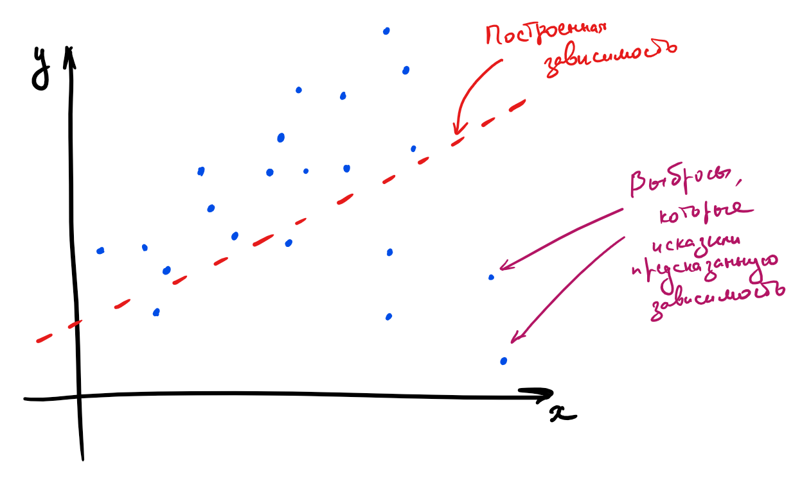

Для того, чтобы задача стала чисто технической, нам осталось только одно: на математическом языке выразить желание «приблизить $$f_w(x)$$ к $$y$$». Говоря простым языком, мы должны научиться измерять «плохость» модели и минимизировать её по обучаемым параметрам, то есть по весам $$w$$. Функция «плохости» традиционно называется **функцией потерь**, **функционалом качества** или просто лоссом (loss function). Важно, чтобы её было легко оптимизировать: скажем, гладкая функция потерь – это хорошо, а кусочно постоянная – просто ужасно.

Функции потерь бывают разными. От их выбора зависит то, насколько задачу в дальнейшем легко решать, и то, в каком смысле у нас получится приблизить предсказание модели к таргету. В текущем подходе предлагается в качестве лосса взять квадрат $$L^2$$-нормы вектора разницы предсказаний модели и $$y$$. Во-первых, так задачу будет нетрудно решить, а во-вторых, это несет в себе несколько смыслов:

* $$L^2$$-норма разницы – это евклидово расстояние $$\|y - f_w(x)\|_2$$ между вектором таргетов и вектором ответов модели, то есть мы их приближаем в смысле самого простого и понятного «расстояния».

* Как мы увидим в разделе про вероятностные модели, с точки зрения статистики это соответствует гипотезе о том, что наши данные состоят из линейного «сигнала» и нормально распределенного «шума».

Так вот, наша функция потерь выглядит так:

$$L(f, X, y) = \|y - f(X)\|_2^2 = $$

$$= \|y - Xw\|_2^2 = \sum_{i=1}^n(y_i - \langle x_i, w \rangle)^2$$

Иногда вместо суммы квадратов расстояний от всех точек до прямой используется среднее расстояние. При таком подходе масштаб ошибки не зависит от размера выборки. Такая функция потерь называется **Mean Squared Error**, **MSE** или **среднеквадратическим отклонением**. Разница здесь чисто косметическая, на алгоритм решения задачи она не влияет:

$$\color{#348FEA}{\text{MSE}(f, X, y) =  \frac{1}{N}\|y - X w\|_2^2}$$


Для того, чтобы найти лучшую модель, этот функционал надо минимизировать по $$w$$:

$$\color{#348FEA}{\|y - Xw\|_2^2 \longrightarrow \min_w}$$


Эту задачу можно решить как аналитически, так и приближенно. Давайте же сделаем и то, и другое.

&nbsp;
## МНК: точный аналитический метод

Чтобы найти точку минимума, приравняем к нулю градиент по вектору $$w$$ в этой точке и получим формулу для оптимального вектора весов:

$$\color{#348FEA}{w_{\ast} = (X^TX)^{-1}X^Ty}$$

Если вы не очень хорошо ориентируетесь в матричном дифференцировании, возможно, вам стоит прочитать соответствующую главу или пропустить вывод формулы и вернуться к нему позже.

<details>
  <summary>Вывод формулы. </summary>

  Вычислим градиент функции $$f(x) = \|y - Xw\|_2^2$$. Для этого распишем квадрат модуля в виде скалярного произведения:

  $$\| y - Xw\|^2 = \langle y - Xw, y - Xw\rangle$$

  Применим формулу дифференциала произведения и воспользуемся симметричностью скалярного произведения:

  $$\color{#348FEA}{\big[D_{w_{\ast}} \langle y - Xw, y - Xw \rangle\big]}(h) = $$

  $$ \langle \color{#348FEA}{\big[D_{w_{\ast}} (y - Xw)\big]}(h), y - Xw\rangle + \langle y - Xw, \color{#348FEA}{\big[D_{w_{\ast}} (y - Xw)\big]}(h)\rangle$$

  $$ = 2\langle y - Xw_{\ast}, \color{#348FEA}{\big[D_{w_{\ast}} (y - Xw)\big]}(h)\rangle =$$

  $$ = 2\langle y - Xw_{\ast}, -Xh\rangle = \langle 2X^T(Xw_{\ast} - y), h\rangle$$

  Получаем, что

  $$\color{#FFC100}{\nabla_{w_{\ast}} f} = 2X^T(Xw_{\ast} - y)$$

  В данном случае нам везёт: приравняв это выражение к нулю, мы получаем простую формулу для оптимального вектора весов:

  $$w_{\ast} = (X^TX)^{-1}X^Ty$$

  Осталось, правда, доказать, что это действительно точка минимума. Мы могли бы найти вторую производную, но мы ограничимся замечанием о том, что квадрат нормы является выпуклой функцией.
</details>

**Вопрос на подумать** Для вычисления $w_{\ast}$ нам приходится обращать (квадратную) матрицу $X^TX$, что возможно, только если она невырожденна. Что это значит с точки зрения анализа данных? Почему мы верим, что это выполняется во всех разумных ситуациях?

<details>
  <summary>Ответ (не открывайте сразу; сначала подумайте сами!)</summary>

  Как известно из линейной алгебры, для вещественной матрицы $X$ ранги матриц $X$ и $X^TX$ совпадают. Матрица $X^TX$ невырожденна тогда и только тогда, когда её ранг равен числу её столбцов, что равно числу столбцов матрицы $X$. Иными словами, формула регрессии поломается, только если столбцы матрицы $X$ линейно зависимы. Столбцы матрицы $X$ – это признаки. А если наши признаки линейно зависимы, то, наверное, что-то идёт не так и мы должны выкинуть часть из них, чтобы остались только линейно независимые.

  Другое дело, что зачастую признаки могут быть _приближённо_ линейно зависимы, особенно если их много. Тогда матрица $X^TX$ будет близка к вырожденной, и это, как мы дальше увидим, будет вести к разным, в том числе вычислительным проблемам.
</details>

&nbsp;
### Геометрический взгляд на точную формулу

Точную формулу можно вывести и из других, геометрических соображений. Пусть $$x^{(1)},\ldots,x^{(D)}$$ – столбцы матрицы $$X$$, то есть столбцы признаков. Тогда

$$Xw = w_1x^{(1)}+\ldots+w_Dx^{(D)},$$

и задачу регрессии можно сформулировать следующим образом: *найти линейную комбинацию столбцов $$x^{(1)},\ldots,x^{(D)}$$, которая наилучшим способом приближает столбец $$y$$ по евклидовой норме* – то есть *найти **проекцию** вектора $$y$$ на подпространство, образованное векторами $$x^{(1)},\ldots,x^{(D)}$$*.

Разложим $$y = y_{\parallel} + y_{\perp}$$, где $$y_{\parallel} = Xw$$ – та самая проекция, а $$y_{\perp}$$ – ортогональная составляющая, то есть $$y_{\perp} = y - Xw\perp x^{(1)},\ldots,x^{(D)}$$. Как это можно выразить в матричном виде? Оказывается, очень просто:

$$X^T(y - Xw) = 0$$

В самом деле, каждый элемент столбца $$X^T(y - Xw)$$ – это скалярное произведение строки $$X^T$$ (=столбца $$X$$ = одного из $$x^{(i)}$$) на $$y - Xw$$. Из уравнения $$X^T(y - Xw) = 0$$ уже очень легко выразить $$w$$:

$$w = (X^TX)^{-1}X^Ty$$

### Проблемы «точного» решения

Заметим, что для получения ответа нам нужно обратить матрицу $$X^TX$$. Это создает множество проблем:
1. Это вычислительно трудно (сложность вычисления обратной матрицы $$\sim O(n^{2.373})$$),
2. Матрица $$X^TX$$, хотя почти всегда обратима в разумных задачах машинного обучения, но зачастую плохо обусловлена (например, если между признаками есть не точная, но приближённая линейная зависимость). Погрешность нахождения $w$ будет зависеть от квадрата [числа обусловленности](https://ru.wikipedia.org/wiki/Число_обусловленности) матрицы $X$, что очень плохо. Это делает полученное таким образом решение численно неустойчивым: малые возмущения $$y$$ могут приводить к катастрофическим изменениям $$w$$.

<details>
   <summary>Пара слов про число обусловленности.</summary>
   Пожертвовав математической строгостью, мы можем считать, что число обусловленности матрицы $X$ – это корень из отношения наибольшего и наименьшего из собственных чисел матрицы $X^TX$. Грубо говоря, оно показывает, насколько разного масштаба бывают собственные значения $X^TX$. Если рассмотреть $L^2$-норму ошибки предсказания, как функцию от $w$, то её линии уровня будут эллипсоидами, форма которых определяется квадратичной формой с матрицей $X^TX$ (проверьте это!). Таким образом, число обусловленности говорит о том, насколько вытянутыми являются эти эллипсоиды.
 </details>

<details>
   <summary>Данные проблемы не являются поводом выбросить решение на помойку. Существует как минимум два способа улучшить его численные свойства, однако если вы не знаете про сингулярное разложение, то лучше вернитесь сюда, когда узнаете.</summary>
   1. Построим $$QR$$-разложение матрицы $$X$$. Напомним, что это разложение, в котором матрица $$Q$$ ортогональна по столбцам (то есть её столбцы ортогональны и имеют длину 1; в частности, $$Q^TQ=E$$), а $$R$$ квадратная и верхнетреугольная. Подставив его в формулу, получим

      $$w = ((QR)^TQR)^{-1}(QR)^T y = (R^T\underbrace{Q^TQ}_{=E}R)^{-1}R^TQ^Ty = R^{-1}R^{-T}R^TQ^Ty = R^{-1}Q^Ty$$

      Отметим, что написать $$(R^TR)^{-1} = R^{-1}R^{-T}$$ мы имеем право благодаря тому, что $$R$$ квадратная. Полученная формула намного проще, обращение верхнетреугольной матрицы (=решение системы с верхнетреугольной левой частью) производится быстро и хорошо, погрешность вычисления $w$ будет зависеть просто от числа обусловленности матрицы $X$, а поскольку нахождение $QR$-разложения является достаточно стабильной операцией, мы получаем решение с более хорошими, чем у исходной формулы, численными свойствами.

   2. Также можно использовать псевдообратную матрицу, построенную с помощью сигнулярного разложения (о нём подробно написано в разделе про матричные разложения). А именно, пусть

       $$A = U\underbrace{\mathrm{diag}(\sigma_1,\ldots,\sigma_r)}_{=\Sigma}V^T$$

       – это усечённое сингулярное разложение, где $r$ – это ранг $A$ (то есть диагональная матрица посередине является квадратной, $U$ и $V$ ортогональны по столбцам: $U^TU = E$, $V^TV = E$). Тогда

      $$w = (V\Sigma \underbrace{U^TU}_{=E}\Sigma V^T)^{-1}V\Sigma U^Ty$$

      Заметим, что $$V\Sigma^{-2}V^T\cdot V\Sigma^2V^T = E = V\Sigma^2V^T\cdot V\Sigma^{-2}V^T$$, так что $$(V\Sigma^2 V^T)^{-1} = V\Sigma^{-2}V^T$$, откуда

       $$w = V\Sigma^{-2}\underbrace{V^TV}_{=E}V^T\cdot V\Sigma U^Ty = V\Sigma^{-1}Uy$$

       Хорошие численные свойства сингулярного разложения позволяют утверждать, что и это решение ведёт себя довольно неплохо.

       Тем не менее, вычисление всё равно остаётся довольно долгим и будет по-прежнему страдать (хоть и не так сильно) в случае плохой обусловленности матрицы $$X$$.
 </details>

Полностью полечить проблемы мы не сможем, но никто и не обязывает нас останавливаться на «точном» решении (которое всё равно никогда не будет вполне точным). Поэтому ниже мы познакомим вас с совершенно другим методом.


&nbsp;
## МНК: приближенный численный метод
Минимизируемый функционал является гладким и выпуклым, а это значит, что можно эффективно искать точку его минимума с помощью итеративных градиентных методов. Более подробно вы можете прочитать о них в разделе про методы оптимизации, а здесь мы лишь коротко расскажем об одном самом базовом подходе.

Как известно, градиент функции в точке направлен в сторону её наискорейшего роста, а антиградиент (противоположный градиенту вектор) в сторону наискорейшего убывания. То есть имея какое-то приближение оптимального значения параметра $$w$$, мы можем его улучшить, посчитав градиент функции потерь в точке и немного сдвинув вектор весов в направлении антиградиента:

$$w_j \mapsto w_j - \alpha \frac{d}{d{w_j}} L(f_w, X, y) $$

где $$\alpha$$ – это параметр алгоритма (**«темп обучения»**), который контролирует величину шага в направлении антиградиента. Описанный алгоритм называется **градиентным спуском**.


Посмотрим, как будет выглядеть градиентный спуск для функции потерь $L(f_w, X, y) = \|Xw - y\|^2$. Градиент квадрата евклидовой нормы мы уже считали; соответственно,

$$
    \nabla_wL = 2 X^T (Xw - y)
$$

Следовательно, стартовав из какого-то начального приближения, мы можем итеративно уменьшать значение функции, пока не сойдёмся (по крайней мере в теории) к минимуму (вообще говоря, локальному, но в данном случае глобальному).

**Алгоритм градиентного спуска**

```python
w = random_normal()             # можно пробовать и другие виды инициализации
repeat S times:                 # другой вариант: while abs(err) > tolerance
   f = X.dot(w)                 # посчитать предсказание
   err = f - y                  # посчитать ошибку
   grad = 2 * X.T.dot(err) / n  # посчитать градиент
   w -= alpha * grad            # обновить веса
```

С теоретическими результатами о скорости и гарантиях сходимости градиентного спуска вы можете познакомиться в главе про методы оптимизации. Мы позволим себе лишь несколько общих замечений:

* Поскольку задача выпуклая, выбор начальной точки влияет на скорость сходимости, но не настолько сильно, чтобы на практике нельзя было стартовать всегда из нуля или из любой другой приятной вам точки;
* Число обусловленности матрицы $X$ существенно влияет на скорость сходимости градиентного спуска: чем более вытянуты эллипсоиды уровня функции потерь, тем хуже;
* Темп обучения $\alpha$ тоже сильно влияет на поведение градиентного спуска; вообще говоря, он является гиперпараметром алгоритма, и его, возможно, придётся подбирать отдельно. Другими гиперпараметрами являются максимальное число итераций $S$ и/или порог tolerance.

<details>
   <summary>Иллюстрация.</summary>
   Рассмотрим три задачи регрессии, для которых матрица $X$ имеет соответственно маленькое, среднее и большое числа обусловенности. Будем строить для них модели вида $y=w_1x_1 + w_2x_1$. Раскрасим плоскость $(w_1, w_2)$ в соответствии со значениями $\|X_{\text{train}}w - y_{\text{train}}\|^2$. Тёмная область содержит минимум этой функции – оптимальное значение $w_{\ast}$. Также запустим из из двух точек градиентный спуск с разными значениями темпа обучения $\alpha$ и посмотрим, что получится:

   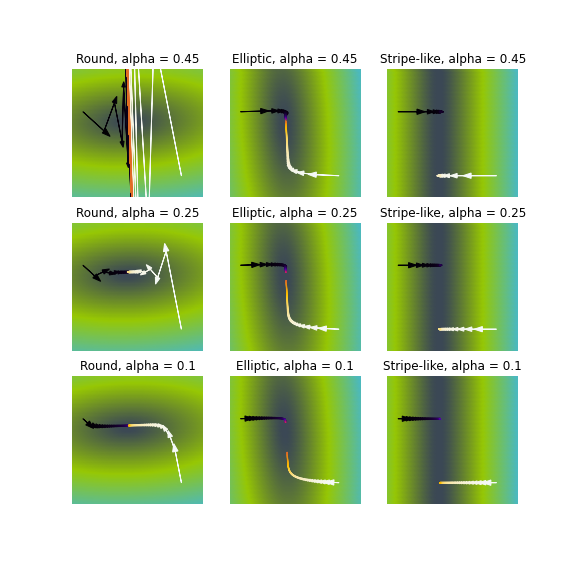

   Видим, что при неудачном выборе $\alpha$ алгоритм не сходится или идёт вразнос, а для плохо обусловленной задачи он сходится абы куда.
 </details>

Вычислительная сложность градиентного спуска – $O(NDS)$, где, как и выше, $N$ – длина выборки, $D$ – число признаков у одного обьекта.

Сложность по памяти – $O(ND)$. В памяти мы держим и выборку, и градиент, но доминирует, разумеется, выборка.

&nbsp;
## Стохастический градиентный спуск

На каждом шаге градиентного спуска нам требуется выполнить потенциально дорогую операцию вычисления градиента по всей выборке (сложность $$O(ND)$$). Возникает идея заменить градиент его оценкой на подвыборке (в английской литературе такую подвыборку обычно именуют **batch** или **mini-batch**; в русской разговорной терминологии тоже часто встречается слово «батч» или «мини-батч»).

А именно, если функция потерь имеет вид сумму по отдельным парам объект-таргет

$$L(w, X, y) = \frac1N\sum_{i=1}^NL(w, x_i, y_i),$$

а градиент, соответственно, записывается в виде

$$\nabla_wL(w, X, y) = \frac1N\sum_{i=1}^N\nabla_wL(w, x_i, y_i),$$

то предлагается брать оценку

$$\nabla_wL(w, X, y) \approx \frac1B\sum_{t=1}^B\nabla_wL(w, x_{i_t}, y_{i_t})$$

для некоторого батча $(x_{i_t}, y_{i_t})_{t=1}^B$. Обратите внимание на множители $\frac1N$ и $\frac1B$ перед суммами. Почему они нужны? Полный градиент $\nabla_wL(w, X, y)$ можно воспринимать как среднее градиентов по всем объектам, то есть как оценку матожидания $\mathbb{E}\nabla_wL(w, x, y)$; тогда, конечно, оценка матожидания по меньшей подвыборке тоже будет иметь вид среднего градиентов по объектам этой подвыборки.

Как делить выборку на батчи? Ясно, что можно было бы случайным образом сэмплировать их из полного датасета, но даже если использовать быстрый алгоритм вроде резервуарного сэмплирования, сложность этой операции не самая оптимальная. Поэтому используют линейный проход по выборке (которую перед этим лучше всё-таки случайным образом перемешать), при котором на $$B$$ очередных примерах (еще один новый параметр алгоритма = размер батча $$B$$) вычисляется градиент и производится обновление весов модели. При этом вместо количества шагов алгоритма обычно задают количество **эпох** $$E$$  (да-да еще один новый гиперпараметр), где одна эпоха – это один полный проход по выборке. Заметим, что если выборка очень большая, а модель компактная, то может быть достаточно и одного неполного прохода.

**Алгоритм:**
```python
 w = normal(0, 1)
 repeat E times:
   for i = B, i <= n, i += B
      X_batch = X[i-B : i]
      y_batch = y[i-B : i]
      f = X_batch.dot(w)                 # посчитать предсказание
      err = f - y_batch                  # посчитать ошибку
      grad = 2 * X_batch.T.dot(err)      # посчитать градиент
      w -= alpha * grad
```

Сложность по времени – $$O(NDE)$$. На первый взгляд, она такая же, как и у обычного градиентного спуска, но заметим, что мы сделали в $$N / B$$ раз больше шагов, то есть веса модели претерпели намного больше обновлений.

Сложность по памяти можно довести до $$O(BD)$$: ведь теперь всю выборку не надо держать в памяти, а достаточно загружать лишь текущий батч (а остальная выборка может лежать на диске, что удобно, так как в реальности задачи, в которых выборка целиком не влезает в оперативную память, встречаются сплошь и рядом). Заметим, впрочем, что при этом лучше бы $$B$$ взять побольше: ведь чтение с диска – намного более затратная по времени операция, чем чтение из оперативной памяти.

В целом, разницу между алгоритмами можно представлять как-то так:
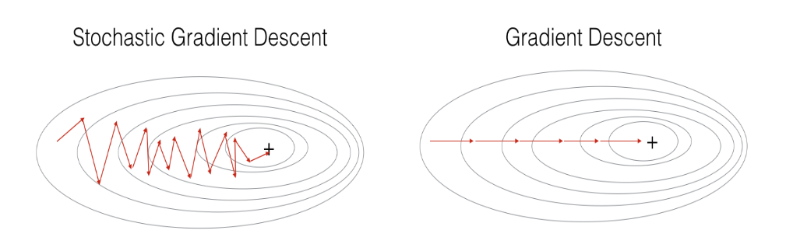

Шаги стохастического градиентного спуска заметно более шумные, но их значительно быстрее считать. И в итоге они тоже сходятся к оптимальному значению (в случае выпуклого функционала качества; подробнее в главе про оптимизацию) из-за того, что матожидание оценки градиента на батче равно самому градиенту. Для сложных моделей и лоссов стохастический градиентный спуск может сходиться плохо или застревать в локальных минимумах, поэтому придумано множество его улучшений. О некоторых из них также рассказано в главе про оптимизацию.

Существует определённая терминологическая путаница, и в некоторых учебниках/курсах стохастическим градиентным спуском называют версию, в которой размер батча равен единице (то есть максимально шумная и быстрая версия алгоритма), а версии с бОльшим размером батча называют batch gradient descent. В книгах, которые старше вас, такая процедура иногда еще называется incremental gradient descent. Это не очень принципиально, но вы будьте готовы, если что.

**Вопрос на подумать**. Вообще говоря, если объём данных не слишком велик и позволяет это сделать, объекты лучше случайным образом перемешивать перед тем, как подавать их в алгоритм стохастического градиентного спуска. Как вам кажется, почему?

Также можно использовать различные стратегии отбора объектов. Например, чаще брать объекты, на которых ошибка больше. Какие ещё стратегии вы могли бы придумать?

<details>
  <summary>Ответ (не открывайте сразу; сначала подумайте сами!)</summary>

  Легко представить себе ситуацию, в которой объекты как-нибудь неудачно упорядочены, скажем, по возрастанию таргета. Тогда модель будет то учить, что все таргеты маленькие, то – что все таргеты большие. Это может и не повлиять на качество итоговой модели, но может привести и к довольно печальным последствиям. И вообще, чем более разнообразные батчи модель увидит в процессе обучения, тем лучше.

  Стратегий можно придумать много. Например, не брать объекты, на которых ошибка слишком большая (возможно, это выбросы – зачем на них учиться), или вообще не брать те, на которых ошибка достаточно мала (они «ничему не учат»). Рекомендуем, впрочем, прибегать к этим эвристикам, только если вы понимаете, зачем они вам нужны и почему есть надежда, что они помогут.
</details>


## Неградиентные методы

После прочтения этой главы у вас может сложиться ощущение, что приближённые способы решения ML задач и градиентные методы – это одно и тоже, но вы будете правы в этом только на 98%. В принципе, существуют и другие способы численно решать эти задачи, но в общем случае они работают гораздо хуже, чем градиентный спуск, и не обладают таким хорошим теоретическим обоснованием.  Мы не будем рассказывать про них подробно, но можете на досуге почитать, скажем, про Stepwise regression, Orthogonal matching pursuit или LARS (у последнего есть довольно интересное свойство: он может эффективно работать на выборках, в которых число признаков больше числа примеров). С алгоритмом LARS вы можете познакомиться в главе про оптимизацию.

&nbsp;
# Регуляризация
Всегда ли решение задачи регрессии единственно? Вообще говоря, нет. Так, если в выборке два признака будут линейно зависимы (и следовательно, ранг матрицы будет меньше $$D$$), то гарантировано найдется такой вектор весов $$\nu$$ что $$\langle\nu, x_i\rangle = 0\ \ \forall x_i$$. В этом случае, если какой-то $$w$$ является решением оптимизационной задачи, то и $$w + \alpha \nu $$ тоже является решением для любого $$\alpha$$. То есть решение может быть не уникальным и сколь угодно большим по модулю, что создаёт вычислительные трудности (малые погрешности признаков сильно возрастают при предсказании ответа, а в градиентном спуске накапливается погрешность из-за операций со слишком большими числами).

Конечно, в жизни редко бывает так, что признаки строго линейно зависимы, а вот быть приближённо линейно зависимыми они вполне могут быть (такая ситуация называется **мультиколлинеарностью**). Тогда у нас возникают проблемы, близкие к описанным выше. В этом случае $$X\nu\sim 0$$ для вектора $\nu$, состоящего из коэффициентов приближённой линейной зависимости, и, соответственно, $$X^TX\nu\sim 0$$, то есть матрица $$X^TX$$ близка к вырожденной. Как и любая симметричная матрица, она диагонализуется в некотором (ортонормированном) базисе, и некоторые из собственных значений $$\lambda_i$$ близки к нулю. Если вектор $$X^Ty$$ в выражении $$(X^TX)^{-1}X^Ty$$ будет близким к соответствующему собственному вектору, то он будет умножаться на $$1 /{\lambda_i}$$, что опять же приведёт к появлению у $$w$$ очень больших по модулю координат (при этом $$w$$ ещё и будет вычислено с большой погрешностью из-за деления на маленькое число). И, конечно же, все ошибки и весь шум, которые имелись в матрице $$X$$ при вычислении $$y\sim Xw$$ будут умножаться на эти большие и неточные числа и возрастать во много-много раз, что приведёт к проблемам (и никакое сингулярное разложение нас от них не спасёт).

Важно ещё отметить, что в случае, когда несколько признаков «почти» линейно независимы, веса $w_i$ при них теряют физический смысл. Может даже оказаться, что вес признака, с ростом которого таргет, казалось бы, должен увеличиваться, станет отрицательным. Это делает модель не только неточной, но и принципиально не интерпретируемой. Вообще, неадекватность знаков или величины весов – хорошее указание на мультиколлинеарность.

Для того, чтобы справиться с этой проблемой, задачу обычно **регуляризуют**, то есть добавляют к ней дополнительное ограничение на величину вектора весов. Это ограничение можно, как и исходный лосс, задавать с помощью самых разных метрик, но, как правило, ничего сложнее, чем $$L^1$$- и $$L^2$$-нормы, не требуется.

Вместо исходной задачи теперь предлагается решить такую:

$$\color{#348FEA}{\min_w L(f, X, y) = \min_w(\|X w - y\|_2^2 + \lambda \|w\|^k_k )}$$

$$\lambda$$ – это очередной параметр, **коэффициент регуляризации**, а $$\|w\|^k_k $$ -- это один из двух вариантов:

$$\color{#348FEA}{\|w\|^2_2 = w^2_1 + \ldots + w^2_D}$$

или

$$\color{#348FEA}{\|w\|_1^1 = \vert w_1 \vert + \ldots + \vert w_D \vert}$$

Добавка $$\lambda\|w\|^k_k$$ называется **регуляризационным членом** или **регуляризатором**, а число $\lambda$ – **коэффициентом регуляризации**.

Коэффициент $$\lambda$$ является гиперпараметром модели и достаточно сильно влияет на качество итогового решения. Его подбирают по логарифмической шкале (скажем, от `1e-2` до `1e+2`), используя для сравнения моделей с разными значениями $\lambda$ дополнительную валидационную выборку (а качество модели с подобранным коэффициентом регуляризации уже проверяют на тестовой). Более подробно о том, как нужно подбирать гиперпараметры, вы можете почитать в соответствующей главе.

Отдельно надо договориться о том, что вес $w_0$, соответствующий отступу от начала координат (то есть признаку из всех единичек), мы регуляризовать не будем, потому что это не имеет смысла: если даже все значения $$y$$ равномерно велики, это не должно портить качество обучения. Обычно это не отображают в формулах, но если придираться к деталям, то стоило бы написать

$$\|w\|^2_2 = \sum_{\color{red}{j=1}}^{D}w_j^2,$$

$$\|w\|_1 = \sum_{\color{red}{j=1}}^{D} \vert w_j \vert$$

В случае $$L^2$$-регуляризации решение задачи изменяется не очень сильно. Например, продифференцировав новый лосс по $$w$$, легко получить, что «точное» решение имеет вид:

$$w = (X^TX + \lambda I)^{-1}X^Ty$$

Отметим, что за этой формулой стоит и понятная численная интуиция: раз матрица $$X^TX$$ близка к вырожденной и обращать её сродни самоубийству, мы лучше слегка исказим её добавкой $$\lambda I$$, которая увеличит все собственные значения на $$\lambda$$, отодвинув их от нуля. Да, аналитическое решение перестаёт быть «точным», но за счёт снижения численных проблем мы получим более качественное решение, чем при использовании «точной» формулы.

В свою очередь, градиент функции потерь

$$L(f_w, X, y) = \|Xw - y\|^2 + \lambda\|w\|^2$$

по весам теперь выглядит так:

$$
    \nabla_wL(f_w, X, y) = 2X^T(Xw - y) + 2\lambda w
$$

Подставив этот градиент в алгоритм стохастического градиентного спуска, мы получаем обновлённую версию приближенного алгоритма, отличающуюся от старой только наличием дополнительного слагаемого.

**Вопрос на подумать**. Стохастический градиентный спуск для $L^2$-регуляризованной линейной регрессии будет (в случае, если батч из одного объекта) иметь вид:

$$w_i\mapsto w_i - \alpha(\langle w, x_j\rangle - y_j)x_{ji} - \frac{2\lambda}N w_i,\quad i=1,\ldots,D$$

Как вы думаете, зачем нужен этот множитель $$\frac1N$$ при градиенте регуляризатора?

<details>
  <summary>Ответ (не открывайте сразу; сначала подумайте сами!)</summary>

  Тут стоит сделать шаг назад и понять, как выглядела функция потерь до того, как мы стали брать градиенты. Давайте вспомним, что изначально мы формулировали SGD не для $L^2$-нормы, а для MSE, потому что нам важно было, чтобы в исходном лоссе перед суммой стоял коэффициент $\frac1N$ (тогда SGD получается из оценки матожидания градиента). А регуляризацию мы определяли для $L^2$-нормы; для MSE регуляризованная функция потерь будет иметь вид

  $$\widetilde{L} = \frac1N\sum_{i=1}^N\|Xw - y\|^2 + \frac{\lambda}{N}\|w\|^2$$

  Коэффициент $\frac1N$ при регуляризационном члене неизбежно должен появиться: иначе соотношения масштабов двух слагаемых будут существенно зависеть от объёма обучающей выборки, а это плохо.
</details>

**Вопрос на подумать**.  Распишите процедуру стохастического градиентного спуска для $L^1$-регуляризованной линейной регрессии. Как вам кажется, почему никого не волнует, что функция потерь, строго говоря, не дифференцируема?

<details>
  <summary>Ответ (не открывайте сразу; сначала подумайте сами!)</summary>

  Распишем для случая батча размера 1:

  $$w_i\mapsto w_i - \alpha(\langle w, x_j\rangle - y_j)x_{ji} - \frac{\lambda}N\cdot \text{sign}{ w_i},\quad i=1,\ldots,D$$

  Функция потерь не дифференцируема лишь в одной точке. Такое не считается проблемой в машинном обучении; производную просто доопределяют как-нибудь (а на самом деле попадание прямо в ноль очень маловероятно из-за численных погрешностей).
</details>

Отметим, что $L^1$- и $L^2$-регуляризацию можно определять для любой функции потерь $L(w, X, y)$ (и не только в задаче регрессии, а и, например, в задаче классификации тоже). Новая функция потерь будет соответственно равна

$$\widetilde{L}(w, X, y) = L(w, X, y) + \lambda\|w\|_1$$

или

$$\widetilde{L}(w, X, y) = L(w, X, y) + \lambda\|w\|_2^2$$

## Разреживание весов в $L^1$-регуляризации

$$L^2$$-регуляризация работает прекрасно и используется в большинстве случаев, но есть одна полезная особенность $$L^1$$-регуляризации: её применение приводит к тому, что у признаков, которые не оказывают большого влияния на ответ, вес в результате оптимизации получается равным $0$. Это позволяет удобным образом удалять признаки, слабо влияющие на таргет (а также автоматически избавляться от признаков, которые участвуют в соотношениях приближённой линейной зависимости).

Не очень строгим, но довольно интуитивным образом это можно объяснить так:
1. В точке оптимума линии уровня регуляризационного члена касаются линий уровня основного лосса, потому что, во-первых, и те, и другие выпуклые, а во-вторых, если они пересекаются трансверсально, то существует более оптимальная точка: 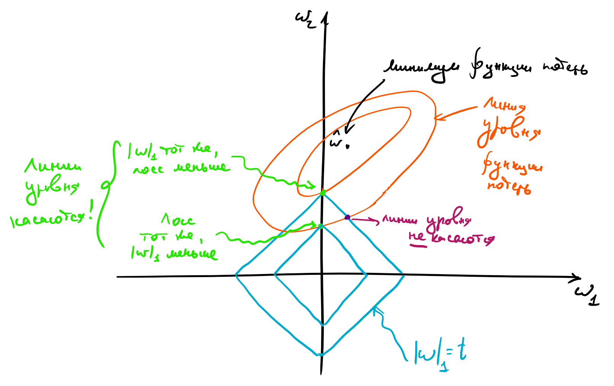

2. Линии уровня $$L^1$$-нормы – это $N$-мерные октаэдры. Точки их касания с линиями уровня лосса, скорее всего, лежат на грани размерности, меньшей $$N-1$$, то есть как раз таки в области, где часть координат равна нулю. Этот факт непросто доказать строго, но после такой иллюстрации в него хочется верить: 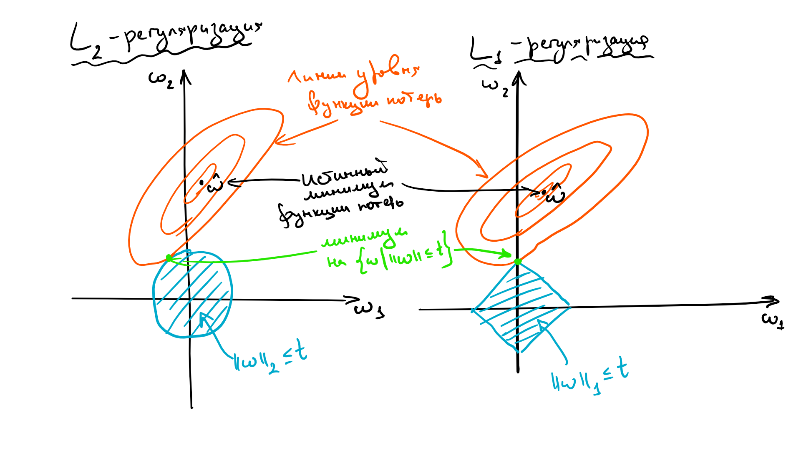

Заметим, что данное построение говорит о том, как выглядит оптимальное решение этой оптимизационной задачи, но ничего не говорит о способе решения. На самом деле найти этот оптимум непросто: ведь у $$L^1$$ меры довольно плохая производная. Но способы есть, можете на досуге прочитать, например, [вот эту статью](https://static.googleusercontent.com/media/research.google.com/en//pubs/archive/41159.pdf) о том, как работало предсказание CTR в google в 2012 году. Там этой теме посвящается довольно много места. Кроме того, рекомендуем посмотреть про проксимальные методы в разделе про оптимизацию в ML.

Заметим также, что вообще-то оптимизация любой нормы $$L_x, \ 0  \leq x \leq 1$$, приведет к появлению разреженных векторов весов, просто если c $$L^1$$ ещё хоть как-то можно работать, то остальными все ещё сложнее.


&nbsp;
# Другие лоссы

Стохастический градиентный спуск можно очевидным образом обобщить для решения задачи линейной регрессии с любой другой функцией потерь, не только квадратичной: ведь всё, что нам нужно от неё, – это градиент. На практике это делают редко, но тем не менее рассмотрим еще пару вариантов.

## MAE
**Mean absolute error**, абсолютная ошибка, появляется при замене $$L^2$$ нормы в MSE на $$L^1$$:

$$\color{#348FEA}{MAE(y, \widehat{y}) = \frac{1}{n}\sum_{i=1}^n \vert y_i - \widehat{y}_i\vert}$$

Можно заметить, что в MAE по сравнению с MSE существенно меньший вклад в ошибку будут вносить примеры, сильно удалённые от ответов модели (из-за того, что здесь мы от расстояния считаем модуль, а не квадрат). Такая функция потерь уместна в случаях, когда вы пытаетесь обучить регрессию на данных с большим количеством выбросов в таргете.

Иначе на эту разницу можно посмотреть так: MSE приближает матожидание условного распределения $$y \mid x$$, а MAE – медиану.


## MAPE
*Mean absolute percentage error*, относительная ошибка.

$$MAPE(y, \widehat{y}) = \frac{1}{n}\sum_{i=1}^n \left|\frac{\widehat{y}_i-y_i}{y_i}\right|$$

Часто используется в задачах прогнозирования (например, погоды, загруженности дорог, кассовых сборов фильмов, цен), когда ответы могут быть различными по порядку величины, и при этом мы бы хотели верно угадать порядок, то есть не хотим за предсказание 2000 вместо 1000 штрафовать в разы сильней, чем за предсказание 2 вместо 1.


**Вопрос на подумать**.  Кроме описанных выше в задаче линейной регрессии можно использовать и другие функции потерь, например, **Huber loss**:

$$
\mathcal{L}(f, X, y) = \sum_{i=1}^Nh_{\delta}(y_i - \langle w_i, x\rangle),\mbox{ где }h_{\delta}(z) =
\begin{cases}
\frac12z^2,\ |z|\leqslant\delta,\\
\delta(|z| - \frac12\delta),\ |z| > \delta
\end{cases}
$$

Число $$\delta$$ является гиперпараметром. Сложная формула при $$\vert z\vert > \delta$$ нужна, чтобы функция $$h_{\delta}(z)$$ была непрерывной (и даже гладкой). Попробуйте объяснить, зачем может быть нужна такая функция потерь.

<details>
  <summary>Ответ (не открывайте сразу; сначала подумайте сами!)</summary>

  Часто требования формулируют в духе «функция потерь должна слабее штрафовать то-то и сильней штрафовать вот это» (так, например, $L^2$-регуляризованный лосс штрафует за большие по модулю веса). В данном случае можно заметить, что при небольших значениях ошибки берётся просто MSE, а при больших мы начинаем штрафовать нашу модель менее сурово. Например, это может быть полезно для того, чтобы выбросы не так сильно влияли на результат обучения.
</details>


# Линейная классификация
Теперь давайте поговорим про задачу классификации, для начала на два класса (обобщить её потом до задачи классификации на $$K$$ классов не составит большого труда). Теперь $$y$$ будет кодировать принадлежность к положительному или отрицательному классу, то есть принадлежность множеству $$\{-1,1\}$$ (в этой главе договоримся именно так обозначать классы, хотя в жизни вам будут нередко встречаться и метки $$\{0,1\}$$), а $$x$$ – по-прежнему векторы из $$\mathbb{R}^D$$. Мы хотим обучить линейную модель так, чтобы плоскость, которую она задаёт, как можно лучше отделяла объекты одного класса от другого.

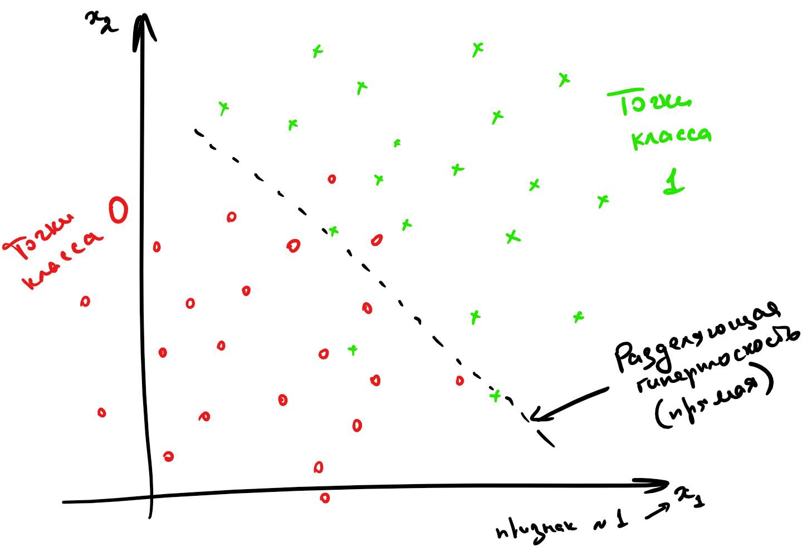

Как её обучить (то есть какую ошибку минимизировать), нам ещё предстоит понять, но уже ясно, что итоговое предсказание можно будет вычислить по формуле

$$y = sign \langle w, x_i\rangle$$

<details>
  <summary>Почему бы не решать, как задачу регрессии?</summary>

  Мы можем попробовать предсказывать числа $$-1$$ и $$1$$, минимизируя для этого, например, MSE с последующим взятием знака, но ничего хорошего не получится. Во-первых, регрессия почти не штрафует за ошибки на объектах, которые лежат близко к *разделяющей плоскости*, но не с той стороны. Во вторых, ошибкой будет считаться предсказание, например, $$5$$ вместо $$1$$, хотя нам-то на самом деле не важно, какой у числа модуль, лишь бы знак был правильным. Если визулизировать такое решение, то проблемы тоже вполне заметны:

  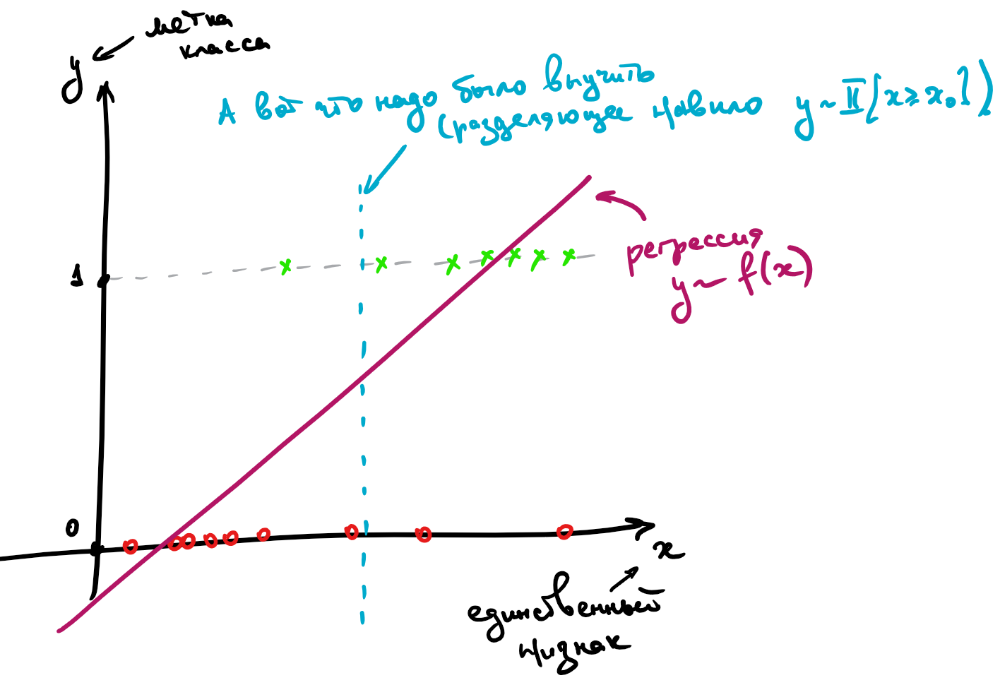

  Нам нужна прямая, которая разделяет эти точки, а не проходит через них!
</details>

Сконструируем теперь функционал ошибки так, чтобы он вышеперечисленными проблемами не обладал. Мы хотим минимизировать число ошибок классификатора, то есть

$$\sum_i \mathbb{I}[y_i \neq sign \langle w, x_i\rangle]\longrightarrow \min_w$$

Домножим обе части на $$y_i$$ и немного упростим

$$\sum_i \mathbb{I}[y_i \langle w, x_i\rangle < 0]\longrightarrow \min_w$$

Величина $M = y_i \langle w, x_i\rangle$ называется **отступом** (**margin**) классификатора. А вся ошибка называется **misclassification loss**. Легко видеть, что

* отступ положителен, когда $sign(y_i) = sign(\langle w, x_i\rangle)$, то есть класс угадан верно; при этом чем больше отступ, тем больше расстояние от $x_i$ до разделяющей гиперплоскости, то есть "уверенность классификатора";

* отступ отрицателен, когда $sign(y_i) \ne sign(\langle w, x_i\rangle)$, то есть класс угадан неверно; при этом чем больше по модулю отступ, тем более сокрушительно ошибается классификатор.

От каждого из отступов мы вычисляем функцию

$$F(M) = \mathbb{I}[M < 0] = \begin{cases}1,\ M < 0,\\ 0,\ M\geqslant 0\end{cases}$$

Она кусочно-постоянная, и из-за этого всю сумму невозможно оптимизировать градиентными методами: ведь её производная равна нулю во всех точках, где она существует. Но мы можем мажорировать её какой-нибудь более гладкой функцией, и тогда задачу будет можно решить. Функции можно использовать разные, у них свои достоинства и недостатки, давайте рассмотрим несколько примеров:


**Вопрос на подумать**. Допустим, мы как-то обучили классификатор, и подавляющее большинство отступов оказались отрицательными. Правда ли нас постигла катастрофа?

<details>
  <summary>Ответ (не открывайте сразу; сначала подумайте сами!)</summary>

  Наверное, мы что-то сделали не так, но ситуацию можно локально выправить, если предсказывать классы, противоположные тем, которые выдаёт наша модель.
</details>

**Вопрос на подумать**. Предположим, что у нас есть два классификатора с примерно одинаковыми и достаточно приемлемыми значениями интересующей нас метрики. При этом одна почти всегда выдаёт предсказания с большими по модулю отступами, а вторая – с относительно маленькими. Верно ли, что первая модель лучше, чем вторая?

<details>
  <summary>Ответ (не открывайте сразу; сначала подумайте сами!)</summary>

  На первый взгляд кажется, что первая модель действительно лучше: ведь она предсказывает «увереннее», но на самом деле всё не так однозначно: во многих случаях модель, которая умеет «честно признать, что не очень уверена в ответе» (в каком-то смысле отказаться от классификации на каких-то объектах), может быть предпочтительней модели, которая врёт с той же непотопляемой уверенностью, что и говорит правду.
</details>

## Ошибка перцептрона
Реализуем простейшую идею: давайте считать отступы только на неправильно классифицированных объектах и учитывать их не бинарно, а линейно, пропорционально их размеру. Получается такая функция:

$$F(M) = \max(0, -M)$$

Весь лосс тогда выглядит так (запишем его сразу с $$L^2$$-регуляризацией):

$$L(w, x, y) = \lambda\vert\vert w\vert\vert^2_2 + \sum_i \max(0, -y_i \langle w, x_i\rangle)$$

Найдём градиент:

$$
    \nabla_w L(w, x, y) = 2 \lambda w + \sum_i
        \begin{cases}
            0,            & y_i \langle w, x_i \rangle > 0 \\
           - y_i x_i,  & y_i \langle w, x_i \rangle \leq 0
        \end{cases}
$$

Имея аналитическую формулу для градиента, мы теперь можем так же, как и раньше, применить стохастический градиентный спуск, и задача будет решена.

Данная функция потерь впервые была предложена для перцептрона Розенблатта, первой вычислительной модели нейросети, которая в итоге привела к появлению deep learning.

Она решает задачу линейной классификации, но у нее есть одна особенность: её решение не единственно и сильно зависит от начальных параметров. Например, все изображённые ниже классификаторы имеют одинаковый нулевой лосс:

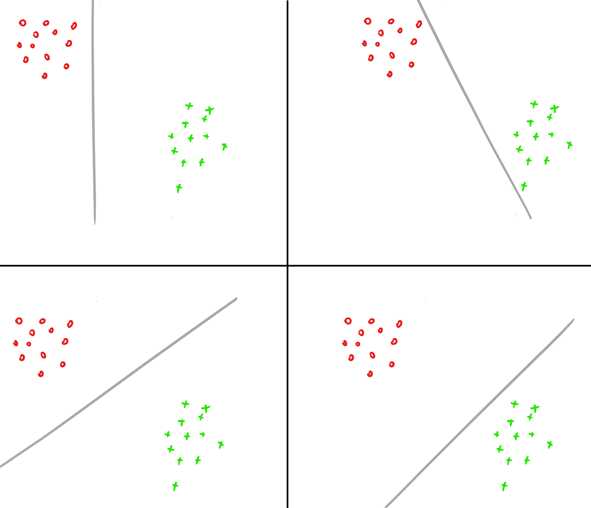

## Hinge loss, SVM
Для таких случаев, как на картинке выше, возникает логичное желание не только найти разделяющую прямую, но и постараться провести её на одинаковом удалении от обоих классов, то есть максимизировать минимальный отступ:

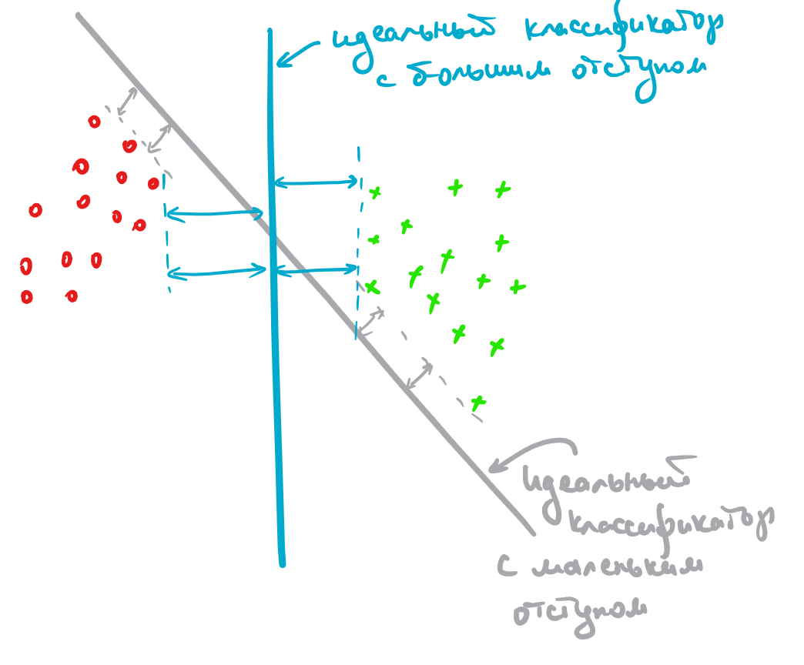

Это можно сделать, слегка поменяв функцию ошибки, а именно положив её равной:

$$F(M) = \max(0, 1-M)$$

$$L(w, x, y) = \lambda\|w\|^2_2 + \sum_i \max(0, 1-y_i \langle w, x_i\rangle)$$

$$
    \nabla_w L(w, x, y) = 2 \lambda w + \sum_i
        \begin{cases}
            0,           & 1 - y_i \langle w, x_i \rangle \leq 0 \\
            - y_i x_i,   & 1 - y_i \langle w, x_i \rangle > 0
        \end{cases}
$$

Почему же добавленная единичка приводит к желаемому результату?

Интуитивно это можно объяснить так: обьекты, которые проклассифицированы правильно, но не очень "уверенно" (то есть $$0 \leq y_i \langle w, x_i\rangle < 1$$), продолжают вносить свой вклад в градиент и пытаются "отодвинуть" от себя разделяющую плоскость как можно дальше.

Но к данному выводу можно прийти и чуть более строго; для этого надо совершенно по-другому взглянуть на выражение, которое мы минимизируем. Поможет эта картинка:


Если мы максимизируем минимальный отступ, то надо максимизировать $$\frac{2}{\|w\|_2}$$, то есть ширину полосы при условии того, что большинство объектов лежат с правильной стороны, что эквивалентно решению нашей исходной задачи:

$$\lambda\|w\|^2_2 + \sum_i \max(0, 1-y_i \langle w, x_i\rangle) \longrightarrow\min\limits_{w}$$

Отметим, что первое слагаемое у нас обратно к ширине полосы (мы и максимизацию поменяли на минимизацию, так что всё в порядке), а второе – штраф за то, что некоторые объекты неправильно расположены относительно неё (ведь никто не обещал нам, что классы на самом деле линейно разделимы и можно провести оптимальную плоскость вообще без ошибок).

Итоговое положение плоскости на самом деле задаётся всего несколькими обучающими примерами: ближайшими к плоскости правильно классифицированными объектами, которые называют **опорными векторами** (**support vectors**). Весь метод, соответственно, зовётся методом **(машиной) опорных векторов**, или **support vector machine** (**SVM**). В 60-90-х годах, до появления методов, основанных на деревьях решений (которые недавно передали пальму первенства нейросетям), он был сильнейшим из известных методов машинного обучения.

Почему же SVM был столь популярен? Из-за небольшого количества параметров и доказуемой оптимальности. Сейчас для нас нормально выбирать кастомный алгоритм под задачу и подбирать оптимальные гиперпараметры (вид и коэффициенты регуляризации, например) для него перебором, а когда-то трава была зеленее, а компьютеры медленнее, и такой роскоши у людей не было, поэтому им нужна была модель, которая гарантированно неплохо работала бы в любой ситуации. Такой моделью и был SVM.

Другие замечательные свойства SVM: существование уникального решения и доказуемо минимальная склонность к переобучению среди всех популярных классов линейных классификаторов. Кроме того, несложная модификация алгоритма, ядровый SVM, позволяет проводить нелинейные разделяющие поверхности.

Строгий вывод постановки задачи SVM можно прочитать [тут](https://www.mit.edu/~9.520/spring08/Classes/class05.pdf) или [в лекции К.В. Воронцова](http://machinelearning.ru/wiki/images/archive/a/a0/20150316112120!Voron-ML-Lin-SVM.pdf).

## Логистическая регрессия

В этом параграфе мы будем обозначать классы 0 и 1.

Еще один интересный метод появляется из желания посмотреть на классификацию как на задачу предсказания вероятностей. Хороший пример – предсказание кликов в интернете (например, в рекламе и поиске). Наличие клика в обучающем логе не означает, что, если повторить полностью условия эксперимента, пользователь обязательно кликнет по объекту опять. Скорее у объектов есть какая-то кликабельность (то есть истинная вероятность клика по данному объекту), клик на каждом обучающем примере является реализацией этой случайной величины, и мы считаем, что в пределе в каждой точке отношение положительных и отрицательных примеров должно сходиться к этой вероятности.

Проблема состоит в том, что вероятности должны располагаться от 0 до 1, а простого способа обучить линейную модель так, чтобы это ограничение соблюдалось, нет. Из этой ситуации можно выйти так: научить линейную модель правильно предсказывать какой-то обьект, связанный с вероятностью, но с диапазоном значений $$(-\infty,\infty)$$, и преобразовать ответы модели в вероятность. Таким обьектом является **logit** или **log odds** – логарифм отношения вероятности положительного события к отрицательному $$\log\left(\frac{p}{1-p}\right)$$.

Если ответом нашей модели является $$\log\left(\frac{p}{1-p}\right)$$, то искомую вероятность посчитать не трудно:

$$\langle w, x_i\rangle = \log\left(\frac{p}{1-p}\right)$$

$$e^{\langle w, x_i\rangle} = \frac{p}{1-p}$$

$$p=\frac{1}{1 + e^{-\langle w, x_i\rangle}}$$

Функция в правой части называется **сигмоидой** и обозначается

$$\color{#348FEA}{\sigma(z) = \frac1{1 + e^{-z}}}$$

Таким образом, $p = \sigma(\langle w, x_i\rangle)$

Как теперь научиться оптимизировать $$w$$ так, чтобы модель как можно лучше предсказывала логиты? Нужно применить метод максимума правдоподобия для распределения Бернулли (клик/не клик с вероятностью $$p$$). Если вы не очень хорошо им владеете, вы можете почитать соответствующий параграф теоретического минимума; мы упомянем лишь основную идею.

Правдоподобие позволяет понять, насколько вероятно получить данные значения таргета $y$ при данных $X$ и весах $w$. Оно имеет вид

$$ p(y\mid X, w) =\prod_i p(y_i\mid x_i, w) $$

и для распределения Бернулли его можно выписать следующим образом:

$$ p(y\mid X, w) =\prod_i p_i^{y_i} (1-p_i)^{1-y_i} $$

где $$p_i$$ – это вероятность, посчитанная из ответов модели. Оптимизировать произведение неудобно, хочется иметь дело с суммой, так что мы перейдём к логарифмическому правдоподобию и подставим формулу для вероятности, которую мы получили выше:

$$ \ell(w, X, y) = \sum_i \big( y_i \log(p_i) + (1-y_i)\log(1-p_i) \big) $$

$$ =\sum_i \big( y_i \log(\sigma(\langle w, x_i \rangle)) + (1-y_i)\log(1 - \sigma(\langle w, x_i \rangle)) \big) $$

Если заметить, что

$$
  \sigma(-z) = \frac{1}{1 + e^z} = \frac{e^{-z}}{e^{-z} + 1} = 1 - \sigma(z),
$$

то выражение можно переписать проще:

$$
  \ell(w, X, y)=\sum_i \big( y_i \log(\sigma(\langle w, x_i \rangle)) + (1 - y_i) \log(\sigma(-\langle w, x_i \rangle)) \big)
$$

Нас интересует $w$, для которого правдоподобие максимально. Чтобы получить функцию потерь, которую мы будем *минимизировать*, умножим его на минус один:

$$\color{#348FEA}{L(w, X, y) = -\sum_i \big( y_i \log(\sigma(\langle w, x_i \rangle)) + (1 - y_i) \log(\sigma(-\langle w, x_i \rangle)) \big)}$$

В отличие от линейной регрессии, для логистической нет явной формулы решения. Деваться некуда, будем использовать градиентный спуск. К счастью, градиент устроен очень просто:

$$
  \nabla_w L(y, X, w) = -\sum_i x_i \big( y_i - \sigma(\langle w, x_i \rangle)) \big)
$$

<details>
  <summary>Вывод формулы градиента</summary>

  Нам окажется полезным ещё одно свойство сигмоиды::

  $$
    \frac{d \log \sigma(z)}{d z} = \left( \log \left( \frac{1}{1 + e^{-z}} \right)  \right)' = \frac{e^{-z}}{1 + e^{-z}} = \sigma(-z) \\
    \frac{d \log \sigma(-z)}{d z} =  -\sigma(z)
  $$

  Отсюда:

  $$
    \nabla_w \log \sigma(\langle w, x_i \rangle) =  \sigma(-\langle w, x_i \rangle) x_i \\
    \nabla_2 \log \sigma(-\langle w, x_i \rangle) =  -\sigma(\langle w, x_i \rangle) x_i
  $$

  и градиент оказывается равным

  $$
    \nabla_w L(y, X, w) = -\sum_i \big( y_i x_i \sigma(-\langle w, x_i \rangle) - (1 - y_i) x_i \sigma(\langle w, x_i \rangle)) \big) = \\
    = -\sum_i \big( y_i x_i (1 - \sigma(\langle w, x_i \rangle)) - (1 - y_i) x_i \sigma(\langle w, x_i \rangle)) \big) = \\
    = -\sum_i \big( y_i x_i - y_i x_i \sigma(\langle w, x_i \rangle) - x_i \sigma(\langle w, x_i \rangle) + y_i x_i \sigma(\langle w, x_i \rangle)) \big) = \\
    = -\sum_i \big( y_i x_i - x_i \sigma(\langle w, x_i \rangle)) \big)
  $$
</details>


Предсказание модели будет вычисляться, как мы договаривались, следующим образом:

$$p=\sigma(\langle w, x_i\rangle)$$

Но это вероятность положительного класса, а как от неё перейти к предсказанию самого класса? В других методах нам достаточно было посчитать знак предсказания, но теперь оно лежит от 0 до 1. Что же делать? Интуитивным и не совсем (и даже совсем не) правильным явлется ответ «взять порог 0.5». Более корректным будет подобрать этот порог отдельно, для уже построенной регрессии минимизируя нужную вам метрику на отложенной тестовой выборке (например, сделать так, чтобы доля положительных и отрицательных классов примерно совпадала с реальной).

Отдельно заметим, что метод называется логистической _регрессией_, а не логистической _классификацией_ именно потому, что предсказываем мы не классы, а вещественные числа – логиты.

**Вопрос на подумать**. Проверьте, что, если метки классов – это $\pm1$, а не $0$ и $1$, то функцию потерь для логистической регрессии можно записать в более компактном виде:

$$\mathcal{L}(w, X, y) = -\sum_{i=1}^N\log(1 + e^{-y_i\langle w, x_i\rangle})$$

&nbsp;

**Вопрос на подумать**. Правда ли разделяющая поверхность модели логистической регрессии является гиперплоскостью?

<details>
  <summary>Ответ (не открывайте сразу; сначала подумайте сами!)</summary>

  Разделяющая поверхность отделяет множество точек, которым мы присваиваем класс $$0$$ (или $$-1$$), и множество точек, которым мы присваиваем класс $$1$$. Представляется логичным провести отсечку по какому-либо значению предсказанной вероятности. Не очевидно, на самом деле, какому (ведь, как мы увидим в главе про калибровку классификаторов, это может быть не настоящая вероятность), но допустим, что по значению $$\frac12$$. Тогда разделяющая поверхность как раз задаётся равенством $$p = \frac12$$, что равносильно $$\langle w, x\rangle = 0$$. А это гиперплоскость.
</details>

**Вопрос на подумать**. Допустим, что матрица объекты-признаки $X$ имеет полный ранг по столбцам (то есть все её столбцы линейно независимы). Верно ли, что решение задачи восстановления логистической регрессии единственно?

<details>
  <summary>Ответ (не открывайте сразу; сначала подумайте сами!)</summary>

  В этот раз хорошего геометрического доказательства, как было для линейной регрессии, пожалуй, нет; нам придётся честно посчитать вторую производную и доказать, что она является положительно определённой. Сделаем это для случая, когда метки классов – это $\pm1$ (формулы будут немного попроще). Напомним, что в этом случае

  $$L(w, X, y) = -\sum_{i=1}^N\log(1 + e^{-y_i\langle w, x_i\rangle})$$

  Следовательно,

  $$\frac{\partial}{\partial w_{j}}(w, X, y) = \sum_{i=1}^N\frac{y_ix_{ij}e^{-y_i\langle w, x_i\rangle}}{1 + e^{-y_i\langle w, x_i\rangle}} = \sum_{i=1}^Ny_ix_{ij}\left(1 - \frac1{1 + e^{-y_i\langle w, x_i\rangle}}\right)$$

  $$\frac{\partial^2L}{\partial w_j\partial w_k}(w, X, y) = \sum_{i=1}^Ny^2_ix_{ij}x_{ik}\frac{e^{-y_i\langle w, x_i\rangle}}{(1 + e^{-y_i\langle w, x_i\rangle})^2} =$$

  $$ = \sum_{i=1}^Ny^2_ix_{ij}x_{ik}\sigma(y_i\langle w, x_i\rangle)(1 - \sigma(y_i\langle w, x_i\rangle))$$

  Теперь заметим, что $$y_i^2 = 1$$ и что, если обозначить через $$D$$ диагональную матрицу с элементами $$\sigma(y_i\langle w, x_i\rangle)(1 - \sigma(y_i\langle w, x_i\rangle))$$ на диагонали, матрицу вторых производных можно представить в виде:

  $$\nabla^2L = \left(\frac{\partial^2\mathcal{L}}{\partial w_j\partial w_k}\right) = X^TDX$$

  Так как $$0 < \sigma(y_i\langle w, x_i\rangle) < 1$$, у матрицы $$D$$ на диагонали стоят положительные числа, из которых можно извлечь квадратные корни, представив $$D$$ в виде $$D = D^{1/2}D^{1/2}$$. В свою очередь, матрица $$X$$ имеет полный ранг по столбцам. Стало быть, для любого вектора приращения $$u\ne 0$$ имеем

  $$u^TX^TDXu = u^TX^T(D^{1/2})^TD^{1/2}Xu = \vert D^{1/2}Xu \vert^2 > 0$$

  Таким образом, функция $$L$$ выпукла вниз как функция от $$w$$, и, соответственно, точка её экстремума непременно будет точкой минимума.
</details>

**Вопрос на подумать**. На картинке ниже представлены результаты работы на одном и том же датасете трёх моделей логистической регрессии с разными коэффициентами $L^2$-регуляризации:

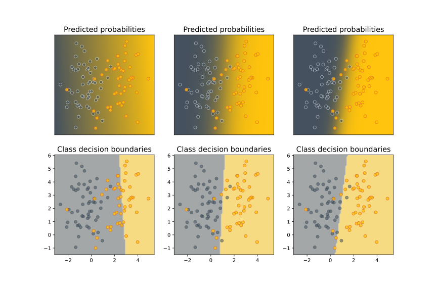

Наверху показаны предсказанные вероятности положительного класса, внизу – вид разделяющей поверхности.

Как вам кажется, какие картинки соответствуют самому большому коэффициенту регуляризации, а какие – самому маленькому? Почему?

<details>
  <summary>Ответ (не открывайте сразу; сначала подумайте сами!)</summary>

  Коэффициент регуляризации максимален у левой модели. На это нас могут натолкнуть два соображения. Во-первых, разделяющая прямая проведена достаточно странно, то есть можно заподозрить, что регуляризационный член в лосс-функции перевесил функцию потерь исходной задачи. Во-вторых, модель предсказывает довольно близкие к $$\frac12$$ вероятности – это значит, что значения $$\langle w, x\rangle$$ близки к нулю, то есть сам вектор $w$ близок к нулевому. Это также свидетельствует о том, что регуляризационный член играет слишком важную роль при оптимизации.

  Наименьший коэффициент регуляризации у правой модели. Её предсказания достаточно «уверенные» (цвета на верхнем графике сочные, то есть вероятности быстро приближаются к $$0$$ или $$1$$). Это может свидетельствовать о том, что числа $$\langle w, x\rangle$$ достаточно велики по модулю, то есть $$\vert w \vert$$ достаточно велик.
</details>

# Многоклассовая классификация

В этом разделе мы будем следовать изложению [из лекций Евгения Соколова](https://github.com/esokolov/ml-course-hse/blob/master/2020-fall/lecture-notes/lecture06-linclass.pdf).

Пусть каждый объект нашей выборки относится к одному из $K$ классов: $\mathbb{Y} = \{1, \ldots, K\}$. Чтобы предсказывать эти классы с помощью линейных моделей, нам придётся свести задачу многоклассовой классификации к набору бинарных, которые мы уже хорошо умеем решать. Мы разберём два самых популярных способа это сделать – one-vs-all и all-vs-all, а проиллюстрировать их нам поможет вот такой игрушечный датасет

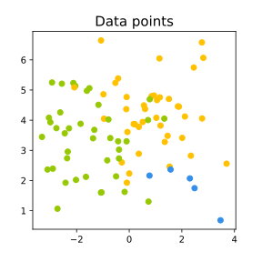

## Один против всех (one-versus-all)

Обучим $K$ линейных классификаторов~$b_1(x), \ldots, b_K(x)$, выдающих оценки принадлежности классам $1, \ldots, K$ соответственно. В случае с линейными моделями эти классификаторы будут иметь вид

$$b_k(x) = \text{sgn}\left(\langle w_k, x \rangle + w_{0k}\right)$$

Классификатор с номером $k$ будем обучать по выборке $\left(x_i, 2\mathbb{I}[y_i = k] - 1\right)_{i = 1}^{\ell}$; иными словами, мы учим классификатор отличать $k$-й класс от всех остальных.

Логично, чтобы итоговый классификатор выдавал класс, соответствующий самому уверенному
из бинарных алгоритмов. Уверенность можно в каком-то смысле измерить с помощью значений линейных функций:

$$a(x) = \text{argmax}_k \left(\langle w_k, x \rangle + w_{0k}\right) $$

Давайте посмотрим, что даст этот подход применительно к нашему датасету. Обучим три линейных модели, отличающих один класс от остальных:

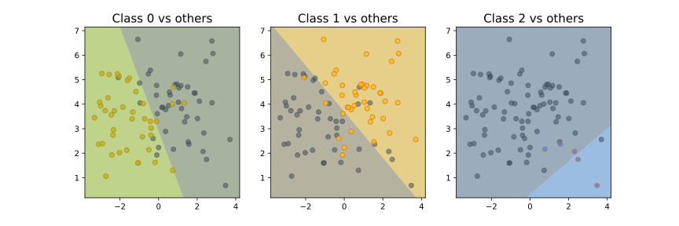

Теперь сравним значения линейных функций

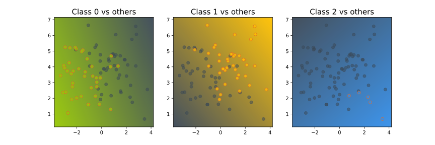

и для каждой точки выберем тот класс, которому соответствует большее значение (то есть самый «уверенный» классификатор):

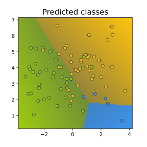

Хочется сказать, что самый маленький класс «обидели».

Проблема данного подхода заключается в том, что каждый из классификаторов $b_1(x), \dots, b_K(x)$ обучается на своей выборке, и выходы этих классификаторов (то есть значения линейных функций $\langle w_k, x \rangle + w_{0k}$) могут иметь разные масштабы, из-за чего сравнивать их будет неправильно. Нормировать вектора весов, чтобы они выдавали ответы в одной и той же шкале,
не всегда может быть разумным решением: так, в случае с SVM веса перестанут являться решением задачи, поскольку нормировка изменит норму весов.

## Все против всех (all-versus-all)

Обучим $C_K^2$ классификаторов $a_{ij}(x)$, $i, j = 1, \dots, K$, $i \neq j$.
Например, в случае с линейными моделями эти модели будут иметь вид

$$b_k(x) = \text{sgn}\left( \langle w_k, x \rangle + w_{0k} \right)$$

Классификатор $a_{ij}(x)$ будем настраивать по подвыборке $X_{ij} \subset X$,
содержащей только объекты классов $i$ и $j$. Соответственно, классификатор $a_{ij}(x)$ будет выдавать для любого объекта либо класс $i$, либо класс $j$. Проиллюстрируем это для нашей выборки:

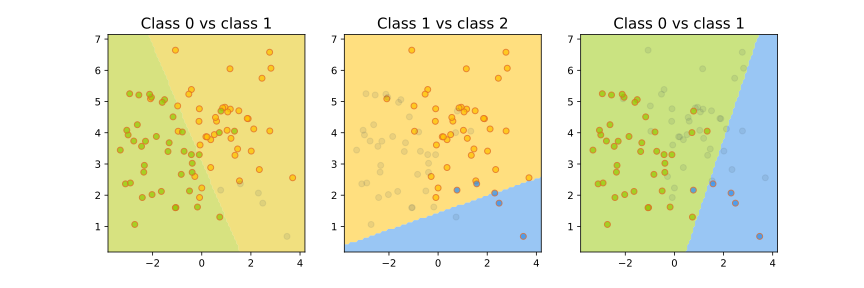

Чтобы классифицировать новый объект, подадим его на вход каждого из построенных бинарных классификаторов. Каждый из них проголосует за своей класс; в качестве ответа выберем тот класс, за который наберется больше всего голосов:

$$a(x) = \text{argmax}_k\sum_{i = 1}^{K} \sum_{j \neq i}\mathbb{I}[a_{ij}(x) = k]$$

Для нашего датасета получается следующая картинка:

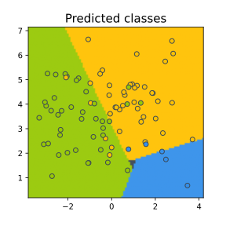

Обратите внимание на серый треугольник на стыке областей. Это точки, для которых голоса разделились (в данном случае каждый классификатор выдал какой-то свой класс, то есть у каждого класса было по одному голосу). Для этих точек нет явного способа выдать обоснованное предсказание.

## Многоклассовая логистическая регрессия

Некоторые методы бинарной классификации можно напрямую обобщить на случай многих классов.
Выясним, как это можно проделать с логистической регрессией.

В логистической регрессии для двух классов мы строили линейную модель

$$b(x) = \langle w, x \rangle + w_0$$

а затем переводили её прогноз в вероятность с помощью сигмоидной функции $\sigma(z) = \frac{1}{1 + \exp(-z)}$. Допустим, что мы теперь решаем многоклассовую задачу и построили $K$ линейных моделей

$$b_k(x) = \langle w_k, x \rangle + w_{0k},$$

каждая из которых даёт оценку принадлежности объекта одному из классов. Как преобразовать вектор оценок $(b_1(x), \ldots, b_K(x))$ в вероятности? Для этого можно воспользоваться оператором $\text{softmax}(z_1, \ldots, z_K)$, который производит «нормировку» вектора:

$$\text{softmax}(z_1, \ldots, z_K) = \left(\frac{\exp(z_1)}{\sum_{k = 1}^{K} \exp(z_k)},
\dots, \frac{\exp(z_K)}{\sum_{k = 1}^{K} \exp(z_k)}\right).$$

В этом случае вероятность $k$-го класса будет выражаться как

$$P(y = k \vert x, w) = \frac{
\exp{(\langle w_k, x \rangle + w_{0k})}}{ \sum_{j = 1}^{K} \exp{(\langle w_j, x \rangle + w_{0j})}}.$$

Обучать эти веса предлагается с помощью метода максимального правдоподобия: так же,
как и в случае с двухклассовой логистической регрессией:

$$\sum_{i = 1}^{\ell} \log P(y = y_i \vert x_i, w) \to \max_{w_1, \dots, w_K}$$

&nbsp;
# Масштабируемость линейных моделей

Мы уже обсуждали, что SGD позволяет обучению хорошо масштабироваться по числу объектов (можно не загружать их целиком в оперативную память), а что делать, если признаков очень много или мы не знаем заранее, сколько их будет? Такое может быть актуально, например, в следующих ситуациях:

* Классификация текстов: мы можем представить текст в формате «мешка слов», то есть неупорядоченного набора слов, встретившихся в данном тексте, и обучить на нём, например, определение тональности отзыва в интернете. Наличие каждого слова из языка в тексте у нас будет кодироваться отдельной фичой. Тогда мы получим обучающую выборку размерности порядка нескольких сотен тысяч.
* В задаче предсказания кликов по рекламе можно получить выборку любой размерности, например, так: в качестве фичи закодируем индикатор того, что пользователь X побывал на веб-странице Y. Суммарная размерность тогда будет порядка $$10^9 \cdot 10^7 = 10^{16}$$. Кроме того, всё время появляются новые пользователи и веб-страницы, так что на этапе применения нас ждут сюрпризы.

Есть несколько хаков, которые позволяют бороться с таким:
* Несмотря на то, что полная размерность объекта в выборке огромна, количество ненулевых элементов в нём невелико. Значит, можно использовать разреженное кодирование, то есть вместо плотного вектора хранить словарь, в котором будут перечислены индексы и значения ненулевых элементов вектора.
* Даже хранить все веса не обязательно! Можно вместо этого хранить хэш-таблицу весов меньшего размера и вычислять индекс по формуле ```hash(feature) %  tablesize``` (хэш может вычисляться прямо от слова или id пользователя). Таким образом, несколько фичей будут иметь общий вес, который тем не менее обучится оптимальным образом. Такой подход называется **hashing trick**. Ясно, что сжатие вектора весов приводит к потерям в качестве, но, как правило, ценой совсем не больших потерь можно сжать этот вектор на много порядков.

Примером открытой библиотеки, в которой реализованы эти возможности, является [vowpal wabbit](https://vowpalwabbit.org/).

## Parameter server

Если при решении задачи ставки столь высоки, что мы не можем разменивать качество на сжатие вектора весов, а признаков всё-таки очень много, то задачу можно решать распределённо, храня все признаки в шардированной хеш-таблице

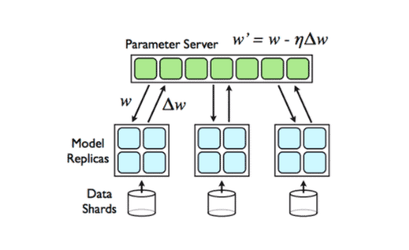


Квадратики здесь означают отдельные сервера. Синие загружают данные, а зелёные хранят части модели. Для обучения синий квадратик запрашивает у зелёных нужные ему для предсказания веса, считает градиент и отправляет его обратно, где тот потом применяется. Схема обладает бесконечной масштабируемостью, но задач, где это оправдано, не очень много. Если это звучит интересно, то в 3 и 4 семестре ШАДа есть несколько курсов, посвященных распределенным вычислениям, вам туда).

# Подытожим

На линейную модель можно смотреть как на однослойную нейросеть, поэтому многие методы, которые были изначально разработаны для них, сейчас переиспользуются в задачах глубокого обучения, а базовые подходы к регрессии, классификации и оптимизации вообще выглядят абсолютно так же. Так что несмотря на то, что в целом линейные модели на сегодня применяются редко, то, из чего они состоят и как строятся, знать очень и очень полезно.

Надеемся также, что главным итогом прочтения это главы для вас будет осознание того, что решение любой ML-задачи состоит из выбора функции потерь, параметризованного класса моделей и способа оптимизации. В следующих главах мы познакомимся с другими моделями и оптимизаторами, но этот фреймворк не изменится.
