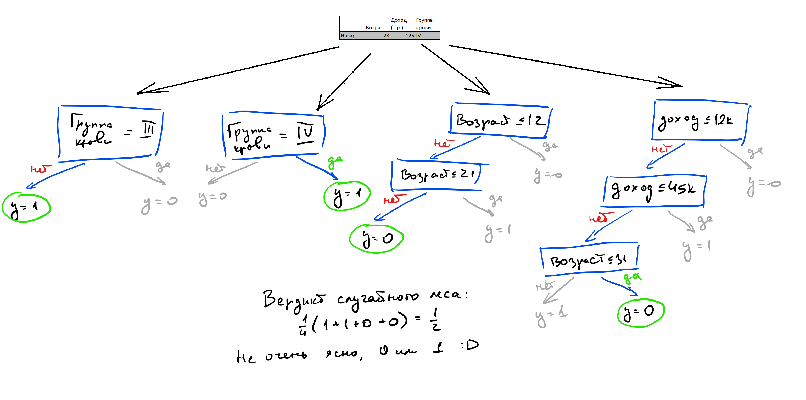

- Этот список будет заменен оглавлением, за вычетом заголовка "Contents",
  к которому добавлен класс `no_toc`.
  {:toc}

Представим, что у вас есть сложная модель, которая запоминает обучающую выборку и выдаёт отличное качество на ней, но вы боитесь, что она легко переобучится, и ошибка на тесте будет большой. Можно ли, не выходя из рассматриваемого класса моделей, **придумать процедуру, которая позволить снизить эту ошибку** и не будет требовать кропотливого подбора параметров модели и алгоритма обучения?

# Bias-variance decomposition

Чтобы придумать такую процедуру, полезно представлять, как формируется ошибка алгоритма. Если у нас получится разделить ошибку на составляющие, то мы, вероятно, сможем работать над минимизацией этих составляющих по отдельности.

Пусть целевая зависимость, которую мы хотим выучить, представляется в виде $$y(x) = f(x) + \varepsilon,$$ где $$\varepsilon \sim \mathcal{N}(0, \sigma^2),$$
то есть мы решаем задачу регрессии. В зависимости от природы данных, которые описывает эта зависимость, её представление в виде точной $f(x)$ и случайной $\varepsilon$ может быть продиктовано тем что:

1. данные на самом деле имеют случайный характер;
2. измерительный прибор не может зафиксировать целевую переменную абсолютно точно;
3. имеющихся признаков недостаточно, чтобы исчерпывающим образом описать объект/пользователя/событие.

Допустим, мы создали алгоритм, строящий по обучающей выборке $X_{\text{train}}$ модель $y \sim a(x) = a\left(x; X_{\text{train}}\right)$. Качество работы модели можно измерять разными способами; для простоты остановимся на квадратичной ошибке предсказания модели на новом объекте $x$: $$\left(y(x) - a(x)\right)^2$$. Но мы хотим учесть и зависимость от обучающей выборки. Поэтому давайте возьмём матожидание ошибки на объекте $x$ по всем возможным выборкам $X_{\text{train}}$, на которых могла обучаться модель:
$$\mathbb{E}_{X_{\text{train}}}\left[\left(y(x) - a(x; X_{\text{train}})\right)^2\right].$$

Преобразуем это выражение:

$$\mathbb{E}\left[\left(y - a\right)^2\right] = \mathbb{E}\left[y^2 + a^2 - 2ya\right] =$$

(раскроем матожидание по линейности, добавим и вычтем $\left(\mathbb{E}y\right)^2$ и $\left(\mathbb{E}a\right)^2$)

$$ =\mathbb{E}\left[y^2\right] - \left(\mathbb{E}y\right)^2 + \left(\mathbb{E}y\right)^2 + \mathbb{E}\left[a^2\right] - \left(\mathbb{E}a\right)^2 + \left(\mathbb{E}a\right)^2 - 2\cdot\mathbb{E}\left[a\cdot(f+\varepsilon)\right]=$$

(объединим матожидание квадрата и квадрат матожидания в дисперсию; используем, что $\mathbb{E}\left[\varepsilon\right] = 0$, $\mathbb{E}\left[f\right] = f$)

$$=\mathbb{D}y + \left(\mathbb{E}y\right)^2 + \mathbb{D}a + \left(\mathbb{E}a\right)^2 - 2f\cdot\mathbb{E}a = $$

(опять используем $\mathbb{E}\left[\varepsilon\right] = 0$, $\mathbb{E}\left[f\right] = f$ и линейность)

$$ = \mathbb{D}y + \mathbb{D}a + \left( f^2 + \left(\mathbb{E}a\right)^2 - 2f\cdot\mathbb{E}a \right)=$$

$$ = \mathbb{D}y + \mathbb{D}a + \left(\mathbb{E}\left[f - a\right]\right)^2 = $$

$$= \sigma^2 + variance(a) + bias^2(f, a)$$

Мы получили **bias-variance decomposition** -- представление ошибки в виде суммы трёх слагаемых:

$$\mathbb{E}\left[\left(y(x) - a(x)\right)^2\right] = \color{blue}{\left[\mathbb{E}\left(f(x) - a(x)\right)\right]^2} + \color{red}{\mathbb{D}\left(a(x)\right)} + \color{green}{\sigma^2},$$ где

- первое слагаемое ( bias ) отвечает за систематическое (по всем возможным обучающим выборкам) смещение предсказания алгоритма
- второе слагаемое ( variance ) отвечает за разброс предсказания
- третье слагаемое ( шум ) отвечает за ошибку, которую не убрать даже идеальным алгоритмом.

Теперь, когда известно, что **ошибка алгоритма раскладывается на шум, смещение и разброс**, можно подумать над способом сократить ошибку. Будет разумно попытаться сначала уменьшить одну из составляющих. Понятно, что с шумом уже ничего не сделать -- это минимально возможная ошибка. Какую можно придумать процедуру, чтобы, например, сократить разброс, не увеличивая смещение?

Пример приходит из жизни древних греков. Если много древних греков соберутся на одном холме и проголосуют независимо друг от друга, то вместе они придут к разумному решению несмотря на то, что опыт каждого из них субъективен. Аналогом голосования в мире машинного обучения является бэггинг.

# Бэггинг

Идея бэггинга заключается в следующем. Выберем из обучающей выборки $n$ примеров. Будем выбирать примеры равновероятно, с повторением. Получим новую выборку $X_{\text{train}}^1$, в которой некоторых элементов исходной выборки не будет, а какие-то могут войти несколько раз. С помощью некоторого алгоритма $b$ обучим на этой выборке модель $b_1(x) = b(x; X_{\text{train}}^1)$. Повторим процедуру: сформируем вторую выборку $X_{\text{train}}^2$ из $n$ элементов с возвращением и с помощью того же алгоритма обучим на ней модель $b_2(x) = b(x; X_{\text{train}}^2)$. Повторив так $k$ раз, получим $k$ моделей, обученных на $k$ выборках. Чтобы получить одно предсказание, усредним предсказания всех моделей:

$$a(x) = \frac{1}{k}(b_1(x) + \dots + b_k(x)).$$

Модели $b_1(x)$, …, $b_k(x)$ часто называют базовыми алгоритмами (хотя, наверное, лучше было бы назвать их базовыми моделями). Модель $a(x)$ называется ансамблем этих моделей.

Рассмотрим, что происходит с качеством предсказания при переходе от одной модели к ансамблю. Для этого воспользуемся концепцией bias-variance decomposition.

Сначала убедимся, что смещение ансамбля не изменилось по сравнению со средним смещением отдельных моделей. По линейности матожидания:

$$\mathbb{E}\left[f - a\right] = \mathbb{E}\left[f - \frac{1}{k}\sum_{i=1}^{k} b_i\right] = \frac{1}{k}\sum_{i=1}^{k}\mathbb{E}\left[f - b_i\right].$$

Теперь рассмотрим, что происходит с разбросом. **Сделаем предположение, что алгоритмы нескореллированы.** Тогда:

$$\mathbb{D}\left(a\right) = \frac{1}{k^2}\sum_i^k\mathbb{D}\left(b_i\right)+ \frac{1}{k^2}\sum_{1\le i < j \le k}cov \left(b_i, b_j\right)\ = \frac{1}{k^2}\sum_i^k\mathbb{D}\left(b_i\right) = \frac{1}{k}\mathbb{D}_{av},$$

где $\mathbb{D}_{av}$ — это средний разброс базовых алгоритмов. Получилось, что процедура бэггинга уменьшает разброс в $k$ раз.

Выше мы сделали предположение, что базовые алгоритмы нескореллированы. Однако в реальной жизни добиться этого сложно: ведь базовые алгоритмы учили одну и ту же зависимость на пересекающихся выборках. Поэтому будет странно, если корелляция на самом деле нулевая. Но на практике оказывается, что **строгое выполнение этого предположения не обязательно**. Достаточно, чтобы алгоритмы были в некоторой степени непохожи друг на друга. На этом строится развитие идеи бэггинга для решающих деревьев — случайный лес.

# Random Forest

Построим ансамбль алгоритмов, где базовый алгоритм — это решающее дерево. Будем строить по следующей схеме.

1. Для построения $i$-го дерева:
   а. Сначала, как в обычном бэггинге, из обучающей выборки $X, y$ выбирается с возвращением случайная подвыборка $X^i, y^i$ того же размера.
   б. Затем случайно выбираются $n < N$ признаков, где $N$ — полное число признаков (метод случайных подпространств). Так же, как и подвыборка для каждого дерева, набор признаков свой для кадого из деревьев. Такой приём как раз позволяет управлять степенью скоррелированности базовых алгоритмов.
   в. На $n$ выбранных признаках подвыборки $X^i, y^i$ строится $i$-е дерево.
2. Чтобы получить предсказание ансамбля на тестовом объекте, усредняем отдельные ответы деревьев (для регресии) или берём самый популярный класс (классификация).
3. Profit. Мы построили Random Forest (случайный лес) -- комбинацию бэггинга и метода случайных подпространств над решающими деревьями.

Построение леса:

Применение леса:

Внимательный читатель мог заметить, что при построении случайного леса у специалиста по машинному обучению есть несколько степеней свободы.

## Какая должна быть глубина деревьев в случайном лесе?

Ошибка модели (на которую мы можем повлиять) состоит из смещения и разброса. Разброс мы уменьшаем с помощью процедуры бэггинга. На смещение бэггинг не влияет, а хочется, чтобы у леса оно было небольшим. Поэтому смещение должно быть небольшим у самих деревьев, из которых строится ансамбль.
У неглубоких деревьев малое число параметров, то есть дерево способно запомнить только верхнеуровневые статистики обучающей подвыборки. Они во всех подвыборкам будут похожи, но будут не очень подробно описывать целевую зависимость. Поэтому при изменении обучающей подвыборки предсказание на тестовом объекте будет стабильным, но не точным (низкая дисперсия, высокое смещение).
Наоборот, у глубоких деревьев нет проблем запомнить подвыборку подробно. Поэтому предсказание на тестовом объекте будет сильнее меняться в зависимости от обучающей подвыборки, зато в среднем будет близко к истине (высокая дисперсия, низкое смещение).
Вывод: используем глубокие деревья.

## Сколько признаков надо подавать дереву для обучения?

Ограничивая число признаков, которые используются в обучении одного дерева, мы также управляем качеством случайного леса. Чем больше признаков, тем больше корреляция между деревьями и тем меньше чувствуется эффект от ансамблирования. Чем меньше признаков, тем слабее сами деревья. Практическая рекомендация -- брать корень из числа всех признаков для классификации и треть признаков для регрессии.

## Сколько должно быть деревьев в случайном лесе?

Выше было показано, что увеличение числа элементарных алгоритмов в ансамбле не меняет смещения и уменьшает разброс. Так как число признаков и варианты подвыборок, на которых строятся деревья в случайном лесе, ограничены, уменьшать разброс до бесконечности не получится. Поэтому имеет смысл построить график ошибки от числа деревьев и ограничить размер леса в тот момент, когда ошибка перестанет значимо уменьшаться.

Вторым практическим ограничением на количество деревьев может быть время работы ансамбля. Обучающие подвыборки создаются независимо друг от друга. Поэтому есть положительное свойство случайного леса: случайный лес можно строить и применять параллельно, что сокращает время работы, если у нас есть несколько процессоров. Но процессоров скорее всего всё же сильно меньше числа деревьев, а сами деревья обычно глубокие. Поэтому на большом числе деревьев Random Forest может работать дольше желаемого и количество деревьев можно сократить, немного пожертвовав качеством.

---

Pedro Domingos, University of Washington Seattle — «A Unifeid Bias-Variance Decomposition and its Applications», January 2000
