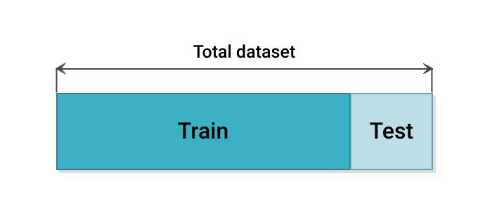
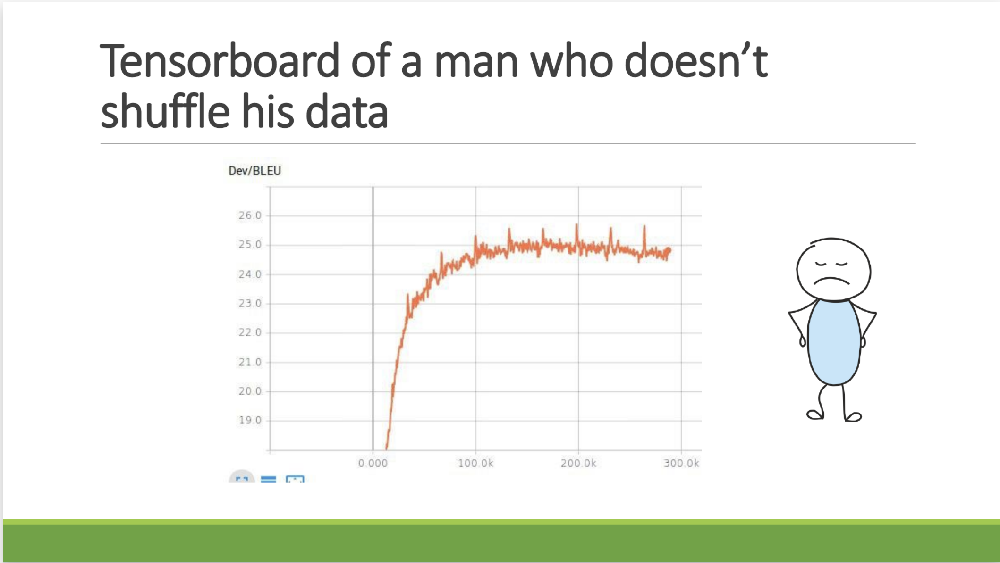
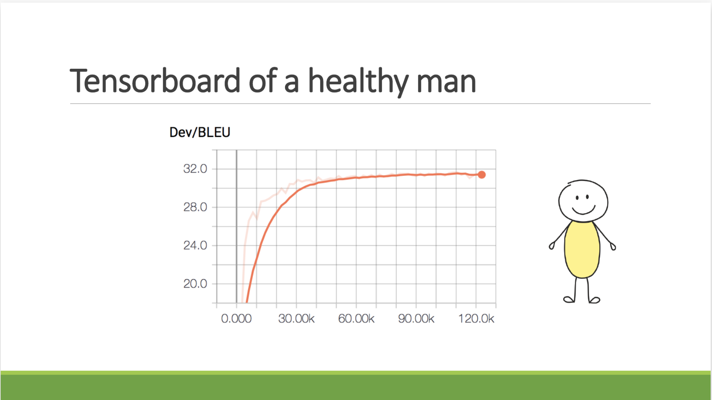
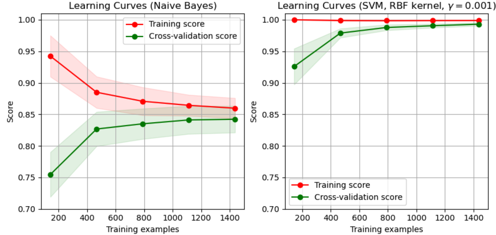
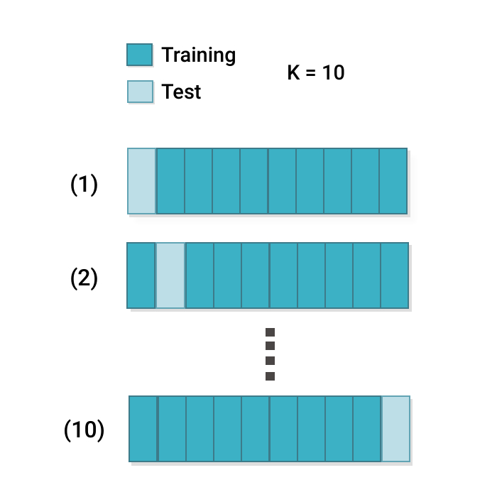
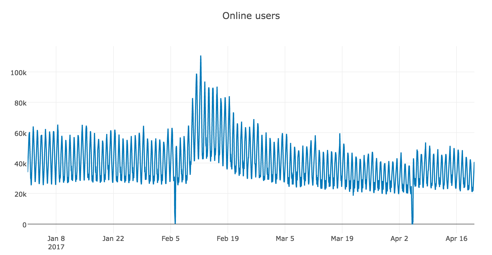
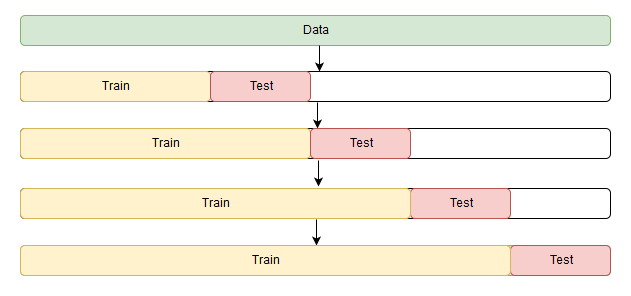
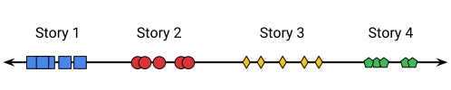
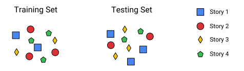
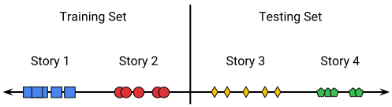

* Этот список будет заменен оглавлением, за вычетом заголовка "Contents",
к которому добавлен класс `no_toc`.
{:toc}


Кросс-валидация -- это метод, предназначенный для оценки качества работы модели, широко применяемый в машинном обучении. Он помогает сравнить между собой различные модели и выбрать наилучшую для конкретной задачи. В этом разделе мы рассмотрим наиболее распространённые методы кросс-валидации, а также обсудим возможные проблемы, которые могут возникнуть в процессе их применения.

Полезные ссылки:
- [Отличный блог-пост](https://neptune.ai/blog/cross-validation-in-machine-learning-how-to-do-it-right) от Neptune про различные методы кросс-валидации
- [Раздел нашего учебника](../model_evaluation/intro), посвящённый сравнению и оценке качества моделей
- [Большая статья-обзор](https://arxiv.org/pdf/1811.12808.pdf) про методы сравнения моделей и оценки их качества
- [Секция Model Selection](https://scikit-learn.org/stable/model_selection.html) от sklearn
- [Блог-пост](https://hunch.net/?p=22) про различные "умные" способы получить завышенные оценки качества моделей

# Hold-out
Метод **Hold-out** представляет из себя простое разделение на train и test:



([источник картинки](https://neptune.ai/blog/cross-validation-in-machine-learning-how-to-do-it-right))

Такое разделение очень легко реализовать с помощью [sklearn](https://scikit-learn.org/stable/modules/generated/sklearn.model_selection.train_test_split.html):
```python
import numpy as np
from sklearn.model_selection import train_test_split

X, y = np.arange(1000).reshape((500, 2)), np.arange(500)
X_train, X_test, y_train, y_test = train_test_split(
    X, y,
    test_size=0.2,
    random_state=42
)
```
Чтобы оценить модель, вы обучаете её на тренировочном множестве, а результаты измеряете на тестовом. У sklearn по дефоту выставлен параметр `shuffle=True`, то есть перед разделением на тренировочное и тестовое множества происходит перемешивание семплов (и для воспроизводимости такого разбиения нужно фиксировать `random_state`).

<details>
  <summary markdown="span">А что будет, если не перемешать данные?</summary>

   Если обучение модели не зависит от порядка подачи в неё примеров (что верно, например, для k-NN или решающего дерева), то перемешивание данных влияет только на то, кто в итоге окажется в train и test. Если данные шли какими-то группами, например, сначала 800 картинок с кошками, а за ними 200 картинок с собаками, и `train_test_split` был совершён в пропорции 0.8, то модель просто не увидит собак в трейне.

   А в случае, когда модель обучается с помощью градентного спуска или его вариации (про различные модификации SGD подробно рассказывается в [главе, посвящённой нейросетям](../neural_nets/intro)), отсутствие перемешивания данных может влиять более интересным образом, что проиллюстрировано на примере далее.

   Пример из практики Yandex.Research. Как вы думаете, что не так с графиком обучения данной модели?

   

   ([источник картинки: пример из видеолекции Лены Войты на курсе NLP, приведённый на моменте 01:30:00](https://yadi.sk/i/nUiHl4VPMOCz0g))
   <details><summary markdown="span">Смотреть ответ</summary>
   На графике видна периодичность по числу итераций! По большим пикам можно вычислить места, где проход по данным начался заново. Кроме того, график в конце ползёт вниз, что означает, что модель уже начала           переобучаться, выучив последовательность данных на трейне и используя эту информацию больше, чем сами данные. Если данные перемешать, то график обучения станет таким:

   

   ([источник картинки -- та же лекция](https://yadi.sk/i/nUiHl4VPMOCz0g))

   Можно привести даже более простой пример, когда отсутствие перемешивания данных может вас сильно подвести. Допустим, у вас большой датасет из миллиона из кошек и собак, и вам нужно научить модель их различать. Пусть изначальный порядок тренировочных данных такой: сначала подряд идёт полмиллиона картинок с кошками, а затем так же подряд идут картинки с собаками. Тогда модель на первой половине обучения выучит, что на картинке всегда кошка, а за вторую забудет, что учила на первой, и будет всегда предсказывать собак. При этом на сами данные при предсказании она опираться не будет вообще.
   </details>
   <br/>
</details>
<br/>
Здесь сразу хочется отметить, что, если у вас достаточно данных, лучше всегда предусматривать также валидационное множество:

```python
import numpy as np
from sklearn.model_selection import train_test_split

X, y = np.arange(1000).reshape((500, 2)), np.arange(500)
X_train, X_test, y_train, y_test = train_test_split(
    X, y,
    test_size=0.2,
    random_state=42
)
X_train, X_val, y_train, y_val = train_test_split(
    X_train, y_train,
    test_size=0.1,
    random_state=42
)
```
Если вы перебираете какие-то модели для вашей задачи, то оптимизировать их качества стоит на валидационном множестве, а окончательное сравнение моделей проводить на тестовом множестве. Оптимизация качеств модели может включать в себя подбор гиперпараметров, подбор архитектуры (в случае нейросеток), подбор оптимального трешолда для максимизации значений целевой метрики (например, вы делаете двуклассовую классификацию, а модель выдаёт непрерывные значения от 0 до 1, которые нужно бинаризовать так, чтобы получить максимальный скор по F1), и тд. Если же оптимизировать качества моделей и проводить их сравнение на одном и том же множестве, то можно неявно заложить в модели информацию о тестовом множестве, и получить результаты хуже ожидаемых на новых данных.

<details>
  <summary markdown="span">Небольшой пример неявного использования моделью тестового множества</summary>

  Пример заимствован [отсюда](https://www.johndcook.com/blog/2015/03/17/a-subtle-way-to-over-fit/). Представьте себе, что вы хотите обучить модель одномерной линейной регрессии для предсказания ваших данных:

  $$
     y = mx + b,
  $$

  где $m$ и $b$ -- искомые параметры вашей модели. Однако представьте, что параметр $b$ вам кто-то запретил обучать на тренировочном множестве, и для вас у этой модели всего один параметр. Пусть на первой итерации у задано вас какое-то фиксированное $b = b_0$, вы с ним подобрали на трейне лучшее $m$ при данном $b_0$ и замерили качество получившейся модели на тестовом множестве. На следующей итерации вы взяли новое значение $b = b_1$, повторили с ним предыдущий шаг и так далее. Теперь пришло время выбирать модель, и из всех них вы выбрали ту, которая показала лучший результат на тестовом множестве. Вам может показаться, что ваша модель с **одним параметром** обучена на трейне, и всё хорошо, но на самом деле вы использовали оба множества, чтобы обучить модель с **двумя параметрами**, и теперь ваша тестовая оценка качества модели завышена.

  Может показаться, что этот пример довольно искусcтвенный, но он на самом деле легко переносится на модели любой сложности. Просто представьте себе, что часть обучаемых весов вашей сложной модели вам запретили обучать на трейне, и вы начинаете так же, как и выше, оценивать их на тесте, то есть по факту **учить** на тесте. А чем такая ситуация отличается от подбора *гиперпараметров* модели (которые вы уже действительно не можете обучить на трейне) сразу на тестовом множестве? Вообще говоря, ничем.
</details>
<br/>
Для окончательного применения найденную лучшую модель можно обучить на всех имеющихся данных. Правда, вы не сможете оценить качество получившейся модели, так как у вас уже не будет тестового множества. Чтобы примерно оценить, как будет вести себя модель при добавлении новых данных, вы можете построить **кривые обучения**: графики качества модели на трейне и на тесте в зависимости от числа поданных семплов на вход. Кривые обучения могут выглядеть следующим образом (код для отрисовки таких кривых можно [найти](https://scikit-learn.org/stable/auto_examples/model_selection/plot_learning_curve.html) в документации sklearn):



([источник картинки](https://scikit-learn.org/stable/auto_examples/model_selection/plot_learning_curve.html))

Если по графикам можно судить о том, что качество модели по валидационным метрикам продолжает расти, добавление новых данных может дать повышение качества. На картинке выше приведены кривые обучения двух моделей на одном и том же датасете. Модель слева показала итоговые результаты явно хуже модели справа (и график качества на валидации у неё близок к плато, хотя и продолжает расти), а качество модели справа могло бы ещё вырасти при добавлении дополнительных семплов (качество на трейне константно высокое, а на валидации возрастает). Отличный гайд по тому, как читать графики обучающих кривых в разных случаях, можно найти в [разделе 2c. Learning Curves статьи Applying Machine Learning](https://www.ritchieng.com/applying-machine-learning/) блога Ritchie Ng.


## Стратификация (stratification)

При простом случайном разделении на тренировочное и тестовое множества (как в примерах выше) может случиться так, что распределения тренировочного и тестового множеств окажутся не такими, как у всего исходного множества. Проиллюстрируем такую ситуацию на примере случайного разбиения датасета [Iris](https://archive.ics.uci.edu/ml/datasets/iris)
на трейн и тест. Распределение классов в данном датасете равномерное:
- $33.3\%$ Setosa
- $33.3\%$ Versicolor
- $33.3\%$ Virginica

Случайное разбиение, в котором две трети цветов (100) отправились в трейн, а оставшаяся треть (50) отправились в тест, может выглядеть, например, так:
- трейн: 38 $\times$ Setosa, 28 $\times$ Versicolor, 34 $\times$ Virginica (распределение  $38\%:28\%:34\%$)
- тест: 12 $\times$ Setosa, 22 $\times$ Versicolor, 16 $\times$ Virginica (распределение  $24\%:44\%:32\%$)

Если распределение цветов в исходном датасете отражает то, что в природе они встречаются одинаково часто, то мы только что получили два новых датасета, не соответствующих распределению цветов в природе. Распределения обоих датасетов вышли не только не сбалансированными, но ещё и разными: самый частый класс в трейне соответствует наименее частому классу в тесте.

На помощь в такой ситуации может прийти **стратификация**: разбиение на трейн и тест, сохраняющее соотношение классов, представленное в исходном датасете. В sklearn такое разбиение можно получить с помощью параметра `stratify`:
```python
import numpy as np
from sklearn.model_selection import train_test_split

X, y = np.arange(1000).reshape((500, 2)), np.arange(500)
X_train, X_test, y_train, y_test = train_test_split(
    X, y,
    test_size=0.2,
    random_state=42,
    stratify=y
)
```
В целом, на достаточно больших датасетах (порядка хотя бы 10 000 семплов) со сбалансированными классами можно не очень сильно беспокоиться об описанной выше проблеме и использовать обычный random split. Но если у вас очень несбалансированные данные, в которых один класс встречается сильно чаще другого (как, например, в задачах фильтрации спама или сегментации осадков на спутниковых снимках), стратификация может довольно сильно помочь.

# k-Fold

Метод **k-Fold** чаще всего имеют в виду, когда говорят о кросс-валидации. Он является обобщением метода hold-out и представляет из себя следующий алгоритм:
1. Фиксируется некоторое целое число $k$ (обычно от 5 до 10), меньшее числа семплов в датасете.
2. Датасет разбивается на $k$ одинаковых частей (в последней части может быть меньше семплов, чем в остальных). Эти части называются *фолдами*.
3. Далее происходит $k$ итераций, во время каждой из которых один фолд выступает в роли тестового множества, а объединение остальных -- в роли тренировочного. Модель учится на $k - 1$ фолде и тестируется на оставшемся.
4. Финальный скор модели получается либо усреднением $k$ получившихся тестовых результатов, либо измеряется на отложенном тестовом множестве, не участвовавшем в кросс-валидации.



([источник картинки](https://neptune.ai/blog/cross-validation-in-machine-learning-how-to-do-it-right))

Этот метод есть в sklearn:
```python
import numpy as np
from sklearn.model_selection import KFold

X = np.array([[1, 2, 3], [4, 5, 6], [7, 8, 9], [10, 11, 12]])
y = np.array([1, 2, 3, 4])
kf = KFold(n_splits=2)

for train_index, test_index in kf.split(X):
    print("TRAIN:", train_index, "TEST:", test_index)
    X_train, X_test = X[train_index], X[test_index]
    y_train, y_test = y[train_index], y[test_index]
'''
result:
TRAIN: [2 3] TEST: [0 1]
TRAIN: [0 1] TEST: [2 3]
'''
```
В коде выше получилось 2 фолда: в первый вошли объекты с индексами 2 и 3, во второй -- объекты с индексами 0 и 1. На первой итерации алгоритма фолд с индексами 2 и 3 будет тренировочным, а на второй -- фолд с индексами 0 и 1. В sklearn есть также метод `cross_val_score`, принимающий на вход классификатор, данные и способ разбиения данных (либо число фолдов) и возвращающий результаты кросс-валидации:
```python
from sklearn.model_selection import cross_val_score

clf = svm.SVC(kernel='linear', C=1, random_state=42)
scores = cross_val_score(clf, X, y, cv=5)
print(scores)
'''
result:
array([0.96..., 1. , 0.96..., 0.96..., 1. ])
'''
```
Интересный вопрос состоит в том, какую модель брать для сравнения с остальными на отложенном тестовом множестве (если оно у вас есть), либо для окончательного применения в задаче. После применения k-Fold для одной модели у вас на руках останется $k$ экземпляров (инстансов) этой модели, обученных на разных подмножествах трейна. Возможные варианты:
- делать предсказание с помощью усреднения предсказаний этих $k$ инстансов
- из этих $k$ инстансов выбрать тот, который набрал лучший скор на своём тестовом фолде, и применять дальше его
- заново обучить модель уже на всех $k$ фолдах и делать предсказания уже этой моделью

Выбирать, какой способ лучше, нужно в зависимости от конкретной задачи и имеющихся вычислительных возможностей.

Метод k-Fold даёт более надёжную оценку качества модели, чем hold-out, так как обучение и тест модели происходят на разных подмножествах исходного датасета. Однако проведение $k$ итераций обучения и теста может быть вычислительно затратным, и поэтому метод обычно применяют либо когда данных достаточно мало, либо при наличии большого количества вычислительных ресурсов, позволяющих проводить все $k$ итераций параллельно. В реальных задачах данных зачастую достаточно много для того, чтобы hold-out давал хорошую оценку качества модели, поэтому k-Fold в больших задачах применяется не очень часто.

## Leave-one-out
Метод **Leave-one-out (LOO)** является частным случаем метода k-Fold: в нём каждый фолд состоит ровно из одного семпла. LOO тоже есть в sklearn:
```python
import numpy as np
from sklearn.model_selection import LeaveOneOut

X = np.array([[1, 2], [3, 4], [5, 6]])
y = np.array([1, 2, 3])
loo = LeaveOneOut()

for train_index, test_index in loo.split(X):
    print("TRAIN:", train_index, "TEST:", test_index)
    X_train, X_test = X[train_index], X[test_index]
    y_train, y_test = y[train_index], y[test_index]
'''
result:
TRAIN: [1 2] TEST: [0]
TRAIN: [0 2] TEST: [1]
TRAIN: [0 1] TEST: [2]
'''
```
Этот метод может понадобиться в случае, если у вас очень мало данных (например, в задаче сегментации клеток на изображениях с оптического микроскопа), и вы хотите использовать максимальное их количество для обучения модели: для валидации на каждой итерации методу требуется всего один семпл. Однако и итераций будет столько, сколько семплов в данных, поэтому метод не применим для средних и больших задач.

## Stratified k-Fold

Метод **Stratified k-Fold** -- это метод k-Fold, использующий стратификацию при разбиении на фолды: каждый фолд содержит примерно такое же соотношение классов, как и всё исходное множество (подробнее о стратификации говорилось выше). Такой подход может потребоваться в случае, например, очень несбалансированного соотношения классов, когда при обычном random split некоторые фолды могут либо вообще не содержать семплов каких-то классов, либо содержать их слишком мало. Этот метод также представлен в sklearn:
```python
import numpy as np
from sklearn.model_selection import StratifiedKFold

X = np.array([[1, 2], [3, 4], [1, 2], [3, 4]])
y = np.array([0, 0, 1, 1])
skf = StratifiedKFold(n_splits=2)

for train_index, test_index in skf.split(X, y):
    print("TRAIN:", train_index, "TEST:", test_index)
    X_train, X_test = X[train_index], X[test_index]
    y_train, y_test = y[train_index], y[test_index]
'''
result:
TRAIN: [1 3] TEST: [0 2]
TRAIN: [0 2] TEST: [1 3]
'''
```

## Кросс-валидация на временных рядах

Существует такая задача, как прогнозирование временных рядов. На практике она часто возникает в форме "Что будет с показателями нашего продукта в ближайший день/месяц/год?". При этом имеются какие-то исторические данные этих показателей за предыдущее время, которые можно визулизировать в виде некоторого графика по времени:



([источник картинки](https://habr.com/ru/company/ods/blog/327242/))

Этот график -- это пример графика временного ряда, и наша задача -- спрогнозировать, как будет выглядеть данный график в будущие моменты времени. Кросс-валидация моделей для такой задачи осложняется тем, что данные не должны пересекаться по времени: тренировочные данные должны идти до валидационных, а валидационные -- до тестовых. С учётом этих особенностей, фолды в кросс-валидации для временных рядов располагаются вдоль временной оси так, как показано на следующей картинке:



([источник картинки](https://habr.com/ru/company/ods/blog/327242/))

В sklearn реализована такая схема кросс-валидации:
```python
import numpy as np
from sklearn.model_selection import TimeSeriesSplit
X = np.array([[1, 2], [3, 4], [1, 2], [3, 4], [1, 2], [3, 4]])
y = np.array([1, 2, 3, 4, 5, 6])
tscv = TimeSeriesSplit()
print(tscv)

for train_index, test_index in tscv.split(X):
    print("TRAIN:", train_index, "TEST:", test_index)
    X_train, X_test = X[train_index], X[test_index]
    y_train, y_test = y[train_index], y[test_index]

'''
result:
TRAIN: [0] TEST: [1]
TRAIN: [0 1] TEST: [2]
TRAIN: [0 1 2] TEST: [3]
TRAIN: [0 1 2 3] TEST: [4]
TRAIN: [0 1 2 3 4] TEST: [5]
'''
```
Полезные ссылки:
- [Отличная статья про временные ряды](https://habr.com/ru/company/ods/blog/327242/) из курса "Открытый курс машинного обучения" от ODS
- [Библиотека Prophet от Facebook](https://facebook.github.io/prophet/docs/quick_start.html#python-api) для прогнозирования временных рядов, у которой есть своя [имплементация кросс-валидации](https://facebook.github.io/prophet/docs/diagnostics.html) с дополнительными фичами (таблицы с результатами кросс-валидации, красивые графики). [Здесь](https://facebook.github.io/prophet/) можно почитать статью с теоретическим обоснованием метода Prophet


# Когда стоит заподозрить, что оценка качества модели завышена?

Ваша модель показала очень высокое качество на тестовых данных, вы радостно откидываетесь на спинку кресла и достаёте шампанское... Или пока рано? Перед тем, как информировать коллег о своих высоких результатах, проверьте, что вы не допустили какую-то из следующих ошибок:

- ваши данные не были перемешаны (вспоминаем пример выше с тензорбордом курильщика)
- вы подбирали гиперпараметры на тестовом множестве, и на нём же оценивали качество модели
- у вас в данных есть фича, которая в некотором смысле является "прокси" к таргету (proxy for the target). Это такая фича, которая почти равна таргету, хотя формально им не является, и так же, как и таргет, не будет доступна на момент реального применения модели
  <details>
  <summary markdown="span">Пример</summary>
  Пусть вы хотите предсказывать, сколько будут зарабатывать выпускники разных вузов с разных факультетов через 10 лет после выпуска. Допустим, что у вас есть разнообразные исторические данные о прошлых выпускниках (какие вуз/школу заканчивали, какие факультеты, в каком городе и так далее), в которых много колонок, и есть искушение особенно не вглядываться в каждую отдельную колонку, а просто разбить данные на трейн и тест и отправить в модель. Но потом вдруг обнаруживается, что у вас всё это время имелась колонка "Доход через 5 лет после выпуска", которая явно скоррелирована с таргетом и является важной для вашей модели, но на момент реального применения модели этой информации у вас не будет. Соответственно, наличием этой колонки во многом и объяснялся высокий скор вашей модели. Мораль: всегда внимательно изучайте свои данные перед обучением моделей.
  </details>
- вы проводили feature engineering на всем датасете, а не только на трейне. Например, вы строили [tf-idf](https://ru.wikipedia.org/wiki/TF-IDF) фичи или [bag-of-words](https://en.wikipedia.org/wiki/Bag-of-words_model) на всех данных, а не только на трейне, тем самым заложив в свои тренировочные данные информацию о тестовых данных
- вы применяли [стандартизацию](https://scikit-learn.org/stable/modules/preprocessing.html#preprocessing) данных на всём датасете, а не только на трейне. Например, в случае [StandardScaler](https://scikit-learn.org/stable/modules/generated/sklearn.preprocessing.StandardScaler.html) тестовое множество повлияет на используемые этим методом оценки среднего и стандартного отклонения
- вы смешали трейн с тестом

Последний пункт может звучать очень банально, но на практике часто оказывается, что правильно разделить данные на тренировочные и тестовые не так просто даже с учётом всех описанных выше техник. Об этом в следующих разделах.

Полезные ссылки:

- [Отличное видео про лики в данных](https://community.datarobot.com/t5/sessions/data-cheats-how-target-leakage-affects-models/ba-p/8220) от DataRobot
- [Блог-пост](https://community.datarobot.com/t5/blog/what-is-target-leakage-and-how-do-i-avoid-it/ba-p/1973) на эту же тему от них же
- [Статья](https://arxiv.org/pdf/2007.13237.pdf) про методики разбиения данных в рекомендательных системах

## Примеры подмешивания тестовых данных в тренировочные

- ваши данные зависят от времени, а вы при разбиении на трейн и тест это не учли. Например, вы применили обычный random split при работе с временными рядами, передав тем самым вашей модели информацию из будущего. Или вы предсказываете погоду на несколько часов вперёд, а у вас данные из одного и того же дня находятся и в трейне, и в тесте
- у вас есть датасет с картинками, и вы решили увеличить количество семплов в нём с помощью [аугментаций](https://www.tensorflow.org/tutorials/images/data_augmentation?hl=en) (примерами аугментаций могут служить симметричные отражения, повороты, растяжения). При этом вы взяли весь датасет, примененили к нему аугментации и только после этого разделили на трейн и тест. В таком случае преобразования какой-то одной картинки могут попасть в оба множества, и вы получите пересечение трейна и теста
- вы решаете задачу рекомендации статей или постов пользователям на основании их комментариев и прочтений, при этом в трейне и тесте у вас одни и те же пользователи
- вы решаете какую-то задачу, где происходит работа с видео-данными. Например, распознаёте движение по видео или предсказываете фамилию актёра, попавшего в кадр. При этом в трейн и тест у вас попадают различные кадры из одного и того же видео
- у вас есть спутниковые снимки, и вы хотите по ним предсказывать рельеф местности. При этом у вас в трейне и тесте есть кропы снимков над одними и теми же географическими координатами (хоть и в разное время)
- вы обучаете голосового ассистента в звуковом потоке распознавать момент, когда к нему обращаются (например, "Слушай, Алиса", "Ok, Google"). При этом у вас в трейне и тесте одни и те же люди. Это, на первый взгляд, не очень страшная проблема, но на самом деле достаточно большая нейронка может запомнить интонации и манеру речи конкретного человека и будет использовать эти сведения для тестовых записей с этим человеком. При этом на новых людях рапознавание будет работать сильно хуже
- вы хотите расширить тренировочный датасет какими-то дополнительными данными из другого датасета, но при этом оказывается, что другой датасет содержит в себе часть тестового множества вашего исходного датасета. Например, есть два публичных датасета: [ImageNet LSVRC 2015](https://academictorrents.com/collection/imagenet-lsvrc-2015), в котором 1000 классов и чуть больше миллиона изображений, и [ImageNet](http://image-net.org/), в котором 21 000 классов и чуть больше 14 миллионов изображений. При этом первый полностью содержится во втором, поэтому использование ImageNet для расширения обучающей выборки из ImageNet LSVRC 2015 может закончиться тем, что в трейне окажутся примеры из тестового множества, сформированного из ImageNet LSVRC 2015

## Ещё один интересный пример, когда что-то пошло не так

Пример заимствован [отсюда](https://developers.google.com/machine-learning/data-prep/construct/sampling-splitting/example). Допустим, что вы должны обучить модель, предсказывающую тему новостной статьи по её тексту. Если отсортировать статьи по дате их публикации, то ваши данные могут выглядеть, например, так:



([источник картинки](https://developers.google.com/machine-learning/data-prep/construct/sampling-splitting/example))

Здесь форма и цвет фигуры соответствуют новости, которой посвящена статья. Почему случайное разбиение данных на трейн и тест может привести к проблемам в этой задаче? На самом деле, новостные статьи с одной и той же тематикой появляются кластерами во времени, так как статьи о новом событии выходят, как правило, порциями в то же время, когда произошло событие. Если разбить данные случайно, то тренировочное и тестовое множества с большой вероятностью будут содержать статьи на одни и те же наборы тем:



([источник картинки](https://developers.google.com/machine-learning/data-prep/construct/sampling-splitting/example))

Такое разбиение не соответствует тому, как потом модель будет применяться в реальной задаче: при нём модель будет ожидать равномерное распределение тем, предложенных ей в трейне, тогда как в реальности ей на вход будут приходить всё те же кластеры, и они, вообще говоря, не обязаны были быть в её тренировочном множестве. Простым решением будет при разбиении на трейн и тест учитывать время, когда была опубликована статья:



([источник картинки](https://developers.google.com/machine-learning/data-prep/construct/sampling-splitting/example))

Тут нужно, однако, учитывать, что в реальности кластеры историй по времени выражены не столь чётко и могут пересекаться. Поэтому если трейн и тест расположены слишком близко друг от друга по времени, то они могут пересечься. В принципе, это не так плохо с учётом того, что новости о каких-то событиях могут продолжать выходить в течение некоторого растянутого промежутка времени. Но если хочется избежать такой ситуации, то можно оставить между трейном и тестом некоторый временной зазор: тренироваться, например, на апрельских публикациях, а тестироваться на второй неделе мая, оставив, таким образом, недельный промежуток между двумя множествами.

Полезные ссылки:
- [Оригинальный текст](https://developers.google.com/machine-learning/data-prep/construct/sampling-splitting/example) описанного выше примера
- [Ещё один классный пример,](https://developers.google.com/machine-learning/crash-course/18th-century-literature) когда случайное разбиение данных может испортить ML-модель
