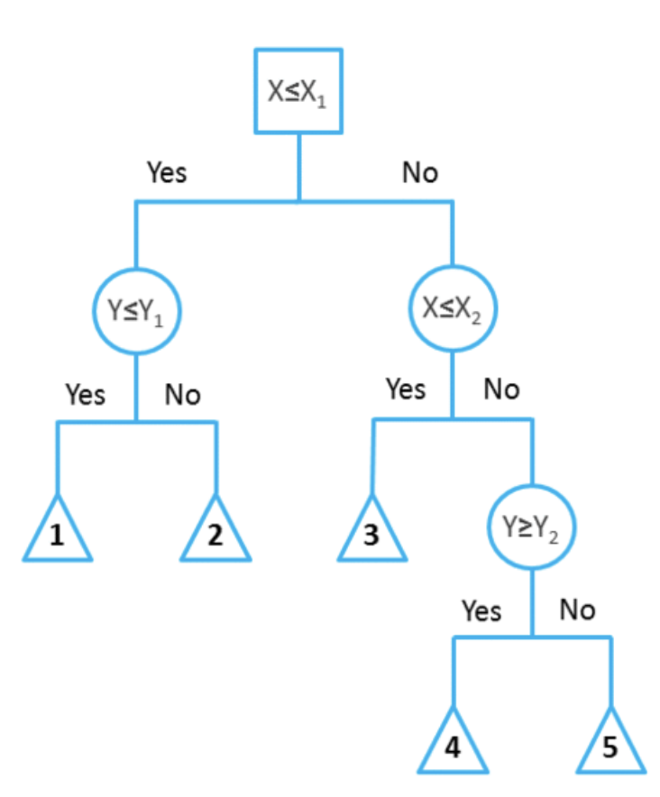
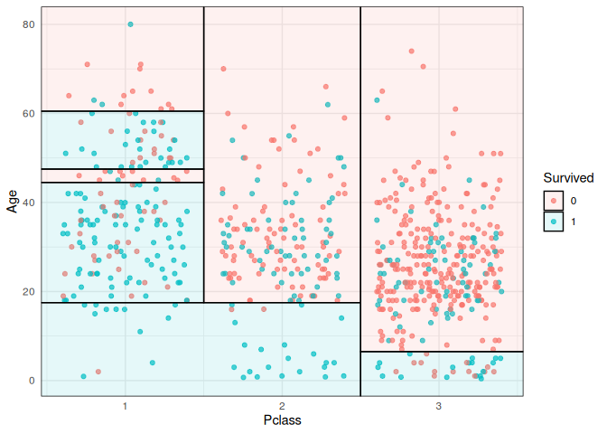
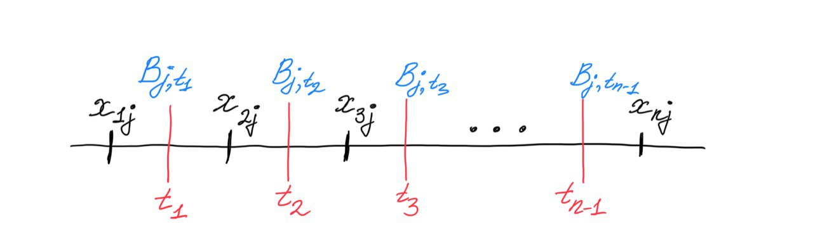
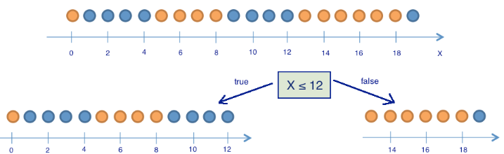
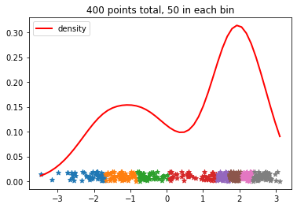

- Этот список будет заменен оглавлением, за вычетом заголовка "Contents",
  к которому добавлен класс `no_toc`.
  {:toc}

# Введение

В этой главе мы рассмотрим ещё одно семейство моделей машинного обучения -- **решающие деревья (decision trees)**.
Решающее дерево предсказывает значение целевой переменной с помощью применения последовательности простых решающих правил (которые называются предикатами). Этот процесс в некотором смысле согласуется с естественным для человека процессом принятия решений. Хотя обобщающая способность таких моделей невысока, их предсказания вычисляются довольно просто, из-за чего решающие деревья часто используют как кирипичики для построения _ансамблей_ -- моделей, делающих предсказания на основе агрегации предсказаний других моделей. О них мы поговорим в следующей главе.

## Пример решающего дерева

Начнём с небольшого примера. На картинке ниже изображено дерево, построенное для задачи классификации на пять классов:

{: center height="500px" width="400px"}

([источник картинки](https://medium.com/@ODSC/the-complete-guide-to-decision-trees-part-1-aa68b34f476d))

Объекты в этом примере имеют два признака с вещественными значениями: $X$ и $Y$. Решение о том, к какому классу будет отнесен текущий объект выборки, будет приниматься с помощью прохода от корня дерева к некоторому листу.
В каждом узле этого дерева находится предикат. Если предикат верен для текущего примера из выборки, мы переходим в левого потомка, если нет -- в правого. В данном примере все предикаты -- это просто взятие порога по значению какого-то признака:

$$
    B(x, j, t) = [ x_j \le t ]
$$

В листьях записаны предсказания (в данном случае метки классов). Как только мы дошли до листа, мы присваиваем объекту ответ, записанный в вершине.

На гифке ниже визуализирован процесс построения решающих поверхностей, порождаемых деревом (правая часть картинки):


([источник картинки](https://medium.com/@ODSC/the-complete-guide-to-decision-trees-part-1-aa68b34f476d))

Каждый предикат порождает разделение текущего подмножества пространства признаков на две части. На первом этапе, когда происходило деление по $[ X \le X_1 ]$, вся плоскость была поделена на две соответствующие части. На следующем уровне часть плоскости, для которой выполняется $X \le X_1$, была поделена на две части по значению второго признака $Y \le Y_1$ -- так образовались области 1 и 2. То же самое повторяется для правой части дерева, и так далее до листовых вершин: получится 5 областей на плоскости. Теперь любому объекту выборки будет присваиваться один из 5 классов в зависимости от того, в какую из образовавшихся областей он попадает.

Этот пример хорошо демонстрирует, в частности, то, что дерево осуществляет кусочно-постоянную аппроксимацию целевой зависимости. Ниже приведён пример визуализации решающей поверхности, которая соответствует дереву глубины 6, построенному для объектов данных из [Титаника](https://www.kaggle.com/c/titanic/data?select=gender_submission.csv), где из всех признаков, описывающих пассажиров Титаника, были выбраны возраст и класс каюты:



([источник картинки](https://github.com/grantmcdermott/parttree/blob/master/man/figures/README-titanic_plot-1.png))

## Определение решающего дерева

Разобравшись с приведёнными выше примерами, мы можем дать определение решающего дерева. Пусть задано бинарное дерево, в котором:

- каждой внутренней вершине $v$ приписан предикат $$B_v: \mathbb{X} \to \{ 0, 1 \}$$
- каждой листовой вершине $v$ приписан прогноз $c_v \in \mathbb{Y}$, где $\mathbb{Y}$ -- область значений целевой переменной (в случае классификации листу может быть также приписан вектор вероятностей классов)

В ходе предсказания осуществляется проход по этому дереву к некоторому листу. Для каждого объекта выборки $x$ движение начинается из корня. В очередной внутренней вершине $v$ проход продолжится влево, если $B_v(x) = 1$, и вправо, если $B_v(x) = 0$. Проход продолжается до момента, пока не будет достигнут некоторый лист, и ответом алгоритма на объекте $x$ считается прогноз $c_v$, приписанный этому листу.

Предикат $B_v$ может иметь, вообще говоря, произвольную структуру, но, как правило, на практике используют просто сравнение с порогом $t \in \mathbb{R}$ по какому-то $j$-му признаку:

$$
    B_v(x, j, t) = [ x_j \le t ]
$$

При проходе через узел дерева с данным предикатом объекты будут отправлены в левое поддерево, если значение $j$-го признака у них меньше либо равно $t$, и в правое, если больше. В дальнейшем рассказе мы будем по умолчанию использовать именно такие предикаты.

Из структуры дерева решений следует несколько интересных свойств:

- выученная функция является кусочно-постоянной, из-за чего производная равна нулю везде, где задана. Следовательно, о градиентных методах при поиске оптимального решения можно забыть;
- дерево решений (в отличие от, например, линейной модели) не сможет экстраполировать зависимости за границы области значений обучающей выборки;
- дерево решений способно идеально приблизить обучающую выборку и ничего не выучить (то есть такой классификатор будет обладать низкой обобщающей способностью): для этого достаточно построить такое дерево, в каждый лист которого будет попадать только один объект. Следовательно, при обучении нам надо не просто приближать обучающую выборку как можно лучше, но и стремиться оставлять дерево как можно более простым, чтобы результат обладал хорошей обобщающей способностью.

## Почему построение оптимального решающего дерева -- сложная задача?

Пусть, как обычно, у нас задан датасет $(X, y)$, где $$y=\{y_i\}_{i=1}^n \subset \mathbb{R}^n$$ -- вектор таргетов, а $$X=\{x_i\}_{i = 1}^n \in \mathbb{R}^{n \times d}, x_i \in \mathbb{R}^d$$ – матрица признаков, в которой $i$-я строка – это вектор признаков $i$-го объекта выборки. Пусть у нас также задана функция потерь $L(f, X, y)$, которую мы бы хотели минимизировать.

Наша задача -- построить решающее дерево, наилучшим образом предсказывающее целевую зависимость. Однако, как уже было замечено выше, оптимизировать структуру дерева с помощью градиентного спуска не представляется возможным. Как ещё можно было бы решить эту задачу? Давайте начнем с простого -- научимся строить **решающие пни**, то есть решающие деревья глубины 1.

Рассматриваемые предикаты, как уже говорилось выше, будут действовать на объекты выборки $x_i$ следующим образом:

$$
    B_{j, t}(x_i) = [ x_{ij} \le t ]
$$

Ясно, что задачу можно решить полным перебором: существует не более $(n - 1) d$ предикатов такого вида. Действительно, индекс $j$ пробегает значения от $1$ до $d$, а всего значений порога $t$, при которых меняется значение предиката, может быть не более $n - 1$:


Решение, которое мы ищем, будет иметь вид:

$$
    (j_{opt}, t_{opt}) = \arg \min_{j, t} L(B_{j, t}, X, y)
$$

Для каждого из предикатов $B_{j, t}$ нам нужно посчитать значение функции потерь на всей выборке, что, в свою очередь, тоже занимает $O(n)$.
Следовательно полный алгоритм выглядит так:

```python
min_loss = inf
optimal_border = None

for j in range(d):
    for t in X[:, j]:     # Можно брать сами значения признаков в качестве порогов
        loss = calculate_loss(t, j, X, y)
        if loss < min_loss:
           min_loss, optimal_border = loss, (j, t)
```

Сложность алгоритма -- $O(n^2 d)$. Это не заоблачная сложность, хотя, конечно, не идеальная. Но это была схема возможного алгоритма поиска оптимального дерева высоты 1.

Как обобщить алгоритм для дерева произвольной глубины? Мы можем сделать наш алгоритм поиска решающего пня рекурсивным и в теле цикла вызывать исходную функцию для всех возможных разбиений. Как мы упоминали выше, так можно построить дерево, идеально запоминающее всю выборку, однако на тестовых данных такой алгоритм вряд ли покажет высокое качество. Можно поставить другую задачу: построить оптимальное с точки зрения качества на обучающей выборке дерево минимальной глубины (чтобы снизить переобучение). Проблема в том, что поиск такого дерева является [NP-полной](https://people.csail.mit.edu/rivest/HyafilRivest-ConstructingOptimalBinaryDecisionTreesIsNPComplete.pdf) задачей, то есть человечеству пока не известны способы решить её за полиномиальное время.

Как быть? Идеального ответа на этот вопрос нет, но до некоторой степени ситуацию можно улучшить двумя не исключающими друг друга способами:

1. Разрешить себе искать не оптимальное решение, а просто достаточно хорошее. Начать можно с того, чтобы строить дерево с помощью _жадного алгоритма_, то есть не искать всю структуру сразу, а строить дерево этаж за этажом. Тогда в каждой внутренней вершине дерева будет решаться задача, схожая с задачей построения решающего пня. Для того, чтобы этот подход хоть как-то работал, его придётся прокачать внушительным набором эвристик.
2. Заняться оптимизацией с точки зрения computer science -- наивную версию алгоритма (перебор наборов возможных предикатов и порогов) можно ускорить и асимптотически, и в константу раз.

Эти две идеи мы и будем обсуждать в дальнейшем. Сначала попытаемся подробно разобраться с первой -- использованием жадного алгоритма.

# Жадный алгоритм построения решающего дерева

Пусть $X$ -- исходное множество объектов обучающей выборки, а $X_m$ -- множество объектов, попавших в текущий лист (в самом начале $X_m = X$). Тогда жадный алгоритм можно верхнеуровнево описать следующим образом:

1. Создаём вершину $v$.
2. Если выполнен _критерий остановки_ $Stop(X_m)$, то останавливаемся, объявляем эту вершину листом и ставим ей в соответствие ответ $Ans(X_m)$, после чего возвращаем её.
3. Иначе, находим предикат (иногда еще говорят _сплит_) $B_{j, t}$, который определит наилучшее разбиение текущего множества объектов $X_m$ на две подвыборки $X_{\ell}$ и $X_r$, максимизируя _критерий ветвления_ $Branch(X_m, j, t)$.
4. Для $X_\ell$ и $X_r$ рекурсивно повторим процедуру.

В виде псевдокода описанный алгоритм может быть записан следующим образом:

```python
def findSplit(Branch, X_m):
    X_l, X_r = None, None
    max_score = 0
    for feature in features:
        for value in X_m[feature]:
            score = Branch(X_m, feature, value)
            if score > max_score:
                max_score = score
                X_l, X_r = Partition(X_m, feature, value) # просто делит объекты относительно value of feature
    return X_l, X_r


def build(X_m):
    create node v
    if Stop(X_m):
        return Ans(X_m)
    else:
        X_l, X_r = findSplit(Branch, X_m) # Find the best binary split X_m = X_l + X_r
        v.left = build(X_l)
        v.right = build(X_r)
    return v
```

Данный алгоритм содержит в себе несколько вспомогательных функций, которые надо выбрать так, чтобы итоговое дерево было способно минимизировать $L$:

- $Ans(X_m)$, вычисляющая ответ для листа по попавшим в него объектам из обучающей выборки, может быть, например:
  - в случае задачи классификации -- меткой самого частого класса или оценкой дискретного распределения вероятностей классов для объектов, попавших в этот лист;
  - в случае задачи регрессии -- средним, медианой или другой статистикой;
  - простой моделью. К примеру, листы в дереве, задающем регрессию, могут быть линейными функциями или синусоидами, обученными на данных, попавших в лист. Впрочем, везде ниже мы будем предполагать, что в каждом листе просто предсказывается константа.
- Критерий остановки $Stop(X_m)$ – функция, которая решает, нужно ли продолжать ветвление или пора остановиться.

  Это может быть какое-то тривиальное правило: например, остановиться только в тот момент, когда объекты в листе получились достаточно однородными и/или их не слишком много. Более детально мы поговорим про критерии остановки в параграфе про регуляризацию деревьев.

- Критерий ветвления $Branch(X_m, feature, value)$ -- пожалуй, самая интересная компонента алгоритма. Это функция, измеряющая, насколько хорош предлагаемый сплит. Чаще всего эта функция оценивает, насколько данный сплит улучшит финальную метрику качества дерева, если получившиеся листы будут терминальными, по сравнению с тем, чтобы эту вершину саму сделать листом, но есть и другие подходы.

При этом строгой теории, которая бы связывала оптимальность выбора разных вариантов этих функций и разных метрик классификации и регрессии, в общем случае не существует. Однако есть набор интуитивных и хорошо себя зарекомендовавших соображений, с которыми мы вас сейчас познакомим.

### Критерии ветвления: общая идея

Давайте теперь по очереди посмотрим на популярные постановки задач ML и под каждую подберем свой критерий.

Ответы дерева будем кодировать так: $c \in \mathbb{R}$ -- для ответов регрессии и меток класса; для случаев, когда надо ответить дискретным распределением на классах, $c \in \mathbb{R}^K$ будет вектором вероятностей:

$$
    c = (c*1, \ldots, c_K), \quad \sum*{i = 1}^K с_i = 1
$$

Предположим также, что задана некоторая функция потерь $L(y_i, c)$.

В момент, когда мы ищем оптимальный сплит, мы можем вычислить для объектов из $X_m$ таргеты, которые предсказало бы дерево, будь текущая вершина терминальной, и связанное с ними значение исходного функционала качества $L$. А именно, константа $c$ должна минимизировать величину:

$$
    H(X_m) = \min\limits_{c \in Y} \frac{1}{\vert X_m\vert}\sum\limits_{(x_i, y_i) \in X_m} L(y_i, c)
$$

Эту величину обычно называют _информативностью_ или _impurity_. Чем она ниже, тем лучше объекты в листе можно приблизить константным значением. Для того, чтобы принять решение о разделении, мы можем сравнить значение информативности для исходного листа и для получившегося после разделения решающего пня.

Получившаяся величина неотрицательна: ведь разделив объекты на две кучки и подобрав ответ для каждой, мы точно не сделаем хуже. Кроме того, она тем больше, чем лучше предлагаемый сплит. Таким образом наш критерий ветвления будет иметь вид:

$$
    Branch (X_m, j, t) = |X_m| \cdot H(X_m) -  |X_l| \cdot H(X_l) -  |X_r| \cdot H(X_r)
$$

### Информативность в задаче регрессии: MSE

Посмотрим на простой пример -- регрессию с минимизацией среднеквадратичной ошибки:

$$
    L(y_i, c) = (y_i -c)^2
$$

Информативность листа будет выглядеть следующим образом:

$$
    H(X_m) = \frac{1}{\vert X_m\vert} \min\limits_{c \in Y} \sum\limits_{(x_i, y_i) \in X_m} (y_i - c)^2
$$

Как мы уже знаем, оптимальным предсказанием константного классификатора для задачи минимизации MSE является среднее значение, то есть

$$
    c = \frac{\sum y_i}{|X_m|}
$$

Подставив в формулу информативности сплита, получаем:

$$
    H(X_m) =  \sum\limits_{(x_i, y_i) \in X_m}\frac{\left(y_i - \overline{y} \right)^2}{|X_m|}, ~ \text{где} ~ \overline{y} = \frac{1}{\vert X_m \vert} \sum_i y_i
$$

То есть при жадной минимизации MSE информативность -- это оценка дисперсии таргетов для объектов, попавших в лист. Получается очень стройная картинка: оценка значения в каждом листе -- это среднее, а выбирать сплиты надо так, чтобы сумма дисперсий в листьях была как можно меньше.

### Информативность в задаче регрессии: MAE

$$
    L(y_i, c) = |y_i -c|
$$

Случай средней абсолютной ошибки так же прост: в листе надо предсказывать медиану, ведь именно медиана таргетов для обучающих примеров минимизирует MAE констатного предсказателя (мы это обсуждали в главе про линейные модели).

В качестве информативности выступает абсолютное отклонение от медианы:

$$
    H(X_m) = \sum\limits_{(x_i, y_i) \in X_m}\frac{|y_i - MEDIAN(Y)|}{|X_m|}
$$

### Критерий информативности в задаче классификации: misclassification error

Пусть в нашей задаче $K$ классов, а $p_k$ -- доля объектов класса $k$ в текущей вершине $X_m$:

$$
    p_k = \frac{1}{|X_m|} \sum_{(x_i, y_i) \in X_m}  [ y_i = k ]
$$

Допустим, мы заботимся о доле верно угаданных классов, то есть функция потерь -- это индикатор ошибки:

$$
    L(y_i, p_i) = [y_i \ne c]
$$

Пусть также предсказание модели в листе -- один какой-то класс. Информативность для такой функции потерь выглядит так:

$$
    H(X_m) = \min_{c \in Y} \frac{1}{|X_m|} \sum_{(x_i, y_i) \in X_m} [y_i \ne c]
$$

Ясно, что оптимальным предсказанием в листе будет наиболее частотный класс $k_*$, а выражение для критерия упростится следующим образом:

$$
    H(X_m) = \frac{1}{|X_m|} \sum_{(x_i, y_i) \in X_m} [y_i \ne k_*] = 1 - p_{k_*}
$$

### Информативность в задаче классификации: entropy

Если же мы собрались предсказывать вероятностное распределение классов $(c_1, \ldots, c_k)$, то к этому вопросу можно подойти так же, как мы поступали при выводе логистической регрессии -- через максимизацию логарифма правдоподобия (= минимизацию минус логарифма) распределения Бернулли:

$$
    P(y|x, c) = \prod\limits_{(x_i, y_i) \in X_m}P(y_i|x_i, с) = \prod\limits_{(x_i, y_i) \in X_m}
    \prod\limits_{k = 1}^K c_k^{[ y_i = k ]}
$$

откуда

$$
    H(X_m) = \min\limits_{\sum\limits_{k} c_k = 1}
    \left(
        -\frac{1}{|X_m|} \sum\limits_{(x_i, y_i) \in X_m} \sum\limits_{k = 1}^K [ y_i = k ] \log c_k
    \right)
$$

То, что оценка вероятностей в листе $c_k$, минимизирующая $H(X_m)$, должна быть равна $p_k$, то есть доле попавших в лист объектов этого класса, до некоторой степени очевидно, но это можно вывести и строго.

Из-за наличия условия на $\sum_k c_k = 1$ нам придется минимизировать лагранжиан

$$
    L(c, \lambda) = \min_{c, \lambda} \left(
    \left(
        -\frac{1}{|X_m|} \sum\limits_{(x_i, y_i) \in X_m} \sum\limits_{k = 1}^K [ y_i = k ] \log c_k
    \right) + \lambda \sum\limits_{k = 1}^K c_k \right)
$$

Как обычно, возьмем частную производную и решим уравнение:

$$
    0 = \frac{\partial }{\partial c_j}L(c, \lambda) = \frac{\partial }{\partial c_j} \left(
    \left(
        -\frac{1}{|X_m|} \sum\limits_{(x_i, y_i) \in X_m} \sum\limits_{k = 1}^K [ y_i = k ] \log c_k
    \right) + \lambda \sum\limits_{k = 1}^K c_k \right) =
$$

$$
    = \left(
    \left(
        -\frac{1}{|X_m|} \sum\limits_{(x_i, y_i) \in X_m} [ y_i = j ] \frac{1}{c_j}
    \right) + \lambda \right) = - \frac{p_j}{c_j} + \lambda,
$$

откуда выражаем $c_j = \frac{p_j}{\lambda}$. Суммируя эти равенства, получим:

$$
    1 = \sum_{k = 1}^K c_k = \frac{1}{\lambda} \sum_{k = 1}^K p_k = \frac{1}{\lambda},
$$

откуда $\lambda = 1$, а значит, $c_k = p_k$. Подставляя этот вектор в выражение выше, мы получим энтропию распределения классов:

$$
    H(X_m) = -\sum_{k = 1}^K p_k \log p_k
$$

  <details>
  <summary markdown="span">Объясняем на примере, что такое энтропия (для дискретного распределения)</summary>

Величина

$$
    H(X_m) = -\sum_k p_k \log p_k
$$

называется _информационной энтропией Шеннона_ и измеряет непредсказуемость реализации случайной величины. В оригинальном определении, правда, речь шла не о значениях случайной величины, а символах (первичного) алфавита, так как Шеннон придумал эту величину, занимаясь вопросами кодирования строк. Для данной задачи энтропия имеет вполне практический смысл -- среднее количество бит, которое необходимо для кодирования одного символа сообщения при заданной частоте символов алфавита.

Так как $p_k\in[0,1]$, энтропия неотрицательна. Если случайная величина принимает только одно значение, то она абсолютно предсказуема и её энтропия равна $ - 1 \log(1) = 0$.

Наибольшего значения энтропия достигает для равномерно распределенной случайной величины -- и это отражает тот факт, что среди всех величин с данной областью значений она наиболее <<непредсказуема>>. В таком случае значение энтропии будет равно:

$$-\sum\frac{1}{n}\log\frac{1}{n} = \log n$$

На следующем графике приведены три дискретных распределения на множестве $$ \{0, 1, \ldots, 20\} $$ с их энтропиями. Как и указано выше, максимальную энтропию будет иметь равномерное распределение; у двух других проявляются пики разной степени остроты -- и тем самым реализации этих величин обладают меньшей неопределённостью: мы можем с большей уверенностью говорить, что будет сгенерировано.


Разберём на примере игрушечной задачи классификации то, как энтропия может выступать в роли impurity. Пусть нам нужно построить классификацию шариков на синие и жёлтые по единственному признаку -- координате:


([источник картинки](https://habr.com/ru/company/ods/blog/322534/))

На картинке 11 жёлтых шариков и 9 синих. Вероятность вытащить синий шарик равна $p_1 = \frac{9}{20}$, а жёлтый -- $p_2 = \frac{11}{20}$. Тогда энтропия состояния равна

$$
    S_0 = -\frac{9}{20} \log_2 \frac{9}{20} - \frac{11}{20} \log_2 \frac{11}{20} \approx 1
$$

Посмотрим, как изменится энтропия, если разбить шарики на две группы по значению координаты, равному 12:



([источник картинки](https://habr.com/ru/company/ods/blog/322534/))

Получилось две группы: в первой 13 шаров, среди которых 8 синих и 5 жёлтых, а во второй -- 7 шаров, среди которых 1 синий и 6 жёлтых. Энтропия первой группы равна:

$$
S_1 = -\frac{5}{13} \log_2 \frac{5}{13} - \frac{8}{13} \log_2 \frac{8}{13} \approx 0.96
$$

Энтропия второй группы равна:

$$
    S_2 = -\frac{1}{7} \log_2 \frac{1}{7} - \frac{6}{7} \log_2 \frac{6}{7} \approx 0.6
$$

Как можно заметить, энтропия в обеих группах уменьшилась по сравнению с изначальной. Получается, что, разделив шарики по значению координаты, равному 12, мы уменьшили общую неопределённость системы.

Кстати, Шеннон изначально собирался назвать информационную энтропию или <<информацией>>, или <<неопределенностью>>, но в итоге выбрал название <<энтропия>>, потому что концепция со схожим (но не совсем таким же) смыслом в статистической механике уже была названа энтропией. Употребление термина из другой научной области выглядело убедительным преимуществом при ведении научных споров.

Здесь мы касаемся темы энтропии Шеннона скорее с развлекательными намерениями. Чтобы поглубже в ней разобраться, вы можете обратиться к какому-нибудь курсу по _теории информации_.

  </details>

### Информативность в задаче классификации: критерий Джини

Пусть предсказание модели -- это распределение вероятностей классов $(c_1, \ldots, c_k)$. Вместо логарифма правдоподобия в качестве критерия можно выбрать, например, [метрику Бриера](https://en.wikipedia.org/wiki/Brier_score#:~:text=The%20Brier%20Score%20is%20a,as%20applied%20to%20predicted%20probabilities) (за которой стоит всего лишь идея посчитать MSE от вероятностей). Тогда информативность получится равной

$$
    H(X_m) = \min_{\sum_k c_k = 1} \frac{1}{|X_m|} \sum_{(x_i, y_i) \in X_m} \sum_{k = 1}^K (c_k - [ y_i = k ] )^2
$$

Можно показать, что оптимальное значение этой метрики, как и в случае энтропии, достигается на векторе $c$, состоящем из выборочных оценок частот классов $(p_1, \ldots, p_k)$, $p_i = \frac{1}{\vert X_m\vert}\sum_i[ y_i = k ]$. Если подставить $(p_1, \ldots, p_k)$ в выражение выше и упростить его, получится **критерий Джини**:

$$
    H(X_m) = \sum_{k = 1}^K p_k (1 - p_k)
$$

Критерий Джини допускает и следующую интерпретацию: $H(X_m)$ равно математическому ожиданию числа неправильно классифицированных объектов в случае, если мы будем приписывать им случайные метки из дискретного распределения, заданного вероятностями $(p_1, \ldots, p_k)$.

### Неоптимальность полученных критериев

Казалось бы, мы вывели критерии информативности для всех популярных задач, и они довольно логично следуют из их постановок, но получилось ли у нас обмануть NP-полноту и научиться строить оптимальные деревья легко и быстро?

Конечно, нет. Простейший пример -- решение задачи XOR с помощью жадного алгоритма и любого критерия, который мы построили выше:


([источник картинки](http://www.machinelearning.ru/wiki/images/archive/9/97/20140227072517!Voron-ML-Logic-slides.pdf))

Вне зависимости от того, что вы оптмизируете, жадный алгоритм не даст оптимального решения задачи XOR. Но этим примером проблемы не исчерпываются. Скажем, бывают ситуации, когда оптимальное с точки зрения выбранной метрики дерево вы получите с критерием ветвления, построенным по другой метрике (например, MSE-критерий для MAE-задачи или Джини для misclassification error).

## Методы регуляризации решающих деревьев

Мы уже упоминали выше, что деревья легко переобучаются, и процесс ветвления надо в какой-то момент останавливать.

Для этого есть разные критерии, обычно используются все сразу:

- ограничение по максимальной глубине дерева;
- ограничение на минимальное количество объектов в листе;
- ограничение на максимальное количество листьев в дереве;
- требование, чтобы функционал качества $Branch$ при делении текущей подвыборки на две улучшался не менее, чем на $s$ процентов .

Делать это можно на разных этапах работы алгоритма, что не меняет сути, но имеет разные сложившиеся названия:

- Можно проверять критерии прямо во время построения дерева, такой способ называется **pre-pruning** или **early stopping**;
- А можно построить дерево жадно без ограничений, а затем провести **стрижку** (**pruning**), то есть удалить некоторые вершины из дерева так, чтобы итоговое качество упало не сильно, но дерево начало подходить под условия регуляризации.

# Алгоритмические трюки

Теперь временно снимем шапочку ML-аналитика, наденем шапочку разработчика и специалиста по Computer Science и посмотрим, как можно сделать сделать полученный алгоритм более вычислительно эффективным.

В базовом алгоритме мы в каждой вершине дерева для всех возможных значений сплитов вычисляем информативность. Если в вершину пришло $q$ объектов, то мы рассматриваем $qd$ сплитов и для каждого тратим $O(q)$ операций на подсчёт информативности. Отметим, что в разных вершинах, находящихся в нашем дереве на одном уровне, оказываются разные объекты, то есть сумма этих $q$ по всем вершинам заданного уровня не превосходит $n$, а значит, выбор сплитов во всех вершинах уровня потребует $O(n^2 d)$ операций. Таким образом, общая сложность построения дерева -- $O(kn^2 d)$ (где $k$ -- высота дерева), и доминирует в ней перебор всех возможных предикатов на каждом уровне построения дерева. Посмотрим, что с этим можно сделать.

## Динамическое программирование

Постараемся оптимизировать процесс выбора сплита в одной конкретной вершине.

Вместо того, чтобы рассматривать все $O(nd)$ возможных сплитов, для каждого тратя $O(n)$ на вычисление информативности, можно использовать одномерную динамику. Для этого заметим, что если отсортировать объекты по какому-то признаку, то, проходя по отсортированному массиву, можно одновременно и перебирать все значения предикатов, и поддерживать все необходимые статистики для пересчета значений информативности за $O(1)$ для каждого следующего варианта сплита (против изначальных $O(n)$).

Давайте разберём, как это работает, на примере построения дерева для MSE. Чтобы оценить информативность для листа, нам нужно знать несколько вещей:

- Дисперсию и среднее значение таргета в текущем листе;
- Дисперсию и среднее значение таргета в обоих потомках для каждого потенциального значения сплита.

Дисперсию и среднее текущего листа легко посчитать за $O(n)$.

С дисперсией и средним для всех значений сплитов чуть сложнее, но помогут следующие равенства:

$$\mathbb{E} y = \frac{\sum y_i}{n}$$

$$\mathbb{D}y = \mathbb{E}[y^2] - (\mathbb{E}y)^2 = \frac{\sum y_i^2 - (\sum y_i)^2}{n} $$

Следовательно, нам необходимо и достаточно для каждого потенциального значения сплита знать количество элементов в правом и левом поддереве, их сумму и сумму их квадратов (на самом деле все это необходимо знать только для одной из половинок сплита, а для второй это можно получить, вычитая значения для первого из полных сумм). Это можно сделать за один проход по массиву, просто накапливая значения частичных сумм.

Если в вершину дерева пришло $q$ объектов, сложность построения одного сплита складывается из $d$ сортировок каждая по $O(q\log q)$ и одного линейного прохода с динамикой, всего $O(qd\log q + qd) = O(qd\log q)$, что лучше исходного $O(q^2d)$. Итоговая сложность алгоритма построения дерева -- $O(kdn\log n)$ против $kdn^2$ в наивной его версии.

Какие именно статистики накапливать (средние, медианы, частоты), зависит от критерия, который вы используете.

## Гистограммный метод

Если бы мощность множества значений признаков была ограничена какой-то разумной константой $b \ll n$, то сортировку в предыдущем способе можно было бы заменить [сортировкой подсчетом](https://ru.wikipedia.org/wiki/%D0%A1%D0%BE%D1%80%D1%82%D0%B8%D1%80%D0%BE%D0%B2%D0%BA%D0%B0_%D0%BF%D0%BE%D0%B4%D1%81%D1%87%D1%91%D1%82%D0%BE%D0%BC) и за счет этого существенно ускорить алгоритм: ведь сложность такой сортировки -- это $O(n)$.

Чтобы провернуть это с любой выборкой, мы можем искусственно дискретизовать значения всех признаков. Это приведет к локально менее оптимальным значениям сплитов, но, учитывая, что наш алгоритм и без этого был весьма приблизительным, это не ухудшит ничего драматически, а вот ускорение получается очень неплохое.

Самый популярный и простой способ дискретизации основан на частотах значений признаков: отрезок между максимальным и минимальным значением признака разбивается на $b$ подотрезков, длины которых выбираются так, чтобы в каждый попадало примерно равное число обучающих примеров. После чего значения признака заменяются на номера отрезков, на которые они попали.

{: .center}

Аналогичная процедура проводится для всех признаков выборки. Полная сложность предобработки -- $O(dn\log n)$ (сортировка за $O(n\log n)$ для каждого из $d$ признаков).

Теперь в процедуре динамического алгоритма поиска оптимального сплита нам надо перебирать не все $n$ объектов выборки, а всего лишь $b$ подготовленных заранее границ подотрезков. Частичные суммы статистик тоже придется поддерживать не для исходного массива данных, а для списка из $b$ возможных сплитов. А для того, чтобы делать это эффективно, необходим объект, называемый _гистограммой_: упорядоченный словарь, сопоставляющий каждому значению дискретизованного признака сумму необходимой статистики от таргета на отрезке [B[i-1], B[i]].

Финальный вид алгоритма таков:

0. Дискретизируем каждый из признаков на $b$ значений. Сложность $O(dn\log n)$;
1. Создаем корневую вершину `root`;
2. Вызываем `build_tree_recursive(root, data)`

Функция `build_tree_recursive` выглядит следующим образом:

0. Проверяем, не пора ли остановиться. Если пора -- считаем значение в листе.
1. Теперь мы снова используем динамический алгоритм, но объекты будем сортировать не по исходным значениям признаков, а по их дискретизированным версиям, упорядочивая их с помощью сортировки подсчётом (для вершины, в которую попало $q$ обьектов, сложность будет равна $O(qd)$ против $O(q\log q\cdot d)$ в стандартной динамике).
2. Находим оптимальный сплит за $O(q d)$.
3. Делим данные, запускаем процедуру рекурсивно для обоих поддеревьев.

**Общая сложность: $O(dn\log n + knd)$**

<details>
<summary markdown="span">Гистограммный метод на примере</summary>

Давайте посчитаем информативность сплита для MSE на данных с одним признаком, по которому мы уже отсортировали данные:

|x | -3 | -2 | -0.05 | 1 | 1 | 2 | 6 | 8 |
|y | 0 | 0.5 | -1 | 0 | 1 | 2 | 1 | 4 |

Дискретизируем на три отрезка с границами $B = [-1, 1.5]$

|discretized_x | 0 | 0 | 1 | 1 | 1 | 2 | 2 | 2 |
|y | 0 | 0.5 | -1 | 0 | 1 | 2 | 1 | 4 |

Строим гистограмму частичных сумм, сумм квадратов и количества объектов для двух отрезков (для третьего можно посчитать, используя общую сумму):

| b | 0 | 1 |
| cnt | 2 | 3 |
|sum_y | 0.5 | 0 |
|sum_y_sq | 0.25 | 2 |

Всего обьектов 8, сумма таргетов -- $\text{sum_total} = 7.5$, сумма квадратов -- $\text{sum_sq_total} = 23.25$.

Информативность текущего листа:

$$
D[X_d] = \frac{\text{sum_sq_total}}{\text{cnt_total}} - \left(\frac{\text{sum_total}}{\text{cnt_total}}\right)^2 = \\
= \frac{23.25}{8} - \left( \frac{7.5}{8} \right)^{2} = 2.0273
$$

Посчитаем значение критерия ветвления для $b=-1$. Информативность левого листа, то есть дисперсия в нём, равна:

$$
D[X_l] = E[X_l^2] - E^2[X_l] = \\

= \frac{\text{sum_y_sq}[0]}{\text{cnt}[0]} - \left(\frac{\text{sum_y}}{\text{cnt}[0]}\right)^2 = \\
= 0.125 - 0.25 ^ 2 = 0.0625
$$

Информативность правого листа, то есть дисперсия в нём, равна:

$$
D[X_r] = E[X_r^2] - E^2[X_r] = \\

= \frac{\text{sum_sq_total} - \text{sum_y_sq}[0]}{\text{cnt_total} - \text{cnt}[0]} - \left(\frac{\text{sum_total} - \text{sum_y}}{\text{cnt_total} - \text{cnt}[0]}\right)^2 \\
\sim 2.47
$$

Полное значение критерия для разбиения по $b=-1$:

$$
Branch(b = -1) = 8 \cdot D[X_d] - 2 \cdot D[X_l] - 6 \cdot D[X_r] = \\
= 6.555
$$

</details>

## Mixed integer optimisation

Если вам действительно хочется построить _оптимальное_ (или хотя бы очень близкое к оптимальному) дерево, то на сегодня для решения этой проблемы не нужно придумывать кучу эвристик самостоятельно, а можно воспользоваться специальными солверами, которые решают NP-полные задачи приближенно, но все-таки почти точно. Так что единственной (и вполне решаемой) проблемой будет представить исходную задачу в понятном для солвера виде. [Пример построения оптимального дерева с помощью решения задачи целочисленного программирования](https://arxiv.org/abs/1907.02211).

# Историческая справка

Как мы, может быть, уже заметили, решающие деревья -- это одна большая эвристика для решения NP-полной задачи, практически лишенная какой-либо стройной теоретической подоплёки. В 70-90e годы интерес к ним был весьма велик как в индустрии, где был полезен хорошо интерпретируемый классификатор, так и в науке, где ученые интересовались способами приближенного решения NP-полных задач.

В связи с этим сложилось много хорошо работающих наборов эвристик, у которых даже были имена: например, [ID3](https://en.wikipedia.org/wiki/ID3_algorithm) был первой реализацией дерева, минимизирующего энтропию, а [CART](https://en.wikipedia.org/wiki/Predictive_analytics#Classification_and_regression_trees_.28CART.29) -- первым деревом для регрессии. Некоторые из них были запатентованы и распространялись коммерчески.

На сегодня это все потеряло актуальность в связи с тем, что существуют хорошо написанные библиотеки (например, [sklearn](https://scikit-learn.org/stable/modules/tree.html), в которой реализована оптимизированная версия CART).
