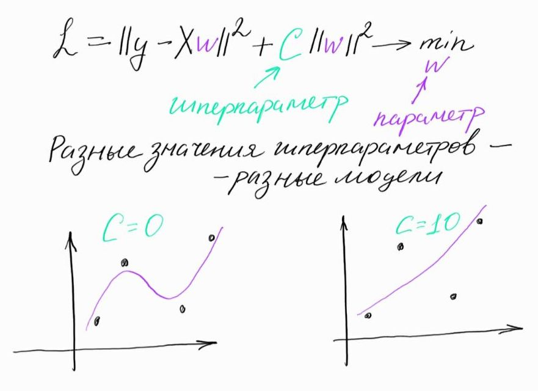
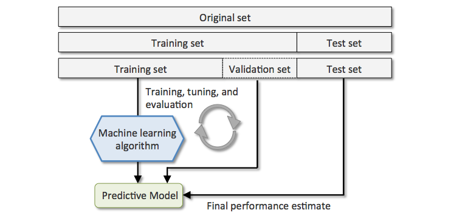
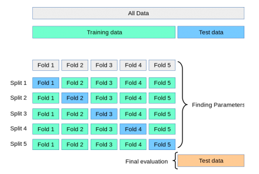
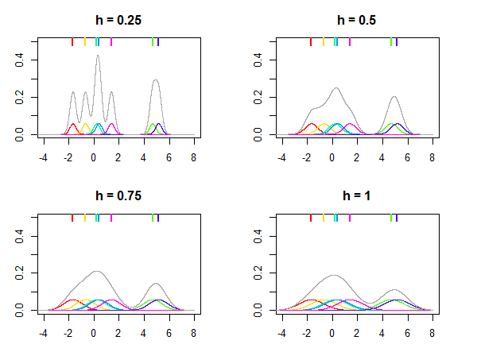
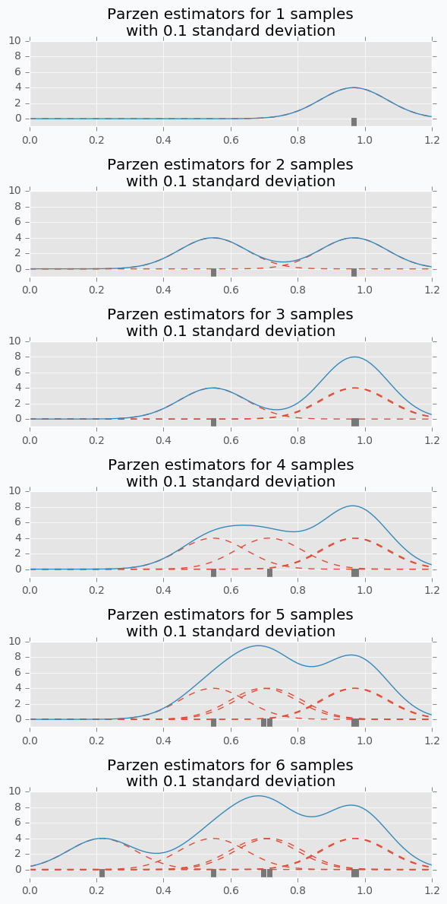
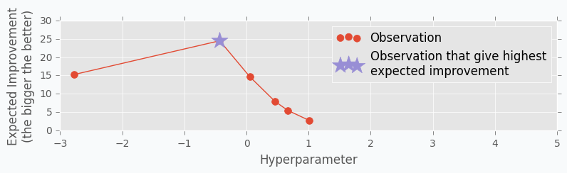
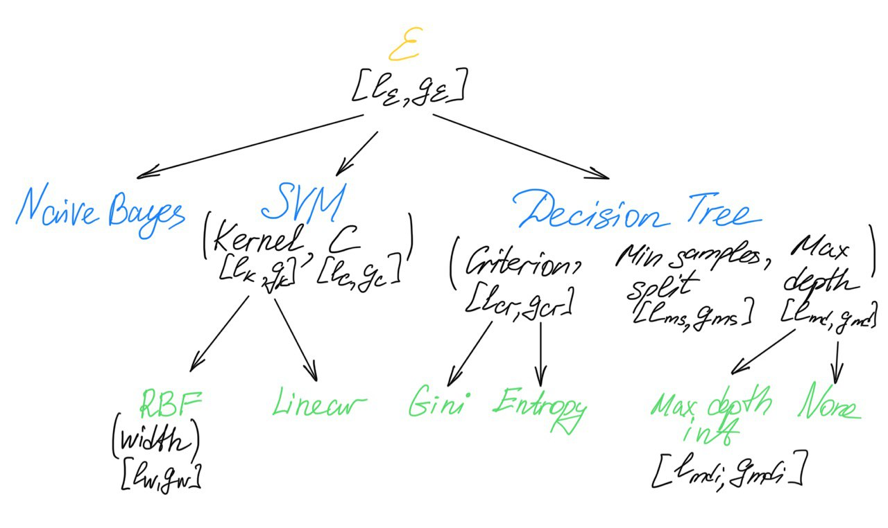
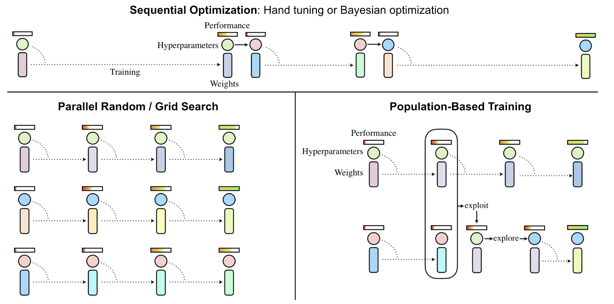
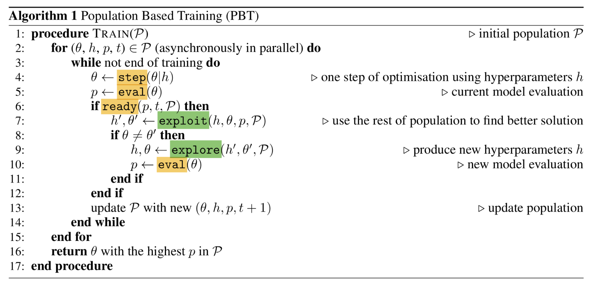
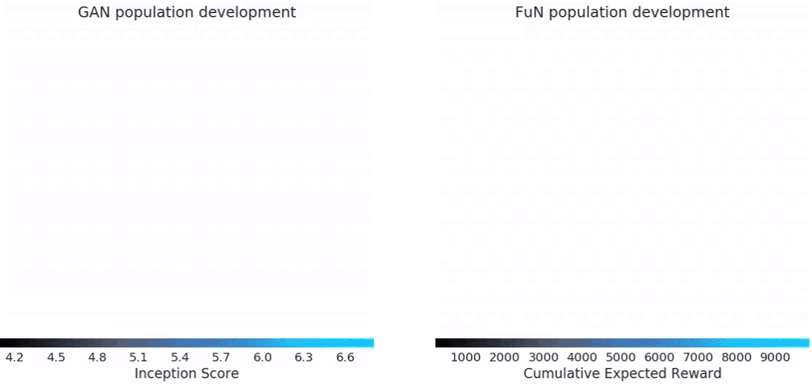

* Этот список будет заменен оглавлением, за вычетом заголовка "Contents",
к которому добавлен класс `no_toc`.
{:toc}

Для начала поймём, в чём отличие параметров модели от гиперпараметров:
- **Параметры** настраиваются в процессе обучения модели на данных. Например, веса в линейной регрессии, нейросетях, структура решающего дерева.
- **Гиперпараметры** -- это характеристики модели, которые фиксируются до начала обучения: глубина решающего дерева, значение силы регуляризации в линейной модели, learning rate для градиентного спуска.

Рассмотрим, например, модель линейной регрессии:

$$
    f(X) = X w
$$

где
- $w = (w_0, w_1, \ldots, w_n)$ - веса модели,
- $X = (x_{ij})$ -- матрица, в которой каждая строка содержит признаки одного объекта выборки (для удобства записи считаем, что первый столбец в этой матрице константный).

Эта модель может обучаться посредством минимизации следующего функционала:

$$
    \mathcal{L} = \| y - X w\|^2 + C \| w \|^2,
$$

где $y$ -- целевая переменная, $C$ -- коэффициент регуляризации. В процессе минизации $\mathcal{L}$ веса $w$ настраиваются по обучающей выборке, то есть являются параметрами. В то же время, величина коэффициента регуляризации задаётся до начала обучения, то есть является гиперпараметром.

{: height="500px" width="700px" style="float:right; padding:32px "}

Ещё хороший пример -- решающее дерево. Его гиперпараметры: максимальная глубина дерева, критерий ветвления, минимальное число сэмплов в листе дерева и ещё много других. А параметром является сама структура решающего дерева: обучение состоит в том, чтобы на каждом уровне дерева выбрать, по какому признаку должно произойти ветвление и с каким пороговым значением этого признака.

Качество модели может очень сильно варьироваться в зависимости от гиперпараметров, поэтому существуют разнообразные методы и инструменты для их подбора. При этом, вне зависимости от выбранного вами метода подбора гиперпараметров, оценку и сравнение моделей нужно проводить грамотно. Пусть у нас есть несколько моделей разной природы (метод ближайших соседей, случайный лес, логистическая регрессия) или несколько нейросеток с разными архитектурами. Нужно для каждой из моделей подобрать гиперпараметры, а затем модели с наилучшими гиперпараметрами сравнить между собой. Есть два наиболее часто используемых варианта:
- разделить выборку на тренировочную, валидационную и тестовую части, для каждой модели выбирать гиперпараметры, максимизирующие её метрики на валидации, а окончательное сравнение моделей проводить по тестовым метрикам. Разделения только на тренировочную и тестовую выборки не достаточно, так как в модель через подобранные гиперпараметры просачивается информация о тестовой выборке. Это означает, что на новых данных модели могут не сохранить свои качества и что их сравнение не будет честным. ([источник картинки](https://stats.stackexchange.com/questions/410118/cross-validation-vs-train-validation-test))



- провести [кросс-валидацию](https://en.wikipedia.org/wiki/Cross-validation_(statistics)). Кросс-валидация может быть нужна в случаях, если данных мало или мы не хотим зависеть от конкретного выбора валидационного множества. Примерный алгоритм (картинка ниже):
	- зафиксировать некоторое тестовое множество и отложить его,
	- разделить оставшееся множество данных на $k$ фолдов (подмножеств), пройтись по ним циклом, на каждой итерации фиксируя один фолд в качестве валидационного и обучаясь на остальных,
	- в качестве оценки качества модели взять среднее значение валидационной метрики по фолдам,
	- финальное сравнение моделей с уже подобранными гиперпараметрами проводить на отложенном тестовом множестве



([источник картинки](https://towardsdatascience.com/cross-validation-and-hyperparameter-tuning-how-to-optimise-your-machine-learning-model-13f005af9d7d))

Подробное описание процесса сравнения моделей между собой можно найти в разделах, посвящённых [кросс-валидации](../cross_validation/intro) и [сравнению и оценке качества моделей](../model_evaluation/intro). Далее мы рассмотрим несколько методов подбора гиперпараметров для моделей, а в конце будет приведён список питоновских библиотек, в которых эти методы реализованы, и дано верхнеуровневое сравнение всех описанных методов между собой.

# Grid Search
Самый естественный способ организовать перебор наборов гиперпараметров -- сделать перебор по сетке (**Grid Search**):
- для каждого гиперпараметра фиксируется несколько значений,
- перебираются все комбинации значений различных гиперпараметров, на каждой из этих комбинаций модель обучается и тестируется,
- выбирается комбинация, на которой модель показывает лучшее качество.

Примеры:
- для метода ближайших соседей можно, например, перебирать по сетке число соседей (например, от 1 до 20) и метрику, по которой будет измеряться расстояние между объектами выборки (евклидова, манхеттенская, ...).
- для решающих деревьев можно перебирать по сетке сочетания значений максимальной глубины дерева и различные критерии ветвления (критерий Джини, энтропийный критерий).

Перебор некоторых значений гиперпараметров можно вести по логарифмической шкале, так как это позволяет быстрее определить правильный порядок параметра, и в то же время значительно уменьшить время поиска. Так можно подбирать, например, значение learning rate для градиентного спуска, значение константы регуляризации для линейной регрессии или метода SVM.

Сразу же видно естественное ограничение данного метода: если комбинаций параметров слишком много, либо каждое обучение / тест длятся долго, алгоритм не завершится за разумное время.

Полезные ссылки:
- [Примеры](https://scikit-learn.org/stable/modules/grid_search.html#exhaustive-grid-search) использования Grid Search от sklearn

# Random Search
Если у вас возникает очень большое количество комбинаций параметров, вы можете какими-то способами пытаться справляться с этой проблемой:
- можно взять меньше значений каждого гиперпараметра, но тогда есть шансы пропустить наилучшую комбинацию
- можно уменьшить число фолдов в кросс-валидации, но оценка параметров станет более шумной
- можно оптимизировать параметры последовательно, а не перебирать их комбинации, но снова есть шанс получить неоптимальное решение
- можно перебирать не все комбинации гиперпараметров, а только случайное подмножество

Последний способ называется **Random Search**. Для каждого гиперпараметра задаётся распределение, из которого выбирается его значение, и комбинация гиперпараметров составляется семплированием из этих распределений (хорошие советы по поводу выбора распределений можно найти в [документации sklearn](https://scikit-learn.org/stable/modules/grid_search.html#randomized-parameter-search)). Таким образом, благодаря случайному выбору очередной комбинации гиперпараметров, вы можете найти оптимальную комбинацию за меньшее число итераций.
Вот эта картиночка хорошо иллюстрирует отличия поиска по сетке от случайного поиска:


(картинка из оригинальной [статьи](http://jmlr.csail.mit.edu/papers/volume13/bergstra12a/bergstra12a.pdf))

Идея, проиллюстрированная на этой картинке, примерно в следующем (пояснение заимствовано из этого [блогпоста](https://medium.com/rants-on-machine-learning/smarter-parameter-sweeps-or-why-grid-search-is-plain-stupid-c17d97a0e881#.pkwq17od8)). Качество нашей модели в зависимости от гиперпараметров -- это функция многих переменных с некоторой нетрививальной поверхностью. Но эта поверхность может от одной из своих переменных зависеть сильно меньше, чем от другой. Если бы мы знали, какой гиперпараметр важнее для перформанса модели, мы бы рассмотрели больше его возможных значений, но часто у нас нет такой информации, и мы рассматриваем некоторое наперёд заданное число значений для каждого гиперпараметра. Random Search может за то же число итераций, что и Grid Search, рассмотреть более разнообразные значения гиперпараметров. Тем самым он с большей вероятностью найдёт те значения, которые больше всего влияют на качество модели, а значит, с большей вероятностью найдет наилучшую комбинацию значений гиперпараметров.

В другом [блогпосте](https://web.archive.org/web/20160701182750/http://blog.dato.com/how-to-evaluate-machine-learning-models-part-4-hyperparameter-tuning) есть ещё одно довольно интересное объяснение того, почему Random Search работает хорошо. Рассмотрим случай, когда у нас конечная сетка гиперпараметров (каждому гиперпараметру сопоставлено конечное число значений). В этой сетке выделим группу размера $5\%$ от общего числа наборов гиперпараметров, на которой модель достигает лучшего качества (можно мысленно отранжировать все наборы по качеству в некоторый список, и взять топ $5\%$ этого списка). Тогда некоторый набор гиперпараметров не попадает в эту группу с вероятностью $1 - 0.05$. Если мы насемплировали $n$ наборов, то каждый из них не попал в эту группу с вероятностью $(1 - 0.05)^n$, и, соответственно, вероятность того, что хотя бы один насемплированный набор попал в лучшую группу, равна $1 - (1 - 0.05)^n$. Мы можем решить неравенство

$$
    1 - (1 - 0.05)^n \ge 0.95
$$

и выяснить, что при $n \ge 60$ мы попадём в топ $5\%$ с вероятностью, не меньшей $0.95$. Это в большинстве случаев значительно быстрее, чем перебор всех комбинаций гиперпараметров с помощью Grid Search.

Если в рассуждении выше у нас некоторым гиперпараметрам соответствует непрерывное распределение, то всегда можно предположить, что мы уже насемплировали из этих распределений некоторое конечное число значений (равное числу итераций Random Search), а дальше считать, что мы работаем с конечной сеткой.

Конечно, остаётся наша зависимость от самой сетки гиперпараметров, и не всякая сетка обязана содержать в себе глобальный максимум перформанса модели или даже гиперпараметры из интервала вокруг него.

Полезные ссылки:
- [Примеры](https://scikit-learn.org/stable/modules/grid_search.html#randomized-parameter-optimization) использования Random Search от sklearn
- [Хороший блог-пост о гиперпараметрах](http://neupy.com/2016/12/17/hyperparameter_optimization_for_neural_networks.html#random-search), в первом разделе которого есть интересные рассуждения про усиление Random Search с помощью квази-случайных распределений

# Exploration vs Exploitation

В машинном обучении достаточно часто встречаются такие термины как **exploration** и **exploitation**. Суть этих терминов хорошо поясняет следующий пример из реальной жизни. Допустим, перед вами стоит выбор, в какой ресторан пойти сегодня. Пусть ваш любимый ресторан находится прямо за углом. Вы ходите туда каждый день, и поэтому достаточно уверены в том, насколько вкусным будет ваш обед. Но при этом не рассматриваете никакие другие опции, и, возможно, упускаете возможность поесть гораздо вкуснее в другом месте. Если же вы будете обедать каждый раз в новом месте, то очень часто будете не удовлетворены результатом.


(источник картинки -- лекция 11 из курса [UC Berkeley AI](http://ai.berkeley.edu/lecture_slides.html))

В описанных далее методах подбора гиперпараметров будет так или иначе происходить поиск баланса между exploration и exploitation. Одно из основных отличий всех методов, которые будут описаны далее, от Grid Search и Random Search -- возможность учитывать результаты предыдущих вычислений. Одна из возможных стратегий выбора точки для следующей итерации -- *exploration*: исследование тех областей, в которых у нас мало сэмплов на текущей итерации, что даёт нам возможность с меньшей вероятностью пропустить оптимальное значение. Другая стратегия -- *exploitation*: выбирать больше семплов в областях, которые мы достаточно неплохо изучили и где, как мы считаем, с большой вероятностью находится оптимум.

# Байесовская оптимизация
Байесовская оптимизация -- это итерационный метод, позволяющий оценить оптимум функции, не дифференцируя её. Кроме того, на каждой итерации метод указывает, в какой следующей точке мы с наибольшей вероятностью улучшим нашу текущую оценку оптимума. Это позволяет значительно сократить количество вычислений функции, каждое из которых может быть довольно затратным по времени.

Подбор гиперпараметров тоже можно сформулировать в виде задачи, которая может решаться с помощью байесовской оптимизации. Пусть, например, наша функция -- значение валидационных метрик в зависимости от текущего сочетания гиперпараметров. Её вычисление затратно по времени (нужно натренировать и провалидировать модель), и мы не можем вычислить градиенты этой функции по её переменным (нашим гиперпараметрам).

Байесовская оптимизация имеет две основные компоненты:
- вероятностную модель, приближающую распределение значений целевой функции в зависимости от имеющихся исторических данных (часто в качестве такой модели выбирают [гауссовские процессы](https://krasserm.github.io/2018/03/19/gaussian-processes/))
- функцию, позволяющую по некоторым статистикам текущей вероятностной модели функции $f$ указать, в какой следующей точке нужно вычислить значение $f$. Эта функция называется *acquisition function*. Она должна балансировать между *exploration* и *exploitation* в следующем смысле:
	- *exploration*: исследовать те точки, в которых дисперсия нашей вероятностной модели велика
	- *exploitation*: исследовать те точки, где среднее нашей модели велико (и может служить оценкой максимума $f$)

Простой пример acquisition function -- сумма среднего вероятностной модели и стандартного отклонения с некоторым весом:

$$
    \alpha(x) = \mu(x) + \beta \sigma(x),
$$

где $x$ -- точка из пространства, в котором мы оптимизируем целевую функцию (в нашем контексте -- вектор значений гиперпараметров). На картинке ниже изображены обе компоненты, из которых складывается данная acquisition function, -- среднее вероятностной модели $\mu$ (синий график) и доверительный интервал, ширина которого в каждой точке пропорциональна стандартному отклонению вероятностной модели (серая область). Среднее модели $\mu$ стремится приблизить искомую функцию $f$ и в точности равно $f$ в тех точках, где значения $f$ известны. Доверительный интервал имеет переменную ширину, так как чем дальше находится некоторая точка от тех, значения в которых известны, тем более не уверена модель в том, какое значение функции в этой точке, и тем шире доверительный интервал. Наоборот, в точках, где значения известны, доверительный интервал имеет нулевой радиус.

{:height="600px" width="1000px"}

([источник картинки](https://www.borealisai.com/en/blog/tutorial-8-bayesian-optimization/))

Байесовская оптимизация в общем случае представляет из себя следующий алгоритм. Пусть $S_t$ -- множество предыдущих наблюдений целевой функции $f$: $(f(x_1), \ldots, f(x_t))$, а $\alpha(\cdot)$ -- некоторая acquisition function.
- На итерации $t + 1$ вычисляется точка $x_{t + 1}$, в которой нужно провести следующее вычисление целевой функции:

$$
    x_{t + 1} = \arg \max_{x \in X} \alpha(x|S_t)
$$

- Вычисляется значение $f(x_{t + 1})$ и обновляется множество наблюдений $S_{t + 1} = (S_t, f(x_{t + 1}))$
- Обновляется статистическая модель

Чтобы такой алгоритм работал эффективно, $\alpha$ должна быть легко вычислимой и дифференцируемой.

На рисунке ниже изображено три итерации этого алгоритма. Здесь пунктирная линия -- это целевая функция, сплошная линия -- график среднего вероятностной модели, фиолетовым цветом обозначен доверительный интервал модели.

Зелёный график снизу -- это график acquisition function. Её значения велики там, где вероятностная модель предсказывает большие значения целевой функции (exploitation) и там, где велика неуверенность вероятностной модели (exploration).

На каждой итерации находится точка максимума acquisition function (красный треугольничек), и следующая итерация произойдёт в этой точке (большой красный кружок на графике функции).  На нижнем графике побеждает exploitation, так как acquisition function верно предсказала, что наблюдения из неизвестных областей слабо повлияют на нашу текущую оценку макимума $f$.

([источник картинки](https://ieeexplore.ieee.org/stamp/stamp.jsp?tp=&arnumber=7352306))

Байесовская оптимизация хорошо работает, когда нужно оптимизировать небольшое число гиперпараметров, так как в наивной реализации алгоритм не поддаётся распараллеливанию. При большой размерности пространства гиперпараметров скорость сходимости не лучше, чем у обычного Random Search ([как утверждается в этой статье](https://arxiv.org/pdf/1603.06560.pdf)).

Байесовская оптимизация в изначальной поставновке предполагалась для работы с непрерывными гиперпараметрами, а для работы с категориальными гиперпараметрами ей нужны некоторые трюки:
- если нужно найти оптимальное значение только одного гиперпараметра, и этот параметр -- категориальный, то можно, например, использовать Thompson sampling (как тут в [разделе Beta-Bernoulli bandit](https://www.borealisai.com/en/blog/tutorial-8-bayesian-optimization/)). Вообще, проблему выбора наилучшего значения категориального гиперпараметра можно переформулировать как [Multi-Armed Bandit Problem](https://lilianweng.github.io/lil-log/2018/01/23/the-multi-armed-bandit-problem-and-its-solutions.html) и использовать любой известный способ решения этой задачи.
- если категориальных гиперпараметров больше одного и кроме них есть некатегориальные, то
	- можно попробовать использовать специальные виды ядер в гауссовских процессах, [как, например, сделано здесь](https://www.cs.toronto.edu/~duvenaud/thesis.pdf)
	- можно заменить гауссовские процессы на Random Forest (подробнее можно посмотреть здесь в [разделе Random forests](https://www.borealisai.com/en/blog/tutorial-8-bayesian-optimization/))

Для дальнейших подробностей по байесовской оптимизации (в частности, конкретных примеров вероятностных моделей и разных acquisition function) можно использовать следующие источники:
- [отличный туториал](https://www.borealisai.com/en/blog/tutorial-8-bayesian-optimization/) по различным методам оптимизации гиперпараметров, в частности, по байесовской оптимизации
- [статья-обзор](https://ieeexplore.ieee.org/stamp/stamp.jsp?tp=&arnumber=7352306), подробно объясняющая математические детали методов байесовской оптимизации и содержащая примеры их применения в ресерче и индустрии
- [видео-лекция](https://www.youtube.com/watch?v=PgJMLpIfIc8) Евгения Бурнаева на летней школе DeepBayes
- [оригинальная статья](https://proceedings.neurips.cc/paper/2011/file/86e8f7ab32cfd12577bc2619bc635690-Paper.pdf), в которой были предложены методы TPE и байесовская оптимизация
- [пример использования skopt (Scikit Optimize)](https://scikit-optimize.github.io/stable/auto_examples/sklearn-gridsearchcv-replacement.html) -- нахождение лучших параметров для SVM с помощью байесовской оптимизации
- [реализация](https://colab.research.google.com/github/krasserm/bayesian-machine-learning/blob/master/bayesian_optimization.ipynb) алгоритма байесовской оптимизации и примеры использования библиотечных реализаций
- [про гауссовские процессы](http://neupy.com/2016/12/17/hyperparameter_optimization_for_neural_networks.html) с хорошими визуализациями
- [более формально про гауссовские процессы](https://krasserm.github.io/2018/03/19/gaussian-processes/), но с хорошими примерами на питоне


# Tree-structured Parsen Estimators (TPE)

Алгоритм TPE, как и алгоритм байесовской оптимизации, итерационный: на каждой итерации принимается решение о том, какие следующие значения гиперпараметров нужно выбрать, исходя из результатов предыдущих итераций. Но идейно имеет довольно сильные отличия.

Предположим сначала, что мы хотим сделать поиск оптимального значения для **одного** гиперпараметра.

На нескольких первых итерациях алгоритму требуется "разогрев": нужно иметь некоторую группу значений данного гиперпараметра, на которой известно качество модели. Самый простой способ собрать такие наблюдения -- провести несколько итераций Random Search (количество итераций определяется пользователем).

Следующим шагом будет разделение собранных во время разогрева данных на две группы. В первой группе будут те наблюдения, для которых модель продемонстрировала лучшее качество, а во второй -- все остальные. Размер доли лучших наблюдений задаётся пользователем: чаще всего это $10-25\%$ от всех наблюдений. Картинка ниже иллюстрирует такое разбиение:


([источник картинки](http://neupy.com/2016/12/17/hyperparameter_optimization_for_neural_networks.html))

Далее некоторым образом строятся оценки распределения $\ell(x)$ лучших наблюдений и распределения $g(x)$ всех остальных в пространстве значений рассматриваемого гиперпараметра.

<details>
  <summary markdown="span">О том, как оцениваются $\ell(x)$ и $g(x)$</summary>

Если гиперпараметр принимает **непрерывные значения**, то распределения $\ell(x)$ и $g(x)$ можно оценить на основе **Parzen window density estimation**. Идея данного метода в следующем. Пусть у нас имеются точки $x_1, \ldots, x_n$, которые были насемплированы из некоторого неизвестного распределения $f$. Нам нужно каким-то образом оценить $f$ по известным данным. Для этого каждое наблюдение $x_i$ помещается в центр некоторого симметричного распределения $K$ с дисперсией $h$, а оценкой для $f$ становится смесь этих распределений:

$$ \hat f_h(x) = \frac{1}{nh} \sum_{i = 1}^n K \left(\frac{x - x_i}{h}\right) $$

Распределения $K$ обычно называют *ядрами*, примеры ядер можно найти [тут](https://en.wikipedia.org/wiki/Kernel_(statistics)). На картинке ниже показана зависимость вида итогового распределения от параметра $h$ (который часто называют *bandwidth*):



([источник картинки](https://stats.stackexchange.com/questions/244012/can-you-explain-parzen-window-kernel-density-estimation-in-laymans-terms))

Чем больше у нас наблюдений, тем точнее можем оценить целевое распределение:



([источник картинки](http://neupy.com/2016/12/17/hyperparameter_optimization_for_neural_networks.html))

Если гиперпараметр **категориальный** и принимает значения $c_1, \ldots, c_n$, то в качестве $\ell(x)$ и $g(x)$ можно задать категориальные распределения в виде наборов из $n$ вероятностей $(p_1, \ldots, p_n)$, где $p_i$ соответствует вероятности насемплировать значение $c_i$. Значения $p_i$ для $\ell(x)$ будут пропорциональны числу раз, которое каждое из значений $c_i$ встретилось в группе лучших наблюдений (и, соответственно, худших наблюдений в случае $g(x)$). Например, пусть у гиперпараметра всего 3 значения, и уже прошло 60 итераций алгоритма. Пусть среди лучших 15 испытаний 2 раза встретилось значение $c_1$, 5 раз встретилось значение $с_2$ и 8 раз встретилось значение $c_3$. Тогда $\ell(x) \sim \left( p_1 = \frac{2}{15}, p_2 = \frac{5}{15}, p_3 = \frac{8}{15} \right)$. Аналогично будет строиться $g(x)$.
</details>
<br/>
На следующем шаге алгоритма мы семплируем несколько значений-кандидатов из распределения $\ell(x)$ (количество таких семплирований тоже задаётся пользователем, можно задать их число равным, например, 1000). Из насемплированных кандидатов мы хотим найти тех, кто с большей вероятностью окажется в первой группе (состоящей из лучших наблюдений), чем во второй. Для этого для каждого кандиата $x$ вычисляется *Expected Improvement*:

$$ EI(x) = \frac{\ell(x)}{g(x)} $$

<details>
  <summary markdown="span">Замечание</summary>

   На самом деле, стоит отметить, что в [оригинальной статье](https://proceedings.neurips.cc/paper/2011/file/86e8f7ab32cfd12577bc2619bc635690-Paper.pdf) величина $EI$ имеет более общее определение. Но там же доказывается, что максимизация $EI$ в исходном определении эквивалентна максимизации отношения выше.
</details>

Кандидат с наибольшим значением $EI(x)$ будет включён в множество рассматриваемых гиперпараметров на следующей итерации:




([источник картинки](http://neupy.com/2016/12/17/hyperparameter_optimization_for_neural_networks.html))

После того, как было выбрано значение-кандидат, максимизирующее $EI$, обучается модель с этим значением гиперпараметра. После обучения мы замеряем её качество на валидационной выборке и в соответствии с этим результатом обновляем распределения $\ell(x)$ и $g(x)$: снова ранжируем всех имеющихся кандидатов по качеству модели с учётом последнего, из топ $10-25\%$ формируется обновлённое $\ell(x)$, из остальных -- $g(x)$. Так происходит столько раз, сколько итераций алгоритма мы задали.

Теперь опишем, как алгоритм работает в общем случае, когда гиперпараметров **более одного**. Алгоритм работает с гиперпараметрами, представляя их в форме дерева (отсюда Tree в названии). Например, в документации [HyperOpt](https://github.com/hyperopt/hyperopt/wiki/FMin#22-a-search-space-example-scikit-learn) можно увидеть такой пример:
``` python
from hyperopt import hp

space = hp.choice('classifier_type', [
    {
        'type': 'naive_bayes',
    },
    {
        'type': 'svm',
        'C': hp.lognormal('svm_C', 0, 1),
        'kernel': hp.choice('svm_kernel', [
            {'ktype': 'linear'},
            {'ktype': 'RBF', 'width': hp.lognormal('svm_rbf_width', 0, 1)},
            ]),
    },
    {
        'type': 'dtree',
        'criterion': hp.choice('dtree_criterion', ['gini', 'entropy']),
        'max_depth': hp.choice('dtree_max_depth',
            [None, hp.qlognormal('dtree_max_depth_int', 3, 1, 1)]),
        'min_samples_split': hp.qlognormal('dtree_min_samples_split', 2, 1, 1),
    },
])
```

На рисунке ниже изображено дерево, соответствующее данному примеру:



Корень дерева $\varepsilon$ -- фиктивная вершина, введённая для удобства. Здесь первым уровнем дерева является выбор классификатора (наивный байес, SVM, решающее дерево). Дальнейшие уровни -- гиперпараметры самих классификаторов и зависящие уже от них гиперпараметры (например, SVM $\to$ kernel $\to$ RBF $\to$ width). Движение по дереву во время итераций алгоритма происходит по некоторому пути от корня к листу и обратно вдоль пройденного пути (этот процесс подробнее описан ниже).

Под некоторыми вершинами записан набор гиперпараметров в скобках (например, `kernel` и `C` под SVM). Это означает, что при приходе в эту вершину значения всех гиперпараметров, перечисленных в скобках, должны так или иначе быть выбраны. Каждой вершине дерева, в которой будет происходить семплирование значений, сопоставляется своя пара  $\ell(x)$ и $g(x)$ с учётом значений, насемплированных на этапе разогрева. Каждому гиперпараметру, перечисленному в скобках, соответствует своя собственная пара. Если из названия гиперпараметра не идут стрелки (например, `C` у SVM и `min_samples_split` у Decision Tree), то это означает, что от его значения не зависят значения никаких других гиперпараметров. Поэтому либо будет выбрано его значение, максимизирующее $EI$ для соответствующих ему $\ell$ и $g$, либо уже ничего не нужно семплировать (как, например, в вершинах `linear` или `gini`). Если же из гиперпараметра идут стрелки на следующий уровень, то с помощью максимизации $EI$ будет выбрано, в каком направлении сделать переход. Например, из корня $\varepsilon$ выбирается, какой классификатор рассмотреть на следующем этапе, а из параметра `kernel` можно перейти либо к `RBF`, либо к `linear`.

Теперь опишем сам алгоритм. Сначала так же, как и в одномерном случае, происходит "разогрев": проводится некоторое количество итераций Random Search с теми изначальными распределениями, которые были заданы для гиперпараметров (в примере из hyperopt эти распределения задаются как `hp.qlognormal`, `hp.lognormal` и т.д.). Затем начинается итерационное обновление дерева гиперпараметров. Обновление дерева на каждой итерации происходит в два этапа:
- сначала алгоритм идёт из корня дерева до некоторого листа. В каждой вершине для каждого соответствующего ей гиперпараметра он находит значение, максимизирующее $EI$. Если выбор значения для некоторого гиперпараметра означает переход на следующий уровень дерева, он идёт в ту вершину, которая соответствует максимизации $EI$. Так он идёт до тех пор, пока не упрётся в какой-то лист. Пройденный путь от корня до листа задаёт полный набор значений гиперпараметров для модели, и её с этими значениями можно провалидировать.
  <details>
  <summary markdown="span">Пример</summary>
    Пусть вы находитесь в корне $\varepsilon$ и выбираете классификатор. Допустим, классификатор SVM оказался оптимальным по критерию $EI$. Вы переходите в соответствующую ему вершину, и здесь вам нужно провести семплирование значений для двух гиперпараметров: `kernel` и `C`. Для `C` вы выбираете некоторое значение, которое максимизирует $EI$. Пусть оно оказалось равно $0.1$. А для `kernel` вы с помощью максимизации $EI$ выбираете, в какую вершину на следующем уровне вы отправитесь. Пусть эта вершина -- `RBF`. Для него вы семплируете конкретное значение `width` -- пусть оно оказалось равным $0.9$. Получилось, что вы прошли полный путь и получили модель с заданным набором гиперпараметров: $SVM(C = 0.1, kernel = RBF(width = 0.9))$, которую теперь можно провалидировать.
  </details>
- после того, как модель, полученная на предыдущем этапе, была провалидирована, распределения в вершинах дерева нужно обновить в соответствии с информацией о полученном качестве. Для этого алгоритм поднимается из листа наверх, обновляя распределения во всех в вершинах дерева вдоль своего пути. В каждой вершине для каждого гиперпараметра процедура обновления та же, что была описана для одного гиперпараметра: имеющиеся значения гиперпараметров переранжируются по качеству с учётом результата последнего кандидата (этот результат общий для всех вершин вдоль пути), по топ $10-25\%$ оценивается $\ell(x)$, по остальным -- $g(x)$.

В качестве окончательного ответа алгоритм выдаёт набор гиперпараметров (или, как в примере выше, не только гиперпараметры, но даже саму модель), на котором было получено лучшее качество за все итерации. Число итераций алгоритма задаётся пользователем.

За дальнейшими деталями о процедуре обновления дерева для алгортима TPE можно обратиться к [данной статье](https://arxiv.org/pdf/1208.3719.pdf) и к [исходному коду](https://github.com/hyperopt/hyperopt/blob/master/hyperopt/tpe.py#L662) алгоритма TPE из библиотеки HyperOpt.

Стоит заметить, что если гиперпараметры не лежат вместе ни в одном пути в дереве, то TPE считает их независимыми. Это является недостатком данного алгоритма, так как некоторые гиперпараметры, находящиеся по смыслу в разных путях в дереве, зависят от друг от друга. Например, с регуляризацией мы можем тренировать нейросеть большее число эпох, чем без регуляризации, потому что без регуляризации сеть на большом числе эпох может начать переобучаться. В этом конкретном примере можно использовать такой трюк:
``` python
hp.choice('training_parameters', [
    {
        'regularization': True,
        'n_epochs': hp.quniform('n_epochs', 500, 1000, q=1),
    }, {
        'regularization': False,
        'n_epochs': hp.quniform('n_epochs', 20, 300, q=1),
    },
])
```
Но если внутренние зависимости между гиперпараметрами вам не известны, то алгоритм не сможет найти их сам.

Критерий $EI$ позволяет методу TPE балансировать между *exploration* и *exploitation*. Семплирование из распределения $\ell(x)$ -- это, с одной стороны, exploitation, так как гиперпараметры, семплируемые из него, близки к оптимуму, но это же привносит элемент exploration, так как семплируемые гиперпараметры не равны оптимуму в точности.

Для дальнейшего изучения темы можно использовать следующие источники:
- [оригинальная статья](https://proceedings.neurips.cc/paper/2011/file/86e8f7ab32cfd12577bc2619bc635690-Paper.pdf), в которой были предложены методы TPE и байесовская оптимизация
- [блог пост](http://neupy.com/2016/12/17/hyperparameter_optimization_for_neural_networks.html) про TPE и остальные методы тюнинга гиперпараметров от NeuPy. Там же можно найти пример применения TPE из [HyperOpt](https://github.com/hyperopt/hyperopt)
- [отличное объяснение](https://stats.stackexchange.com/questions/244012/can-you-explain-parzen-window-kernel-density-estimation-in-laymans-terms) того, что такое Parzen window density estimation
- [отличный туториал](https://www.borealisai.com/en/blog/tutorial-8-bayesian-optimization/) по различным методам оптимизации гиперпараметров (который уже был упомянут выше в разделе про байесовскую оптимизацию)

# Population Based Training (PBT)

Этот метод использует идеи из теории [эволюционных стратегий](https://lilianweng.github.io/lil-log/2019/09/05/evolution-strategies.html) и с самого начала включает в себя параллельные вычисления.

Методы, описанные выше, имеют свои сильные и слабые стороны:
- Grid Search и Random Search
	- отлично параллелизуются
	- не используют результаты предыдущих итераций
- BO и TPE
	- трудно параллелизуются
	- используют результаты предыдущих итераций, при сходимости результаты лучше, чем у Random Search и Grid Search

В алгоритме PBT была сделана попытка объединить сильные стороны обеих групп, что проиллюстрировано на картинке ниже:



(источник картинки -- [статья](https://arxiv.org/pdf/1711.09846.pdf), в которой был предложен алгоритм)

В процессе работы алгоритм обучает не одну модель, а целую **популяцию** $\mathcal{P}$ моделей -- набор моделей одинакового типа, отличающихся только набором гиперпараметров:

$$
    \mathcal{P} = \{(\theta_i, h_i) \, | \, i = 1, \ldots, N \},
$$

где $\theta_i$ и $h_i$ -- веса и гиперпараметры модели $i$ соответственнно.
Предполагается также, что модели обучаются как-то итерационно, например, градиентным спуском (но могут использоваться и безградиентные методы, такие как эволюционные стратегии). Изначально каждая модель  в популяции имеет случайные веса и гиперпараметры. Каждая модель из популяции тренируется параллельно с остальными, и периодически качество каждой модели замеряется независимо от остальных. Как только какая-то модель считается "созревшей" для обновления (например, прошла достаточное число шагов градиентного спуска или преодолела некоторый порог по качеству), у неё появляется шанс быть обновлённой относительно всей остальной популяции:
- процедура **exploit()**: если у модели низкое качество относительно популяции, то её веса заменяются на веса модели с более высоким качеством
- процедура **explore()**: если веса модели были перезаписаны, шаг *explore* добавляет случайный шум в параметры модели

При таком подходе только лучшие пары моделей и гиперпараметров выживут и будут обновляться, что позволяет добиться более высокой утилизации ресурсов.



(источник картинки -- [статья](https://arxiv.org/pdf/1711.09846.pdf), в которой был предложен алгоритм)

Стоит отметить, что наиболее оптимальный размер популяции, выявленный авторами в результате экспериментов, -- от 20 до 40, что довольно много, и не реализуется на обычном ноутбуке.

Красивая гифка с демонстрацией работы алгоритма:



([источник гифки](https://deepmind.com/blog/article/population-based-training-neural-networks))

Полезные ссылки:
- [блог-пост](https://deepmind.com/blog/article/population-based-training-neural-networks) от DeepMind про предложенный ими алгоритм Population Based Training
- [оригинальная статья](https://arxiv.org/pdf/1711.09846.pdf), где был предложен алгоритм
- [блог пост](https://lilianweng.github.io/lil-log/2019/09/05/evolution-strategies.html) про эволюционные стратегии

# Open source библиотеки

## Scikit-learn

В библиотеке [Scikit-learn](https://scikit-learn.org/stable/index.html) есть реализации Grid Search и Random Search, что очень удобно, если вы используете модели из sklearn. Примеры их использования можно найти [здесь](https://scikit-learn.org/stable/modules/grid_search.html#randomized-parameter-optimization).

## Hyperopt

В библиотеке [Hyperopt](http://hyperopt.github.io/hyperopt/) реализованы три метода оптимизации гиперпараметров:
- Random Search
- TPE
- [Adaptive TPE](https://github.com/electricbrainio/hypermax)

У них есть небольшой [туториал](https://github.com/hyperopt/hyperopt/wiki/FMin) по тому, как начать пользоваться библиотекой. Кроме того, у них есть обёртка над sklearn, позволяющая работать с моделями оттуда: [hyperopt-sklearn](https://github.com/hyperopt/hyperopt-sklearn).

## Optuna

В библиотеке [Optuna](https://optuna.org/) реализованы те же методы оптимизации, что и в Hyperopt, но по многим параметрам она оказывается удобнее. Хорошее сравнение Optuna и Hyperopt можно найти [здесь](https://neptune.ai/blog/optuna-vs-hyperopt).

## Scikit Optimize

В библиотеке [Scikit Optimize](https://scikit-optimize.github.io/stable/index.html) реализованы алгоритмы байесовской оптимизации и Random Search. Кроме самих методов оптимизации, библиотека предоставляет отличный инструментарий для различных [визуализаций](https://neptune.ai/blog/scikit-optimize#8). Хорошее описание возможностей библиотеки можно найти [тут](https://neptune.ai/blog/scikit-optimize).

## Keras Tuner

Библиотека [Keras Tuner](https://keras-team.github.io/keras-tuner/) позволяет подбирать гиперпараметры для нейросеток, написанных на TensorFlow 2.0, и для обычных моделей из Scikit-learn.
Доступные методы оптимизации -- Random Search и [Hyperband](https://arxiv.org/pdf/1603.06560.pdf). Хороший гайд по использованию данной библиотеки можно найти [тут](https://blog.tensorflow.org/2020/01/hyperparameter-tuning-with-keras-tuner.html).

# Summary

Список описанных методов не исчерпывает все существующие на данный момент методы оптимизации гиперпараметров: остались за кадром такие алгоритмы как [ASHA](https://arxiv.org/pdf/1810.05934.pdf), [Hyperband](https://arxiv.org/pdf/1603.06560.pdf), [BOHB](https://arxiv.org/abs/1807.01774). Хороший сравнительный обзор этих трёх алгоритмов можно найти [здесь](https://neptune.ai/blog/hyperband-and-bohb-understanding-state-of-the-art-hyperparameter-optimization-algorithms). Далее приведено общее summary описанных выше алгоритмов, а также некоторые дополнительные замечания.

**Grid Search.** Хорошо работает, когда у вас совсем мало гиперпараметров либо вы смогли распараллелить его работу.
- Сильные стороны:
    - самый простой для понимания и реализации
    - тривиально распараллеливается
- Слабые стороны:
    - Не использует результаты других итераций
    - Ограничен в выборе заданной сеткой
    - Долго работает, если делает последовательный перебор по сетке. Нет гарантий на необходимое число итераций

В защиту этого метода хочется сказать, что часто на практике приходится делать перебор гиперпараметров вообще вручную (если один инстанс вашей модели учится недели две и использует много ресурсов), либо по очень небольшой сетке. Так что метод вполне в ходу :)

**Random Search**. Метод представляет собой небольшое усложнение над Grid Search, но при этом оказывается намного более эффективным.
- Сильные стороны:
    - случайный перебор по сетке позволяет находить оптимальные гиперпараметры более эффективно, чем Grid Search, в частности из-за того, что непрерывные параметры можно задать в виде распределения, а не перечислять значения заранее
    - тривиально распараллеливается
    - допускает усиление за счёт [использования квази-случайных распределений](http://neupy.com/2016/12/17/hyperparameter_optimization_for_neural_networks.html#random-search) при семплировании
 - Слабые стороны:
    - Не использует результаты других итераций
    - Ограничен в выборе заданной сеткой, хотя и в некоторых случаях менее жёстко, чем Grid Search

 **Bayesian Optimization**.
 - Сильные стороны:
    - использует результаты предыдущих итераций
    - может моделировать внутренние завимости между гиперпараметрами (за счёт работы с ними в едином подмножестве $\mathbb{R}^n$, где $n$ -- число гиперпараметров)
    - может расширять заданные изначально границы множества поиска гиперпараметров
    - достигает более высокого качества, чем Random Search, если удалось провести достаточное количество итераций
- Слабые стороны:
    - паралеллится нетривиально
    - В нераспараллеленном случае работает долго, так как для каждой итерации ему приходится заново строить вероятностную модель. В случае, если такая модель -- гауссовские процессы, сложность получается порядка $n^3$, где $n$ -- число гиперпараметров
    - для работы с категориальными гиперпараметрами нужны нетривиальные хаки

 **Tree-structured Parsen Estimators**.
 - Сильные стороны:
    - использует результаты предыдущих итераций
    - может работать с зависимостями между гиперпараметрами, в которых один гиперпараметр не будет рассматриваться, если другой не примет какое-то определённое значение (например, число нейронов во втором слое нейросети нужно перебирать, если параметр "число слоёв" имеет значение не менее двух)
    - имеет линейную сложность по числу гиперпараметров (в отличие от BO)
    - не требует специальных хаков для работы с категориальными признаками, так как каждый гиперпараметр в этом алгоритме имеет своё отдельное одномерное распределение, и не нужно строить сложное совместное распределение всех гиперпараметров (как в BO)
    - достигает высоких результатов по качеству, довольно часто используется в соревнованиях

 - Слабые стороны:
    - не может моделировать неявные зависмости между гиперпараметрами (те, которые юзер не задал с помощью дерева)
    - хотя сложность и меньше, чем у BO, может работать довольно медленно даже на не очень большом числе гиперпараметров

 **Population Based Training**.
 - Сильные стороны
    - параллельный by design
    - может использовать результаты предыдущих итераций
- Слабые стороны
    - Для эффективной работы нужно много воркеров (от 20 до 40), что нетривиально для реализации
