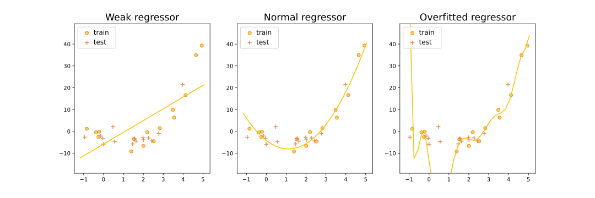

# Об этой книге
Эта книга написана коллективом добрых людей, состоящим из преподавателей и выпускников Школы анализа данных. Своим появлением она обязана обязана двум замечательным курсам. Во-первых, это [курс Константина Вячеславовича Воронцова](http://www.machinelearning.ru/wiki/index.php?title=%D0%9C%D0%B0%D1%88%D0%B8%D0%BD%D0%BD%D0%BE%D0%B5_%D0%BE%D0%B1%D1%83%D1%87%D0%B5%D0%BD%D0%B8%D0%B5_%28%D0%BA%D1%83%D1%80%D1%81_%D0%BB%D0%B5%D0%BA%D1%86%D0%B8%D0%B9%2C_%D0%9A.%D0%92.%D0%92%D0%BE%D1%80%D0%BE%D0%BD%D1%86%D0%BE%D0%B2%29) , на котором выросло подавляющее большинство и авторов книги, да и вообще ML-специалистов в России.  Во-вторых, это курс [NLP Course | For You](https://lena-voita.github.io/nlp_course.html) Лены Войта, благодаря которому мы поняли, как должен выглядеть современный учебник, и на который мы будем регулярно ссылаться в частях, связанных с анализом текста.

Идея была такая: записать сложившийся в ШАДе курс машинного обучения в виде книги, при этом избежав каких-либо компромиссов: нигде ничего не упрощать чрезмерно, дать всю возможную теорию, описать и исторически важные алгоритмы, и применяющиеся сегодня, вместе с теорией рассказывать и практические вопросы о реализации алгоритмов и работе с данными. 

Мы считаем, что для чтения книги вы совершенно обязательно должны уверенно владеть линейной алгеброй, математическим анализом, теорией вероятностей и уметь программировать на хотя бы одном каком-нибудь языке (а желательно на Python). Знания статистики и методов выпуклой оптимизации не обязательны, хотя сделают чтение комфортнее.

Читая книгу, вы обязательно заметите в ней ошибки, неточности и плохо объяснённые детали. В таком случае, пожалуйста, не поленитесь прислать нам merge-реквест с исправлениями ([сюда](https://gitlab.com/ysda_trove/ml-handbook)) – так вы поможете следующим поколениям студентов, и вам самим тоже будет приятно сознавать, какой вы молодец. 

Итак, приступим. 

# Машинное обучение

***Машинное обучение* – это наука, изучающая алгоритмы, автоматически улучшающиеся благодаря опыту.**

С момента возникновения компьютеров человечество пытается автоматизировать все больше и больше задач. Многие проблемы получается алгоритмически (и запрограммировать), но по разным причинам выходит это не всегда. Например, бывают задачи, которые люди не могут решить сами; более того, их доказуемо нельзя эффективно решить, и компьютер здесь чуда тоже не совершит (речь об NP-трудных задачах). Но бывают и задачи, которые для людей особенного труда не составляют, но которые почему-то трудно или вообще невозможно запрограммировать, например:

* Перевести текст с одного языка на другой;

* Диагностировать болезнь по симптомам;

* Сравнить, какой из двух документов в интернете лучше подходит под данную поисковый запрос;

* Сказать, что изображено на картинке;

* Оценить, по какой цене удастся продать квартиру.

 Эти задачи обьединяет как минимум несколько вещей. Во-первых, их решение можно записать, как функцию, которая отображает **объекты**, или **примеры** в **предсказания** (например, больных в диагнозы, документы в оценку релевантности). Во-вторых, нам подойдет не идеальное, а достаточно хорошее решение: ведь и доктора иногда делают ошибки в диагнозах, и вы не всегда можете сказать, что же именно изображено на картинке. В-третьих, у нас есть много примеров правильных ответов (скажем, переводов предложения на другой язык или подписей к заданной картинке), а примеры неправильных ответов (если они нужны) как правило не составляет труда сконструировать. Функция, отображающая объекты в предсказания, именуется **моделью**, а имеющийся у нас набор примеров иногда ещё называют **обучающей выборкой** или **датасетом** (от слова dataset). Обучающая выборка состоит из

 * **объектов** (это могут быть скачанные из интернета картинки, истории известных нам больных, активность пользователей на сервисе)

 * и **ответов** для них (это могут быть подписи к картинкам, диагнозы, факты ухода пользователей с сервиса), которые мы также будем иногда называть **таргетами**

 По обучающей выборке мы хотим построить модель, предсказания которой достаточно хороши. Но что значит <<достаточно хороши>>? Обычно качество предсказаний измеряют с помощью **метрик**, то есть функций, которые показывают, насколько сильно полученные предсказания, выдаваемые моделью, похожи на правильные ответы. Метрики могут быть очень разными: 

 * для задачи с диагнозами хорошими метриками могут быть, например, доля правильно поставленных диагнозов или доля заражённых, которым удалось поставить правильный диагноз (а вы поняли разницу?);

 * в задаче с ценой квартиры – доля квартир, для которых разница между предсказанным и истинным значением цены не превысила какого-то порога, или средний модуль разницы между предсказанным и истинным значением;

 * в задаче с поисковыми документами – доля пар документов, которые мы упорядочили неправильно. Чем меньше значение метрики, тем лучше работает наша модель. Решение задачи ML – это поиск такой модели, которая минимизирует значение метрики на датасете. 

 **Вопрос на подумать**. Важно помнить, что разные нужды заказчика могут диктовать самые разные метрики. Вернёмся к задаче постановки диагноза пациентам больницы. Какие метрики вы предложили бы использовать в каждом из следующих случаев:

 * Обычный год в обычном терапевтическом отделении обычной больницы;

 * Определение очень унизительной болезни, которая жутким клеймом падёт на каждого, кому поставили такой диагноз;

 * Определение опасной и очень заразной болезни.

 **Вопрос на подумать**. Рассмотрим задачу детектирования людей на изображении (под детектированием чаще всего понимают указание местоположения человека: например, прямоугольника, в котором он находится). Подумайте, какие метрики можно было бы использовать в различных ситуациях для измерения качества решения этой задачи. Не забудьте, что метрики – это способ численно измерить то, насколько модель помогает нам в жизни, так что важно думать о том, зачем вообще нам детектировать людей.

 Как найти функцию, которая минимизирует метрику на данной выборке? В общем случае решить эту задачу не представляется возможным. Но, быть может, если ограничиться каким-то классом функций, то на нём получится найти оптимум?

 Для примера давайте возьмём задачу предсказания цены квартиры, в качестве класса моделей – константные функции $$f(x) = c$$ (то есть будем для всех квартир предсказывать одно и то же значение цены), а в качестве метрики – **среднее абсолютное отклонение** (mean absolute error, она же **MAE**)

 $$MAE(y) = L(y) = \frac1n\sum\limits_{i=1}^n |f(x_i) - y_i| \rightarrow \min\limits_f$$

 где $$f$$ – это модель (та самая, $$f(x) = c$$), $$x_1,\ldots,x_n$$ – обучающие примеры (те данные о квартирах, которые мы смогли достать), $$y_1,\ldots,y_n$$ – правильные ответы (то есть цены на известные нам квартиры). Так как предсказание модели константное, по нему легко можно взять производную, которую мы приравняем к нулю, чтобы найти оптимальное значение $$c$$: 

 $$\frac{\mathcal{d} L(y)}{\mathcal{d}c} = \frac1n\sum\limits_{i=1}^n sign(c - y_i) = 0.$$

 Нетрудно увидеть, что 0 (и, соответственно, оптимум нашей метрики) достигается в точке $$f(x) = \mathrm{median}(y)$$. 

 **Вопрос на подумать**. Давайте теперь в задаче предсказания цены квартиры рассмотрим метрику **среднеквадратическое отклонение** (**MSE**):

$$MSE(f, X, y) = \frac1n\sum_{i=1}^n(f(x_i) - y_i)^2$$

Каким будет оптимальное значение параметра $c$ для константной модели $f(x) = c$?

 Прекрасно, значит, в классе константных функций мы можем найти оптимальную модель. Может быть, это можно сделать и в каком-нибудь более интересном классе? Этому вопросу и будет посвящена большая часть нашей книги. Классический курс ML состоит из описания классов моделей и способов работы с ними. Несмотря на то, что для решения большинства практических задач на сегодня достаточно знать только два типа моделей – **градиентный бустинг на решающих деревьях** и **нейросетевые модели** – мы постараемся рассказать и про другие, чтобы развить у вас глубинное понимание предмета и дать возможность не только использовать лучшие сложившиеся практики, но и, при вашем желании, участвовать в проработке новых идей и поиске новых методов, уже в роли исследователя, а не просто инженера. 

 Не любое сочетание задач, моделей и метрик имеет смысл. Скажем, если вы предсказываете класс опасности вещества (бывает от 1-го до 4-го) по его химической формуле, MAE по умолчанию представляется не очень обоснованной метрикой, уж точно менее удачной, чем доля правильных предсказаний: ведь несмотря на то, что классы вроде как представлены целыми числами, их порядок не имеет чёткой семантики. И наоборот, если мы предсказываем возраст человека в годах по его фотографии, точность предсказаний кажется уже не столь удачной метрикой (хотя возраст принимает лишь конечное, и не очень большое число различных значений), а вот MAE – вполне. В ходе курса вы научитесь выбирать правильные метрики для различных задач и классов моделей – и поймёте, что этот выбор не всегда так однозначен, как хотелось бы.

 При этом стоит отметить, что при постановке бизнес-задачи метрика обычно выбирается из соображений целесообразности, а не из-за её совместимости с какими-то моделями (больше того, модель обычно возникает уже в процессе оптимизации метрики как средство). Например, человек, ставящий аналитику задачу о предсказании цены квартиры, может попросить в качестве метрики использовать доход риэлторского агенства или аудиторию сайта этого агенства. Ясно, что в такой ситуации особо ничего не продифференцируешь, потому что доход можно лишь неявно связать с качеством предсказания цен на квартиры. Или же метрика окажется принципиально не дифференцируемой (как, например, точность предсказания). Что же делать? Обычно поступают так: выбирают прокси метрику, оптимизируя которую мы будем улучшать и исходную метрику или хотя бы уповать на это. Например, в качестве прокси для дохода риэлторского агентства можно использовать метрику абсолютной близости и понадеяться, что точные предсказания приведут к успеху и популярности компании. А вместо точности предсказания класса опасного вещества мы можем попробовать взять средеквадратичное отклонение (вот это плохая идея, а как надо делать – вы узнаете дальше). В таком случае метрику, которую используют при поиске оптимальной модели, называют **функцией потерь**, ошибкой, лоссом (от loss) или лосс-функцией. Выбор удачной функции потерь и класса моделей для конкретной задачи – тонкое и хорошо оплачиваемое искусство, которому мы надеемся научить вас в нашем курсе. 

## Виды задач 

Описанные выше задачи являются примерами задач **обучения с учителем** (supervised learning), так как правильные ответы для каждого объекта обучающей выборки заранее известны.
Задачи обучения с учителем в свою очередь делятся на следующие виды в зависимости от того, каким может быть множество $\mathbb{Y}$ всех возможных ответов (таргетов):
1. $\mathbb{Y} = \mathbb{R}$ или $\mathbb{Y} = \mathbb{R}^m$ – **регрессия**. Примерами задач регрессии является предсказание продолжительности поездки на каршеринге, спрос на конкретный товар в конкретный день или погода в вашем городе на завтра (температура, влажность и давление – это пример, когда мы предсказываем сразу несколько вещественных чисел). 
3. $\mathbb{Y} = \\{0, 1\\}$ – **бинарная классификация**. Например, мы можем предсказывать, кликнет ли пользователь по рекламному объявлению, вернет ли клиент кредит в установленный срок, сдаст ли студент сессию, случится ли определенное заболевание с пациентом (на основе, скажем, его генома), есть ли на картинке банан. 
4. $\mathbb{Y} = \\{1, \dots, K\\}$ – **многоклассовая (multi-class) классификация**. Например, определение предметной области для научной статьи (математика, биология, психология и т.д.).
5. $\mathbb{Y} = \\{0, 1\\}^K$ – **многоклассовая классификация с пересекающимися классами (multi-label classification)**. Например, задача автоматического проставления тегов для ресторанов (логично, что ресторан может одновременно иметь несколько тегов).
6. $\mathbb{Y}$ – конечное упорядоченное множество – **ранжирование**. Основным примером является задача ранжирования поисковой выдачи, где для любого запроса нужно отсортировать все возможные документы по релевантности этому запросу; при этом оценка релевантности имеет смысл только в контексте сравнения двух документов между собой, её абсолютное значение информации не несёт.

Ответ может быть и более сложным. Так, в задаче сегментации изображения требуется для каждого пикселя предсказать, к какому объекту или типу объектов он относится, а в задаче машинного перевода мы должны сгенерировать предложение (или целый текст), являющееся переводом исходного. Интерес представляют и задачи **порождения новых объектов**, то есть генерации правдоподобных объектов, из ничего или на основе уже существующих. На первый взгляд может показаться, что таким моделям сложно найти применение: понятно, почему мы хотим научиться отличать изображение кошки от изображения собаки, но не очень понятно, зачем нам уметь генерировать изображения собак. Однако с помощью такой модели также можно научиться увеличивать разрешение изображения и применять любимые всеми маски в Snapchat и Instagram.

Чем сложнее задача, тем больше данных нужно, чтобы её решить. Например, существенные успехи в задачах распознавания изображений были достигнуты лишь с появлением очень больших датасетов (и, стоит добавить, вычислительных мощностей). Вычислительные ресурсы продолжают совершенствовать, но во многих ситуациях размеченных данных (то есть объектов, которым кто-то сопоставил ответ) было бы по-прежнему слишком мало: например, для решения задачи аннотирования изображений (image captioning) потребовалось бы огромное количество пар (изображение, описание).

Бороться с этой проблемой можно двумя способами. Первый – использование **краудсорсинга**, то есть привлечение людей, готовых за относительно небольшие деньги разметить много данных. Во многих ситуациях (например, когда речь заходит об оценке поисковой выдачи) без него никак, и мы обязательно познакомим вас с этим подходом. Второй же способ состоит в использовании наряду с неразмеченными и размеченных данных. В самом деле, в той же задаче аннотирования изображений у нас есть огромное количество никак не связанных друг с другом изображений и текстов, и мы можем использовать их для того, чтобы, например, помочь компьютеру понять, какие слова в принципе могут стоять рядом в предложении. Подходы, связанные с использованием неразмеченных данных для решения задач обучения с учителем, объединяются термином **self-supervised learning** и очень активно используются сейчас. Важной составляющей является **обучение представлений** (**representation learning**) – задача построения компактных векторов небольшой размерности из сложных по структуре данных (например, изображений, звука, текстов, графов) так, чтобы близкие по структуре или семантике данные получали метрически близкие представления. Делать это можно разными способами, например, используя фрагменты моделей, обученных для решения какой-либо другой задачи, или строя модель, предсказывающую скрытую часть объекта по оставшейся его части – например, пропущенное слово в предложении. Этому будет посвящена отдельная глава нашего учебника.

Есть и относительно небольшой класс задач, относящихся к **обучению без учителя** (**unsupervised learning**) – это задачи, для которых нам известны только данные, а ответы неизвестны или вообще не существуют, и их поиск не является самоцелью. Классическим примером обучения без учителя является кластеризация – задача разделения объектов на группы, обладающие некоторыми (неизвестными нам, но, как мы в глубине души надеемся, интерпретируемыми) свойствами. Примером может служить кластеризация документов из электронной библиотеки по темам или кластеризация новостей с целью выделения крупных <<сюжетов>>.

Бывают и другие виды (и даже парадигмы) машинного обучения; так что если вы встретите задачу, которую никак не получается отнести к одному из перечисленных выше типов, не расстраивайтесь и знайте, что где-то дальше в учебнике вас ждёт рассказ про такие задачи.

 **Вопрос на подумать** Для следующих задач определите, относятся ли они к обучению с учителем, или без, или к чему-то промежуточному, попробуйте отнести их к более узким видам задач:

1. Предсказание курса евро к доллару на следующий день;

2. Стилизация текста. Например, перевод на бюрократический язык: <<Пипина и Мерри похитили!>> $\mapsto$ <<Граждане Тук, Перегин Паладинович 2990 года рождения и Брендибэк, Мериадок Сарадокович 2982 года рождения были похищены неустановленными лицами>>;

3. Детектирование котиков на изображении;

4. Обучение робокота запрыгивать на стол из произвольной позы;

5. Поиск наборов товаров, которые посетители супермаркета часто покупают вместе.

 **Вопрос на подумать** Ранжирование – это задача с таргетом из конечного упорядоченного множества $(1,\ldots,K)$. Но, казалось бы, её запросто можно было бы рассматривать, как задачу классификации на $K$ классов или задачу регрессии. В чём же проблема? Почему так не делают?

## Выбор модели, переобучение 

Может показаться, что мы вас обманули, когда пугали сложностями: очевидно, что для любой задачи машинного обучения можно построить идеальную модель – надо всего лишь запомнить всю обучающую выборку с ответами. Такая модель может достичь идеального качества по любой метрике, но радости от неё довольно мало, ведь мы хотим, чтобы он выявил какие-то закономерности в данных и помог нам с ответами там, где мы их не знаем. Важно понимать, какая у построенной модели **обобщающая способность**, то есть насколько она способна выучить общие закономерности, присущие не только обучающей выборке, и давать адекватные предсказания на новых данных. Для того, чтобы предохранить себя от конфуза, поступают обычно так: делят выборку с данными на две части: *обучающую выборку* и *тестовую выборку* (*train* и *test*). Обучающую выборку используют для, собственно, обучения модели, а метрики считают на тестовой. 

Такой подход позволяет отделить модели, которые просто удачно подстроились к обучающим данным, от моделей, в которых произошла **генерализация** (generalization), то есть от таких, которые на самом деле кое-что поняли о том, как устроены данные и могут выдавать полезные предсказания для обьектов, которые не видели. 

Например, рассмотрим три модели регрессионной зависимости уровня счастья людей от их доходов, построенные на одном и том же датасете. Отложим на графике их ошибки (пока не очень важно, метрики или функции потерь) на тестовой и обучающей выборке: 

Левая модель очень простая: мы предполагаем, что зависимость линейна. Центральная немного сложней; возможно, она использует логарифм дохода. Наконец, правая самая хитрая; можно говорить, что она <<запомнила>> всю обучающую выборку (и в самом деле, чтобы вычислить значение этой функции, нам надо знать координаты всех исходны точек).

С увеличением сложности модели ошибка на обучающей выборке падает. Во многих задачах очень сложная модель будет работать примерно так же, как модель, <<просто запомнившая всю обучающую выборку>>, но с генерализацией всё будет плохо: ведь выученные закономерности будут слишком специфическими, подогнанными под то, что происходит на обучающей выборке. Мы видим это на трёх графиках сверху: линейная функция очень проста, но и закономерность приближает лишь очень грубо; на правом же графике мы видим довольно хитрую функцию, которая точно подобрана под значения из обучающей выборки, но явно слишком эксцентрична, чтобы соответствовать какой-то природной зависимости. Оптимальная же генерализация достигается на модели не слишком сложной и не слишком простой.

Алгоритм, избыточно подстроившийся под данные, называют **переобученным**.

Точный способ выбрать алгоритм оптимальной сложности по данной задаче нам пока неизвестен, хотя какую-то теоретическую базу имеющимся философским наблюдениям мы дадим в главе про теорию обучения; при этом есть хорошо продуманная методология сравнения разных моделей и выбора среди них оптимальной – об этом мы обязательно расскажем вам в следующих главах. А пока дадим самый простой и неизменно ценный совет: не забывайте считать метрики на тестовой выборке и никогда не смешивайте её с обучающей!

 **Вопрос на подумать** Обсуждая переобучение, мы упоминали про сложность модели, но не сказали, что это такое. Как бы её определили? Как описать/сравнить сложность моделей для двух приведённых ниже задач? Почему, кстати, мы решили, что средняя модель ок, а правая переобученная?

 {: .center}

 {: .center}

## Что же такое модель

В курсе мы будем активно использовать слово <<модель>>, и нужно заранее договориться о том, что мы имеем в виду, чтобы вам не казалось, что мы одним и тем же словом называем совсем разные вещи.

Мир, в котором мы живём, бесконечно сложен, и вряд ли у нас есть шанс хоть что-то измерить и предсказать совершенно точно, будь то форма Земли или вероятность того, что пользователь останется доволен поисковой выдачей. Но как-то работать нужно, и поэтому люди вводят (упрощённые) описания мироздания, которые и называют моделями.

Например, <<Земля плоская>> – это модель, и не такая плохая, как вам может показаться. Ей активно пользуются, когда всё происходит в масштабах одного города и кривизной поверхности можно пренебрегать. С другой стороны, если мы попробуем рассчитать кратчайший путь из Парижа в Лос-Анджелес, модель плоской Земли выдаст неадекватный ответ, она войдёт в противоречие с имеющимися данными, и её придётся заменить на <<Земля круглая>>, <<Земля имеет форму эллипсоида>> и так далее – в той мере, в которой нам важна точность и в какой нам это позволяет (не)совершенство измерительной техники. Так, модель <<Земля – это безымянная штука с шершавостями на месте горных хребтов>> очень точная и замечательная, но, возможно, будет избыточно сложной для большинства практических задач и при этом слишком тяжёлой в плане вычислений.

То же самое верно и для машинного обучения. Если мы предсказываем цену квартиры, мы не можем учесть всех на свете тонкостей и сделать это совершенно точно. С одной стороны, нам фантазии не хватит, чтобы придумать все на свете факторы, влияющие на цену (да и вообще в природу на квантовом уровне внесена случайность). С другой – данных у нас конечное количество и, скажем, если мы даже знаем, что квартира, хозяин которой ходит с эльфийскими ушами и по ночам играет на арфе, продаётся за большие деньги, у нас просто нету другой квартиры, которая отличалась бы от этой лишь ушами хозяина, чтобы сделать хоть сколь-нибудь ответственный вывод о том, что именно уши повлияли на цену. Поэтому мы с самого начала должны примириться с тем, что мы ищем не истинную зависимость, а лишь приближённую – то есть строим модель. Например, такую: <<цена квартиры линейно зависит от метража и логарифмически от расстояния до ближайшего метро>>. Или такую: <<цена квартиры линейно зависит от суммарного метража и как многочлен второй степени от метража ванных комнат>>. Или вот такую: <<в некоторых случаях цена квартиры линейно зависит от метража и логарифмически от расстояния до ближайшего метро, а в некоторых она просто равна константе>>. В каждой модели у нас есть **обучаемые (настраиваемые) параметры** (в данном случае коэффициенты зависимостей, а у третьей модели ещё и правило, разделяющее одни случаи и другие), которые мы будем оптимизировать в ходе обучения. Кроме того, нам придётся научиться сравнивать между собой разные модели.

Но, как мы видели в примере с формой Земли, не все модели являются предсказательными. Например, мы можем задуматься о том, как устроена вся совокупность квартир (виденных нами, не виденных нами и не существующих пока, но правдоподобных). <<Половина квартир – двухкомнатные>> – это тоже модель, и она, как мы увидим, может оказаться полезной для построения уже предсказательной модели цены, равно как и модель <<Расстояние от квартиры до ближайшего метро имеет нормальное распределение>>. Больше того, и для цены мы можем давать не точный ответ, а что-то в духе <<ну, цена этой квартиры заключена между такими-то значениями>> или <<цена этой квартиры имеет нормальное распределение с такими-то параметрами, то есть вот такое значение, конечно, вероятнее всего, но вообще, мы не очень уверены, и вот так можно выразить нашу неуверенность>>. Модели данных вы можете применить и для того, чтобы генерировать новые объекты – и если генерировать квартиры с ценами звучит, как сомнительное занятие, то генерация осмысленного текста или аниме точно заслуживает право на существование. Наконец, понимание того, как устроены данные, может оказаться полезным для поиска аномалий: так, если какая-то квартира уж совсем никак не соответствует модели (скажем, если это землянка по цене в три раза выше средней по рынку или если в ней на две жилых комнаты десять ванных комнат), у нас есть повод заподозрить шутников или мошенников (но в то же время это может означать и то, что мы просто недостаточно данных собрали, и модель в процессе обучения просто не повидала подобного).

В следующих главах вы узнаете, что модели машинного обучения бывают очень разными, что они могут служить разными целям и к ним могут предъявляться нетривиальные требования.

### Модель vs алгоритм: в чём разница?

Изучая машинное обучение, вы нередко будете сталкиваться со словами **модель** и **алгоритм**, и иногда вам будет казаться, что это одно и то же, а иногда нет. Сейчас мы опишем, в чём, на наш взгляд, состоит разница между ними, и мы будем стараться придерживаться этого разделения дальше в учебнике. Впрочем, не все придерживаются тех же терминологических соглашений, так что будьте осмотрительны.

Как уже было описано выше, **модель** – это некоторое суждение о мире вокруг нас. У модели могут быть настраиваемые параметры (например, коэффициенты линейной функции), и тогда нужен какой-то способ настроить их по конкретной обучающей выборке. Например, с помощью метода наименьших квадратов. Это и есть **алгоритм** (**алгоритм обучения**): инструкция, как по выборке обучить параметры модели. Естественно, для одной и той же модели может быть несколько различных алгоритмов обучения, и точно так же один и тот же алгоритм (например, уже упомянутый метод наименьших квадратов) может быть использован для обучения различных моделей (например, и для модели <<цена квартиры линейно зависит от расстояния до метро>>, и для модели <<цена квартиры логарифмически зависит от расстояния до метро>>).

