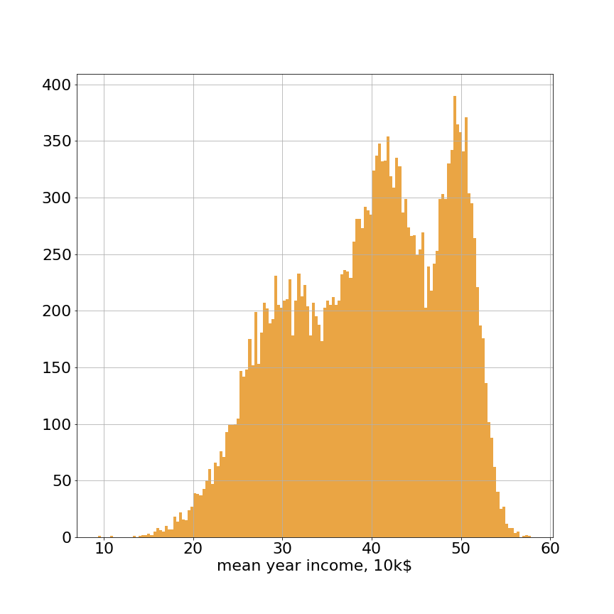
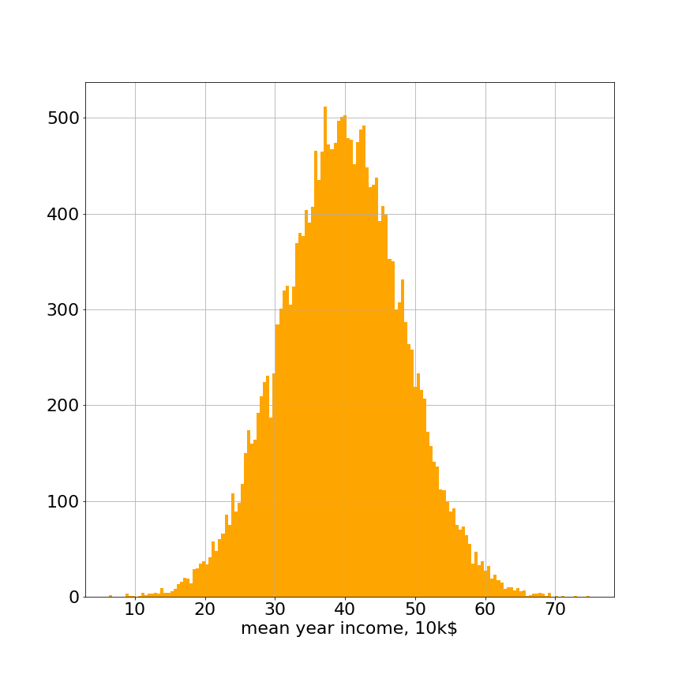
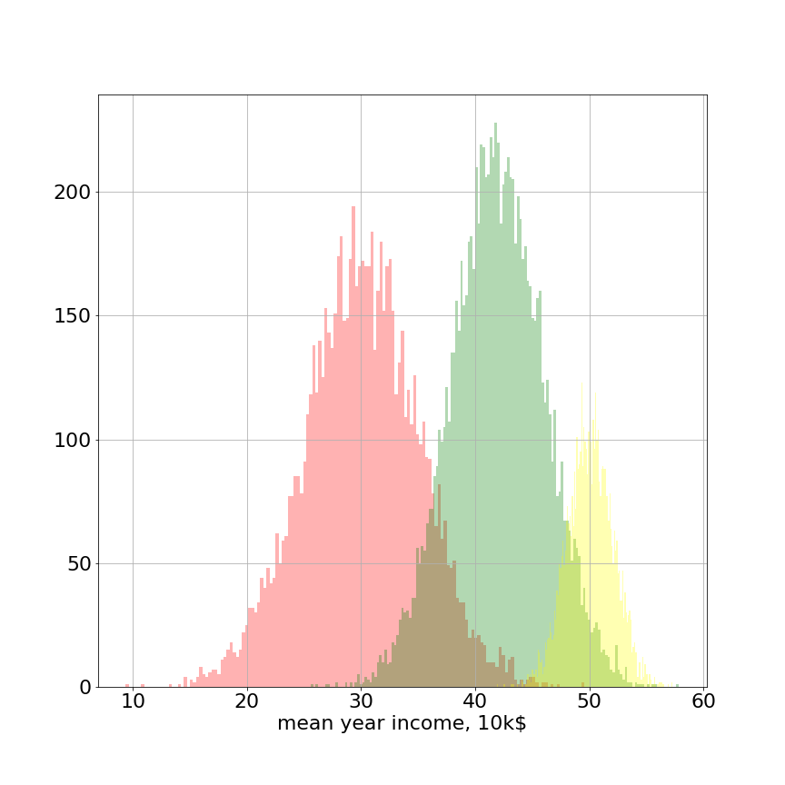

# Зачем?

Предположим, что мы делаем анализ данных для банка и нам предоставили данные о годовых зарплатах клиентов.

В этом графике очевидно есть три большие моды (три кластера) клиентов. Неопытный аналитик мог бы попытаться описать этот график в отчете для руководства с помощью двух чисел — средней зарплаты и стандартного отклонения зарплат. Однако данные с гистограммы ниже имеют точно такое же среднее и стандартное отклонение, как и мультимодальные данные выше (из этого следует что не надо пытаться описывать мультимодальные данные с помощью унимодальных распределений). Очевидно, что графики выглядят совершенно по разному и правильная интерпретация первого графика может принести бизнесу дополнительные деньги (если банк научится предлагать клиентам из каждого кластера более кастомизированные предложения).

Проблема заключается в том, что нам неизвестно, к какому кластеру относится каждый клиент и неизвестны характеристики кластеров. Как мы можем описать три больших кластера клиентов? Для каждого кластера можно попытаться задать свои параметры (среднее и дисперсию). Но как тогда определить, из какого кластера конкретный клиент в выборке? Более того, один клиент может, например, относиться с вероятностью 0.7 к одному кластеру и с вероятностью 0.3 к другому.

Как бы мы могли попытаться решить такую задачу "мягкой" кластеризации ("мягкой", потому что один объект может относиться к нескольким кластерам)? Мы могли бы действовать итерационно: сначала зададим начальное приближение на параметры распределений. Например, в нашем случае с клиентами банка из графика можно предположить, что среднее первой моды 30, среднее второй — 40 и третьей — 50, а стандартные отклонения у всех мод равняются, скажем, 10. Зная эти начальные параметры мы можем для каждого клиента посчитать вероятность прийти из каждого из 3 кластеров и отнормировать эти вероятности в единицу. Дальше мы бы могли переоценить наши средние и дисперсии, "взвешивая" вклад объектов пропорционально их вероятности принадлежности к каждому кластеру и таким образом уточнить средние и дисперсии для всех трех кластеров. Повторяя эти два шага последовательно мы бы смогли получить для всех кластеров среднее и дисперсию, а для каждого объекта — вероятности принадлежности к кластерам. В сущности это и есть EM-алгоритм.

Кстати оказывается, что метод кластеризации K-средних является частным случаем применения EM-алгоритма. Действительно, мы сначала случайно расставляем центры кластеров. Затем мы для каждого объекта пересчитываем расстояние до центра каждого кластера, после чего получаем "вес" объекта в каждом кластере ("вес" в том смысле, что чем ближе объект к центру кластера, тем больше этот объект учитывается при пересчете центра этого кластера) через нормировку расстояний. Дальше мы опять пересчитываем центры кластеров и потом опять перевзвешиваем для каждого объекта кластера.

**Смеси распределений**

Говорят, что распределение $p(x)$ является **смесью распределений**, если его плотность имеет вид

$$
    p(x)
    =
    \sum_{k = 1}^{K} \pi_k p_k(x),
    \qquad
    \sum_{k = 1}^{K} \pi_k = 1,
    \qquad
    \pi_k \geq 0,
$$

где $p_k(x)$ — распределения компонент смеси,
$\pi_k$ — априорные вероятности компонент,
$K$ — число компонент.

В примере с банком мы можем априорно считать, что каждый клиент может принадлежать к любому кластеру с одинаковой вероятностью и тогда $\pi_k = \frac{1}{3}$ для каждого клиента.

Будем считать, что распределения компонент смеси принадлежат
некоторому параметрическому семейству: $p_k(x) = \phi ( x \vert \theta_k )$
Каждую компоненту распределения $p_k(x)$ можно рассматривать как кластер,
а значение данной плотности на объекте — как вероятность принадлежности
данному кластеру. Таким образом, с помощью смеси распределений можно описывать **мягкую кластеризацию**,
в которой каждый объект относится к каждому из кластеров с некоторой вероятностью.

Рассмотрим следующий эксперимент: сначала из дискретного распределения $\{\pi_1, \dots, \pi_K\}$ выбирается номер $k$, а затем из распределения $\phi(x \vert \theta_k)$ выбирается значение $x$. Покажем, что распределение переменной $x$ будет представлять собой смесь вида [ссылка на определение смеси]

Введем **скрытую переменную** $z$, отвечающую за выбор компоненты смеси. Пусть она представляет собой $K$-мерный бинарный случайный вектор, ровно одна компонента которого равна единице:

$$
    z \in \{0, 1\}^K,
    \qquad
    \sum_{k = 1}^{K} z_k = 1.
$$

Вероятность того, что единице будет равна $k$-я компонента, равна $\pi_k$:

$$
    p(z_k = 1) = \pi_k.
$$

Запишем распределение сразу всего вектора:

$$
    p(z) = \prod_{k = 1}^{K} \pi_k^{z_k}.
$$

Если номер компоненты смеси известен, то случайная величина $x$ имеет распределение $\phi(x \vert \theta_k)$:

$$
    p(x \vert z_k = 1)
    =
    \phi(x \vert \theta_k),
$$

или, что то же самое,

$$
    p(x \vert z)
    =
    \prod_{k = 1}^{K}
    \Bigl[
        \phi(x \vert \theta_k)
    \Bigr]^{z_k}.
$$

Запишем совместное распределение переменных $x$ и $z$:

$$
    p(x, z)
    =
    p(z) p(x \vert z)
    =
    \prod_{k = 1}^{K}
    \Bigl[
        \pi_k \phi(x \vert \theta_k)
    \Bigr]^{z_k}.
$$

Чтобы найти распределение переменной $x$, нужно избавиться от скрытой переменной:

$$
    p(x)
    =
    \sum_{z} p(x, z).
$$

Суммирование здесь ведется по всем возможным значениям $z$,
то есть по всем $K$-мерным бинарным векторам с одной единицей:

$$
    p(x)
    =
    \sum_{z} p(x, z)
    =
    \sum_{k = 1}^{K}
    \pi_k \phi(x \vert \theta_k).
$$

Мы получили, что распределение переменной $x$ в описанном эксперименте
представляет собой смесь $K$ компонент.

**Модели со скрытными переменными**

Рассмотрим вероятностную модель с наблюдаемыми переменными $X$ и параметрами $\Theta$, для которой задано правдоподобие $\log p(X \vert \Theta)$.

Предположим, что в модели также существуют **скрытые переменные** $Z$, описывающие ее внутреннее состояние. Тогда правдоподобие $\log p(X \vert \Theta)$ называется **неполным**, а правдоподобие $\log p(X, Z \vert \Theta)$ — **полным**. Они связаны соотношением

$$
\log p(X \vert \Theta) = \log \Biggl\{ \sum_{Z} p(X, Z \vert \Theta) \Biggr\}.
$$

Как правило, знание скрытых переменных существенно упрощает правдоподобие и позволяет достаточно просто оценить параметры $\Theta$.

Рассмотрим пример со смесями распределений. В качестве наблюдаемых переменных здесь выступает выборка~$X = \{x_1, \dots, x_\ell\}$, в качестве скрытых переменных — номера компонент, из которых сгенерированы объекты $Z = \{z_1, \dots, z_\ell\}$ (здесь каждый из $z_i$ является $K$-мерным вектором), в качестве параметров — априорные вероятности и параметры компонент~$\Theta = (\pi_1, \dots, \pi_K, \theta_1, \dots, \theta_K)$.

Неполное правдоподобие имеет вид

$$
\log p(X \vert \Theta) = \sum_{i = 1}^{l} \log \Biggl\{.  \sum_{k = 1}^{K} \pi_k p(x_i \vert \theta_k) \Biggr\}.
$$

Правдоподобие здесь имеет вид логарифм суммы. Если приравнять нулю его градиент, то получатся сложные
уравнения, не имеющие аналитического решения. Данное правдоподобие сложно вычислять, оно не является вогнутым и имеет много локальных экстремумов, поэтому применение итерационных методов для его непосредственной максимизации приводит к медленной сходимости.

Рассмотрим теперь полное правдоподобие:

$$
\log p(X, Z \vert \Theta) = \sum_{i = 1}^{l} \sum_{k = 1}^{K} z_{ik} \Bigl\{ \log \pi_k + \log \phi(x_i \vert \theta_k)
\Bigr\}.
$$

Оно имеет вид **сумма логарифмов**, и позволяет аналитически найти оценки максимального правдоподобия на параметры $\Theta$ при известных переменных $X$ и $Z$.

Проблема же заключается в том, что нам не известны скрытые переменные $Z$, поэтому их необходимо оценивать одновременно с параметрами, что никак не легче максимизации неполного правдоподобия. Решение данной проблемы предлагается в **EM-алгоритме**.

**EM-алгоритм**

EM-алгоритм решает задачу максимизации полного правоподобия путем попеременной оптимизации по параметрам и по скрытым переменным.

Опишем сначала **наивный** способ оптимизации. Зафиксируем некоторое начальное приближение для параметров $\Theta^{\text{old}}$. При известных наблюдаемых переменных $X$ и параметрах $\Theta^{\text{old}}$ мы можем оценить скрытые переменные, найдя их наиболее правдоподобные значения:

$$
Z^* = \underset{Z}{\operatorname{arg max}} p(Z \vert X, \Theta^\text{old}) = \underset{Z}{\operatorname{arg max}} p(X, Z \vert \Theta^\text{old}).
$$

Зная скрытые переменные, мы можем теперь найти следующее приближение для параметров:

$$
\Theta^\text{new} = \underset{\Theta}{\operatorname{arg max}} p(X, Z^* \vert \Theta).
$$

Повторяя итерации до сходимости, мы получим некоторый итоговый вектор параметров $\Theta^{\*}$.

Данная процедура, однако, далека от идеальной — ниже мы предложим подход, который приводит к более качественным результатам.

Гораздо лучшие результаты можно получить, воспользовавшись байесовским подходом. Как и прежде, зафиксируем вектор параметров $\Theta^\text{old}$, но вместо точечной оценки вычислим апостериорное распределение на скрытых переменных $p(Z \vert X, \Theta^\text{old})$. В этом заключается **E-шаг** EM-алгоритма. Усредним логарифм полного правдоподобия по всем возможным значениям скрытых переменных $Z$ с весами, равными апостериорным вероятностям этих переменных $p(Z \vert X, \Theta^\text{old})$:

$$
Q(\Theta, \Theta^\text{old}) = \mathbb{E}_{Z \sim p(Z \vert X, \Theta^\text{old})} \log p(X, Z \vert \Theta) = \sum_{Z} p(Z \vert X, \Theta^\text{old}) \log p(X, Z \vert \Theta).
$$

Формально говоря, мы нашли матожидание логарифма полного правдоподобия по апостериорному распределению на скрытых переменных.

На $M-шаге$ новый вектор параметров находится как максимизатор данного матожидания:

$$
\Theta^\text{new} = \underset{\Theta}{\operatorname{arg max}} Q(\Theta, \Theta^\text{old}) = \underset{\Theta}{\operatorname{arg max}} \sum_{Z} p(Z \vert X, \Theta^\text{old}) \log p(X, Z \vert \Theta).
$$

Можно показать, что такой итерационной процесс всегда не уменьшает правдоподобие и сходится.

**Разделение гауссиан**

Пусть теперь нам известно, что $N$ точек были сэмплированы из K **разных** гауссовских распределений и нам неизвестно, какая точка из какого распределения пришла в выборку. Нам нужно оценить параметры ($\mu_1$, $\sigma_1$) для первого распределения, ($\mu_2$, $\sigma_2$) для второго и соответсвенно ($\mu_k$, $\sigma_k$) для $k$-го распределения.

Если мы знаем, что точка $x_i$ пришла из распределения $z_i$, то её правдоподобие в равно:

$$
p(x*i \mid z_i, \theta) = \frac{ \exp\left( \frac{ -(x_i - \mu*{z*i})^2 }{2 \sigma*{z*i}^2} \right) }{ \sqrt ( 2 \pi ) \sigma*{z_i} }
$$

Напомним, что $z_i$ обозначает номер гауссианы (от 1 до $K$), из которой была просэмплирована точка $x_i$. Например, если точка $x_i$ просэмплирована из 3го распределения, то в формулу вместо ($\mu_{z_i}$, $\sigma_{z_i}$) нужно подставлять $(\mu_3, \sigma_3)$.

Более подробно распишем алгоритм в нашем случае. Сначала инициализируем параметры

$\theta_{\text{old}}= \\{ \mu_{1\_{\text{old}}}, \sigma_{1\_{\text{old}}}, \mu_{2\_{\text{old}}}, \sigma_{2\_{\text{old}}}, \ldots, \mu_{K\_{\text{old}}}, \sigma_{K\_{\text{old}}}\\}$.

Зная $\theta\_{\text{old}}$, выполним E-шаг: нужно найти $p(Z \mid X, \theta)$ или что то же самое, для каждого объекта $x_i$ найти распределение на вероятности $p(z_i = k \mid x_i, \theta\_{\text{old}})$.

Как найти $p(z_i = k \mid x_i, \theta\_{\text{old}})$, если мы знаем $x_i$ и у нас есть приближение $\theta\_{\text{old}}$? Ответ — по формуле Байеса:

$$
p(z*i = k \mid x_i, \theta*{\text{old}}) = \frac{p(x*i \mid z_i = k, \theta*{\text{old}}) \cdot p(z*i = k) } {p(x_i | \theta*{\text{old}} )} = \frac {p(x*i \mid z_i = k, \theta*{\text{old}}) \cdot p(z*i = k) } { \sum*{k=1}^3 p(x*i \mid z_i = k, \theta*{\text{old}}) \cdot p(z_i = k) }
$$

где $p(z_i = k)$ — априорная вероятность о принадлежности объекта $x_i$ к гауссиане с номером $k$. Априорную вероятность можно положить равной $p(z_i = k) = \frac{1}{K}$ для всех гауссиан. (в нашем примере $K$ гауссиан).

Введём обозначение

$$
u_{ik} := p(x_i \mid z_i = k, \theta_{\text{old}}) = \frac{ \exp\left( \frac{ -(x_i - \mu_{k_{\text{old}}})^2 }{2 \sigma_{k_{\text{old}}}^2} \right) }{ \sqrt(2 \pi) \sigma_{k_{\text{old}}} }
$$

— вероятность того, что объект $x_i$ пришел из распределения с нормального распределения с параметрами $(\mu_{k_{\text{old}}}, \sigma_{k_{\text{old}}}^2)$.

Тогда вероятность, что объект $z_i = k$ по формуле Байеса:

$$
p(z*i = k| x_i, \theta*{\text{old}}) = \frac{ u*{ik} \cdot \frac{1}{K}} { \sum*{k=1}^K u\_{ik} \cdot \frac{1}{K} }
$$

Таким образом для каждого объекта $x_i$ по начальному приближению $\theta_{\text{old}}$ мы посчитаем распределение $p(z_i )$ — с какими вероятностями объект $x_i$ принадлежит к каждому из $K$ кластеров.

Теперь выведем формулы для М-шага.

$$
\theta = \underset{\Theta}{\operatorname{arg max}} \mathbb{E}_{q(Z)} \log p(X | Z, \theta) = \underset{\Theta}{\operatorname{arg max}} \sum_{i=1}^N \sum_{k=1}^K p(z_i = k | x_i, \theta) \cdot \log p(x_i | z_i = k, \theta)
$$

$$
= \sum*{i=1}^N \sum*{k=1}^K p(z_i = k | x_i, \theta) \cdot \left ( \log \frac{1}{K} - \frac{1}{2 \sigma_k^2} (x_i - \mu_k)^2 - \frac{1}{2} \log \sigma_k^2 \right) + const’
$$

Запишем производную и приравняем к 0, чтобы найти экстремум:

$$
\frac{\partial \mathbb{E}_{q(Z)} \log p(X | Z, \theta) }{\partial \mu_k} = - \sum_{i=1}^N p(z_i = k | x_i, \theta) \cdot \frac{x_i - \mu_k}{\sigma_k^2} = 0 \rightarrow
$$

$$
\mu*k = \frac{ \sum*{i=1}^N p(z*i = k | x_i, \theta) \cdot x_i } {\sum*{i=1}^N p(z_i = k | x_i, \theta) }
$$

Мы получили конечную формулу для пересчета $\mu_k$ по $z_i$ и предыдущему значению $\theta$. Причем у этой формулы есть простая интерпретация — каждый объект мы взвешиваем с его вероятностью принадлежности к этому класса $p(z_i = k \mid x, \theta)$.

Теперь посчитаем производную по $\sigma_k^2$ (обратите внимание что по квадрату $\sigma_k$):

$$
 \frac{\partial \mathbb{E}_{q(Z)} \log p(X | Z, \theta) }{\partial \sigma_k^2} = \sum_{i=1}^N   p(z_i = k | x_i, \theta) \cdot ( \frac{(x_i - \mu_k)^2}{2 \sigma_k^4} - \frac{1}{2 \sigma_k^2} ) = 0 \rightarrow
$$

$$
\sigma_k^2 = \frac{ \sum_{i=1}^N  p(z_i = k | x_i, \theta) (x_i - \mu_k)^2 }{ \sum_{i=1}^N p(z_i = k | x_i, \theta) }
$$

Мы снова получили интерпретируемый результат, при подсчете дисперсии для $k$-ой гауссианы мы учитываем вес каждого объекта при подсчете квадратичного отклонения с учетом его вероятности принадлежности к гауссиане с номером $k$. Сравните эту формулу с формулой для подсчета выборочной дисперсии, где каждый из $N$ объектов вносит одинаковый вклад в дисперсию с весом $\frac{1}{N}$.

$$
\sigma^2 = \frac{\sum_i^N (x_i - \mu)^2}{N}
$$
