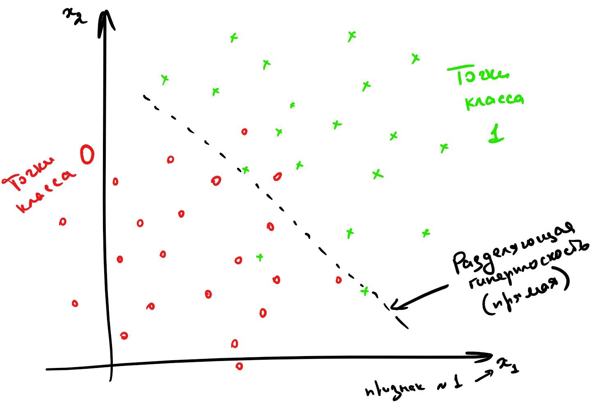
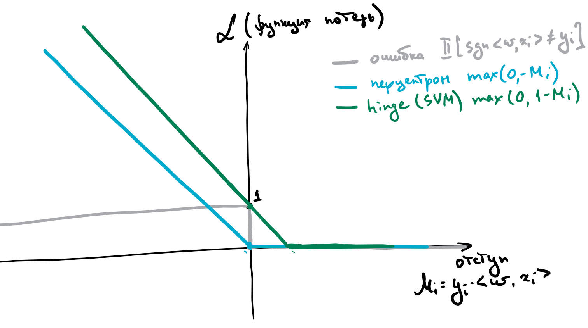
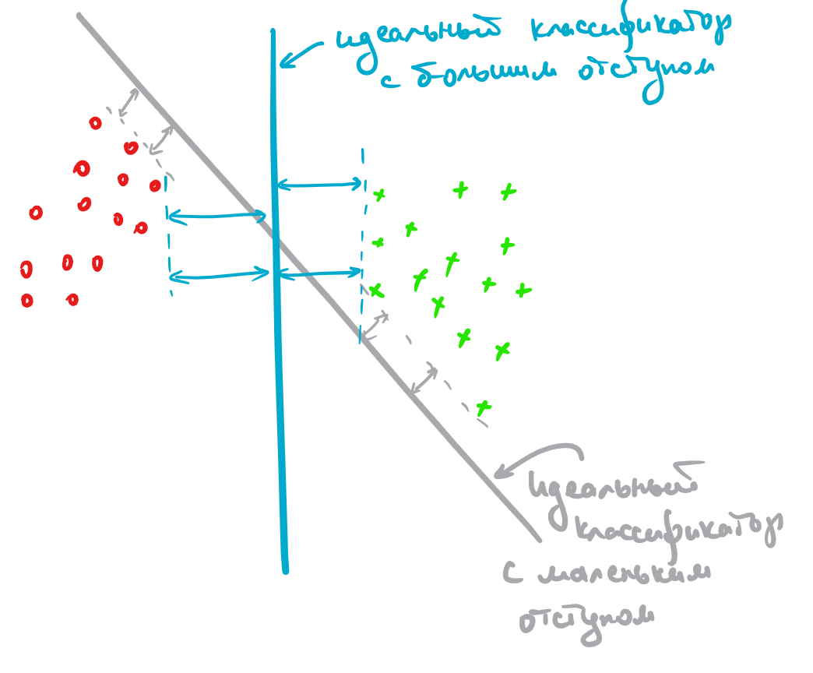
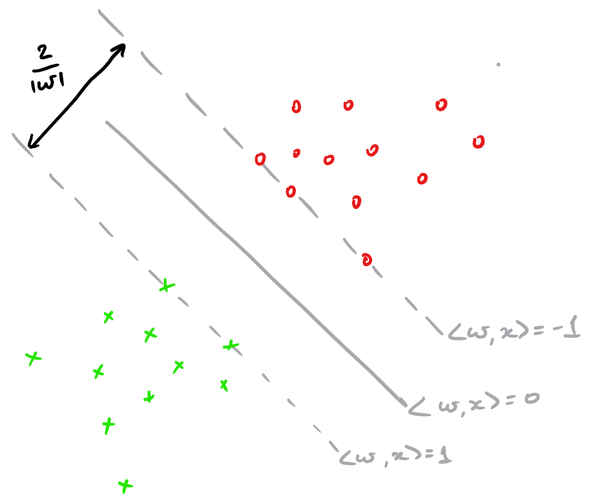

* Этот список будет заменен оглавлением, за вычетом заголовка "Contents",
к которому добавлен класс `no_toc`.
{:toc}

Мы начнем с, пожалуй, самых простых и понятных моделей машинного обучения: линейных. Нам предстоит понять, что это вообще такое, почему они работают, как их программировать и в каких случаях их стоит использовать. Так как это первый рассмотренный нами вид моделей, мы постараемся объяснить цепочку рассуждений очень подробно, поэтому читайте внимательно.

# Почему модели линейные?

Задачи классификации и регрессии можно сформулировать как поиск следующих отображений:
- **классификация**: $$\mathbb{R}^d  \to \{0, 1, \ldots, n\}$$, где $0, \ldots, n$ -- номера классов,
- **регрессия**: $\mathbb{R}^d \to \mathbb{R}$,

причем искомые отображения должны допускать как можно меньшее число ошибок на наших данных. Для того, чтобы эти задачи можно было свести к задаче оптимизации, нам нужно ограничить пространство поиска каким-то параметризованным классом функций. Самым простым таким классом являются линейные функции:

$$
    y = w_1 x_1 + \ldots + w_d x_d + b,
$$

где $y$ -- целевая зависимость, $(x_1, \ldots, x_d)$ -- вектор, соответствующий объекту в выборке, а $w_1, \ldots, w_n, b$ -- параметры модели. Для $$d = 1$$ график такой функции – это прямая. Для регрессии такая прямая задает значение функции в точке, а для бинарной классификации – разделяющее правило: там, где значение функции положительно, мы предсказываем один класс, где отрицательно – другой, а множество нулей функции становится разделяющей границей между классами.

{: .center}

В случае более высоких размерностей прямой будет соответствовать гиперплоскость с аналогичным смыслом.


&nbsp;
# Метод наименьших квадратов (МНК)

Мы начнём с использования линейных моделей для решения задачи регрессии. Простейшим примером постановки задачи линейной регрессии является *метод наименьших квадратов* [Ordinary least squares].

Пусть у нас задан датасет $(X, y)$, где $$y=(y_i)_{i=1}^n \in \mathbb{R}^n$$ -- вектор таргетов, а $$X=(x_i)_{i = 1}^n \in \mathbb{R}^{n \times d}, x_i \in \mathbb{R}^d$$ – матрица признаков, в которой $i$-я строка – это вектор признаков $i$-го объекта выборки. Мы хотим моделировать зависимость $$y_i$$ от $$x_i$$ как линейную функцию со свободным членом. Общий вид такой функции из $$\mathbb{R}^d$$ в $$\mathbb{R}$$ выглядит следующим образом:

$$f_w(x_i) = \langle w, x_i \rangle + b$$

Вектор $$w \in \mathbb{R}^d$$ часто называют вектором весов, так как на предсказание модели можно смотреть как на взвешенную сумму признаков объекта.

Свободный член $$b$$ часто опускают, потому что такого же результата можно добиться, добавив ко всем $$x_i$$ признак, тождественно равный единице; тогда роль свободного члена будет играть соответствующий ему вес:

$$\begin{pmatrix} x_{i1} & \ldots & x_{id} \end{pmatrix}\cdot\begin{pmatrix}w_1\\ \vdots \\ w_d\end{pmatrix} + b =
\begin{pmatrix} x_{i1} & \ldots & x_{id} & 1 \end{pmatrix}\cdot\begin{pmatrix}w_1\\ \vdots \\ w_d \\ b\end{pmatrix}$$

Мы хотим, чтобы на нашем датасете (то есть на парах $$(x_i, y_i)$$ из обучающей выборки) эта функция как можно лучше приближала нашу зависимость.

{: .center}

Для того, чтобы задача стала чисто технической, нам осталось только одно: на математическом языке выразить желание "приблизить $$f_w(x)$$ к $$y$$". Понятно, что должна получиться какая-то задача оптимизации; говоря простым языком, мы должны научиться измерять "плохость" модели и минимизировать её по параметрам $$f_w$$ (то есть по весам $$w$$). Эта самая удобно оптимизируемая "плохость" традиционно называется **функцией потерь**, **функционалом качества** или просто лоссом [loss function].

Функции потерь бывают разными. От их выбора зависит то, насколько задачу в дальнейшем легко решать, и то, в каком смысле мы хотели бы приблизить предсказание модели к таргету. В текущем подходе предлагается в качестве лосса взять квадрат $$L_2$$-нормы вектора разницы предсказаний модели и $$y$$. Во-первых, так задачу будет весьма нетрудно решить, а во-вторых, это несет в себе несколько смыслов:

* $$L_2$$-норма разницы – это евклидово расстояние $$\|y - f_w(x)\|_2$$ между вектором таргетов и вектором ответов модели, то есть мы их приближаем в смысле самого простого и понятного "расстояния".

* Как мы увидим дальше, с точки зрения статистики это соответствует гипотезе о том, что наши данные состоят из линейного "сигнала" и нормально распределенного "шума".

Так вот, наша функция потерь выглядит так:

$$L(f, X, y) = \|y - f(X)\|_2^2 = \|y - Xw\|_2^2 = \sum_{i=1}^n(y_i - \langle x_i, w \rangle)^2$$

Иногда вместо суммы квадратов расстояний от всех точек до прямой используется среднее расстояние. При таком подходе размер ошибки не зависит от размера выборки. Такая функция потерь называется **Mean Squared Error**, **MSE** или **среднеквадратическое отклонение**. Разница здесь чисто косметическая, на алгоритм решения задачи она не влияет:

$$L'(f, X, y) = \frac{1}{n}\|y - X w\|_2^2$$


Для того, чтобы найти лучшую модель, этот функционал надо минимизировать по $$w$$:

$$\|y - Xw\|_2^2 \longrightarrow \min_w$$


Эту задачу можно решить как аналитически, так и приближенно. Давайте же сделаем и то, и другое.

&nbsp;
# МНК: точный аналитический метод

В точке минимума градиент по вектору $$w$$ равен нулю, и мы можем решить уравнение “в лоб”:

$$
    0 = \nabla_wL(f_w, X, y) = \nabla_w\|Xw - y\|_2^2  = \\
    = \nabla_w(Xw - y)^T (Xw - y) = \\
    = \nabla_w(w^T X^T Xw - w^T X^T y - y^T X w + y^T y) = \\
    = \nabla_w(w^T X^T Xw - w^T X^T y - y^T X w) = 2 X^T Xw - 2 X^T y
$$

Отсюда

$$
    X^TX w = X^T y \\
    w = (X^TX)^{-1}X^T y
$$

Заметим, что в последнем переходе мы обратили матрицу $X^T X$, что, вообще говоря, не всегда возможно. Но даже в случаях, когда это возможно, операция обращения матрицы может быть вычислительно нестабильна. Эти проблемы мы затронем в следующих разделах.

&nbsp;
## Геометрический взгляд на точную формулу

Точную формулу, кстати, можно вывести и из других, геометрических соображений. Пусть $$x^{(1)},\ldots,x^{(n)}$$ – столбцы матрицы $$X$$, то есть столбцы признаков. Тогда

$$Xw = w_1x^{(1)}+\ldots+w_nx^{(n)},$$

и задачу регрессии можно сформулировать следующим образом: *найти линейную комбинацию столбцов $$x^{(1)},\ldots,x^{(n)}$$, которая наилучшим способом приближает столбец $$y$$ по евклидовой норме* – то есть *найти **проекцию** вектора $$y$$ на подпространство, образованное векторами $$x^{(1)},\ldots,x^{(n)}$$*.

Разложим $$y = y_{\parallel} + y_{\perp}$$, где $$y_{\parallel} = Xw$$ – та самая проекция, а $$y_{\perp}$$ – ортогональная составляющая, то есть $$y_{\perp} = y - Xw\perp x^{(1)},\ldots,x^{(n)}$$. Как это можно выразить в матричном виде? Оказывается, очень просто:

$$X^T(y - Xw) = 0$$

В самом деле, каждый элемент столбца $$X^T(y - Xw)$$ – это скалярное произведение строки $$X^T$$ (=столбца $$X$$ = одного из $$x^{(i)}$$) на $$y - Xw$$. Из уравнения $$X^T(y - Xw) = 0$$ уже очень легко выразить $$w$$:

$$w = (X^TX)^{-1}X^Ty$$

## Проблемы "точного" решения

Заметим, что для получения ответа нам нужно обратить матрицу $$X^TX$$. Это создает множество проблем:
1. Это вычислительно трудно (сложность вычисления обратной матрицы $$\sim O(n^{2.373})$$),
2. Матрица $$X^TX$$, хотя почти всегда обратима (для этого достаточно, чтобы все признаки были линейно независимы и $$\mathrm{rk}(X^TX) = \mathrm{rk}{X}$$), но зачастую плохо обусловлена (например, если между признаками есть не точная, но приближённая линейная зависимость). Погрешность нахождения $w$ будет зависеть от квадрата [числа обусловленности](https://ru.wikipedia.org/wiki/Число_обусловленности) матрицы $X$, что очень плохо. Это делает полученное таким образом решение численно неустойчивым: малые возмущения $$y$$ могут приводить к катастрофическим изменениям $$w$$.

<details>
   <summary markdown="span">Данные проблемы не являются поводом выбросить решение на помойку. Существует как минимум два способа улучшить его численные свойства, однако если вы не знаете про сингулярное разложение, то лучше вернитесь сюда, когда узнаете.</summary>
   1. Построим $$QR$$-разложение матрицы $$X$$. Напомним, что это разложение, в котором матрица $$Q$$ ортогональна по столбцам (то есть её столбцы ортогональны и имеют длину 1; в частности, $$Q^TQ=E$$), а $$R$$ квадратная и верхнетреугольная. Подставив его в формулу, получим

      $$w = ((QR)^TQR)^{-1}(QR)^T y = (R^T\underbrace{Q^TQ}_{=E}R)^{-1}R^TQ^Ty = R^{-1}R^{-T}R^TQ^Ty = R^{-1}Q^Ty$$

      Отметим, что написать $$(R^TR)^{-1} = R^{-1}R^{-T}$$ мы имеем право благодаря тому, что $$R$$ квадратная. Полученная формула намного проще, обращение верхнетреугольной матрицы (=решение системы с верхнетреугольной левой частью) производится быстро и хорошо, погрешность вычисления $w$ будет зависеть просто от числа обусловленности матрицы $X$, а поскольку нахождение $QR$-разложения является достаточно стабильной операцией, мы получаем решение с более хорошими, чем у исходной формулы, численными свойствами.

   2. Также можно использовать псевдообратную матрицу, построенную с помощью сигнулярного разложения (о нём подробно написано в разделе про матричные разложения). А именно, пусть

       $$A = U\underbrace{\mathrm{diag}(\sigma_1,\ldots,\sigma_r)}_{=\Sigma}V^T$$

       -- это усечённое сингулярное разложение, где $r$ – это ранг $A$ (то есть диагональная матрица посередине является квадратной, $U$ и $V$ ортогональны по столбцам: $U^TU = E$, $V^TV = E$). Тогда

      $$w = (V\Sigma \underbrace{U^TU}_{=E}\Sigma V^T)^{-1}V\Sigma U^Ty$$

      Заметим, что $$V\Sigma^{-2}V^T\cdot V\Sigma^2V^T = E = V\Sigma^2V^T\cdot V\Sigma^{-2}V^T$$, так что $$(V\Sigma^2 V^T)^{-1} = V\Sigma^{-2}V^T$$, откуда

       $$w = V\Sigma^{-2}\underbrace{V^TV}_{=E}V^T\cdot V\Sigma U^Ty = V\Sigma^{-1}Uy$$

       Хорошие численные свойства сингулярного разложения позволяют утверждать, что и это решение ведёт себя довольно неплохо.

       Тем не менее, вычисление всё равно остаётся довольно долгим и будет по-прежнему страдать (хоть и не так сильно) в случае плохой обусловленности матрицы $$X$$.
 </details>

Полностью полечить проблемы мы не сможем, но никто и не обязывает нас останавливаться на "точном" решении (которое всё равно никогда не будет вполне точным). Поэтому ниже мы познакомим вас с совершенно другим методом.

&nbsp;
# МНК: приближенный численный метод
Минимизируемый функционал является выпуклым, а это значит, что можно эффективно искать точку его минимума с помощью итеративных методов. Есть множество способов это сделать, и вообще-то этим занимается отдельная дисциплина – *Выпуклая оптимизация*. Мы пока рассмотрим самый простой итерационный метод оптимизации, а позднее в книге устроим небольшой обзор существующих на данный момент методов этого класса.

Как известно, градиент функции в точке направлен в сторону её наискорейшего роста, а антиградиент (противоположный градиенту вектор) в сторону наискорейшего убывания. То есть, имея какое-то приближение параметра $$w$$, мы можем его улучшить, посчитав градиент функции потерь в точке и немного сдвинув вектор весов в направлении антиградиента:

$$w_j \mapsto w_j - \alpha \frac{d}{d{w_j}} L(f_w, X, y) $$

где $$\alpha$$ – это параметр алгоритма ("темп обучения"), который контролирует величину шага в направлении антиградиента. Описанный алгоритм называется **градиентным спуском**. Градиент нашего функционала потерь по $$j$$-й координате вектора весов равен

$$
    \frac{dL}{dw_j} = \frac{d}{dw_j}\left(\frac{1}{n} \sum_{i=1}^n(y_i - \langle x_i, w \rangle)^2 \right) = \\
    = \frac{2}{n}\sum_{i=1}^{n}(\langle x_i, w \rangle - y_i) \frac{d}{dw_j}( \langle w, x_i \rangle - y_i) = \\
    = \frac{2}{n}\sum_{i=1}^{n}(\langle x_i, w \rangle - y_i) \frac{d}{dw_j} \left( \sum_{k = 1}^n x_{ik} w_k - y_i \right) = \\
    = \frac{2}{n}\sum_{i=1}^{n}(\langle x_i, w \rangle - y_i) x_{ij}
$$

В матричном виде вычисление векторa градиента может быть записано так:

$$
    \frac{dL}{dw} =  \frac{2}{n} X^T (Xw - y)
$$

Следовательно, имея данный вектор весов, мы знаем, как его сделать немного лучше. Но из какой точки стартовать процесс? Так как функционал выпуклый, это не так важно, и подойдет любое значение, например, нулевое. Для более сложных моделей и лоссов выбор хорошего начального значения – это полдела, но пока не будем об этом.

## Алгоритм градиентного спуска
```python
w = normal(0, 1)                # можно пробовать и другие виды инициализации
repeat S times:                 # другой вариант: while abs(err) > tolerance
   f = X.dot(w)                 # посчитать предсказание
   err = f - y                  # посчитать ошибку
   grad = 2 * X.T.dot(err) / n  # посчитать градиент
   w -= alpha * grad            # обновить веса
```

За обсуждением того, с какой скоростью мы будем сходиться к ответу и почему вообще сойдемся, – проследуйте в отдельную главу, посвященную градиентному спуску. А пока лишь заметим, что у нас теперь появился еще один параметр, контролирующий качество его работы, – количество шагов $$S$$, которые надо пройти алгоритму до момента, когда мы сочтём, что решение уже достаточно точное.

Вычислительная сложность градиентного спуска – $O(ndS)$, где, как и выше, $n$ – длина выборки, $d$ – размерность одного обьекта.

Сложность по памяти – $O(nd)$. В памяти мы держим и выборку, и градиент, но доминирует, разумеется, выборка.

&nbsp;
## Стохастический градиентный спуск

На каждом шаге градиентного спуска нам требуется выполнить потенциально дорогую операцию вычисления градиента по всей выборке (сложность $$O(nd)$$, плюс ещё память на хранение градиента). Алгоритм можно существенно ускорить, заменив градиент его оценкой на подвыборке (в английской литературе такую подвыборку обычно именуют **batch**, в русской разговорной терминологии тоже часто встречается слово "батч").

Как делить выборку на батчи? Ясно, что можно было бы случайным образом сэмплировать их из полного датасета, но даже если использовать быстрый алгоритм вроде резервуарного сэмплирования, сложность этой операции не самая оптимальная. Поэтому используют линейный проход по выборке (которую перед этим лучше всё-таки случайным образом перемешать), при котором на $$B$$ очередных примерах [еще один новый параметр алгоритма = размер батча $$B$$] вычисляется градиент и производится обновление весов модели. При этом вместо количества шагов алгоритма обычно используют количество **эпох** $$E$$  [да-да еще один новый параметр], где одна эпоха – это один полный проход по выборке. Заметим, что если выборка очень большая, а модель компактная, то может быть достаточно и одного неполного прохода. Кстати, о том, как вообще соотносится необходимый размер выборки с количеством параметров модели, мы ещё поговорим в отдельной главе.

**Алгоритм:**
```python
 w = normal(0, 1)
 repeat E times:
   for i = B, i <= n, i += B
      X_batch = X[i-B : i]
      y_batch = y[i-B : i]
      f = X_batch.dot(w)                 # посчитать предсказание
      err = f - y_batch                  # посчитать ошибку
      grad = 2 * X_batch.T.dot(err) / n  # посчитать градиент
      w -= alpha * grad

```

Сложность по времени – $$O(ndE)$$. На первый взгляд, она такая же, как и у обычного градиентного спуска, но заметим, что мы сделали в $$n / B$$ раз больше шагов, то есть веса модели претерпели намного больше обновлений.

Сложность по памяти можно довести до $$O(Bd)$$: ведь теперь всю выборку не надо держать в памяти, а достаточно загружать лишь текущий батч (а остальная выборка может лежать на диске, что удобно, так как в реальности задачи, в которых выборка целиком не влезает в оперативную память, встречаются сплошь и рядом). Заметим, что при этом лучше бы $$B$$ взять побольше: ведь чтение с диска – намного более затратная по времени операция, чем чтение из оперативной памяти.

В целом, разницу между алгоритмами можно представлять как-то так:
{: .center}

Шаги стохастического градиентного спуска заметно более шумные, но их значительно быстрее считать. И в итоге они тоже сходятся к оптимальному значению [в случае выпуклого функционала качества] из-за того, что матожидание оценки градиента на батче равно самому градиенту. Для сложных моделей и лоссов стохастический градиентный спуск может сходиться плохо или застревать в локальных минимумах, поэтому придумано множество его улучшений. О некоторых из них мы поговорим в главе о нейронных сетях.

Существует определённая терминологическая путаница, и в некоторых учебниках/курсах стохастическим градиентным спуском называют версию, в которой размер батча равен единице (то есть максимально шумная и быстрая версия алгоритма), а версии с бОльшим размером батча называют batch gradient descent. В книгах, которые старше вас, такая процедура иногда еще называется incremental gradient descent. Это не очень принципиально, но вы будьте готовы, если что.

&nbsp;
# Регуляризация
Всегда ли решение этой задачи оптимизации единственно? К сожалению, нет. Например, если в выборке два признака будут линейно зависимы (и следовательно, ранг матрицы будет меньше $$d$$), то гарантировано найдется такой вектор весов $$\nu$$ что $$\langle\nu, x_i\rangle = 0\ \ \forall x_i$$. В этом случае, если какой-то $$w$$ является решением оптимизационной задачи, то и $$w + \alpha \nu $$ тоже является решением для любого $$\alpha$$. То есть решение может быть не уникальным и сколь угодно большим по модулю, что создаёт вычислительные трудности (малые погрешности признаков сильно возрастают при предсказании ответа, а в градиентном спуске накапливается погрешность из-за операций со слишком большими числами).

Конечно, в жизни редко бывает так, что признаки строго линейно зависимы, а вот быть приближённо линейно зависимыми они вполне могут быть. Тогда у нас возникают проблемы, близкие к описанным выше. В этом случае $$X\nu\sim 0$$ для вектора $\nu$, состоящего из коэффициентов приближённой линейной зависимости, и, соответственно, $$X^TX\nu\sim 0$$, то есть матрица $$X^TX$$ близка к вырожденной. Как и любая симметричная матрица, она диагонализуется в некотором (ортонормированном) базисе, и некоторые из собственных значений $$\lambda_i$$ близки к нулю. Если вектор $$X^Ty$$ в выражении $$(X^TX)^{-1}X^Ty$$ будет близким к соответствующему собственному вектору, то он будет умножаться на $$1 /{\lambda_i}$$, что опять же приведёт к появлению у $$w$$ очень больших по модулю координат (при этом $$w$$ ещё и будет вычислено с большой погрешностью из-за деления на маленькое число). И, конечно же, все ошибки и весь шум, которые имелись в матрице $$X$$ при вычислении $$y\sim Xw$$ будут умножаться на эти большие и неточные числа и возрастать во много-много раз, что приведёт к проблемам (и никакое сингулярное разложение нас от них не спасёт).

Для того, чтобы справиться с этой проблемой, задачу обычно **регуляризуют**, то есть добавляют к ней дополнительное ограничение на величину вектора весов. Это ограничение можно, как и исходный лосс, задавать с помощью самых разных метрик, но, как правило, ничего сложнее, чем $$L_1$$- и $$L_2$$-нормы, не требуется.

Вместо исходной задачи теперь предлагается решить такую:

$$\min_w L(f, X, y) = \min_w(\|X w - y\|_2^2 + \lambda \|w\|^k_k )$$

$$\lambda$$ – это очередной параметр, **коэффициент регуляризации**, а $$\|w\|^k_k $$ -- это один из двух вариантов:

$$\|w\|^2_2 = w^2_1 + \ldots + w^2_d$$

или

$$\|w\|_1^1 = \vert w_1 \vert + \ldots + \vert w_d \vert$$

Добавка $$\lambda\|w\|^k_k$$ называется **регуляризационным членом** или **регуляризатором**, а число $\lambda$ – **коэффициентом регуляризации**.

 Чаще всего $$\lambda$$ достаточно сильно влияет на качество итогового решения (и его нужно грамотно подбирать – этому мы тоже потом научимся; пока лишь отметим, что подбирать его следует по логарифмической шкале). Отдельно надо договориться о том, что вес, соответствующий отступу от начала координат (то есть признаку из всех единичек), мы регуляризовать не будем, потому что это не имеет смысла: если даже все значения $$y$$ равномерно велики, это не должно портить качество обучения. Это никак не повлияет на записанные формулы, но если придираться к деталям, то стоило бы написать

$$\|w\|^2_2 = \sum_{j=1}^{\color{red}{d-1}}w_j^2 \text{ и } \|w\|_1 = \sum_{j=1}^{\color{red}{d-1}} \vert w_j \vert$$

В случае $$L_2$$-регуляризации решение задачи изменяется не очень сильно. Например, продифференцировав новый лосс по $$w$$, легко получить, что "точное" решение имеет вид:

$$w = (X^TX + \lambda I)^{-1}X^Ty$$

Отметим, что за этой формулой стоит и понятная численная интуиция: раз матрица $$X^TX$$ близка к вырожденной и обращать её сродни самоубийству, мы лучше слегка исказим её добавкой $$\lambda I$$, которая увеличит все собственные значения на $$\lambda$$, отодвинув их от нуля. Да, аналитическое решение перестаёт быть "точным", но за счёт снижения численных проблем мы получим более качественное решение, чем при использовании "точной" формулы.

В свою очередь, градиент функции потерь по весам теперь выглядит так:

$$
    \frac{\partial L}{\partial w_j} = \frac{\partial}{\partial w_j}\left(\frac{1}{n}\sum_{i=0}^{n}(\langle x_i, w \rangle - y_i)^2 + \lambda \|w\|_2^2 \right) = \\
    = \frac{2}{n}\sum_{i=0}^{n}(\langle x_i, w \rangle - y_i) x_{ij} + 2 \lambda w_j
$$

Подставив этот градиент в алгоритм стохастического градиентного спуска ([этот](#алгоритм-стохастического-градиентного-спуска)), мы получаем обновлённую версию приближенного алгоритма, отличающуюся от старой только наличием дополнительного слагаемого.

## Разреживание весов в $L_1$-регуляризации

$$L_2$$ регуляризация работает прекрасно и используется в большинстве случаев, но есть одна полезная особенность $$L_1$$: её применение приводит к тому, что у признаков, которые не оказывают большого влияния на ответ, вес в результате оптимизации получается равным $0$. Это позволяет удобным образом находить признаки, слабо влияющие на таргет.

Не очень строгим, но довольно интуитивным образом это можно объяснить так:
1. В точке оптимума линии уровня регуляризационного члена касаются линий уровня основного лосса, потому что, во-первых, и те, и другие выпуклые, а во-вторых, если они пересекаются трансверсально, то существует более оптимальная точка: {: .center}

2. Линии уровня $$L_1$$-нормы – это $n$-мерные октаэдры. Точки их касания с линиями уровня лосса, скорее всего, лежат на грани размерности, меньшей $$n-1$$, то есть как раз таки в области, где часть координат равна нулю. Этот факт непросто доказать строго, но после такой иллюстрации в него хочется верить: {: .center}

Заметим, что данное построение говорит о том, как выглядит оптимальное решение этой оптимизационной задачи, но ничего не говорит о способе решения. На самом деле найти этот оптимум непросто: ведь у $$L_1$$ меры довольно плохая производная. Но способы есть, можете на досуге прочитать, например, [вот эту статью](https://static.googleusercontent.com/media/research.google.com/en//pubs/archive/41159.pdf) о том, как работало предсказание CTR в google в 2012 году. Там этой теме посвящается довольно много места.

Заметим также, что вообще-то оптимизация любой нормы $$L_x, \ 0  \leq x \leq 1$$, приведет к появлению разреженных векторов весов, просто если c $$L_1$$ ещё хоть как-то можно работать, то остальными все ещё сложнее.


# Вероятностный взгляд на задачу, метод максимума правдоподобия
Как мы только что выяснили, задачу линейной регрессии можно решить методом минимизации квадратичной ошибки. В этом параграфе хочется посмотреть, каким предположениям о природе данных соответствует такой подход с точки зрения статистики.

Выбор евклидова расстояния в качестве функции потерь эквивалентен разумной гипотезе о том, что *шум* (разница предсказания и таргета) в задаче независим и нормально распределен. Для того, чтобы это показать, необходимо применить  **принцип максимума правдоподобия** [maximum likelihood estimation]. А для того, чтобы его применить, нужно сначала вспомнить, что это за принцип. Если вы забыли, можете пока пропустить этот раздел и вернуться к нему после того, как начнёте читать про вероятностный подход в ML.

Давайте предположим, что наш таргет связан с данными вот так:

$$y_i = \langle x_i, w \rangle + \varepsilon$$

где $$\varepsilon$$ – это как раз таки шум, нормально распределенная случайная величина с матожиданием 0:

$$p(\varepsilon) = \frac{1}{\sqrt{2 \pi \sigma^2}} \exp\left(-\frac{\varepsilon^2}{2\sigma^2}\right)$$

Случайная величина $$y_i$$ получается из шума $$\varepsilon$$ сдвигом на постоянный вектор $$\langle x_i, w \rangle$$, так что она тоже распределена нормально с той же дисперсией $$\sigma^2$$ и со средним $$\langle x_i, w \rangle$$

$$p(y| x, w) = \frac{1}{\sqrt{2 \pi \sigma^2}} \exp\left(-\frac{(y - \langle x_i, w \rangle)^2}{2\sigma^2}\right)$$

Теперь рассмотрим **правдоподобие** [likelihood] выборки:

$$Likelihood(y, X, w) = p(y|X, w) = \prod_{i=1}^n p(y_i, |x_i, w) = \prod_{i=1}^n \frac{1}{\sqrt{2 \pi \sigma^2}} \exp\left(-\frac{(y_i-\langle w,x_i\rangle)^2}{2\sigma^2}\right)$$

Его интуитивный смысл таков: если даны объекты $$x_i$$ и модель с весами $w$, насколько вероятно, что выходам модели на этих объектах будут соответствовать таргеты $$y_i$$?

Согласно принципу максимума правдоподобия, наиболее разумной оценкой параметра $$w$$ является такая, которая максимизирует правдоподобие нашей выборки. Переводя на русский гуманитарный, метод максимума правдоподобия – это записанное в виде формул желание найти такое объяснение для происходящего, при котором происходящее наиболее вероятно.

Максимизровать произведение кучи тяжелых множителей – неблагодарное дело, но ситуацию можно улучшить, перейдя к логарифму правдоподобия: ведь координаты максимума это не изменит, а логарифм произведения, как известно, -- это сумма логарифмов.

$$ \max_w LogLikelihood(y, X, w) = \sum_{i=0}^n \left(-\log({\sqrt{2 \pi \sigma^2}}) -\frac{(y_i-\langle w,x_i\rangle)^2}{2\sigma^2}\right)$$

Отметим, что $$LogLikelihood(y, X, w)$$ часто называют **логарифмическим правдоподобием**. Первое слагаемое и знаменатель дроби от $$w$$ не зависят, следовательно их из максимума можно просто выкинуть, получается такое выражение

$$ \max_w (-(y_i-\langle w,x_i\rangle)^2) =  \min_w (y_i-\langle w,x_i\rangle)^2$$

Вот и получилась постановка метода наименьших квадратов. ЧТД.

Несколько сложнее объяснить, как в эту картину мира вписывается регуляризация параметров. Мы этим займемся в следующей главе учебника.

&nbsp;
# Другие лоссы

Стохастический градиентный спуск можно очевидным образом обобщить для решения задачи линейной регрессии с любой другой функцией потерь, не только квадратичной: ведь всё, что нам нужно от неё, – это градиент. На практике это делают редко, но тем не менее рассмотрим еще пару вариантов.

## MAE
*Mean absolute error*, абсолютная ошибка, появляется при замене $$L_2$$ нормы в MSE на $$L_1$$:

$$MAE(y, \widehat{y}) = \frac{1}{n}\sum_{i=1}^n |y_i - \widehat{y}_i|$$

Можно заметить, что в MAE по сравнению с MSE существенно меньший вклад в ошибку будут вносить примеры, сильно удалённые от ответов модели (из-за того, что здесь мы от расстояния считаем модуль, а не квадрат). Такая функция потерь уместна в случаях, когда вы пытаетесь обучить регрессию на данных с большим количеством выбросов в таргете.

Иначе на эту разницу можно посмотреть так: MSE приближает матожидание условного распределения $$y \mid x$$, а MAE -- медиану.


## MAPE
*Mean absolute percentage error*, относительная ошибка.

$$MAPE(y, \widehat{y}) = \frac{1}{n}\sum_{i=1}^n \left|\frac{\widehat{y}_i-y_i}{y_i}\right|$$

Часто используется в задачах прогнозирования (например, погоды, загруженности дорог, кассовых сборов фильмов, цен), когда ответы могут быть различными по порядку величины, и при этом мы бы хотели верно угадать порядок, то есть не хотим за предсказание 2000 вместо 1000 штрафовать в разы сильней, чем за предсказание 2 вместо 1.

# Неградиентные методы

После прочтения этой главы у вас может сложиться ощущение, что приближённые способы решения ML задач и градиентные методы – это одно и тоже, но вы будете правы в этом только на 98%. В принципе, существуют и другие способы численно решать эти задачи, но в общем случае они работают гораздо хуже, чем градиентный спуск, и не обладают таким хорошим теоретическим обоснованием.  Мы не будем рассказывать про них подробно, но можете на досуге почитать, скажем, про Stepwise regression, Orthogonal matching pursuit или LARS (у последнего есть довольно интересное свойство: он может эффективно работать на выборках, в которых число признаков больше числа примеров).

# Линейная классификация
Теперь давайте поговорим про задачу классификации, для начала на два класса (обобщить её потом до задачи классификации на $$n$$ классов не составит большого труда). Теперь $$y$$ будет кодировать принадлежность к положительному или отрицательному классу, то есть принадлежность множеству $$\{-1,1\}$$ (в этой главе договоримся именно так обозначать классы, хотя в жизни вам будут нередко встречаться и метки $$\{0,1\}$$), а $$x$$ – по-прежнему векторы из $$\mathbb{R}^d$$. Мы хотим обучить линейную модель так, чтобы плоскость, которую она задаёт, как можно лучше отделяла объекты одного класса от другого.

{: .center}

Как её обучить (то есть какую ошибку минимизировать), нам ещё предстоит понять, но уже ясно, что итоговое предсказание можно будет вычислить по формуле

$$y = sign \langle w, x_i\rangle$$

Легко видеть, что интерпретация этой задачи как задачи регрессии (предсказание чисел $$-1$$ и $$1$$) и минимизация, например, среднеквадратичной ошибки с последующим взятием знака приведет к не очень хорошим результатам. Во-первых, регрессия почти не штрафует за ошибки на объектах, которые лежат близко к *разделяющей плоскости*, но не с той стороны. Во вторых, ошибкой будет считаться предсказание, например, $$5$$ вместо $$1$$, хотя нам-то на самом деле не важно, какой у числа модуль, лишь бы знак был правильным. Если визулизировать такое решение, то проблемы тоже вполне заметны:

{: .center}

Нам нужна прямая, которая разделяет эти точки, а не проходит через них!

Сконструируем теперь функционал ошибки так, чтобы он вышеперечисленными проблемами не обладал. Мы хотим минимизировать число ошибок классификатора, то есть

$$\sum_i \mathbb{I}[y_i \neq sign \langle w, x_i\rangle]\longrightarrow \min_w$$

Домножим обе части на $$y_i$$ и немного упростим

$$\sum_i \mathbb{I}[y_i \langle w, x_i\rangle < 0]\longrightarrow \min_w$$

Величина $M = y_i \langle w, x_i\rangle$ называется **отступом** (**margin**) классификатора. А вся ошибка называется **misclassification loss**. Легко видеть, что

* отступ положителен, когда $sign(y_i) = sign(\langle w, x_i\rangle)$, то есть класс угадан верно; при этом чем больше отступ, тем больше расстояние от $x_i$ до разделяющей гиперплоскости, то есть "уверенность классификатора";

* отступ отрицателен, когда $sign(y_i) \ne sign(\langle w, x_i\rangle)$, то есть класс угадан неверно; при этом чем больше по модулю отступ, тем более сокрушительно ошибается классификатор.

От каждого из отступов мы вычисляем функцию

$$F(M) = \mathbb{I}[M < 0] = \begin{cases}1,\ M < 0,\\ 0,\ M\geqslant 0\end{cases}$$

Она кусочно-постоянная, и из-за этого всю сумму невозможно оптимизировать градиентными методами: ведь её производная равна нулю во всех точках, где она существует. Но мы можем мажорировать её какой-нибудь более гладкой функцией, и тогда задачу будет можно решить. Функции можно использовать разные, у них свои достоинства и недостатки, давайте рассмотрим несколько примеров:

{: .center}

## Ошибка перцептрона
Реализуем простейшую идею: давайте считать отступы только на неправильно классифицированных объектах и учитывать их не бинарно, а линейно, пропорционально их размеру. Получается такая функция:

$$F(M) = \max(0, -M)$$

Весь лосс тогда выглядит так (запишем его сразу с $$L_2$$-регуляризацией):

$$L(w, x, y) = \lambda\|w\|^2_2 + \sum_i \max(0, -y_i \langle w, x_i\rangle)$$

Найдём градиент:

$$
    \nabla_w L(w, x, y) = 2 \lambda w + \sum_i
        \begin{cases}
            0,            & y_i \langle w, x_i \rangle > 0 \\
           - y_i x_i,  & y_i \langle w, x_i \rangle \leq 0
        \end{cases}
$$

Имея аналитическую формулу для градиента, мы теперь можем так же, как и раньше, применить стохастический градиентный спуск, и задача будет решена.

Данная функция потерь впервые была предложена для перцептрона Розенблатта, первой вычислительной модели нейросети, которая в итоге привела к появлению deep learning.

 Она решает задачу линейной классификации, но у нее есть одна особенность: её решение не единственно и сильно зависит от начальных параметров. Например, все изображённые ниже классификаторы имеют одинаковый нулевой лосс:

{: .center}

## Hinge loss, SVM
Для таких случаев, как на картинке выше, возникает логичное желание не только найти разделяющую прямую, но и постараться провести её на одинаковом удалении от обоих классов, то есть максимизировать минимальный отступ:

{: .center}

Это можно сделать, слегка поменяв функцию ошибки, а именно положив её равной:

$$F(M) = \max(0, 1-M)$$

$$L(w, x, y) = \lambda\|w\|^2_2 + \sum_i \max(0, 1-y_i \langle w, x_i\rangle)$$

$$
    \nabla_w L(w, x, y) = 2 \lambda w + \sum_i
        \begin{cases}
            0,           & 1 - y_i \langle w, x_i \rangle \leq 0 \\
            - y_i x_i,   & 1 - y_i \langle w, x_i \rangle > 0
        \end{cases}
$$

Почему же добавленная единичка приводит к желаемому результату?

Интуитивно это можно объяснить так: обьекты, которые проклассифицированы правильно, но не очень "уверенно" (то есть $$0 \leq y_i \langle w, x_i\rangle < 1$$), продолжают вносить свой вклад в градиент и пытаются "отодвинуть" от себя разделяющую плоскость как можно дальше.

Но к данному выводу можно прийти и чуть более строго; для этого надо совершенно по-другому взглянуть на выражение, которое мы минимизируем. Поможет эта картинка:

{: .center}

Если мы максимизируем минимальный отступ, то надо максимизировать $$\frac{2}{\|w\|_2}$$, то есть ширину полосы при условии того, что большинство объектов лежат с правильной стороны, что эквивалентно решению нашей исходной задачи:

$$\lambda\|w\|^2_2 + \sum_i \max(0, 1-y_i \langle w, x_i\rangle) \longrightarrow\min\limits_{w}$$

Отметим, что первое слагаемое у нас обратно к ширине полосы (мы и максимизацию поменяли на минимизацию, так что всё в порядке), а второе – штраф за то, что некоторые объекты неправильно расположены относительно неё (ведь никто не обещал нам, что классы на самом деле линейно разделимы и можно провести оптимальную плоскость вообще без ошибок).

Итоговое положение плоскости на самом деле задаётся всего несколькими обучающими примерами: ближайшими к плоскости правильно классифицированными объектами, которые называют **опорными векторами** (**support vectors**). Весь метод, соответственно, зовётся методом **(машиной) опорных векторов**, или **support vector machine** (**SVM**). В 60-90-х годах, до появления методов, основанных на деревьях решений (которые недавно передали пальму первенства нейросетям), он был сильнейшим из известных методов машинного обучения, а его соавтор А. Я. Червоненкис, кстати, преподавал в ШАДе профессором до 2014 года.

Почему же SVM был столь популярен? Из-за небольшого количества параметров и доказуемой оптимальности. Сейчас для нас нормально выбирать кастомный алгоритм под задачу и подбирать оптимальные гиперпараметры (вид и коэффициенты регуляризации, например) для него перебором, а когда-то трава была зеленее, а компьютеры медленнее, и такой роскоши у людей не было, поэтому им нужна была модель, которая гарантированно неплохо работала бы в любой ситуации. Такой моделью и был SVM.

Другие замечательные свойства SVM: существование уникального решения и доказуемо минимальная склонность к переобучению среди всех популярных классов линейных классификаторов. Кроме того, несложная модификация алгоритма, ядровый SVM, позволяет проводить нелинейные разделяющие поверхности.

Строгий вывод постановки задачи SVM можно прочитать [тут](https://www.mit.edu/~9.520/spring08/Classes/class05.pdf) или [в лекции К.В. Воронцова](http://machinelearning.ru/wiki/images/archive/a/a0/20150316112120!Voron-ML-Lin-SVM.pdf).

## Логистическая регрессия

Еще один интересный метод появляется из желания посмотреть на классификацию как на задачу предсказания вероятностей. Хороший пример – предсказание кликов в интернете (например, в рекламе и поиске). Наличие клика в обучающем логе не означает, что, если повторить полностью условия эксперимента, пользователь обязательно кликнет по объекту опять. Скорее у объектов есть какая-то кликабельность (то есть истинная вероятность клика по данному объекту), клик на каждом обучающем примере является реализацией этой случайной величины, и мы считаем, что в пределе в каждой точке отношение положительных и отрицательных примеров должно сходиться к этой вероятности.

Проблема состоит в том, что веростности должны располагаться от 0 до 1, а простого способа обучить линейную модель так, чтобы это ограничение соблюдалось, нет. Из этой ситуации можно выйти так: научить линейную модель правильно предсказывать какой-то обьект, связанный с вероятностью, но с диапазоном значений $$(-\infty,\infty)$$, и преобразовать ответы модели в вероятность. Таким обьектом является **logit** или **log odds** – логарифм отношения вероятности положительного события к отрицательному $$\log\left(\frac{p}{1-p}\right)$$.

Если ответом нашей модели является $$\log\left(\frac{p}{1-p}\right)$$, то искомую вероятность посчитать не трудно:

$$\langle w, x_i\rangle = \log\left(\frac{p}{1-p}\right)$$

$$e^{\langle w, x_i\rangle} = \frac{p}{1-p}$$

$$p=\frac{1}{1 + e^{-\langle w, x_i\rangle}}$$

Функция в правой части называется **сигмоидой** и обозначается

$$p=\sigma(\langle w, x_i\rangle)$$

Как теперь научиться оптимизировать $$w$$ так, чтобы модель как можно лучше предсказывала логиты? Нужно применить метод максимума правдоподобия для распределения Бернулли (клик/не клик с вероятностью $$p$$).

$$ Likelyhood(w, X, y)=\prod_i p_i^{y_i} (1-p_i)^{1-y_i} $$

где $$p_i$$ – это вероятность, посчитанная из ответов модели. Перейдем, как обычно, к логарифмическому правдоподобию и подставим формулу для вероятности, которую мы получили выше:

$$ LogLikelyhood(w, X, y)=\sum_i \big( y_i \log(p_i) + (1-y_i)\log(1-p_i) \big) $$

$$ LogLikelyhood(w, X, y)=\sum_i \big( y_i \log(\sigma(\langle w, x_i \rangle)) + (1-y_i)\log(1 - \sigma(\langle w, x_i \rangle)) \big) $$

Если заметить, что

$$
    \sigma(-z) = \frac{1}{1 + e^z} = \frac{e^{-z}}{e^{-z} + 1} = 1 - \sigma(z),
$$

то выражение можно переписать проще:

$$
    LogLikelyhood(w, X, y)=\sum_i \big( y_i \log(\sigma(\langle w, x_i \rangle)) + (1 - y_i) \log(\sigma(-\langle w, x_i \rangle)) \big)
$$

Теперь нам нужно вычислить градиент данного выражения. Для этого заметим ещё одно полезное свойство сигмоиды:

$$
    \frac{d \log \sigma(z)}{d z} = \left( \log \left( \frac{1}{1 + e^{-z}} \right)  \right)' = \frac{e^{-z}}{1 + e^{-z}} = \sigma(-z) \\
    \frac{d \log \sigma(-z)}{d z} =  -\sigma(z)
$$

Отсюда:

$$
    \frac{d \log \sigma(\langle w, x_i \rangle)}{d w} =  \sigma(-\langle w, x_i \rangle) x_i \\
    \frac{d \log \sigma(-\langle w, x_i \rangle)}{d w} =  -\sigma(\langle w, x_i \rangle) x_i
$$

и градиент оказывается равным

$$
    \nabla_w LogLikelyhood(y, X, w) = \sum_i \big( y_i x_i \sigma(-\langle w, x_i \rangle) - (1 - y_i) x_i \sigma(\langle w, x_i \rangle)) \big) = \\
    = \sum_i \big( y_i x_i (1 - \sigma(\langle w, x_i \rangle)) - (1 - y_i) x_i \sigma(\langle w, x_i \rangle)) \big) = \\
    = \sum_i \big( y_i x_i - y_i x_i \sigma(\langle w, x_i \rangle) - x_i \sigma(\langle w, x_i \rangle) + y_i x_i \sigma(\langle w, x_i \rangle)) \big) = \\
    = \sum_i \big( y_i x_i - x_i \sigma(\langle w, x_i \rangle)) \big)
$$

Итого, после впечатляющей гимнастики с производными и логарифмами мы получили совершенно тривиальный градиент, который мы, как обычно, можем подставить в алгоритм SGD и найти оптимальное значение $$w$$:

$$
    \nabla_w LogLikelyhood(y, X, w) = \sum_i x_i \big( y_i - \sigma(\langle w, x_i \rangle)) \big)
$$

Предсказание модели будет вычисляться, как мы договаривались, следующим образом:

$$p=\sigma(\langle w, x_i\rangle)$$

Но это вероятность положительного класса, а как от неё перейти к предсказанию самого класса? В других методах нам достаточно было посчитать знак предсказания, но теперь оно лежит от 0 до 1. Что же делать? Интуитивным и не совсем (и даже совсем не) правильным явлется ответ "взять порог 0.5". Более корректным будет подобрать этот порог отдельно, для уже построенной регрессии минимизируя нужную вам метрику на отложенной тестовой выборке (например, сделать так, чтобы доля положительных и отрицательных классов примерно совпадала с реальной).

Отдельно заметим, что метод называется логистической _регрессией_, а не логистической _классификацией_ именно потому, что предсказываем мы не классы, а вещественные числа – логиты.

&nbsp;
# Open source реализации линейных моделей

Линейные модели замечательны своей простотой: для их написания достаточно понимать алгоритм стохастического градиентного спуска в том виде, в каком мы его написали выше (исключением, правда, является SVM, его обучение не сводится к оптимизации Hinge лосса градиентным спуском, там более изощрённая математика). Если открыть [популярную реализацию в python библиотеке sklearn](https://github.com/scikit-learn/scikit-learn/blob/42aff4e2edd8e8887478f6ff1628f27de97be6a3/sklearn/linear_model/_sgd_fast.pyx#L524), то он в ней легко угадывается. Конечно, там есть множество хаков для того, чтобы ускорить все вычисления и улучшить скорость сходимости алгоритма, но сути это не меняет.

Помимо sklearn хорошо реализованные линейные модели есть в [liblinear](https://www.csie.ntu.edu.tw/~cjlin/liblinear/) и [vowpal wabbit](https://vowpalwabbit.org/). Последний обладает практически бесконечной масштабируемостью как по длине выборки (потому что никогда не загружает её в память целиком), так и по размерности обучающих примеров (то есть по числу признаков). С первым всё ясно, данных у нас бывает много (в любых задачах, связанных с интернетом, сплошь и рядом встречаются выборки с миллирадами примеров), а откуда может взяться потребность в большой размерности? Есть несколько классических примеров таких задач:
* Классификация текстов: мы можем представить текст в формате *мешка слов*, то есть неупорядоченного набора слов, встретившихся в данном тексте, и обучить на нём, например, определение тональности отзыва в интернете. Наличие каждого слова из языка в тексте у нас будет кодироваться отдельной фичой. Тогда мы получим обучающую выборку размерности порядка нескольких сотен тысяч.
* В задаче предсказания кликов по рекламе можно получить выборку любой размерности, например, так: в качестве фичи закодируем индикатор того, что пользователь X побывал на веб-странице Y. Суммарная размерность тогда будет порядка $$10^9 \cdot 10^7 = 10^{16}$$

Как vowpal wabbit справляется с решением таких задач? Тут помогают два наблюдения:
* Несмотря на то, что полная размерность объекта в выборке огромна, количество ненулевых элементов в нём невелико. Значит, можно использовать разреженное кодирование, то есть вместо плотного вектора хранить словарь, в котором будут перечислены индексы и значения ненулевых элементов вектора.
* Даже хранить все веса не обязательно! Можно вместо этого хранить хэш-таблицу весов меньшего размера и вычислять индекс по формуле ```hash(feature) %  tablesize```. Таким образом, несколько фичей будут иметь общий вес, который тем не менее обучится оптимальным образом. Такой подход называется *hashing trick*. Ясно, что сжатие вектора весов приводит к потерям в качестве, но, как правило, ценой совсем не больших потерь можно сжать этот вектор на много порядков.


## Parameter server

Если при решении задачи ставки столь высоки, что мы не можем разменивать качество на сжатие вектора весов, а признаков всё-таки очень много, то задачу можно решать распределённо, храня все признаки в шардированной хеш-таблице


Квадратики здесь означают отдельные сервера. Синие загружают данные, а зелёные хранят части модели. Для обучения синий квадратик запрашивает у зелёных нужные ему для предсказания веса, считает градиент и отправляет его обратно, где тот потом применяется. Схема обладает бесконечной масштабируемостью, но задач, где это оправдано, не очень много. Если это звучит интересно, то в 3 и 4 семестре ШАДа есть несколько курсов, посвященных распределенным вычислениям, вам туда).

# Подытожим

На линейную модель можно смотреть как на однослойную нейросеть, поэтому многие методы, которые были изначально разработаны для них, сейчас переиспользуются в задачах глубокого обучения, а базовые подходы к регрессии, классификации и оптимизации вообще выглядят абсолютно так же. Так что несмотря на то, что в целом линейные модели на сегодня применяются редко, то, из чего они состоят и как строятся, знать очень и очень полезно.

Надеемся также, что главным итогом прочтения это главы для вас будет осознание того, что решение любой ML-задачи состоит из выбора функции потерь, параметризованного класса моделей и способа оптимизации. В следующих главах мы познакомимся с другими моделями и оптимизаторами, но этот фреймворк не изменится.
