import Math from '../../../components/Math/Math';

- Этот список будет заменен оглавлением, за вычетом заголовка "Contents",
  к которому добавлен класс `no_toc`.
  {:toc}

Если наш датасет таков, что все признаки целочисленные и вещественные, нет пропущенных значений и других приятных сюрпризов, то матрица объекты-признаки --- это просто матрица, к которой можно пробовать применять инструменты из линейной алгебры, а среди таковых весьма полезными оказываются матричные разложения, то есть различные способы представить матрицу в виде произведения двух или более матриц, обычно специального вида. Такие разновидности, как LU-разложение, QR-разложение, разложение Холецкого вы несомненно встретите, если откроете код любой библиотеки численной линейной алгебры, но суждено ли матричным разложениям играть роль только лишь винтиков и шестерёнок, запрятанных внутри инструментов машинного обучения, или какие-то из них и сами по себе могут помочь вам анализировать данные? На этот вопрос мы попробуем ответить в данном разделе. Но прежде, чем переходить к конкретным методам, мы разберёмся, к каким моделям данных можно прийти, разложив матрицу в произведение.

# Итак, я разложил матрицу в произведения --- и что же?

Предположим, что нашу матрицу объекты-признаки $X$ мы представили в виде произведения (или, более общно, приблизили в каком-либо смысле таким произведением):

<Math block>

$$
\underset{N\times D}{\operatorname{X}} \sim \underset{N\times R}{\operatorname{B}} \cdot \underset{R\times D}{\operatorname{C}}
$$

</Math>

где внизу указаны размеры матриц (то есть в нашем датасете $N$ и $D$ признаков). Что это может означать?

## Смесь признаков

Мы считаем, что каждый из $D$ признаков нашего исходного датасета --- это смесь (то есть линейная комбинация) $R$ скрытых (латентных) признаков:

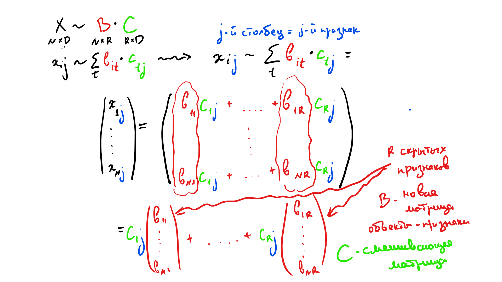{: .center style="width:40vw"}

По сути это одна из самых простых моделей с латентными переменными, в которой исходные признаки выражаются через латентные линейным образом. Если $ R < D $, то мы получаем приближённое описание нашего датасета с помощью меньшего количества признаков. На уровне объектов каждый объект $x_i$ ($D$-мерная строка) приобретает латентное представление $z_i$ ($R$-мерная строка), с которой он связан соотношением $ x_i = z_i \color{green}{C} $. Мы можем представлять, что наши объекты $x_i$ представляют из себя на $D$-мерное облако, а лежат на некоторой $R$-мерной плоскости; переходя к $R$-мерным представлениям $z_i$, мы обнажаем эту структуру.

Точность аппроксимации можно измерять по-разному; наиболее популярной (в силу вычислительной простоты) является норма Фробениуса $$ \| A \|_{fro}^2 = \sum\limits_{i,j} A\_{i j} = \operatorname{tr}(A^TA) $$ --- соответствующую модель называют  анализом главных компонент, или PCA (Principal Component Analysis).

## Понижение размерности признакового пространства

Мы можем захотеть описать наш датасет меньшим чем $D$ количеством признаков (а может быть, и вообще каким-то весьма маленьким). У нас может быть несколько причин для этого, например:

- Признаков очень много, и мы боимся, что обучение на них будет занимать очень много времени или что в процессе обучения нам потребуется слишком много оперативной памяти;

- Мы считаем, что в данных есть шум или что часть признаков связаны соотношением приближённой линейной зависимости --- иными словами, мы уверены, что значительную часть информации можно закодировать меньшим числом признаков

Мы уже обсуждали, что это можно получить, построив приближённое разложение:

<Math block>

$$
\underset{N\times D}{\operatorname{X}} \sim \underset{N\times T}{\operatorname{B}} \cdot \underset{T\times D}{\operatorname{C}}
$$

</Math>

_Математика помогает_. Матрица имеет ранг $T$ тогда и только тогда, когда она представляется в виде
$\underset{N\times S}{\operatorname{B}} \cdot \underset{S\times D}{\operatorname{C}} $ для $S = T$
и не представляется в таком виде для меньших $S$.

Доказывать это мы не будем, но подметим, что  приблизить датасет линейной смесью $T$ признаков --- это то же самое, что приблизить матрицу $X$ матрицей $\hat{X}$ ранга $T$ .

_Качество приближения._ Нам, конечно же, хочется, чтобы приближение было наилучшим --- скажем, в том смысле, чтобы разность $X - BC$ была минимальной в каком-либо смысле. Можно предложить много разных метрик; остановимся на двух:

-  Норма Фробениуса.
  Представим, что матрица $A = (X - BC)$ --- это просто вектор из $N\times D$ чисел,
  который зачем-то записали в виде прямоугольной таблицы. Тогда его норму можно записать
  в виде

  $$
  \|A\|_{fro} = \sqrt{\sum\limits_{i,j}a_{ij}^2} = \mathrm{tr}\left(A^TA\right)
  $$

  Эту норму (а точнее, её квадрат) легко оптимизировать.

- Операторная $l_2$-норма.

  Вычислять её тяжко, а уж оптимизировать вообще непонятно как, зато звучит круто. Идея в том, что отображения можно сравнивать в зависимости от того, как оно действует на векторы: чем больше оно умеет удлинять векторы --- тем оно <<больше>>:

  $$
  \|A\|_2 = \sup \left\{ \frac{\vert Av \vert}{\vert v \vert} \mid v \in\mathbb{R}^D \right\}
  $$

  Поскольку $\frac{\vert A(\lambda v)\vert}{\vert \lambda v \vert} = \frac{\vert Av \vert}{ \vert v \vert}$, достаточно брать супремум только по векторам единичной длины, то есть по единичной сфере. Так как это компакт, непрерывная функция $v\mapsto \vert Av \vert$ достигает на нём своего максимального значения, то есть мы можем переписать

  $$
  \|A\|_2 = \sup \left\{ \vert Av \vert \mid v\in\mathbb{R}^D,\,\vert v \vert = 1 \right\}
  $$

### Смесь объектов

Мы считаем, что каждый из $N$ объектов нашего исходного датасета --- смесь (то есть линейная комбинация) $R$ скрытых объектов:

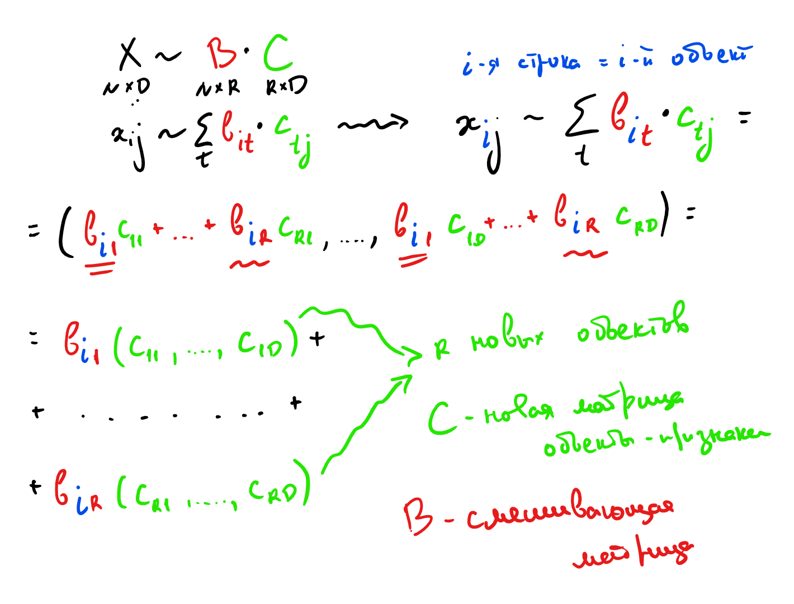{: .center style="width:40vw"}

Такая интерпретация может быть полезна, например, в ситуации, когда объекты --- это записи с каждого из нескольких микрофонов в помещении, признаки --- фреймы, а скрытые объекты --- это голоса отдельных людей.

Также данную модель можно интерпретировать как что-то вроде поиска типичных объектов.

### Отдельные представления для объектов и признаков

Эту интерпретацию лучше всего пояснить на примере. Пусть объекты нашего датасета соответствуют пользователям интернет-магазина, а признаки --- товарам, причём в клетке с индексом $(i,j)$ записана единица, если пользователь интересовался товаром, и ноль --- если нет (или, в более общей ситуации, рейтинги, которые пользователи ставят товарам).

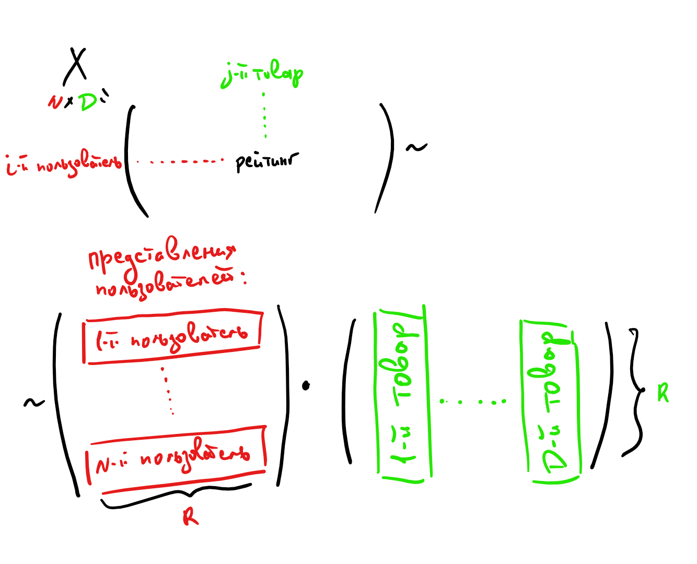{: .center style="width:40vw"}

При перемножении матриц $B$ и $C$ на $(i, j)$-м месте произведении стоит скалярное произведение $i$-й строки $B$ и $j$-го столбца $C$. Таким образом, степень релевантности товара пользователю моделируется скалярным произведением (напрашивается сравнение с косинусным расстоянием) вектора, представляющего $i$-го пользователя, и вектора, представляющего $j$-й товар.

<Math block>

$$
\begin{array}{l}
X_{\color{red}{i} \color{green}{j}}=\color{red}{b_{i 1}} \color{green}{c_{1 j}} + \ldots + \color{red}{b_{i k}} \color{green}{c_{k j}}= \\
= ( \color{red}{\text{i-ый пользователь}}, \color{green}{ \text{j-ый товар} })
\end{array}
$$

</Math>

Заметим ещё, что $R$ координат вектора, ответчающего пользователю, равно как и $R$ координат вектора, отвечающего товару, можно рассматривать как $R$ латентных признаков, которые в идеальном мире являются интерпретируемыми и характеризуют <<сродство>> пользователя и товара с некоторым аспектом бытия:

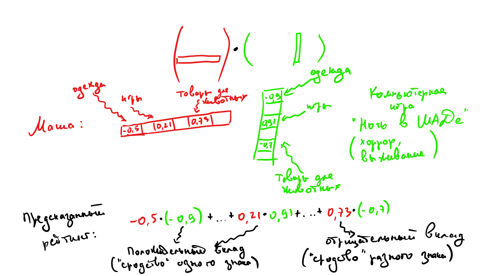{: .center style="width:55vw"}

## Матрицы в разложении: физический смысл

Но матрицы в разложении обычно не абы какие --- так какие из разновидностей могут быть полезны?

Во всех известных вам матричных разложениях к отдельным сомножителям предъявляются определённые требования: симметричность, треугольность, ортогональность --- некоторые из них (скажем, симметричность) не имеют физического смысла ни в одной из указанных выше интерпретаций. Но одно оказывается полезным.

## Ковариация и дисперсия признаков

Для начала --- и это важно ---  предположим, что матрица $X$ центрирована по столбцам, то есть среднее в каждом из столбцов (= признаков) равно нулю (если это не так, то вычтем из каждого столбца его среднее).

Теперь матрица ковариации признаков может быть с точностью до константы оценена как $X^TX$:

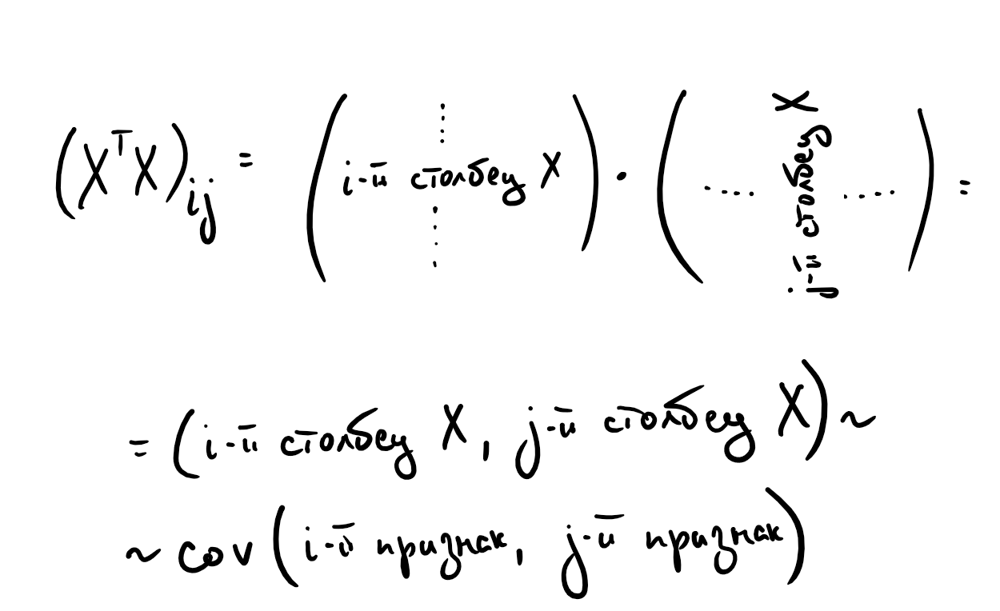{: .center style="width:40vw"}

И мы видим: $i$-й и $j$-й столбцы матрицы $X$ ортогональны тогда и только тогда, когда соответствующие признаки не коррелированы.

При этом $(i,i)$-й диагональный элемент матрицы $X^TX$ --- это дисперсия $i$-го признака.

**Вывод: матрица, ортонормированная по столбцам, отвечает датасету, в котором признаки не коррелированы и имеют единичную дисперсию**

# Сигнулярное разложение

С помощью сингулярного разложения можно перейти от $D$ исходных признаков к потенциально небольшому количеству <<самых важных>> , по-быстрому визуализовать данные или построить простенькую рекомендательную систему. Конечно, глубинные автоэнкодеры, TSNE или DSSM справятся с этим гораздо лучше, но если данных относительно немного или если хочется что-нибудь быстро попробовать <<на коленке>>, старое доброе сингулярное разложение всегда подставит плечо.

## Математическое определение

Сингулярным разложением матрицы $X$ называется разложение

<Math block>

$$
X = \color{orange}{U} \color{green}{\Sigma}\color{magenta}{V^T},
$$

</Math>

где $\color{orange}{U}$ и $\color{magenta}{V}$ --- матрицы, ортонормированные по столбцам, а $\color{green}{\Sigma} = \mathrm{diag}(\color{green}{\sigma_1},\color{green}{\sigma_2},\ldots)$ --- диагональная матрица, у которой $\color{green}{\sigma_1} \geqslant \color{green}{\sigma_2} \geqslant \ldots \geqslant \color{green}{\sigma_R}> \color{green}{\sigma_{R+1}}=0$.

Числа $\color{green}{\sigma_i}$ называются $\color{green}{\text{сингулярными числами}}$, а столбцы $\color{orange}{U}$ и $\color{magenta}{V}$ --- $ \color{orange}{\text{левыми}}$ и $ \color{magenta}{\text{правыми}} $ сингулярными векторами соответственно (их алгебраический смысл станет ясен чуть ниже).

Сингулярное разложение можно записать в полном или в усечённом виде:

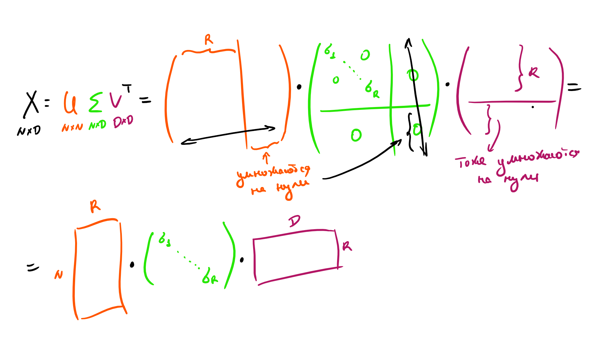{: .center style="width:40vw"}

Пара предостережений по поводу ортогональности по столбцам:

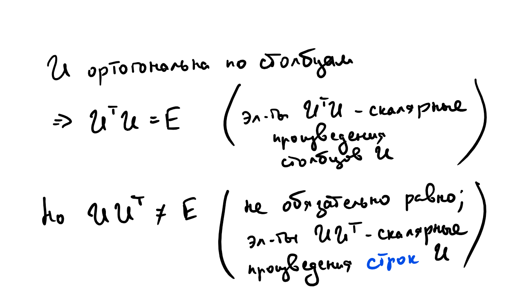{: .center style="width:40vw"}

Ясно, что хранить полное разложение нет смысла: ведь бесполезные, умножающиеся на нули, блоки будут лишь занимать память.

По-английски сингулярное разложение называется SVD (singular value decomposition), и мы будем активно использовать эту аббревиатуру.

_Если вы не любите математику, можете пропустить_. С точки зрения математики сингулярное разложение говорит следующее. Пусть $X$ --- матрица линейного отображения $\varphi:\mathbb{R}^D\longrightarrow\mathbb{R}^N$.

Тогда найдётся ортонормированый базис $\color{magenta}{v_1},\dots,\color{magenta}{v_D}$ в пространстве $\mathbb{R}^D$ и ортонормированый базис $\color{orange}{u_1},\dots,\color{orange}{u_N}$ в пространстве $\mathbb{R}^N$, в которых действие оператора записывается следующим образом:

<Math block>

$$
\begin{align*}
\varphi(\color{magenta}{v_1}) &= \color{green}{\sigma_1}\color{orange}{u_1},\\
\vdots\\
\varphi\color{magenta}{(v_R}) &= \color{green}{\sigma_r}\color{orange}{u_R},\\
\varphi(\color{magenta}{v_{R+1}}) &= 0,\\
\vdots\\
\varphi(\color{magenta}{v_D}) &= 0
\end{align*}
$$

</Math>

(знатоки функционального анализа могут узнать в этом частный случай теоремы Гильберта-Шмидта).

_Сингулярное разложение и операторная l2-норма_.
Можно показать, что $$||A||_2 $$, эта самая операторная l2-норма матрицы, равна $$\sigma_1^2$$ --- квадрату наибольшего сингулярного числа.

_Сингулярное разложение и норма Фробениуса_. Можно показать, что

<Math block>

$$
||A||_{fro} = \sqrt{\sum_i\sigma_i^2}
$$

</Math>

Контрольный вопрос. Единственно ли сингулярное разложение матрицы? Давайте сразу считать, что речь об усечённом разложении.
Есть очень простой источник неоднозначности: если $$\varphi(\color{magenta}{v_i}) = \color{green}{\sigma_1}\color{orange}{u_i}$$, то и $$\varphi(\color{magenta}{-v_i}) = \color{green}{\sigma_1}\color{orange}{(-u_i)}$$; при этом умножение вектора на $$(-1)$$ не попортит ортонормированности базиса. Иными словами, мы можем одновременно поменять знаки $$i$$-х столбцов матриц $$\color{orange}{U}$$ и $$\color{magenta}{V}$$ (без транспонирования!) без ущерба для разложения.

Есть и более тонкие, хотя и весьма частные, ситуации. Можете ли вы, например, указать несколько различных сингулярных разложений матрицы $$E$$? Да-да, для неё сингулярное разложение максимально неоднозначно. Можете ли вы теперь придумать не скалярную матрицу, у которой были бы различные SVD, отличающиеся не только знаками столбцов матриц $$\color{orange}{U}$$ и $$\color{magenta}{V}$$?

## Теоретико-вероятностная интерпретация SVD

Если $$X =\color{orange}{U}\color{green}{\Sigma} \color{magenta}{V^T}$$ (рассмотрим сейчас не усечённое, а полное разложение, в котором матрицы $$\color{orange}{U}$$ и $$\color{magenta}{V}$$ квадратные ортогональные), то

<Math block>

$$
X^TX = \color{magenta}{V}\color{green}{\Sigma^T}\underbrace{\color{orange}{U^T}\cdot \color{orange}{U}}_{=E}\color{green}{\Sigma} \color{magenta}{V^T} =
\color{magenta}{V}\color{green}{\Sigma}^T\color{green}{\Sigma} \color{magenta}{V^T}
$$

</Math>

Отметим, что в рассматриваемой ситуации $$\color{green}{\Sigma}$$ не обязательно квадратная, и поэтому нельзя написать, что $$\color{green}{\Sigma}^T\color{green}{\Sigma}=\color{green}{\Sigma}^2$$; тем не менее, $$\color{green}{\Sigma}^T\color{green}{\Sigma}$$ --- это квадратная матрица с числами $$\color{green}{\sigma_1}^2,\color{green}{\sigma_2}^2,\ldots$$ на диагонали.

_Контрольный вопрос_. Точно так же мы можем вычислить $$XX^T = \color{orange}{U}^T\color{green}{\Sigma}\color{green}{\Sigma}^T\color{orange}{U}$$, где опять-таки $$\color{green}{\Sigma}\color{green}{\Sigma}^T$$ --- квадратная матрица с числами $$\color{green}{\sigma_1}^2,\color{green}{\sigma_2}^2,\ldots$$ на диагонали. И всё бы хорошо, но если $$\color{green}{\Sigma}$$ не квадратная, матрицы $$\color{green}{\Sigma}^T\color{green}{\Sigma}$$ и $$\color{green}{\Sigma}\color{green}{\Sigma}^T$$ имеют разные размеры. Так в чём же подвох?

Как бы то ни было, в (ортогональном!) базисе из (ортогональных!) столбцов $$\color{magenta}{V}$$ матрица $$X^TX$$ приводится к диагональному виду с числами $$\color{green}{\sigma_1}^2,\color{green}{\sigma_2}^2,\ldots$$ на диагонали.

Теперь представим, что наши объекты $$x_1,x_2,\ldots,x_N$$ выбраны из $$D$$-мерного нормального распределения

<Math block>

$$
p(x_i) = \frac{1}{(2\pi)^{D/2}|C|^{1/2}}e^{-\frac12(x_i - \mu)C^{-1}(x_i - \mu)^T}
$$

</Math>

где $$\mu$$ --- вектор средних, а $$C$$ --- матрица ковариации. Это, в частности, значит, что облако точек представляет из себя нечто вроде эллипсоида в $$D$$-мерном пространстве с центром $$\mu$$.

Предположим, что $$\mu = 0$$ (все признаки центрированы); тогда оценкой матрицы ковариации признаков является матрица $$\frac1n X^TX$$. Допустим, что эта оценка точная, тогда разложение $$X^TX = \color{magenta}{V}\color{green}{\Sigma}^T\color{green}{\Sigma} \color{magenta}{V}^T$$ даёт нам аналогичное разложение $$C = \color{magenta}{V}(\frac1n\color{green}{\Sigma}^T\color{green}{\Sigma}) \color{magenta}{V}^T$$. Теперь замена координат $$x = z\color{magenta}{V}^T$$ (с матрицей замены $$\color{magenta}{V}$$ --- то есть переход происходит в базис из столбцов матрицы $$\color{magenta}{V}$$) даёт нам

<Math block>

$$
p(x_i) = \mathrm{const}\cdot \exp\left(-\frac12\cdot\color{red}{x_i}\cdot \color{blue}{C^{-1}}\cdot \color{grey}{x_i^T}\right)
$$

</Math>

Обратите внимание, что $$x_i$$ и $$x_i^T$$ стоят в формуле на непривычных местах, как будто их перепутали, но нет --- просто $$x_i$$ у нас является строкой, а не столбцом.

<Math block>

$$
p(z) = \mathrm{const}\cdot \exp\left(-\frac12\cdot\color{red}{z_i}\underbrace{\color{red}{V^T}\cdot \color{blue}{V}}_{=E}\color{blue}{(n\Sigma^{-1}\Sigma^{-T})}\underbrace{\color{blue}{V^T}\cdot \color{cyan}{V}}_{=E}\color{grey}{z_i^T})\right)=
$$

</Math>

<Math block>

$$
= \mathrm{const}\cdot \exp\left(-\frac{n}2z_i\Sigma^{-1}\Sigma^{-T}z_i^T)\right)=\mathrm{const}\cdot \exp\left(-\frac{n}2\left(\frac1{\sigma_1^2}z_{i1}^2 + \frac1{\sigma_2^2}z_{i2}^2 + \ldots\right)\right)=
$$

</Math>

<Math block>

$$
=p(x'_{i1})\cdot\ldots\cdot p(x'_{iD})
$$

</Math>

Итак, если наши данные взяты из многомерного нормального распределения, после перехода к базису из столбцов $$\color{magenta}{V}$$ новые координаты становятся независимыми; вместе с тем это соответствует переходу к главным осям ковариационной матрицы --- и геометрически столбцы $$\color{magenta}{V}$$ соответствуют главным осям эллипсоида-облака точек.

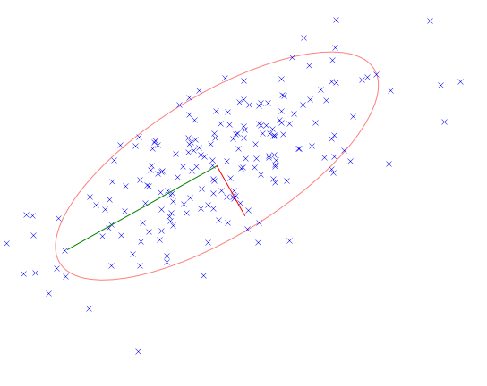

# Использование SVD: латентные признаки

Запишем

<Math block>

$$
\underset{N\times D}{\operatorname{X}} = \underset{N\times R}{\operatorname{U\Sigma}} \cdot \underset{R\times D}{\operatorname{V^T}}
$$

</Math>

и вспомним самую первую интерпретацию матричного разложения.

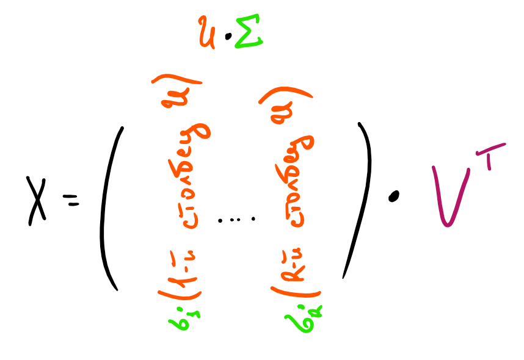{: .center style="width:50vw"}

Столбцы $$U\Sigma$$ ортогональны (так как они пропорциональны столбцам ортогональной по столбцам матрицы $$U$$) --- то есть  латентные признаки не коррелированы. При этом, поскольку длина каждого из столбцов $$U$$ равна 1, длины столбцов $$U\Sigma$$ порпорциональны $$\sigma_i$$ --- а, значит,  латентные признаки упорядочены по невозрастанию дисперсии (ведь с точностью до константы оценка дисперсии признака --- это квадрат длины вектора его значений).

Заметим, что перед применением SVD признаки лучше центрировать, иначе первая компонента будет указывать в сторону центра масс облака точек (зачем нам это?), а остальные вынуждены будут ей быть ортогональны:

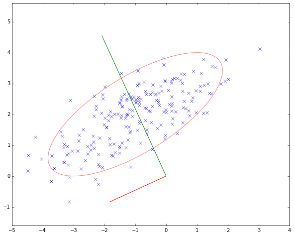

## Понижение размерности признакового пространства

Мы уже обсуждали, что это можно получить, построив приближение ранга $$T$$ или, что то же самое, приближённое разложение

<Math block>

$$
\underset{N\times D}{\operatorname{X}} \sim \underset{N\times T}{\operatorname{B}} \cdot \underset{T\times D}{\operatorname{C}}
$$

</Math>

для некоторого и желательно небольшого $$T$$. И тут SVD приходится более чем кстати.

### Теорема Эккарта-Янга

Наилучшее по норме Фробениуса приближение ранга $$T$$ --- это

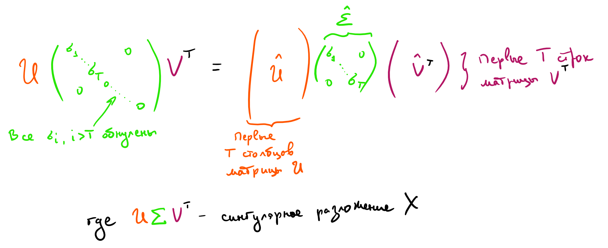

Таким образом, если вы хотите получить $$T$$ <<самых важных>> признаков, то вы можете использовать SVD. Но что это за признаки? Что именно означают эти слова <<самые важные>>? Давайте обратимся к геометрии, которая, как мы помним, тесно связана с теорией вероятностей:

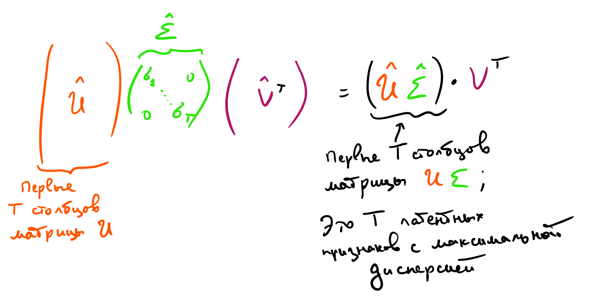

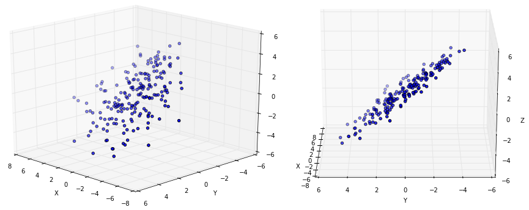

Если применить SVD к датасету, изображённому на последней картинке, и взять два первых латентных признака, то эллипсоид превратится в эллипс; меньшая из полуосей, похожая на шум, будет забыта, останется две бOльших. Видим: самое важное для SVD --- это самое масштабное.

_А правда ли у нас получится хорошее приближение с помощью $$T$$ новых признаков?_ Посчитаем норму разности. Везде ниже $$\color{orange}{U}$$ и $$\color{magenta}{V}$$ --- квадратные ортогональные матрицы; в частности $$\color{green}{\Sigma}$$ не обязательно квадратная матрица размера $$N\times D$$.

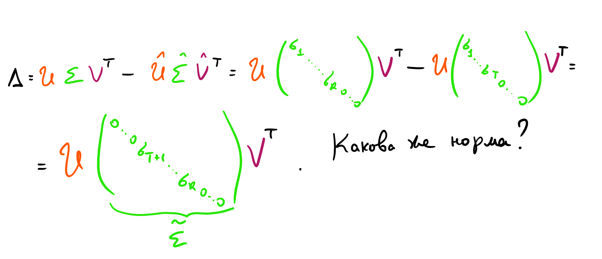

<Math block>

$$
||\Delta||_{fro}^2 = \mathrm{tr}\left((\color{orange}{U}\color{green}{\widetilde{\Sigma}}\color{magenta}{V}^T)^T\color{orange}{U}\color{green}{\widetilde{\Sigma}}\color{magenta}{V}^T\right) =
\mathrm{tr}\left(\color{magenta}{V}\color{green}{\widetilde{\Sigma}}^T\underbrace{\color{orange}{U}^T\color{orange}{U}}_{=E}\color{green}{\widetilde{\Sigma}}\color{magenta}{V}^T\right) =
$$

</Math>

<Math block>

$$
=\mathrm{tr}\left(\color{magenta}{V}\color{green}{\widetilde{\Sigma}}^T\color{green}{\widetilde{\Sigma}}\color{magenta}{V}^T\right) = \mathrm{tr}\left(\color{green}{\widetilde{\Sigma}}^T\color{green}{\widetilde{\Sigma}}\underbrace{\color{magenta}{V}^T\color{magenta}{V}}_{=E}\right) = ||\color{green}{\widetilde{\Sigma}}||^2_{fro} = \color{green}{\sigma_{T+1}}^2 + \ldots + \color{green}{\sigma_{R}}^2
$$

</Math>

Аналогичным образом

<Math block>

$$
||\Delta||_2 = \color{green}{\sigma_{T+1}}
$$

</Math>

потому что умножение на ортогональную матрицу не меняет операторную $$l_2$$-норму. Таким образом, если сингулярные значения убывают достаточно медленно (например, линейно), то мы вряд ли сможем приблизить исходную матрицу матрицей маленького ранга с очень хорошей точностью.

_Как избавиться от иллюзий_.
Сгенерируйте матрицу $$100\times100$$ с помощью _np.random.rand_ или _np.random.randn_. Для какого $$T$$ вы сможете найти матрицу ранга $$T$$, приближающую исходную с относительной точностью $$10^{-6}$$?

К счастью, в реальных датасетах сингулярные значения убывают достаточно быстро или же нам хватает довольно грубого приближения.

### Переход из исходного признакового пространства в новое и обратно

Допустим, мы построили приближённое разложение ранга $T$:

<Math block>

$$
X\sim\color{orange}{\widehat{U}}\color{green}{\widehat{\Sigma}}\color{magenta}{\widehat{V}}^T =
\color{orange}{U}\cdot\underbrace{\color{green}{\begin{pmatrix}
\sigma_1 &\\
 & \ddots & \\
 & & \sigma_T &\\
& & & 0 & \\
& & & & \ddots\end{pmatrix}}}_{=:\color{green}{\Sigma'}}\cdot\color{magenta}{V}^T
$$

</Math>

Матрица $\color{orange}{\widehat{U}}\color{green}{\widehat{\Sigma}}$ --- это первые $T$ столбцов матрицы $\color{orange}{U}\color{green}{\Sigma'}$, и они же первые $T$ столбцов матрицы $\color{orange}{U}\color{green}{\Sigma} = X\cdot\color{magenta}{V}$. Таким образом, для перевода объекта $x_i$ в новое признаковое пространство нужно произвести $x_i\mapsto x_i\cdot\color{magenta}{V}$ и взять первые $T$ столбцов или, что то же самое, $x_i\mapsto x_i\cdot\color{magenta}{V[:,:T]}$.

Теперь пусть задана вектор-строка $z_i$ длины $T$ --- латентное представление, соответствующего некоторому объекту, то есть одна из строк матрицы $\color{orange}{\widehat{U}}\color{green}{\widehat{\Sigma}}$. Тогда точно восстановить исходный $x_i$ мы не сможем: ведь равенство $X\sim\color{orange}{\widehat{U}}\color{green}{\widehat{\Sigma}}\color{magenta}{\widehat{V}}^T$ не точное, но для приближённого восстановления $x_i$ мы должны произвести $z_i\mapsto z_i\cdot \color{magenta}{\widehat{V}}^T = z_i\cdot\color{magenta}{V[:,:T]}^T$. 

# На что не способно сингулярное разложение

Сингулярное разложение умеет находить дающие самый существенный вклад в дисперсию линейные комбинации признаков, притом некоррелированные; в случае нормально распределённых данных эти направления оказываются главными осями эллипсоида, которым является облако данных. К сожалению, эта суперспособность SVD столь же охотно превращается в слабость, ведь:

- Данные не всегда распределены нормально, они могут обладать сложной геометрией, но SVD будет упрямо искать эллипсоид.
- Самое важное не всегда самое масштабное. Забыть привести признаки к одному масштабу --- хороший способ выстрелить себе в ногу при работе с сингулярным разложением.
- Новые признаки не обязаны быть хорошо интерпретируемыми. Линейная комбинация возраста, стажа работы и зарплаты --- это не то, что хотелось бы показывать банковскому регулятору.
- Выбросы почти наверняка усложнят вам жизнь, хотя, возможно, SVD поможет вам их увидеть.

# Практические кейсы

## MNIST и путешествие по латентному пространству

Возьмём большой датасет MNIST, состоящий из чёрно-белых изображений рукописных цифр размера $28\times28$ пикселей (его можно загрузить, к примеру, [отсюда](https://ru-keras.com/datasets)), вытянем каждое из изображений в вектор, получив тем самым матрицу размера $60000\times(28\cdot28)$, и применим к этой матрице SVD. Теперь возьмём первые два латентных признака (то есть первые два столбца матрицы $U\Sigma$) --- получается, что каждая рукописная цифра у нас теперь кодируется вектором из двух чисел. Нарисуем на плоскости точки, соответствующие этим векторам (скажем, по 100 из каждого класса, чтобы хоть что-нибудь было понятно):

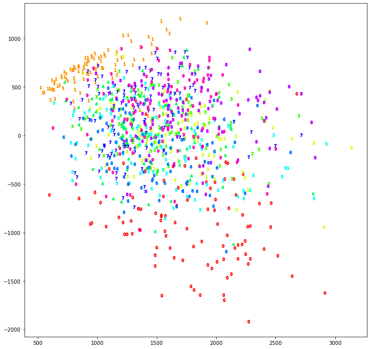{: .center style="width:70vw"}

Что же мы видим? Единицы и нули оказались особенными, то есть уже первые два латентных признака хорошо их различают, правда, с середине какая-то каша. А почему? Да потому, что мы забыли центрировать данные. Давайте перед применением SVD вычтем из каждого признака (то есть из каждого пикселя) его среднее по всем картинкам, а потом нарисуем всё заново:

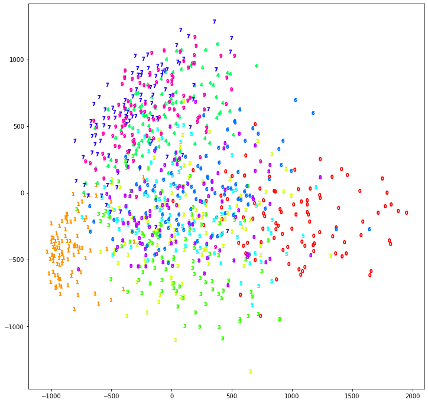{: .center style="width:70vw"}

Теперь стало получше: например, семёрки, девятки и четвёрки сгуппировались вместе с другой стороны от восьмёрок и троек (собственно говоря, это отражает тот факт, что рукописные написания семёрок, девяток и четвёрок могут быть похожи друг на друга, так и человек не сразу отличит --- а вот с тройкой их спутать намного труднее).

Заметим ещё вот что. В $(28\cdot28)$-мерном пространстве наборов пикселей совсем не каждая точка соответствует какой-то рукописной цифре --- то, что может приходить из реального мира, лежит на некоторой хитрой поверхности в этом пространстве (если выражаться корректнее, то на подмногообразии). Если же мы попробуем нарисовать <<изображения>>, лежащие на отрезке, соединяющем два изображения цифр, то получим нечто не слишком интересное:

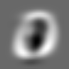{: .center style="width:100px"}

Одно изображение просто наложилось и затем сменило другое --- скучно! Но если мы сделаем то же самое в двумерном пространстве, образованном первыми двумя латентными признаками SVD, то мы будем получать, может быть, не совсем реалистичные изображения цифр, но что-то явно из мира рукописных символов:

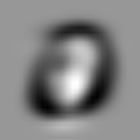{: .center style="width:100px"}

_Контрольный вопрос_. Если $x_1$ --- вектор-строка длины $28\cdot28$, отвечающая первой картинке, $x_2$ --- второй, а $U$, $\Sigma$, $V^T$ --- матрицы из сингулярного разложения, то как получить картинку, соответствующую середине отрезка, соединяющего в пространстве двух первых латентных признаков SVD точки $x_1'$ и $x_2'$, отвечающие этим картинкам?

## Химический состав рек

Посмотрим на небольшой кусок вот [этого датасета](https://data.europa.eu/euodp/en/data/dataset/data_waterbase-rivers-10), который доступен для скачивания нигде (ха-ха), и попробуем что-нибудь понять про химических состав рек европейского союза, а заодно соберём шишки, которые могут попасться при визуализации с помощью SVD.

Конечно, сразу хочется нарисовать все объекты датасета в виде точек на плоскости. Мы знаем, что в этом может помочь SVD --- попробуем же! Центрируем признаки --- и рисуем:

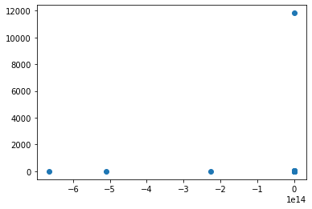{: .center style="width:50vw"}

Ой, что-то пошло не так. Но почему же?! Наверное, надо хотя бы посмотреть на данные...

- Объекты имеют вид GBPKER0059, GB20227, LVV0120100 и так далее --- это коды станций, измеряющих состав воды;

- Признаки имеют вид 1985 BOD5, 1985 Chlorophyll a, 1985 Orthophosphates и так далее --- тут указан год измерения и показатель;

- Посмотрев статистики, убеждаемся, что все показатели неотрицательны (то есть уж точно распределены не нормально --- но может, и так сработает);
  при этом почти все элементы нашей матрицы находятся в пределах 1000, но три значения космически огромны, причём в одном столбце <<2008 Total oxidised nitrogen>> (а строки соответствуют каким-то греческим станциям, с которыми вообще всё странно), и ещё одно тоже очень большое (<<2005 Total organic carbon (TOC)>>) --- вот они-то и дали нам четыре точки на графике, отличных от начала координат.
  Кстати говоря, если космически большие значения, по-видимому, являются результатам поломки, то по поводу четвёртого, не столь злостного, выброса есть подозрение, что это реальные значения. Посмотрев в данные, мы видим, что показатель был измерен на станции Zidlochovice, на реке Srvatka ниже Брно --- а, как говорит нам википедия: _As a result of water pollution by communal sewage, the reservoir suffered from an extensive amount of cyanobacteria for a long time_. Так или иначе, все четыре станции мы уберём, чтобы они не портили нам SVD.
- Один из признаков <<2002 Kjeldahl Nitrogen>> принимает только нулевые значения. Уберём его, чтобы не мешался.

Почистив выбросы в исходных данных, опять центрируем и рисуем:

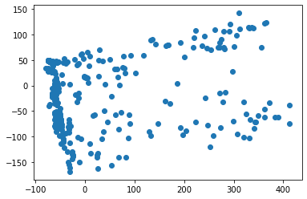{: .center style="width:35vw"}

Уже лучше. Попробуем понять, что за вещества внесли вклад в первые два латентных признака. Как это сделать? Латентные признаки --- это столбцы матрицы $U\Sigma = XV$; линейная алгебра говорит нам, что $i$-й столбец произведения $XV$ --- это линейная комбинация столбцов $X$ с коэффициентами из $i$-го столбца $V$. Находим номера самых больших по модулю координат $V$ --- и оказывается, что первые два латентных признака складываются почти сплошь из насыщения воды кислородом, только за разные годы (первый за более старые, второй за чуть более свежие):

**First latent feature**

| Признак                | элемент $V$ |
| :--------------------- | ----------: |
| 2001 Oxygen saturation |        0.27 |
| 2002 Oxygen saturation |        0.27 |
| 2000 Oxygen saturation |        0.26 |
| 2004 Oxygen saturation |        0.26 |
| $\vdots$               |    $\vdots$ |

**Second latent feature**

| Признак                | элемент $V$ |
| :--------------------- | ----------: |
| 2001 Oxygen saturation |       -0.62 |
| 2002 Oxygen saturation |       -0.49 |
| 2000 Oxygen saturation |       -0.45 |
| 2004 Oxygen saturation |       -0.26 |
| $\vdots$               |    $\vdots$ |

Неужели насыщение кислородом действительно так важно? Нет, просто мы не отмасштабировали признаки. Оказывается, что насыщение кислородом имеет на порядок больший масштаб, чем многое другое, и потому забивает все остальные признаки. Тем не менее, мы можем попробовать сделать вывод и из имеющейся картинки. По оси "у" что-то не очень интересное, а по оси "х" видим большой кластер (напомним, это меньшие значения насыщения воды кислородом в начале 2000-х), содержащий, если проверить, примерно три четверти всех точек, и ещё некоторой размазанный шлейф.

Итак, на многих станциях насыщение воды кислородом в начале 2000-х было примерно в одинаковой степени мало --- проверив глазами, обнаруживаем, что там просто нули. Поскольку вряд ли это так на самом деле, видимо, стоит сделать вывод, что в первой половине 2000-х насыщение кислородом измерялось из рук вон плохо.

Теперь вдобавок к центрированию поделим каждый признак на его стандартное отклонение и снова нарисуем:

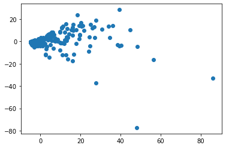

Опять видим тесный кластер. При этом первый латентный признак складывается в основном из Nitrate, pH и Dissolved oxygen за разные годы, все с положительными коэффициентами, а второй --- из Total ammonium, Total phosphorus и Kjeldahl Nitrogen за разные годы, причём с отрицательными коэффициентами. В частности, справа у нас точки с высоким содержанием нитратов и высокой кислотностью. Среди этих точек:

- [Река Тейм](https://en.wikipedia.org/wiki/River_Tame,_West_Midlands), про которую Википедия пишет: _The Tame was once one of Britain's dirtiest rivers._
- Река Кёрёш, про которую тоже можно найти вот такую информацию:
  _For some time the municipal government of Kanjiža (to which the mouth of the river belongs) protests about the extreme pollution of the Kereš's water, as it represents the single largest polluter of the Tisa river_
- Темза (станция немного выше Лондона).

Что ещё можно было бы сделать? Например, мы можем посмотреть распределения признаков и увидеть, что многие из них далеки от нормальных и в целом выиграли бы от логарифмирования --- тогда, возможно, итоговая картинка стала бы красноречивей.

# Использование SVD: разделённые представления и рекомендательная система для бедных

Мы уже обсуждали, что, вообще говоря, любое матричное разложение можно с той или иной степенью успеха использовать для построения рекомендательной системы. Основанные на этом модели называются **моделями латентных факторов** (Latent factor models). В 2006 году SVD-подобный алгоритм даже помог Саймону Фанку (Simon Funk; под этим псевдонимом скрывался Brandyn Webb) занять высокое место на соревновании Netflix Prize.

## Подход на чистом SVD

Вернёмся к примеру из пункта 1.3. Пусть вновь объекты нашего датасета соответствуют пользователям интернет-магазина, а признаки --- товарам, причём в клетке с индексом $(i,j)$ записаны рейтинги $\rho_{ij}$, которые пользователи ставят товарам. На основе этих данных мы хотим порекомендовать некоторому $n$-му пользователю $k$ очередных товаров. Если бы нам были известны $\rho_{nj}$ для всех индексов товаров $j$, задача не стоила бы выеденного яйца: мы бы просто взяли $k$ товаров с максимальными значениями рейтингов. Более того, мы могли бы с помощью матричного разложения построить модель и надеяться, что координаты латентных представлений пользователей и товаров окажутся интерпретируемыми (нет).

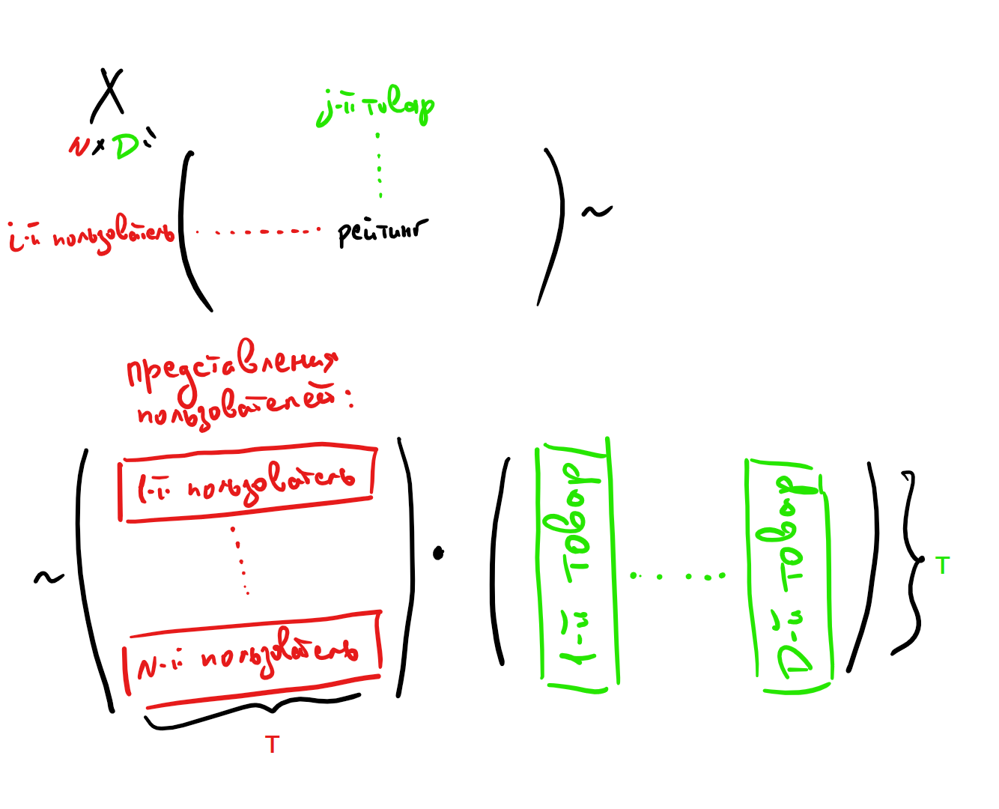{:.center}

А именно, если бы мы знали все $\rho_{nj}$, построить отдельные представления для пользователей и для товаров некоторой (подбираемой; это гиперпараметр модели) длины $T$ мы могли бы с помощью SVD и приближения из теоремы Эккарта-Янга:

<Math block>

$$
X\sim\widehat{X}\widehat{U}\widehat{\Sigma}\widehat{V}^T = \color{red}{\widehat{U}\widehat{\Sigma}^{\frac12}}\cdot
\color{green}{\widehat{\Sigma}^{\frac12}\widehat{V}^T}
$$

</Math>

Но на деле матрица $\left(\rho_{ij}\right)_{i,j}$ обычно разреженная: в ней лишь сравнительно немного известных рейтингов, а в остальных ячейках стоят пропуски. Что же делать?

Наивный вариант --- заменить все пропуски нулями (то есть положить, что если пользователь не ставил рейтинг товару, то он ему вдребезги не интересен, что не всегда правдоподобно) или средними по строке/столбцу, после чего сделать SVD и радоваться жизни. В этой ситуации наша приближённая модель предсказывает рейтинг, выставленный $i$-м пользователем $j$-му товару, как скалярное произведение представлений пользователя и товара --- то есть $i$-й строки матрицы $\color{red}{\widehat{U}\widehat{\Sigma}^{\frac12}}$ и $j$-го столбца матрицы $\color{green}{\widehat{\Sigma}^{\frac12}\widehat{V}^T}$

Теперь  чтобы порекомендовать n-му пользователю k очередных товаров, мы просто берём n-ю строку матрицы $\widehat{X}$ и находим номера её наибольших элементов.

К сожалению, у этого метода есть как минимум две проблемы:

- Пропусков обычно очень много; если их все заменить какими попало значениями, оценка будет очень шумной;
- При таком подходе нет простого способа обновить рекомендации при добавлении новых данных --- SVD придётся переучивать заново.

## Развиваем идею: как побороть разреженность

К счастью, есть и другой путь. Давайте подумаем: чего вообще мы требуем от матриц $\color{red}{B} := \color{red}{\widehat{U}\widehat{\Sigma}^{\frac12}}$ и $\color{green}{C}^T := \color{green}{\widehat{\Sigma}^{\frac12}\widehat{V}^T}$? По сути нам нужны две вещи:

- $\color{red}{B}\cdot\color{green}{C}^T \sim X$;
- Обе матрицы ортогональны по столбцам.

Последнее можно опустить. Ясной пользы для рекомендательной системы от этого нет; да, это давало бы нам некоррелированность латентных признаков, но мы уже видели, что интерпретируемости это не влечёт. Первое же условие удобно сформулировать в терминах векторов латентных представлений пользователей (обозначим их $\color{red}{b_i}$; это строки $\color{red}{B}$) и товаров (обозначим их $\color{green}{c_i}$ --- это строки $\color{green}{C}$). А именно, нам нужно, чтобы \*скалярное произведение $(\color{red}{b_i},\color{green}{c_j})$ было как можно ближе к $\rho_{ij}$ **для всех пар $(i, j)$, для которых $\rho_{ij}$ нам известно\***.

Вот именно! Мы можем просто не обращать внимания на неизвестные значения, оптимизируя только по тем клеткам $X$, для которых нам что-то известно:

<Math block>

$$
\ \color{blue}{\sum_{i,j:\,\rho_{ij} \ne\mbox{NA}}(\rho_{ij} - (\color{red}{b_i},\color{green}{c_j}))^2\longrightarrow \min\limits_{\color{red}{b_i},\color{green}{c_i}}}
$$

</Math>

Но как решить эту оптимизационную задачу? Разумеется, с помощью стохастического градиентного спуска. В базовом варианте мы случайным образом перебираем пары $(i, j)$, для которых $\rho_{ij}$ нам известно, и обновляем координаты векторов $\color{red}{b_i}$ и $\color{green}{c_j}$ следующим образом:

<Math block>

$$
\begin{matrix}
\color{red}{b_{it}} := \color{red}{b_{it}} + \eta\varepsilon_{ij}\color{green}{c_{jt}}\\
\color{green}{c_{jt}} := \color{green}{c_{jt}} + \eta\varepsilon_{ij}\color{red}{b_{it}}
\end{matrix},\ t=1,\ldots,T,\quad\mbox{где $\varepsilon_{ij} = \rho_{ij} - (\color{red}{b_i},\color{green}{c_j})$}
$$

</Math>

где $\eta$ --- гиперпараметр, отвечающий за темп обучения.

Приятное свойство такого подхода: в нём легко добавлять новые товары/пользователей (дообучаем их векторы, заморозив остальные), а также новые оценки $\rho_{ij}$ (добавляем в оптимизируемый функционал и проводим дооптимизацию).

Отметим, что в ходе оптимизации мы попеременно осуществляем градиентный спуск, обновляя то $\color{red}{B}$, то $\color{green}{C}$. Эту идею можно развить следующим образом. Заметим, что при фиксированной матрице $C$ задача минимизации по $B$ выражения

<Math block>

$$
\ \sum_{i,j:\,\rho_{ij} \ne\mbox{NA}}(\rho_{ij} - (b_i,c_j))^2\longrightarrow \min\limits_{b_i,c_i}
$$

</Math>

превращается по сути в обычный метод наименьших квадратов, для которого можно даже выписать <<точное>> решение (а вы можете это сделать?). Точно так же и при фиксированном $B$ легко находится минимум по $C$. Чередуя эти два шага, мы будем сходиться к решению быстрее и надёжнее, чем с помощью SGD. Данный алгоритм носит название Alternating Least Squares (ALS).

## Развиваем идею: как ещё усовершенствовать модель

Можно ввести много дополнительных эвристик и предположений, которые уведут нас совсем далеко от старого доброго SVD. Например:

- Рейтинг не всегда является продуктом чистого взаимодействия пользователя с товаром. Бывают товары, которые сами по себе ужасно популярны (скажем, человек купит туалетную бумагу даже если не очень интересуется товарами для дома) или так ужасны, что даже интересующийся данной <<латентной категорией>> покупатель не станет их высоко оценивать. Это можно промоделировать, добавив к скалярному произведению члены, зависящие только от пользователя и только от товара соответственно:

  $$
  \rho_{ij}\sim \color{red}{\overline{b}_i} +\color{green}{\overline{c}_j} + (\color{red}{b_i},\color{green}{c_j})
  $$

  Тогда наша задача оптимизации примет вид:

  $$
  \ \color{blue}{\sum_{i,j:\,\rho_{ij} \ne\mbox{NA}}(\rho_{ij} - \color{red}{\overline{b}_i} -\color{green}{\overline{c}_j} -  (\color{red}{b_i},\color{green}{c_j}))^2\longrightarrow \min\limits_{\color{red}{b_i},\color{green}{c_i}, \color{red}{\overline{b}_i},\color{green}{\overline{c}_j}}}
  $$

- Можно добавлять регуляризационные члены. Например:

<Math block>

$$
\ \color{blue}{\sum_{i,j:\,\rho_{ij} \ne\mbox{NA}}(\rho_{ij} - (\color{red}{b_i},\color{green}{c_j}))^2 + \lambda\sum_i||\color{red}{b_i}||^2 + \mu\sum_j||\color{green}{c_j}||^2 \longrightarrow \min\limits_{\color{red}{b_i},\color{green}{c_i}}}
$$

</Math>

- Мы можем не игнорировать неизвестные нам элементы матрицы $X$, а присвоить им нулевые значения и ставить более низкие веса соответствующим слагаемым функции потерь:

<Math block>

$$
\ \color{blue}{\sum_{i,j}w(\rho_{ij})(\rho_{ij} - (\color{red}{b_i},\color{green}{c_j}))^2\longrightarrow \min\limits_{\color{red}{b_i},\color{green}{c_i}}}
$$

</Math>

где $w(\rho_{ij})$ маленькое, если $\rho_{ij} = \mbox{NA}$, и большое в противном случае. Это имеет смысл, например, если отсутствие данных в самом деле может быть логично интерпретировать, как отсутствие интереса.

- Можно ввести требования неотрицательности: $\color{red}{b_{it}}\geqslant 0$, $\color{green}{c_{js}}\geqslant0$. Подробнее об этом в главе про неотрицательное матричное разложение.
- Или даже всё это вместе :D

_Контрольный вопрос_. Предположим, что каждый рейтинг $\rho_{ij}$ имеет также временную метку $t_{ij}$. Можете ли вы придумать, как их использовать?

# Вероятностное обличье модели латентных факторов

Вы могли заметить, что задача

<Math block>

$$
\ \sum_{i,j:\,\rho_{ij} \ne\mbox{NA}}(\rho_{ij} - (\color{red}{b_i},\color{green}{c_j}))^2\longrightarrow \min\limits_{\color{red}{b_i},\color{green}{c_i}}
$$

</Math>

подозрительно напоминает задачу наименьших квадратов, и неспроста. В базовой формулировке мы предполагаем, что

<Math block>

$$
\color{blue}{\rho_{ij} = (\color{red}{b_i},\color{green}{c_j}) + \xi_{ij},\quad\mbox{где $\xi_{ij}\sim\mathcal{N}(0,\sigma^2)$ - нормальный шум}}
$$

</Math>

Иными словами,

<Math block>

$$
\color{blue}{\rho_{ij} \sim\mathcal{N}\left((\color{red}{b_i},\color{green}{c_j}), \sigma^2\right)}
$$

</Math>

По крайней мере, те из них, которые нам известны. Нахождение $\color{red}{b_i}$ и $\color{green}{c_j}$ методом максимального правдоподобия как раз и приводит к описанной выше оптимизационной задаче.

Как обычно, мы можем добавить априорную информацию о распределении латентных векторов $\color{red}{b_i}$ и $\color{green}{c_j}$. Например, такую:

<Math block>

$$
\color{red}{b_i}\sim\mathcal{N}(0, \sigma_bE),\qquad\color{green}{c_j}\sim\mathcal{N}(0, \sigma_cE)
$$

</Math>

Расписывая логарифм правдоподобия

<Math block>

$$
p(\rho;\color{red}{b},\color{green}{c}) = p(\rho|\color{red}{b},\color{green}{c})p(\color{red}{b})p(\color{green}{c})
$$

</Math>

и убирая константные члены, которые содержат только сигмы, приводим задачу максимизации логарифма правдоподобия к виду

<Math block>

$$
-\frac1{2\sigma^2}\sum_{i,j:\,\rho_{ij} \ne\mbox{NA}}(\rho_{ij} - (\color{red}{b_i},\color{green}{c_j}))^2 - \frac1{2\sigma^2_1}\sum_i||\color{red}{b_i}||^2 - \frac1{2\sigma_2^2}\sum_j||\color{green}{c_j}||^2\longrightarrow \max\limits_{\color{red}{b_i},\color{green}{c_i}}
$$

</Math>

вполне объясняющему, почему в предыдущем пункте у нас могла появляться L2-регуляризация.

# Анализ независимых компонент (ICA)

ICA изначально был придуман для задачи разделения сигналов (blind source separation). Рассмотрим [пример из sklearn](https://scikit-learn.org/stable/auto_examples/decomposition/plot_ica_blind_source_separation.html#sphx-glr-auto-examples-decomposition-plot-ica-blind-source-separation-py)

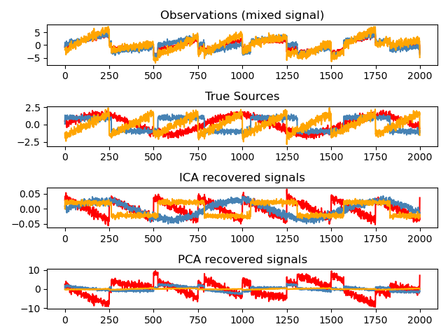

Изначально были три сигнала (красный, рыжий и синий на второй сверху картинке), их смешали, получив три линейных комбинации (на верхней картинке). Теперь попробуем их разделить. Первая мысль, которая нам приходит в голову: воспользуемся SVD (проинтерпретировав моменты времени как объекты, а сигналы из смеси как признаки --- то есть взяв матрицу $2000\times3$)! Но на нижней картинке мы видим результат, который не радует, но не радует ожидаемо, и вот почему:

- В первый латентный признак SVD старается собрать максимально возможную дисперсию --- мы видим, что красный график на нижней картинке действительно ловит самые значительные колебания сигналов из смеси; при этом в третий (рыжий) сигнал уже попадает более или менее случайный шум.
- Если посмотреть на значения исходных сигналов, то они распределены не нормально (распределения значений синего и красного имеют две моды, а у рыжего близко к равномерному), а мы помним, что SVD плохо приспособлено к работе с не гауссовскими данными.

Анализ независимых компонент (ICA) состоит в аппроксимации
$x_i\sim z_iV^T$ наблюдаемых признаков линейной смесью латентных, которые являются
**независимыми** как случайные величины.

_Замечание_. Оригинальная формулировка несколько другая: изначально ICA --- это аппроксимация наблюдаемых сигналов линейной смесью некоторого числа независимых сигналов, то есть речь шла о смеси объектов. Описываемые далее методы можно точно также использовать и для разделения смеси объектов, конечно.

Важно, что в данном случае предъявляется требование **независимости**, а не просто **некоррелированности** --- более сильное, впрочем, труднодостижимое и столь же трудно проверяемое.

## Как построить ICA? Путешествие в мир удивительных эвристик

Мы будем излагать алгоритм FastICA по [статье его создателей](https://www.cs.helsinki.fi/u/ahyvarin/papers/TNN99new.pdf), она же реализована в библиотеке sklearn; в статье вас ждёт гораздо больше подробностей и тонкостей реализации.

Алгоритм базируется на следующем эвристическом соображении: линейная комбинация нескольких независимых негауссовских величин в большей степени гауссовская, чем сами эти величины  --- довольно смелый вывод из Центральной предельной теоремы. Таким образом, мы будем искать линейную комбинацию исходных признаков, которая была бы в наименьшей степени гауссовской --- это и будет первая из независимых компонент. Но как померить близость к нормальности?

Пусть $z$ --- некоторая (одномерная) случайная величина с плотностью $p(z)$. Рассмотрим её энтропию

<Math block>

$$
H(z) = -\int p(t)\log{p(t)}dt
$$

</Math>

Имеет место теорема: гауссовская случайная величина имеет максимальную энтропию среди всех случайных величин с заданной дисперсией. Рассмотрим теперь

<Math block>

$$
J(z) = H(z_{gauss}) - H(z)
$$

</Math>

где $z_{gauss}$ --- гауссовская случайная величина с той же дисперсией, что и у $z$. Величина $J(z)$ всегда неотрицательна и равна нулю в том случае, если $z$ гауссовская. Решая задачу

<Math block>

$$
J(Xw)\longrightarrow\max\limits_{w}
$$

</Math>

мы могли бы найти самую негауссовскую линейную комбинацию наших признаков. Проблема в том, что $J(z)$ трудно посчитать. Авторы статьи предлагают использовать приближение

<Math block>

$$
J(z)\sim\left(\mathbb{E}G(z) - \mathbb{E}G(w)\right)^2,
$$

</Math>

где $w\sim\mathcal{N}(0,1)$, а $G$ неквадратичная функция (в статье предлагаются конкретные варианты). Последующие независимые компоненты можно искать в ортогональном подпространстве (всё-таки они должны быть и некоррелированными).

## Подготовка данных для ICA

Перед тем, как строить разложение нужно центрировать данные (вычесть из признаков их средние) и убедиться, что ковариационная матрица признаков является единичной.

{' '}

  

    *Контрольный вопрос*: как добиться последнего с помощью линейной замены?
  

  *Ответ*. При линейной замене $x = Cx'$ матрица ковариации меняется, как $\Sigma'
  = C^T\Sigma C$. Осталось вспомнить, что, поскольку матрица ковариации симметричная
  и положительно определённая, существует линейная замена, для которой $C^T\Sigma
  C = E$. Например, в качестве $C$ можно взять (симметричный положительно определённый)
  квадратный корень из $\Sigma^{-1}$.

 

# Неотрицательное матричное разложение (NMF)

## Мотивация: тематическое моделирование

Допустим, что у нас есть датасет, в котором объекты --- тексты, признаки --- токены (например, слова), а на $(i,j)$-м месте написана частота встречаемости $j$-го токена в $i$-м тексте (то есть $\frac{n_{ij}}{n_j}$, где $n_{ij}$ --- сколько раз $i$-й токен встретился в $j$-м документе, а $n_j$ --- общее число токенов в этом документе).

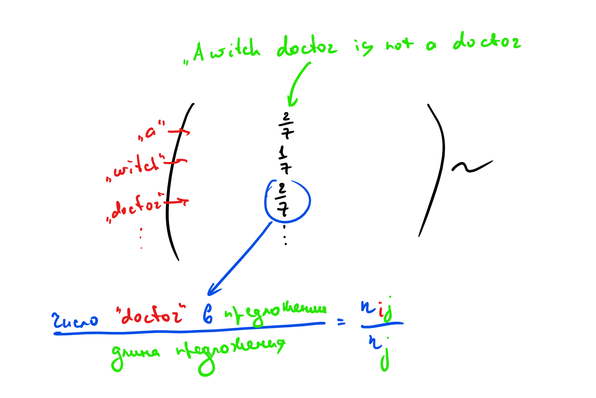{:.center}

Приблизим нашу матрицу произведением

<Math block>

$$
\underset{N\times D}{\operatorname{X}} \sim \underset{N\times R}{\operatorname{B}} \cdot \underset{R\times D}{\operatorname{C}}
$$

</Math>

Одна из возможных интерпретаций такова. Есть $D$ тем:

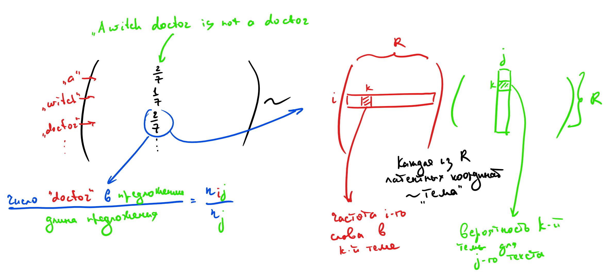{:.center}

За этим стоит вполне ясная вероятностная модель:

<Math block>

$$
p(word\mid document)\sim\sum_{theme}p(word\mid theme)\cdot p(theme\mid document)
$$

</Math>

Вопрос в том, как получить такое разложение. Конечно, чисто технически можно использовать SVD. Но тогда элементы матриц разложения вряд ли будут иметь вероятностный смысл: они же даже не обязаны быть неотрицательными. С другой стороны, если потребовать, чтобы все элементы $\color{red}{B}$ и $\color{green}{C}$ были неотрицательными, ситуация исправится.

## Определение NMF

Неотрицательное матричное разложение неотрицательной
матрицы $X$ --- это произведение $BC$ матриц с неотрицательным элементами, наилучшим
образом приближающее $X$ по норме Фробениуса

<Math block>

$$
||X - BC||^2_{fro}\longrightarrow\min\limits_{\begin{smallmatrix}B, C\\b_{ij}, c_{kl}\geqslant0\,\forall i,j,k,l\end{smallmatrix}}
$$

</Math>

## Alternating Least Squares (ALS)

ALS --- один из популярных методов для решения факторизационных задач. Несмотря на то, что оптимизационная задача в целом не является выпуклой, по отдельности задача поиска каждого из сомножителей является выпуклой и может решаться с помощью привычных нам методов. Таким образом, мы можем чередовать поиск $B$ при фиксированном $C$ и поиск $C$ при фиксированном $B$, итеративно сходясь к итоговому решению:

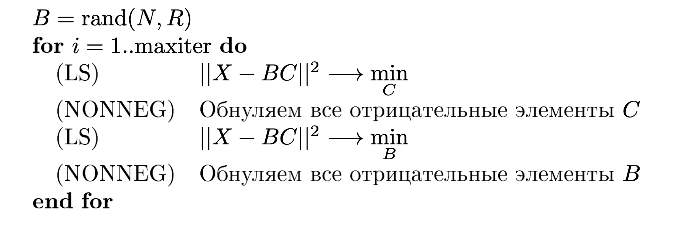{:.center}

Заметим, что из-за насильного обнуления элементов будут получаться разреженные матрицы.

Разумеется, можно рассматривать и более сложные функционалы, прибавляя к $\Vert X - BC\Vert^2$ различные регуляризационные члены, скажем, поощряющие большую разреженность матриц $B$ и $C$.
