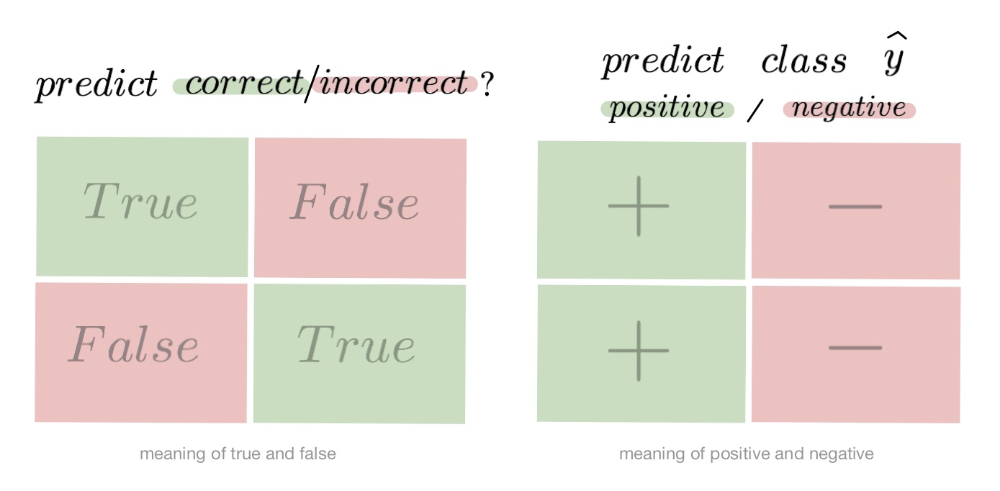

- Этот список будет заменен оглавлением, за вычетом заголовка "Contents",
  к которому добавлен класс `no_toc`.
  {:toc}

> "Гораздо легче что-то измерить, чем понять, что именно вы измеряете" - Джон Уильям Салливан

Задачи машинного обучения с учителем как правило состоят в восстановлении зависимости между парами (признаковое описание, целевая переменная) по данным, доступным нам для анализа. Алгоритмы машинного обучения (learning algorithm), со многими из которых вы уже успели познакомиться, позволяют построить модель, аппроксимирующую эту зависимость. Но как понять, насколько качественной получилась аппроксимация?

Почти наверняка наша модель будет ошибаться на некоторых объектах: будь она даже идеальной, шум или выбросы в тестовых данных всё испортят. При этом разные модели будут ошибаться на разных объектах и в разной степени. Задача специалиста по машинному обучению – подобрать подходящий критерий, который позволит сравнивать различные модели.

Перед чтением этой главы мы настоятельно рекомендуем вам прочитать про [кросс-валидацию](../cross_validation/intro), и напоминаем вам, что качество модели нужно оценивать на отложенной выборке.

# Выбор метрик в реальных задачах

Возможно, вы уже участвовали в соревнованиях по анализу данных. На таких соревнованиях **метрику (критерий качества модели)** организатор выбирает за вас, и она, как правило, довольно понятным образом связана с результатами предсказаний. Но на практике всё бывает намного сложнее.

Например, мы хотим:

- решить, сколько коробок с бананами нужно завтра привезти в конкретный магазин, чтобы минимизировать количество товара, который не будет выкуплен и минимизировать ситуацию, когда покупатель к концу дня не находит желаемый продукт на полке;
- увеличить счастье пользователя от работы с нашим сервисом, чтобы он стал лояльным и обеспечивал тем самым стабильный прогнозируемый доход;
- решить, нужно ли направить человека на дополнительное обследование.

В каждом конкретном случае может возникать целая иерархия метрик. Представим, например, что речь идёт о стриминговом музыкальном сервисе, пользователей которого мы решили порадовать сгенерированными самодельной нейросетью треками – не защищёнными авторским правом, а потому совершенно бесплатными. Иерархия метрик могла бы иметь такой вид:

1. самый верхний уровень: будущий доход сервиса – невозможно измерить в моменте, сложным образом зависит от совокупности всех наших усилий;
2. медианная длина сессии, возможно служащая оценкой радости пользователей, которая, как мы надеемся, повлияет на их желание продолжать платить за подписку – её нам придётся измерять в продакшене, ведь нас интересует реакция настоящих пользователей на новшество;
3. доля удовлетворённых качеством сгенерированной музыки асессоров, на которых мы потестируем её до того, как выставить на суд пользователей;
4. функция потерь, на которую мы будем обучать генеративную сеть.

На этом примере мы можем заметить сразу несколько общих закономерностей. Во-первых, метрики бывают offline- и online- (оффлайновыми и онлайновыми). Online метрики вычисляются по данным, собираемым с работающей системы (например, медианная длина сессии). Offline метрики могут быть измерены до введения модели в эксплуатацию, например, по историческим данным или с привлечением специальных людей, асессоров. Последнее часто применяется, когда метрикой является реакция живого человека: скажем, так поступают поисковые компании, которые предлагают людям оценить качество ранжирования экспериментальной системы еще до того, как рядовые пользователи увидят эти результаты в обычном порядке. На самом же нижнем этаже иерархии лежат оптимизируемые в ходе обучения функции потерь.

В данном разделе нас будут интересовать offline метрики, которые могут быть измерены без привлечения людей.

# Функция потерь $\neq$ метрика качества

Как мы узнали ранее, методы обучения реализуют разные подходы к обучению:

- обучение на основе прироста информации (как в деревьях решений)
- обучение на основе сходства (как в методах ближайших соседей)
- обучение на основе вероятностной модели данных (например, максимизацией правдоподобия)
- обучение на основе ошибок (минимизация эмпирического риска)

И в рамках обучения на основе минимизации ошибок мы уже отвечали на вопрос: как можно штрафовать модель за предсказание на обучающем объекте.

Во время сведения задачи о построении решающего правила к задаче численной оптимизации, мы вводили понятие функции потерь и, обычно, объявляли целевой функцией сумму потерь от предсказаний на всех объектах обучающей выборке.

Важно понимать разницу между функцией потерь и метрикой качества. Её можно сформулировать следующим образом:

- Функция потерь возникает в тот момент, когда мы **сводим задачу построения модели к задаче оптимизации**. Обычно требуется, чтобы она обладала хорошими свойствами (например, дифференцируемостью).

- Метрика – **внешний, объективный критерий качества**, обычно зависящий не от параметров модели, а только от предсказанных меток.

В некоторых случаях метрика может совпадать с функцией потерь. Например, в задаче регрессии MSE играет роль как функции потерь, так и метрики. Но, скажем, в задаче бинарной классификации они почти всегда различаются: в качестве функции потерь может выступать кросс-энтропия, а в качестве метрики – число верно угаданных меток (accuracy). Отметим, что в последнем примере у них различные аргументы: на вход кросс-энтропии нужно подавать логиты, а на вход accuracy – предсказанные метки (то есть по сути argmax логитов).

# Бинарная классификация: метки классов

Перейдём к обзору метрик и начнём с самой простой разновидности классификации – бинарной, а затем постепенно будем наращивать сложность.

Напомним постановку задачи бинарной классификации: нам нужно по обучающей выборке $\\{(x_i, y_i)\\}_{i=1}^N$, где $y_i\in\\{0, 1\\}$ построить модель, которая по объекту $x$ предсказывает метку класса $f(x)\in\{0, 1\}$.

Первым критерием качества, который приходит в голову, является accuracy – доля объектов, для которых мы правильно предсказали класс:

$$
\text{Accuracy}(y, y^{pred}) = \frac{1}{N} \sum\_{i=1}^N [y_i \neq f(x_i)]
$$

Или же сопряженная ей метрика -- доля ошибочных классификаций:

$$
\text{ErrorRate} = 1 - \text{Accuracy}
$$

Познакомившись чуть внимательнее с этой метрикой, можно заметить, что у неё есть несколько недостатков:

- она не учитывает дисбаланс классов. Например, в задаче диагностики редких заболеваний классификатор, предсказывающий всем пациентам отсутствие болезни будет иметь достаточно высокую accuracy просто потому, что больных людей в выборке намного меньше;
- она также не учитывает цену ошибки на объектах разных классов. Для примера снова можно привести задачу медицинской диагностики: если ошибочный положительный диагноз для здорового больного обернётся лишь ещё одним обследованием, то ошибочно отрицательный вердикт может повлечь роковые последствия.

## Confusion matrix (матрица ошибок)

Исторически задача бинарной классификации –- это задача об обнаружении чего-то редкого в большом потоке объектов, например, поиск человека, больного туберкулёзом, по флюорографии. Или задача признания пятна на экране приёмника радиолакационной станции бомбардировщиком, представляющем угрозу охраняемому объекту (в противовес стае гусей).

Поэтому класс, который представляет для нас интерес, называется "положительным", а оставшийся -- "отрицательным".

Заметим, что для каждого объекта в выборке возможно 4 ситуации:

- мы предсказали **положительную** метку и **угадали**. Будет относить такие объекты к **True Positive** группе (true -- потому что предсказали мы правильно, а positive -- потому что предсказали положительную метку);
- мы предсказали **положительную** метку, но **ошиблись** в своём предсказании -- False Positive (false, потому что предсказание было неправильным);
- мы предсказали **отрицательную** метку и **угадали** -- True Negative;
- и наконец, мы предсказали **отрицательную** метку, но **ошиблись** -- False Negative.
  Для удобства все эти 4 числа изображают в виде таблицы, которую называют Confusion matrix (матрицей ошибок):

{:.center style="width:40vw"}

Не волнуйтесь, если первое время эти обозначения будут сводить вас с ума (будем откровенны, даже профи со стажем в них порой путаются), однако логика за ними достаточно простая: первая часть названия группы показывает угадали ли мы с классом, а вторая -- какой класс мы предсказали.

{:.center style="width:40vw"}

**Пример**

Попробуем воспользоваться введёнными метриками в боевом примере: сравним работу нескольких моделей классификации на [Breast cancer wisconsin (diagnostic) dataset](<https://archive.ics.uci.edu/ml/datasets/Breast+Cancer+Wisconsin+(Diagnostic)>).

Объектами выборки являются фотографии биопсии грудных опухолей. С их помощью было сформировано признаковое описание, которое заключается в характеристиках ядер клеток (таких как радиус ядра, его текстура, симметричность). Положительным классом в такой постановке будут злокачественные опухоли, а отрицательным -- доброкачественные.

**Модель 1. Константное предсказание.**

Решение задачи начнём с самого простого классификатора, который выдаёт на каждом объекте константное предсказание -- самый часто встречающийся класс.

<details>
  <summary markdown="span">
    Зачем вообще замерять качество на такой модели?
  </summary>
  При разработке модели машинного обучения для проекта всегда желательно иметь некоторую
  baseline модель. Так нам будет легче проконтролировать, что наша более сложная
  модель действительно дает нам прирост качества.
</details>
<br />

```python
from sklearn.datasets
import load_breast_cancer
the_data = load_breast_cancer()

# 0 -- "доброкачественный"
# 1 -- "злокачественный"
relabeled_target = 1 - the_data["target"]

from sklearn.model_selection import train_test_split
X = the_data["data"]
y = relabeled_target
X_train, X_test, y_train, y_test = train_test_split(X, y, random_state=0)

from sklearn.dummy import DummyClassifier
dc_mf = DummyClassifier(strategy="most_frequent")
dc_mf.fit(X_train, y_train)

from sklearn.metrics import confusion_matrix
y_true = y_test y_pred = dc_mf.predict(X_test)
dc_mf_tn, dc_mf_fp, dc_mf_fn, dc_mf_tp = confusion_matrix(y_true, y_pred, labels = [0, 1]).ravel()
```

|                  | Прогнозируемый класс + | Прогнозируемый класс - |
| ---------------- | ---------------------- | ---------------------- |
| Истинный класс + | TP = 0                 | FN = 53                |
| Истинный класс - | FP = 0                 | TN = 90                |

Обучающие данные таковы, что наш dummy-классификатор все объекты записывает в отрицательный класс, то есть признаёт все опухоли доброкачественными. Такой наивный подход позволяет нам получить минимальный штраф за FP (действительно, нельзя ошибиться в предсказании, если положительный класс вообще не предсказывается), но и максимальный штраф за FN (в эту группу попадут все злокачественные опухоли).

**Модель 2. Случайный лес.**

Настало время воспользоваться всем арсеналом моделей машинного обучения и начнём мы со случайного леса.

```python
from sklearn.ensemble import RandomForestClassifier
rfc = RandomForestClassifier()
rfc.fit(X_train, y_train)
y_true = y_test
y_pred = rfc.predict(X_test)
rfc_tn, rfc_fp, rfc_fn, rfc_tp = confusion_matrix(y_true, y_pred, labels = [0, 1]).ravel()
```

|                  | Прогнозируемый класс + | Прогнозируемый класс - |
| ---------------- | ---------------------- | ---------------------- |
| Истинный класс + | TP = 52                | FN = 1                 |
| Истинный класс - | FP = 4                 | TN = 86                |

Можно сказать, что этот классификатор чему-то научился, т.к. главная диагональ матрицы стала содержать все объекты из отложенной выборки, за исключением 4 + 1 = 5 объектов (сравните с 0 + 53 объектами dummy-классификатора, все опухоли объявляющего доброкачественными).

Отметим, что вычисляя долю недиагональных элементов, мы приходим к метрике ErrorRate, о которой мы говорили в самом начале:

$$ErrorRate = \frac{FP + FN}{ TP + TN + FP + FN}$$

тогда как доля объектов, попавших на главную диагональ -- это как раз-таки accuracy:

$$Accuracy = \frac{TP + TN}{ TP + TN + FP + FN}$$

**Модель 3. Метод опорных векторов.**

Давайте построим еще один классификатор на основе линейного метода опорных векторов.

_Не забудьте привести признаки к единому масштабу, иначе численный алгоритм не сойдется к решению и мы получим гораздо более плохо работающее решающее правило. Попробуйте проделать это упражнение._

```python
from sklearn.svm import LinearSVC
from sklearn.preprocessing import StandardScaler
ss = StandardScaler() ss.fit(X_train)
scaled_linsvc = LinearSVC(C=0.01,random_state=42)
scaled_linsvc.fit(ss.transform(X_train), y_train)
y_true = y_test
y_pred = scaled_linsvc.predict(ss.transform(X_test))
tn, fp, fn, tp = confusion_matrix(y_true, y_pred, labels = [0, 1]).ravel()
```

|                  | Прогнозируемый класс + | Прогнозируемый класс - |
| ---------------- | ---------------------- | ---------------------- |
| Истинный класс + | TP = 50                | FN = 3                 |
| Истинный класс - | FP = 1                 | TN = 89                |

**Сравним результаты**
Легко заметить, что каждая из двух моделей лучше классификатора-пустышки, однако давайте попробуем сравнить их между собой. С точки зрения ErrorRate модели практически одинаковы: 5/143 для леса против 4/143 для SVM.

Посмотрим на структуру ошибок чуть более внимательно: лес -- (FP = 4, FN = 1), SVM -- (FP = 1, FN = 3). Какая из моделей предпочтительнее?

_Замечание: Мы сравниваем несколько классификаторов на основании их предсказаний на отложенной выборке. Насколько ошибки данных классификаторов зависят от разбиения исходного набора данных? Иногда в процессе оценки качества мы будем получать модели, чьи показатели эффективности будут статистически неразличимыми._

Пусть мы учли предыдущее замечание и эти модели действительно статистически значимо ошибаются в разную сторону. Мы встретились с очевидной вещью: на матрицах нет отношения порядка. Когда мы сравнивали dummy-классификатор и случайный лес с помощью Accuracy, мы всю сложную структуру ошибок свели к одному числу, т.к. на вещественных числах отношение порядка есть. Сводить оценку модели к одному числу очень удобно, однако не стоит забывать, что у вашей модели есть много аспектов качества.

Что же всё-таки важнее уменьшить: FP или FN? Вернёмся к задаче: FP -- доля доброкачественных опухолей, которым ошибочно присваивается метка злокачественной, а FN -- доля злокачественных опухолей, которые классификатор пропускает. В такой постановке становится понятно, что при сравнении выиграет модель с меньшим FN (то есть лес в нашем примере), ведь каждая не обнаруженная опухоль может стоить человеческой жизни.

Рассмотрим теперь другую задачу: по данным о погоде предсказать, будет ли успешным запуск спутника. FN в такой постановке –- это ошибочное предсказание неуспеха, то есть не более, чем упущенный шанс (если вас, конечно не уволят за срыв сроков). С FP всё серьёзней: если вы предскажете удачный запуск спутника, а на деле он потерпит крушение из-за погодных условий, то ваши потери будут в разы существеннее.

Итак, из примеров мы видим, что в текущем виде введенная нами **доля ошибочных классификаций** не даст нам возможности учесть неравную важность FP и FN. Поэтому введем две новые метрики: точность и полноту.

## Точность и полнота

Accuracy - это метрика, которая характеризует качество модели, агрегированное по всем классам. Это полезно, когда классы для нас имеют одинаковое значение. В случае, если это не так, accuracy может быть обманчивой.

Рассмотрим ситуацию, когда положительный класс это событие редкое. Возьмем в качестве примера поисковую систему - в нашем хранилище хранятся миллиарды документов, а релевантных к конкретному поисковому запросу на несколько порядков меньше.

Пусть мы хотим решить задачу бинарной классификации "документ d релевантен по запросу q". Благодаря большому дисбалансу, Accuracy dummy-классификатора, объявляющего все документы нерелевантными, будет близка к единице. Напомним, что $\text{Accuracy} = \frac{TP + TN}{TP + TN + FP + FN}$, и в нашем случае высокое значение метрики будет обеспечено членом TN, в то время для пользователей более важен высокий TP.

Поэтому в случае ассиметрии классов, можно использовать метрики, которые не учитывают TN и ориентируются на TP.

Если мы рассмотрим долю правильно предсказанных положительных объектов среди всех объектов, предсказанных положительным классом, то мы получим метрику, которая называется **точностью (precision)**

$$
\text{Precision} = \frac{TP}{TP + FP}
$$

Интуитивно метрика показывает долю релевантных документов среди всех найденных классификатором. Чем меньше ложноположительных срабатываний будет допускать модель, тем больше будет её Precision.

Если же мы рассмотрим долю правильно найденных положительных объектов среди всех объектов положительного класса, то мы получим метрику, которая называется **полнотой (recall)**

$$
\text{Recall} = \frac{TP}{TP + FN}
$$

Интуитивно метрика показывает долю найденных документов из всех релевантных. Чем меньше ложно отрицательных срабатываний, тем выше recall модели.

Например, в задаче предсказания злокачественности опухоли точность показывает, сколько из определённых нами как злокачественные опухолей действительно являются злокачественными, а полнота -- какую долю злокачественных опухолей нам удалось выявить.

Хорошее понимание происходящего даёт следующая картинка:
{: .center}
([источник картинки](https://en.wikipedia.org/wiki/Precision_and_recall))

## F1-мера

Как мы уже отмечали ранее, модели очень удобно сравнивать, когда их качество выражено одним числом. В случае пары Precision-Recall существует популярный способ скомпоновать их в одну метрику - взять их среднее гармоническое.
Данный показатель эффективности исторически носит название **F1-меры (F1-measure)**.

$$
F_1 = \frac{2}{\frac{1}{Recall} + \frac{1}{Precision}} = 2 \frac{Recall \cdot Precision }{Recall + Precision} = \frac
{TP} {TP + \frac{FP + FN}{2}}
$$

Стоит иметь в виду, что F1-мера предполагает одинаковую важность Precision и Recall, если одна из этих метрик для вас приоритетнее, то можно воспользоваться $F_{\beta}$ мерой:

$$
F_{\beta} = (\beta^2 + 1) \frac{Recall \cdot Precision }{Recall + \beta^2Precision}
$$

&nbsp;

# Бинарная классификация: вероятности классов

Многие модели бинарной классификации устроены так, что класс объекта получается бинаризацией выхода классификатора по некоторому фиксированному порогу:

$$
f\left(x ; w, w_{0}\right)=\left[g(x, w) > w_{0}\right];
$$

Например, модель логистической регрессии возвращает оценку вероятности принадлежности примера к положительному классу. Другие модели бинарной классификации обычно возвращают произвольные вещественные значения, но существуют техники, называемые [калибровкой классификатора](./prob_ML/intro#как-оценить-вероятности), которые позволяют преобразовать предсказания в более или менее корректную оценку вероятности принадлежности к положительному классу.

Как оценить качество предсказываемых вероятностей, если именно они являются нашей конечной целью? Общепринятой мерой является логистическая функция потерь, которую мы изучали раньше, когда говорили об устройстве некоторых методов классификации (например уже упоминавшейся логистической регрессии).

Если же нашей целью является построение прогноза в терминах метки класса, то нам нужно учесть, что в зависимости от порога мы будем получать разные предсказания и разное качество на отложенной выборке. Так, чем ниже порог отсечения, тем больше объектов модель будет относить к положительному классу. Как в этом случае оценить качество модели?

## AUC ROC

Пусть мы хотим учитывать ошибки на объектах обоих классов. При уменьшении порога отсечения мы будем находить (правильно предсказывать) всё большее число положительных объектов, но также и неправильно предсказывать положительную метку на всё большем числе отрицательных объектов. Естественным кажется ввести две метрики TPR и FPN:

TPR - это полнота, доля положительных объектов, правильно предсказанных положительными:

$$
TPR = \frac{TP}{P} = \frac{TP}{TP + FN}
$$

FPR - это доля отрицательных объектов, неправильно предсказанных положительными:

$$
FPR = \frac{FP}{N} = \frac{FP}{FP + TN}
$$

Обе эти величины растут при уменьшении порога.
Кривая в осях TPR/FPR, которая получается при варьировании порога, исторически называется кривой рабочей характеристики приёмника (receiver operating characteristics curve - ROC). Следующий график поможет вам понять поведение ROC-кривой:



Желтая и синяя кривые показывают распределение предсказаний классификатора на объектах положительного и отрицательного классов соответственно. То есть значения на оси X (на графике с двумя гауссианами) мы получаем из классификатора. Если классификатор идеальный (две кривые разделимы по оси X), то на правом графике мы получаем ROC-кривую (0,0)->(0,1)->(1,1) (убедитесь сами!), площадь под которой равна 1. Если классификатор случайный (предсказывает одинаковые метки положительным и отрицательным объектам), то мы получаем ROC-кривую (0,0)->(1,1), площадь под которой равна 0.5. Поэкспериментируйте с разными вариантами распределения предсказаний по классам и посмотрите, как меняется ROC-кривая.

Чем лучше классификатор разделяет два класса, тем больше площадь (Area Under Curve) под ROC-кривой -- и мы можем использовать её в качестве метрики. Эта метрика называется AUC ROC и она работает благодаря следующему свойству ROC-кривой:

**AUC ROC равен доле пар объектов вида (объект класса 1, объект класса $0$), которые алгоритм верно упорядочил**, т.е. предсказание классификатора на первом объекте больше:

$$
\operatorname{AUC} = \frac{\sum\limits_{i = 1}^{N} \sum\limits_{j = 1}^{N}I[y_i < y_j] I^{\prime}[f(x_{i}) < f(x_{j})]}{\sum\limits_{i = 1}^{N} \sum\limits_{j = 1}^{N}I[y_i < y_j]}
$$

$$
I^{\prime}\left[f(x_{i}) < f(x_{j})\right]=\left\{\begin{array}{ll}
0, & f(x_{i}) > f(x_{j}) \\
0.5 & f(x_{i}) = f(x_{j}) \\
1, & f(x_{i}) < f(x_{j})
\end{array}, \quad I\left[y_{i}< y_{j}\right]=\left\{\begin{array}{ll}
0, & y_{i} \geq y_{j} \\
1, & y_{i} < y_{j}
\end{array},\right.\right.
$$

Чтобы детальнее разобраться, почему это так, советуем вам обратиться к [материалам А.Г.Дьяконова](https://dyakonov.org/2017/07/28/auc-roc-площадь-под-кривой-ошибок/).

В каких случаях лучше отдать предпочтение этой метрике? Рассмотрим следующую задачу: некоторый сотовый оператор хочет научиться предсказывать, будет ли клиент пользоваться его услугами через месяц. На первый взгляд кажется, что задача сводится к бинарной классификации с метками 1, если клиент останется с компанией и $0$ – иначе.

Однако если копнуть глубже в процессы компании, то окажется, что такие метки практически бесполезны. Компании скорее интересно упорядочить клиентов по вероятности прекращения обслуживания и в зависимости от этого применять разные варианты удержания: кому-то прислать скидочный купон от партнёра, кому-то предложить скидку на следующий месяц, а кому-то и новый тариф на особых условиях.

Таким образом, в любой задаче, где нам важна не метка сама по себе, а правильный порядок на объектах, имеет смысл применять ROC AUC.

<details>
   <summary markdown="span">Утверждение выше может вызывать у вас желание использовать ROC AUC в качестве метрики в задачах ранжирования, но мы призываем вас быть аккуратными. </summary>
   Продемонстрируем это на следующем примере: пусть наша выборка состоит из $9100$ объектов класса $0$ и $10$ объектов класса $1$, и модель расположила их следующим образом:

$$
\underbrace{0 \dots 0}_{9000} ~ \underbrace{1 \dots 1}_{10} ~ \underbrace{0 \dots 0}_{100}
$$

Тогда ROC AUC будет близка к единице: количество пар правильно расположенных объектов будет порядка $90000$, в то время как общее количество пар порядка $91000$.

Однако самыми высокими по вероятности положительного класса будут совсем не те объекты, которые мы ожидаем.

 </details>

&nbsp;

## Average Precision

Будем постепенно уменьшать порог бинаризации. При этом полнота будет расти от $0$ до $1$, так как будет увеличиваться количество объектов, которым мы приписываем положительный класс (а количество объектов, на самом деле относящихся к положительному классу, очевидно, меняться не будет). Про точность же нельзя сказать ничего определённого, но мы понимаем, что скорее всего она будет выше при более высоком пороге отсечения (мы оставим только объекты, в которых модель <<уверена>> больше всего).
Варьируя порог и пересчитывая значение Precision и Recall при каждом пороге, мы получим некоторую кривую примерно следующего вида

{:.center style="width:40vw"}
([источник картинки](https://scikit-learn.org/stable/auto_examples/model_selection/plot_precision_recall.html))

Рассмотрим среднее значение точности (оно равно площади под кривой точность-полнота):

$$
\text { AP }=\int\_{0}^{1} p(r) d r
$$

Получим показатель эффективности, который называется average precision. Как в случае матрицы ошибок мы переходили к скалярным показателям эффективности, так и в случае с кривой точность-полнота мы охарактеризовали ее в виде числа.

# Регрессия

В задачах регрессии целевая метка у нас имеет потенциально бесконечное число значений. И природа этих значений, обычно, связана с каким-то процессом измерений:

- величина температуры в определенный момент времени на метеостанции
- количество прочтений статьи на сайте
- количество проданных бананов в конкретном магазине, сети магазинов или стране
- дебит добывающей скважины на нефтегазовом месторождении за месяц и т.п.

Мы видим, что иногда метка это целое число, а иногда произвольное вещественное число. Обычно случаи целочисленных меток моделируют так, словно это просто обычное вещественное число. При таком подходе может оказаться так, что модель A лучше модели B по некоторой метрике, но при этом предсказания у модели A могут быть не целыми. Если в бизнес-задаче ожидается именно целочисленный ответ, то и оценивать нужно огрубление.

Общая рекомендация такова: оценивайте весь каскад решающих правил: и те <<внутренние>>, которые вы получаете в результате обучения, и те <<итоговые>>, которые вы отдаёте бизнес-заказчику.

Например, вы можете быть удовлетворены, что стали ошибаться не во втором, а только в третьем знаке после запятой при предсказании погоды. Но сами погодные данные измеряются с точностью до десятых долей градуса, а пользователь и вовсе может интересоваться лишь целым числом градусов.

&nbsp;
Итак, напомним постановку задачи регрессии: нам нужно по обучающей выборке $\{(x_i, y_i)\}_{i=1}^N$, где $y_i \in \mathbb{R}$ построить модель f(x).

Величину $$ e_i = f(x_i) - y_i $$ называют ошибкой на объекте i или регрессионным остатком.

Весь набор ошибок на отложенной выборке может служить аналогом матрицы ошибок из задачи классификации. А именно, когда мы рассматриваем две разных модели, то, глядя на то, как и на каких объектах они ошиблись, мы можем прийти к выводу, что для решения бизнес-задачи нам выгоднее взять ту или иную модель. И, аналогично со случаем бинарной классификации, мы можем начать строить агрегаты от вектора ошибок, получая тем самым разные метрики.

## MSE, RMSE, $R^2$

MSE -- одна из самых популярных метрик в задаче регрессии. Она уже знакома вам, т.к. применяется в качестве функции потерь (или входит в ее состав) во многих ранее рассмотренных методах.

$$
MSE(y^{true}, y^{pred}) = \frac{1}{N}\sum\_{i=1}^{N} (y_i - f(x_i))^2
$$

Иногда для того, чтобы показатель эффективности MSE имел размерность исходных данных, из него извлекают квадратный корень и получают показатель эффективности RMSE.

MSE неограничен сверху, и может быть нелегко понять, насколько "хорошим" или "плохим" является то или иное его значение. Чтобы появились какие-то ориентиры, делают следующее:

- Берут наилучшее константное предсказание с точки зрения MSE — среднее арифметическое меток $\bar{y}$. При этом чтобы не было подглядывания в test, среднее нужно вычислять по обучающей выборке
- Рассматривают в качестве показателя ошибки

  $$
  R^2 = 1 - \frac{\sum*{i=1}^{N} (y_i - f(x_i))^2}{\sum*{1i=}^{N} (y_i - \bar{y})^2}
  $$

  У идеального решающего правила $R^2$ равен $1$, у наилучшего константного предсказания он равен $0$ на обучающей выборке. Можно заметить, что $R^2$ показывает, какая доля дисперсии таргетов (знаменатель) объяснена моделью.

MSE квадратично штрафует за большие ошибки на объектах. Мы уже видели проявление этого при обучении моделей методом минимизации квадратичных ошибок -- там это проявлялось в том, что модель старалась хорошо подстроиться под выбросы.

Пусть теперь мы хотим использовать MSE для оценки наших регрессионных моделей. Если большие ошибки для нас действительно неприемлемы, то квадратичный штраф за них - очень полезное свойство (и его даже можно усиливать, повышая степень, в которую мы возводим ошибку на объекте). Однако если в наших тестовых данных присутствуют выбросы, то нам будет сложно объективно сравнить модели между собой: ошибки на выбросах будет маскировать различия в ошибках на основном множестве объектов.

Таким образом, если мы будем сравнивать две модели при помощи MSE, у нас будет выигрывать та модель, у которой меньше ошибка на объектах-выбросах, а это, скорее всего, не то, чего требует от нас наша бизнес-задача.

<details><summary markdown="span">История из жизни про бананы и квадратичный штраф за ошибку</summary>
Из-за неверно введенных данных в метка одного из объектов оказалась в 100 раз больше реального значения. Моделировалась величина при помощи градиентного бустинга над деревьями решений. Функция потерь была MSE.

Однажды уже во время эксплуатации случилось ч.п.: у нас появились предсказания, в 100 раз превышающие допустимые из соображений физического смысла значения. Представьте себе, например, что вместо обычных 4 ящиков бананов система предлагала поставить в магазин 400. Были распечатаны все деревья из ансамбля, и мы увидели, что постепенно число ящиков действительно увеличивалось до прогнозных 400.

Было решено проверить гипотезу, что был выброс в данных для обучения. Так оно и оказалось: всего одна точка давала такую потерю на объекте, что алгоритм обучения решил, что лучше переобучиться под этот выброс, чем смириться с большим штрафом на этом объекте. А в эксплуатации у нас возникли точки, которые плюс-минус попадали в такие же листья ансамбля, что и объект-выброс.

Избежать такого рода проблем можно двумя способами: внимательнее контролируя качество данных или адаптировав функцию потерь.

Аналогично, можно поступать и в случае, когда мы разрабатываем метрику качества: менее жёстко штрафовать за большие отклонения от истинного таргета.

</details>
<br/>

## MAE

Использовать RMSE для сравнения моделей на выборках с большим количеством выбросов может быть неудобно. В таких случаях прибегают к также знакомой вам в качестве функции потери метрике Mean Absolute Error:

$$
MAE(y^{true}, y^{pred}) = \frac{1}{N}\sum\_{1i=}^{N} \left|y_i - f(x_i)\right|
$$

## Метрики, учитывающие относительные ошибки

И MSE и MAE считаются как сумма абсолютных ошибок на объектах.

Рассмотрим следующую задачу: мы хотим спрогнозировать спрос товаров на следующий месяц. Пусть у нас есть два продукта: продукт A продаётся в количестве 100 штук, а продукт В в количестве 10 штук. И пусть базовая модель предсказывает количество продаж продукта A как 98 штук, а продукта B как 8 штук. Ошибки на этих объектах добавляют 4 штрафных единицы в MAE.

И есть 2 модели-кандидата на улучшение. Первая предсказывает товар А 99 штук, а товар B 8 штук. Вторая предсказывает товар А 98 штук, а товар B 9 штук.

Обе модели улучшают MAE базовой модели на 1 единицу. Однако, с точки зрения бизнес-заказчика вторая модель может оказаться предпочтительнее, т.к. предсказание продажи редких товаров может быть приоритетнее. Один из способов учесть такое требование -- рассматривать не абсолютную, а относительную ошибку на объектах.

## MAPE, SMAPE

Когда речь заходит об относительных ошибках, сразу возникает вопрос: что мы будем ставить в знаменатель?

В метрике MAPE -- Mean Absolute Percentage Error в знаменатель помещают целевое значение:

$$
MAPE(y^{true}, y^{pred}) = \frac{1}{N} \sum\_{i=1}^{N} \frac{ \left|y_i - f(x_i)\right|}{\left|y_i\right|}
$$

С особым случаем, когда в знаменателе оказывается $0$, обычно поступают "инженерным" способом: или выдают за непредсказание $0$ на таком объекте большой, но фиксированный штраф, или пытаются застраховаться от подобного на уровне формулы и переходят к метрике SMAPE -- Symmetric Mean Absolute Percentage Error:

$$
SMAPE(y^{true}, y^{pred}) = \frac{1}{N} \sum\_{i=1}^{N} \frac{ 2 \left|y_i - f(x_i)\right|}{y_i + f(x_i)}
$$

Если же предсказывается ноль, штраф считаем нулевым.

Таким переходом от абсолютных ошибок на объекте к относительным мы сделали объекты в тестовой выборке равнозначными: даже если мы делаем абсурдно большое предсказание, на фоне которого истинная метка теряется, мы получаем штраф за этот объект порядка 1 в случае MAPE и 2 в случае SMAPE.

## WAPE

Как и любая другая метрика, MAPE имеет свои границы применимости: например, она плохо справляется с прогнозом спроса на товары с прерывистыми продажами. Рассмотрим такой пример:

|         | Понедельник | Вторник | Среда |
| ------- | ----------- | ------- | ----- |
| Прогноз | 55          | 2       | 50    |
| Продажи | 50          | 1       | 50    |
| MAPE    | 10%         | 100%    | 0%    |

Срденее MAPE – 36.7%, что не очень отражает реальную ситуацию, ведь два дня мы предсказывали с хорошей точностью. В таких ситуациях помогает WAPE -- Weighted Average Percentage Error:

$$
WAPE(y^{true}, y^{pred}) = \frac{\frac{1}{N}\sum*{i=1}^{N} \left|y_i - f(x_i)\right|}{\sum*{i=1}^{N} \left|y_i\right|}
$$

Если мы предсказываем идеально, то WAPE = 0, если все предсказания отдаём нулевыми, то WAPE = 1.

В нашем примере получим WAPE = 5.9%

## RMSLE

Альтернативный способ уйти от абсолютных ошибок к относительным предлагает метрика RMSLE -- Root Mean Squaread Logrithmic Error:

$$
RMSLE(y^{true}, y^{pred}| c) = \sqrt{ \frac{1}{N} \sum\_{i=1}^N \log{\left(y_i + c \right)} - \log{\left(f(x_i) + c \right)} }
$$

где нормировочная константа $$c$$ вводится искусственно, чтобы не брать логарифм от нуля. Также по построению видно, что метрика пригодна лишь для неотрицательных меток.

## Веса в метриках

Все вышеописанные метрики легко допускают введение весов для объектов. Если мы из каких-то соображений можем определить стоимость ошибки на объекте, можно брать эту величину в качестве веса. Например, в задаче предсказания спроса в качестве веса можно использовать стоимость объекта.

## Доля предсказаний с абсолютными ошибками больше чем d

Еще одним способом охарактеризовать качество модели в задаче регрессии является доля предсказаний с абсолютными ошибками больше заданного порога $d$:

$$
\frac{1}{N} \sum_{i=1}^{N} \left[ \left| y_i - f(x_i) \right| > d \right]
$$

Например, можно считать, что прогноз погоды сбылся, если ошибка предсказания составила меньше 1/2/3 градусов. Тогда рассматриваемая метрика покажет, в какой доле случаев прогноз не сбылся.
