В этой главе мы на примере задачи распознавания образов на картинках познакомимся с, уже ставшими стандартом в области, сверточными нейронными сетями. Для начала мы разберемся, с какого рода данными придется работать. После попробуем решить задачу "в лоб" при помощи знакомых вам MLP, поймем, чем это чревато. А в конце рассмотрим свертки и попробуем выработать нужную интуицию.

## Формат данных

Картинки, в большинстве случаев, представляют собой упорядоченный набор пикселей, где каждый пиксель -- это вектор из трех "каналов" `(интенсивность красного, интенсивность зеленого, интенсивность синего)`. Каждая интенсивность характеризуется числом от 0 до 1. Для привычных нам изображений этот интервал равномерно дискретизирован, чтобы уместиться в 8 бит, для экономии памяти. Когда мы наблюдаем изображение на мониторе компьютера, мы видим эти пиксели "уложенными" в строки одинаковой длины (человек не сможет воспринять картинку, вытянутую в один вектор). Длину каждой такой строки называют шириной `W` картинки, а количество строк -- высотой `H`. Суммаризируя, мы можем рассматривать картинку, как тензор `HxWx3`, состоящий из чисел uint8. Ниже приведен пример загрузки такой картинки:

input:

```
import cv2 # ваш швейцарский нож, если собираетесь часто работать с изображениями. Обычно ставится командой `pip install opencv-python`

image_tensor = cv2.imread("./src/cnn/puppy.jpg")

print(type(image_tensor))
print(f"dtype={image_tensor.dtype}")
print(f"shape={image_tensor.shape}") # (H, W, C), C -- количество каналов интенсивности. В нашем случа три (blue, green, red).
print(f"sample pixel={image_tensor[0, 0]}")

```

output:

```
<class 'numpy.ndarray'>
dtype=uint8
shape=(128, 128, 3)
sample pixel=[61 77 90]
```

Существует множество разных форматов хранения картинок: вместо трех интенсивностей мы можем использовать триплет `(оттенок,насыщенность,интенсивность)`, а сами картинки хранить, например, как тензор `CxHxW`.

## MLP

Наверное, самый простой способ построить нейронную сеть для решения задачи классификации на наших данных -- это "развернуть" нашу картинку в вектор, а затем использовать обычную многослойную сеть с кросс-энтропией в качестве лосса:

input:

```
image_vector = image_tensor.flatten()
print(image_vector.shape)
```

output:

```
(49152,)
```

Однако, такой подход имеет несколько недостатков:

1. Количество параметров. В первом слое у нас получается `HxWxCxCout` параметров, где Cout -- это количество нейронов в первом слое. Если поставить `Cout` слишком маленьким, мы рискуем потерять много важной информации, особенно, если рассматривать картинки размером, например, 1920x1080. Ставить Cout большим -- рискуем получить слишком много параметров (а это только первый слой), а с этим и все вытекающие проблемы (переобучение, сложность оптимизации).
2. Структура данных никак не учитывается. Что здесь имеется в виду под "структурой"? Попробуем объяснить на примере. Для этого рассмотрим картинку щеночка:

   {:.center style="width:150px"}

   Если мы сдвинем картинку на несколько пикселей, то мы все еще будем уверены в том, что это щенок:

   {:.center style="width:150px"}

   Точно также мы останемся неизменны в своем мнении, если картинку отмасштабировать:

   {:.center style="width:150px"}

   или повернуть/развернуть:

   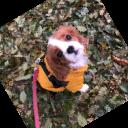{:.center style="width:150px"}

   {:.center style="width:150px"}

Получается, что нейронная сеть должна "сама" понять, что ее ответ должен быть инвариантен к описанным преобразованиям. Но, обычно, это достигается за счет увеличения количества нейронов в скрытых слоях (как мы можем помнить из universal approximation theorem), что и так для нас является головной болью из-за первого пункта.

С частью этих проблем нам поможет новый "строительный блок" -- свертка. О ней в следующем разделе.

## Свертка

Давайте попробуем решить хотя бы пробему инвариантности к сдвигу. Мы не можем наверняка сказать, в какой части изображения наша модель "лучше всего" научилась видеть щенков. Поэтому, для надежного предсказания, будет логично посдвигать картинку на все возможные смещения (пустоты заполним нулями):

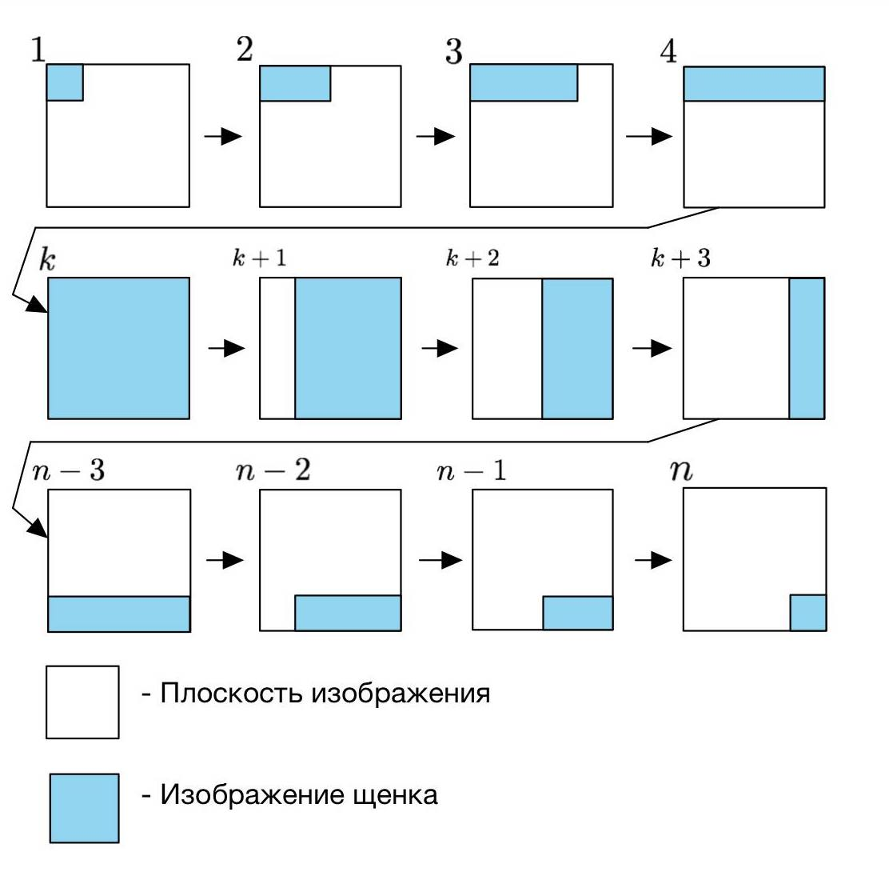{: .center style="width:500px"}

Для каждого смещения у нас предсказывается вероятность наличия щенка на картинке. Получившиеся предсказания можно уже агрегировать, как удобно: среднее, максимум и тп.
Давайте взглянем на эту операцию под другим углом: рассмотрим картинку размером, в 3 раза превышающей оригинальную, в центре которой находится наше изображение щеночка:

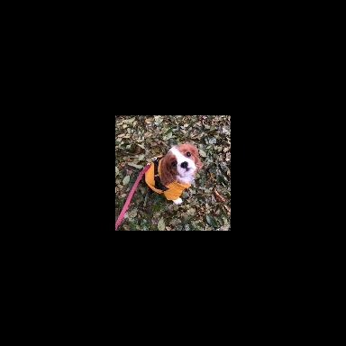{: .center style="width:500px"}

Возьмем окно размером в исходную картинку, и будем его сдвигать на все возможные смещения внутри нового изображения:

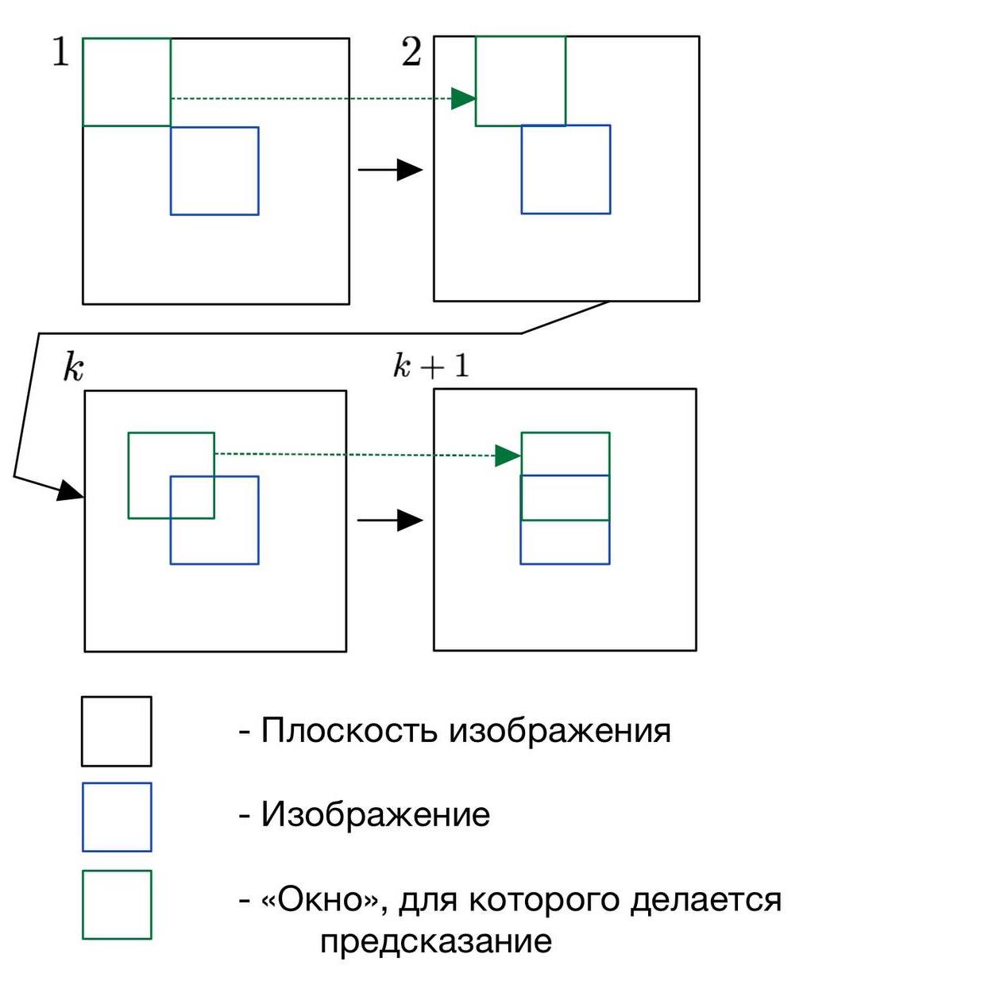{: .center style="width:500px"}

Убедитесь, что получаются одни и те же результаты.
Если в модели оставить только первый линейный слой, то мы получим линейный оператор, для которого есть специальное имя -- _свертка_, один из важнейших компонент в _сверточных_ нейронных сетях. Веса свертки, упорядоченные в тензор (в нашем случае размерности `HxWx3`) -- это ее _ядро_. Область картинки, которая в текущий момент участвует в вычислении признака, обычно называется _окном свертки_. Обратите внимание, что обычно такие свертки называются двумерными -- так как считаются вдоль ширины и высоты картинки, хотя на самом деле свертка -- трехмерная, так как все цветовые каналы участвуют в вычислениях. Следующая картинка поможет разобраться (внимание: на ней _нет_ изображения весов оператора):

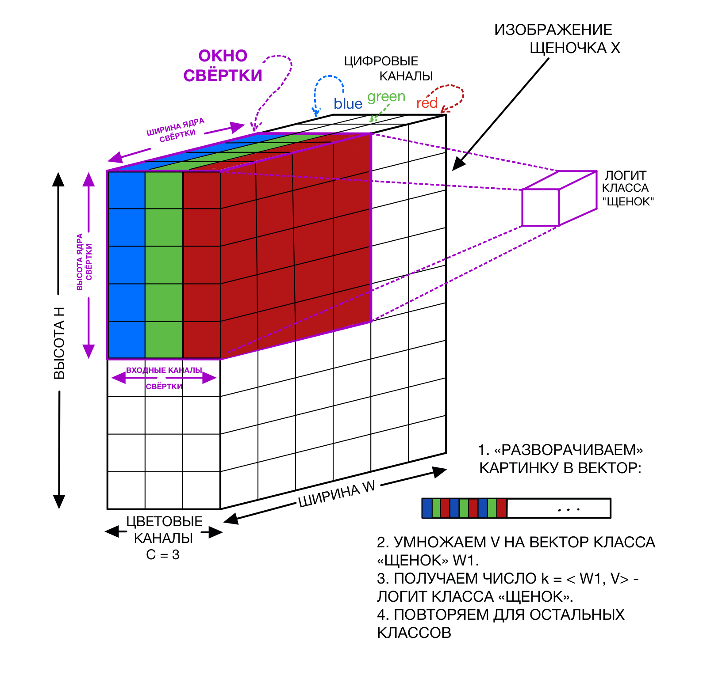{: .center style="width:700px"}

Каждый "кубик" на картинке -- это число. Большой черный тензор слева -- это изображение щеночка $X$. Фиолетовым на нем выделено окно, из которого мы достаем все пиксели и разворачиваем в вектор (аналогично операции flatten в numpy) $v$. Далее этот вектор умножается на вектор весов класса "щенок" $w_1$, и получается число $k_1$ -- логит интересующего класса. Добавив остальные классы, получим матрицу весов $W$ -- прямо как в мультиномиальной логистической регрессии. Эту операцию мы повторяем для каждого возможного сдвига окна свертки.
Решив проблему сдвига картинки и имея на руках наш огромный сверточный фильтр, давайте попробуем теперь справиться с первой проблемой -- количество параметров. Самое простое, что можно придумать -- уменьшим размер окна с `HxW` до, допустим, `kxk` (обычно нечетное и $k \in [3,11])$. В этом случае получается радикальное снижение количества параметров и сложности вычислений.

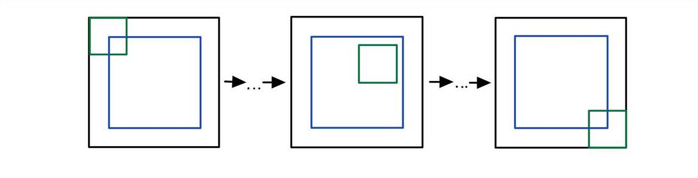{: .center style="width:700px"}

К сожалению, с таким подходом возникает новая проблема: предсказание для какого-то окна никак не учитывает контекст вокруг него. Получается, мы можем получить разумные предсказания только в случае, если распознаваемый объект обладает признаками, которые "помещаются" в окно свертки (например, лого автомобиля при классификации марок машин), либо объекты заметно отличаются по своей текстуре (шерсть кошки vs кирпич, например). На картинке ниже сделана попытка изобразить проблему:

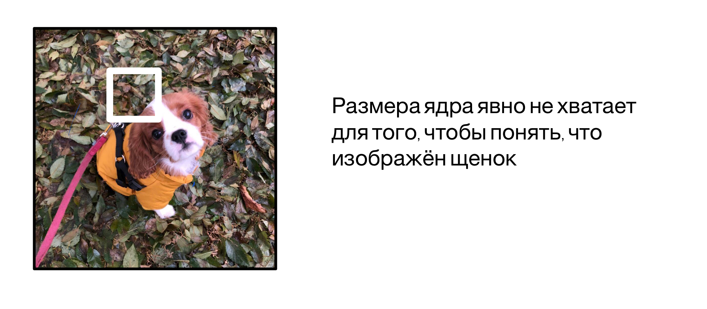{: .center style="width:700px"}
Область картинки, на которую "смотрит" наша нейронная сеть, назвается _receptive field_ -- и про него приходится часто думать в задачах компьютерного зрения. Давайте и мы подумаем, как мы можем его увеличить, не портя уже сделанный выбор с размером ядра. Вспомним, что в нашей нейронке сейчас есть только один слой, сразу предсказывающий класс. Выглядит так, что мы можем применить уже знакомую технику стекинга слоев: пусть на первой стадии мы делаем $C_1$ разных сверток с фильтрам размером `kxk`. Получили, так называемую, карту признаков размером `HxWxC_1`. Применим к ней поэлементно нелинейность и воспользуемся уже `K` свертками для получения предсказаний для каждого пикселя. На таком шаге получается, что наш receptive field для финальных нейронов вырос от `kxk` до `(2k-1)x(2k-1)` (пояснение на [картинке](#fig:receptive_field)). Повторяя такую операцию, мы можем добиться, чтобы наши финальные нейроны уже могли "видеть" почти всю нужную информацию для хорошего предикта. Более того, у нас все еще получается заметно меньше параметров и сложность вычислений, чем если бы мы использовали одну большую MLP.

Как это схематично выглядит:

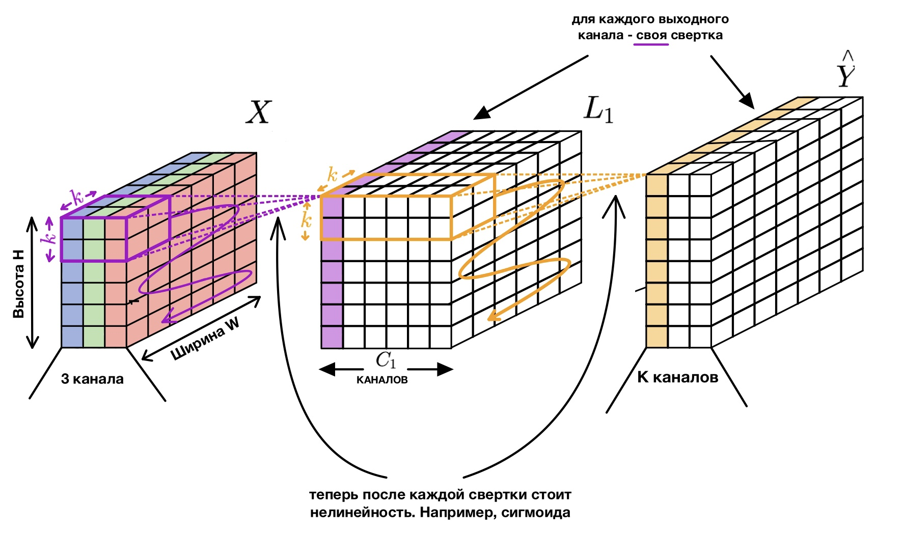{:.center #fig:conv_composition}

Промежуточный тензор $L_1$, полученный при помощи $C_1$ сверток, можно себе представить, как новую картинку, у которой уже $C_1$ каналов.
На следующей картинке можно отследить, как меняется receptive field в зависимости от глубины:

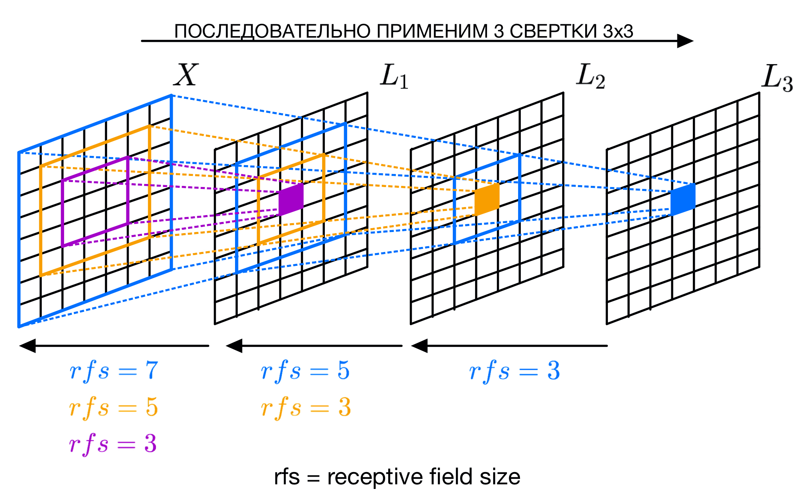{:.center style="width:900px" #fig:receptive_field}

На картинке схематично изображен "плоский" двумерный тензор (количество каналов = 1), к которому последовательно применили 3 свертки 3x3, в каждом случае рассматривается пиксель в центре. Каждый соответствующий тензор помечен, как $L_i$. Если рассматривать первую свертку ($X\to L_1$), то размер receptive field равен размеру ее окна = 3. Рассмотрим вторую свертку $L_1 \to L_2$. В ее вычислении участвуют не только сам центральный пиксель, но и его соседи, причем каждый сосед, в свою очередь, был получен при помощи предыдущей свертки $X \to L_1$. Получается, что для каждого пикселя внутри окна свертки $L_1 \to L_2$ есть receptive field на предыдущей карте признаков $X$, которые агрегируются новой сверткой. Следовательно, их receptive fields объединяются, образуя новый, размером 5x5 (обратите внимание, что это справедливо только для свертки $L_1 \to L_2$, receptive field для $X \to L_1$ остался тот же). Аналогичные рассуждения можно повторить и для всех последующих сверток.

Итого получили, что мы смогли сверткой решить сразу две проблемы: сдвиг и количество параметров. Давайте попробуем определить оператор более формально:

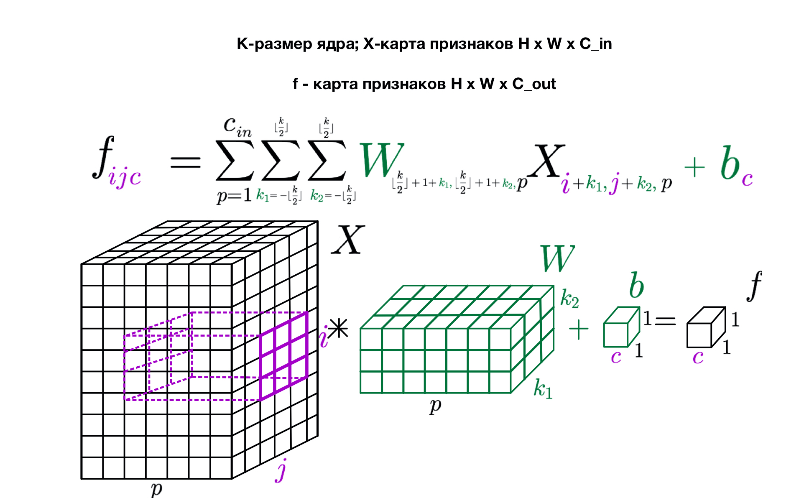{:.center style="width:900px"}

**Упражнение 1** Пусть у нас есть тензор размером `HxWxC_{in}`, к которому одновременно применяется $C_{out}$ сверток, размер окна каждой равен `kxk`. Посчитайте количество обучаемых параметров. Как изменится формула, если к свертке добавить смещение (bias)? Во сколько раз изменится количество параметров, если увеличить размер окна в 2 раза? А если увеличить количество каналов $C_{in}$ и $C_{out}$ в два раза? А если увеличить размер входного тензора в 2 раза по высоте и ширине?
**Упражнение 2** Оцените количество операций сложений-умножений для предыдущего упражнения. Ответье на аналогичные вопросы.

**Упражнение 3** Пусть последовательно применяется $N$ сверток $k \times k$. Посчитайте размер receptive field для последнего оператора.

**Упражнение со звездочкой 4** Как будет преобразован градиент при проходе через сверточный слой во время error backpropagation?

**Упражнение со звездочкой 5** Посчитайте производные для обновления весов свертки.

А что делать с остальными проблемами: поворот, отражение, скейл? К сожалению, на момент написания главы, автору не было известно об успешном опыте решения этих проблем в архитектуре сети. Оказывается, что приведенного оператора уже достаточно, чтобы нейронная сеть могла хорошо обощать на невиданные ранее картинки (лишь бы сверток было больше и сеть глубже).

## Остальные важные блоки сверточных нейронных сетей

Наигравшись с нашими мысленными экспериментами, давайте обратимся к опыту инженеров и исследователей, который копился с 2012 года ([alexnet](https://proceedings.neurips.cc/paper/2012/file/c399862d3b9d6b76c8436e924a68c45b-Paper.pdf)), чтобы разобраться с тем, как эффективней всего строить картиночные нейронки. Здесь будут перечислены, по мнению автора, самые важные, на момент написания главы, блоки.

### Max pool

Несмотря на то, что использование свертки позволило нам радикально сократить количество параметров и вычислений, их все еще оказывается слишком много, если мы хотим работать на картинках высокого разрешения. Выходом оказалось использование следующей эвристики: будем применять одинаковые блоки c $C_1$ каналами, например, $l_1$ раз, затем, как нибудь, уменьшим нашу карту признаков в 2 раза, и одновременно увеличим количество сверток во столько же. Посчитаем, как в таком случае изменится сложность вычислений: было $H \times W \times K \times K \times C_1 \times C_1$, стало $(H/2) \times (W/2) \times K \times K \times (C_1 \times 2) \times (C_1 \times 2) = H \times W \times K \times K \times C_1 \times C_1$, то есть, ничего не изменилось, а количество фильтров удвоилось, что приводит к выучиванию более сложных зависимостей.

Осталось разобраться, что имелось в виду под "как-нибудь" в описании выше. Тривиальный способ -- взять все пиксели с нечетными индексами. Такой подход будет работать, но, как может подсказать здравый смысл, хотелось бы учитывать сигнал с выкинутых нейронов. Здесь есть много вариантов: например, брать среднее/максимум по обучаемым весам в окне 2x2, которое идет по карте признаков с шагом 2. Экспериментально выяснилось, что максимум -- хороший выбор, и, в большинстве архитектур, используют именно его. Обратите внимание, что максимум берется для каждого канала независимо.

Еще одно преимущество -- увеличение receptive field. Получается, что он увеличивается в 2 раза:

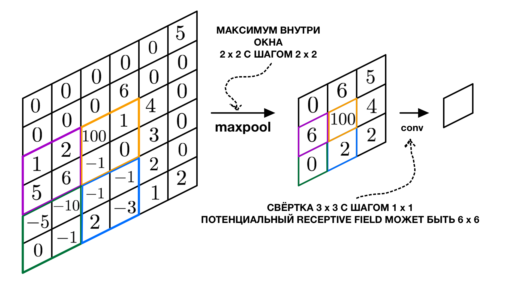{:.center style="width:700px"}

**Упражнение 6** Как будет преобразовываться градиент во время error backpropagation для maxpool с окном и шагом 2x2? А для average pool?

### Global average pool

В предыдущем пункте мы предсказывали классы для каждого пикселя, а затем результаты как-то агрегировали (усредняли, например). На самом деле, в реальной жизни, делают по другому. Если брать старые архитектуры (alexnet, vgg), то там происходит интересное: после последнего слоя сверточного слоя тензор разворачивали в вектор и строили дальше обычную MLP (прям в духе того, как мы не хотели, чтобы архитектура строилась). Позднее было предложено следующее: будем брать среднее вдоль пространственных осей нашего последнего тензора и усреднять их активации, а уже после этого строить MLP. Это и есть Global Average Pooling. У такого подхода есть несколько преимуществ:

1. Радикально меньше параметров
2. Теперь мы можем "применять" нейронку к картинку любого размера
3. Мы сохраняем "магию" инвариантности предсказаний к сдвигам

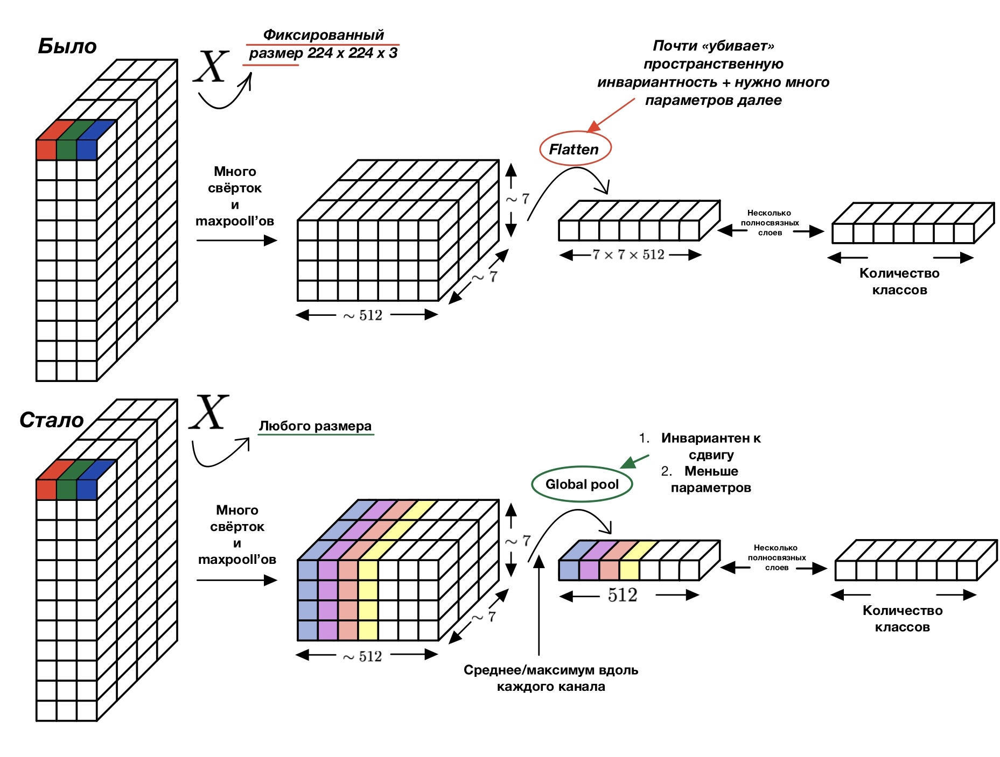{:.center style="width:1000px"}

### Residual connection

Оказывается, что, если мы будем безконтрольно стекать наши свертки, то, несмотря на использование relu и batch normalization, градиенты все равно будут затухать, и на первых слоях будут почти нулевыми. Интересное решение предлагают авторы архитектуры resnet: давайте будем "прокидывать" признаки на предыдущем слое мимо сверток на следующем:

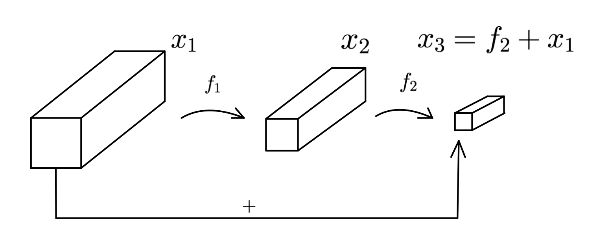{:.center style="width:700px"}

Таким образом получается, что градиент доплывет даже до самых первых слоев, что существенно ускоряет сходимость и качество полученной модели. Вопрос: почему именно сумма? Может, лучше конкатенировать? Авторы densenet именно такой подход и предлагают (с оговорками), получая результаты лучше, чем у resnet. Однако, такой подход получается вычислительно сложным и редко используется на практике.

## Регуляризация

Несмотря на наши ухищрения со свертками, в современных нейронных сетях параметров все равно оказывается больше, чем количество картинок. Поэтому часто оказывается важным использовать различные комбинации регуляризваторов, коих уже стало слишком много, чтобы опысывать в этой главе. Далее рассмотрим одни из наиболее важных.

### Классические

Почти все регуляризаторы, которые использовались в классической машинке и для MLP, применимы и здесь: l1/l2, dropout и так далее. Вопрос на подумать: насколько разумно использовать dropout в сверточных слоях? Как можно модифицировать метод, чтобы он стал "более подходящим"?

### Аугментации

Один из самых мощных инструментов при работе с картинками. Помогает, даже если картинок несколько тысяч, а нейронная сеть с миллионами параметров. Мы уже выяснили, что смещение\поворот\прочее не меняют (при разумных параметрах) факта наличия на картинке того или иного объекта. На самом деле, есть огромное множество операций, сохраняющих это свойство:

1. добавление случайного гауссового шума
2. вырезание случайно части картинки (cutout)
3. перспективные преобразования
4. случаное изменение оттенка\насыщщености\яркости для всей картинки
5. и многое другое

Пример хорошой библиотеки с аугментациями: [Albumentations](https://github.com/albumentations-team/albumentations).

### Label smoothing

Часто оказывается, что нейронная сеть делает "слишком уверенные предсказания": 0.9999 или 0.00001. Это становится головной болью, если в нашей разметке есть шум -- тогда градиенты на таких объектах могут сильно портить сходимость. Исследователи пришли к интересной идее: давайте предсказывать не one-hot метку, а ее сглаженный вариант. Итак, пусть у нас есть $K$ классов:

<<<<<<< develop
<<<<<<< develop
<<<<<<< develop
$$
y_{ohot}=(0, 0, \dots, 1, \dots, 0)
$$

$$
y_{ls}=\left(\frac{\varepsilon}{k-1},\frac{\varepsilon}{k-1}, \dots, 1-\varepsilon,\frac{\varepsilon}{k-1}, \dots, \frac{\varepsilon}{k-1}\right)
$$

$$
\sum_i y^i_{ohot}=\sum_i y^i_{ls}=1
$$
=======
$$y_{ohot}=(0, 0, \dots, 1, \dots, 0)$$
=======
<Math block>
>>>>>>> feat: pass formulas to Math component

=======
>>>>>>> fix: use MathLayout instead Math
$$
y_{ohot}=(0, 0, \dots, 1, \dots, 0)
$$

<<<<<<< develop
<<<<<<< develop
$$\sum_i y^i_{ohot}=\sum_i y^i_{ls}=1$$
>>>>>>> chore: added and checked neural_nets
=======
</Math>

<Math block>

=======
>>>>>>> fix: use MathLayout instead Math
$$
y_{ls}=\left(\frac{\varepsilon}{k-1},\frac{\varepsilon}{k-1}, \dots, 1-\varepsilon,\frac{\varepsilon}{k-1}, \dots, \frac{\varepsilon}{k-1}\right)
$$

$$
\sum_i y^i_{ohot}=\sum_i y^i_{ls}=1
$$

<<<<<<< develop
</Math>
>>>>>>> feat: pass formulas to Math component

=======
>>>>>>> fix: use MathLayout instead Math
Обычно берут $\epsilon=0.1$. Тем самым модель штрафуется за слишком уверенные предсказания, а шумные лейблы уже не вносят такого большого вклада в градиент.

### Mixup

Самый интересный вариант. А что будет, если мы сделаем выпуклую комбинацию двух картинок и их лейблов:

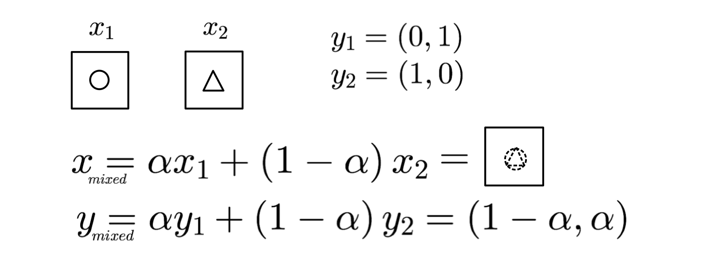{:.center style="width:700px"}

где $\alpha$ обычно семплируется из какого-нибудь Бета распределения. Оказывается, что такой подход заставляет модель выучивать, в каком-то смысле, более устойчивые предсказания, так как мы форсируем некую линейность в отображении из простарнстве картинок в пространство лейблов. На практике часто оказывается, что это дает значимое улучшение в качестве модели.

## Итого

Мы разобрались, что для картинок эффективно использовать сверточные фильтры в качестве основных операторов. Выяснили, какие основные блоки есть почти в каждой картиночной нейронной сети и зачем они там нужны. Разобрались, какие методы регуляризаторы сейчас самые популярные и какая за ними идея.

## Бонус: не одной классификацией едины

Сверточными нейронными сетями можно решать большой спектр задач, например:

1. Сегментация. Если убрать в конце слои GlobalAveragePool или flatten, то можно делать предсказания для каждого пикселя в отдельности (подумайте, что делать, если в сети есть maxpool) -- получаем сегментацию картинки. Проблема -- долгая и дорогая разметка.
2. Детекция. Часто намного дешевле получить разметку объектов обрамляющими прямоугольниками. Здесь уже можно для каждого пикселя предсказывать размеры прямоугольника, который обрамляет объект, к которому принадлежит пиксель. Проблемы -- нужен этап агрегации прямоугольников + много неоднозначностей во время разметки + много эверистик на всех этапах + данных нужно больше.
3. Понимание видео. Добавляем в тензор новый канал -- временной, считаем четырехмерные свертки -- и получаем распознавание сцен на видео.
4. Metric learning. Часто мы не можем собрать все интересующие нас классы, например, в задаче идентификации человека по лицу (или товара на полке). В этом случае используют такой трюк: научим модель в некотором смысле (обычно по косиносному расстоянию) разделять эмбеддинги существующих классов (уникальных людей). Если на руках была репрезентативная выборка, то модель, скорее всего (а обычно -- всегда), выучит генерировать дискриминативные эмбеддинги, которые уже позволят различать между собой ранее невиданные лица.
5. и многое другое
