- Этот список будет заменен оглавлением, за вычетом заголовка "Contents",
  к которому добавлен класс `no_toc`.
  {:toc}

В этой главе мы узнаем про новое семейство моделей -- **нейронные сети**. Этот тип моделей на сегодня самый распространенный. Науку об обучении нейросетей называют **Глубинным Обучением** или **Deep learning**. Нейросети изначально придумали еще в 70-х, но техническая возможность и понимание того, как тренировать нейросети большого размера, появились совсем недавно, примерно в 2011 году. Чтобы зафиксировать этот качественный переход, современные сети часто называют **deep networks**, а все, что было раньше, соответственно **shallow networks** (мелкие? неглубокие? что-то такое :).

<!-- <mark> график роста производительности видеокарточек -->

<!-- 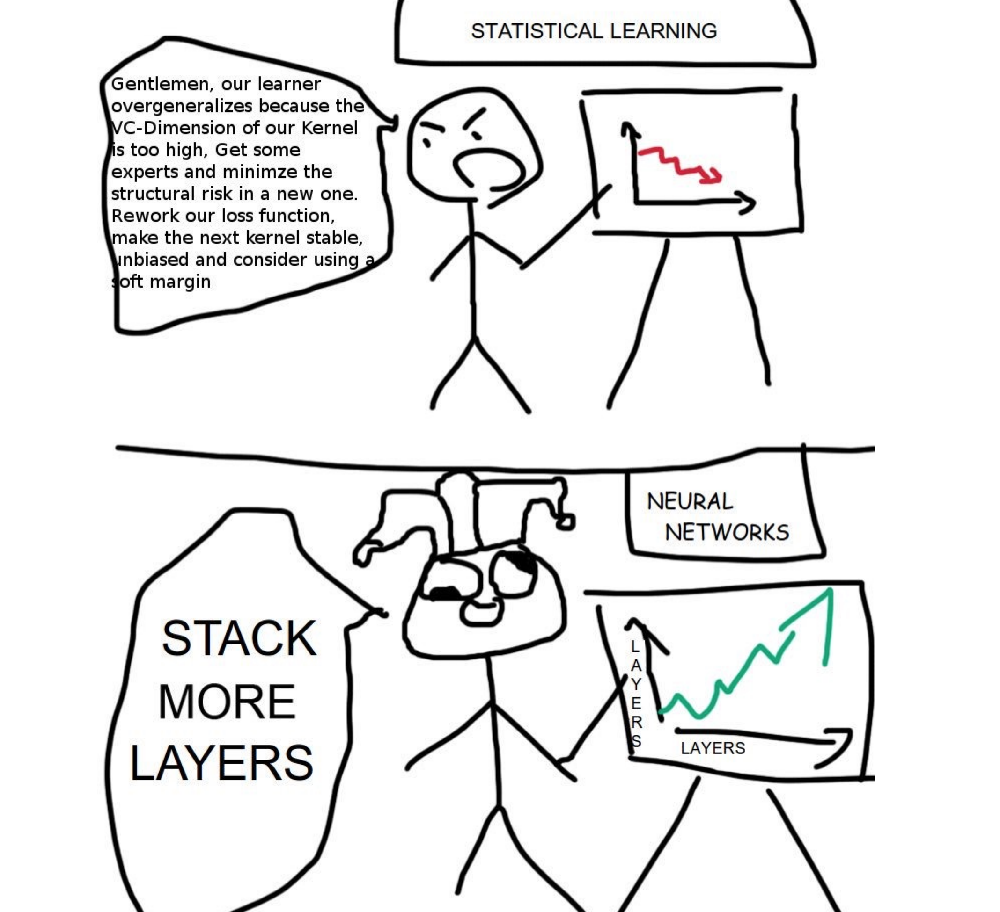{: .center style="width:400px"}
*Популярность нейросетей связана с ростом проиводительности компьютеров.* -->

Если раньше люди занимались выводом теоретических гарантий на сходимость или устойчивость алгоритма к шуму, то сегодня, когда компьютеры быстрые, а данных много, нас скорее интересуют универсальность алгоритма и возможность работы с данными. Чисто инженерный подход к построению алгоритмов, изобилие деталей, основанных на интуиции и обосновывающихся фразой <<просто потому, что так работает, а иначе -- нет>>, а также отсутствие теоретической основы приводят к тому, что многие ученые продолжают относиться к нейросетям скептически. Однако результаты, достигнутые с их помощью за последние 10 лет, столь впечатляющие, что их нельзя игнорировать.

{: .center style="width:40vw"}

**Связь нейронных сетей и других моделей обучения с учителем**

Почти всегда существует способ заставить линейные модели хорошо работать: для этого нужны только креативный подход в генерации признакового описания и огромные временные ресурсы. Человеческий труд в этом процессе используется для того, чтобы найти такие преобразования исходного описания объекта в некое <<более информативное или же более простое>> пространство (с точки зрения решаемой задачи), в котором поставленная задача легко разрешима. Нейросети можно рассматривать как способ автоматизации этой работы: прикладываемые человеческие усилия заменяются на траты вычислительных возможностей компьютеров.

В настоящее время нейронные сети де-факто стали стандартом во множестве задач. Особенно показательны результаты, которых удалось добиться при анализе данных, обладающих некоторой внутренней _структурой_: текстов, изображений, видео, облаков точек, графов и т.д. Успех нейронных сетей в этих задачах во многом обусловлен их способностью к построению **в автоматическом режиме** информативных признаковых описаний, учитывающих структуру данных, лишь на основе самих данных. Об этом мы подробно поговорим ниже. Для начала же введем несколько определений, которые понадобятся нам в дальнейшем.

&nbsp;

# Основные определения

**_Искусственная нейронная сеть (далее нейронная сеть)_** -- это _сложная дифференцируемая функция, задающая отображение из исходного признакового пространства в пространство ответов, все параметры которой могут настраиваться одновременно и взаимосвязанно (т.е. сеть может обучаться end-to-end)._ В частном (и наиболее частом) случае представляет собой последовательность (дифференцируемых) параметрических преобразований.

Внимательный читатель может обратить внимание, что под указанное выше определение нейронной сети подходят и логистическая, и линейная регрессии. Это верное замечание: и линейная, и логистическая регрессия могут рассматриваться как нейронные сети, задающие отображение в пространство ответов и логитов соответственно.

На практике часто выделяются следующие основные блоки, из которых состоят искусственные нейронные сети:

- **Слой (layer)** – преобразование над исходными данными, порождающее новое представление этих данных, притом достаточно простое, чтобы его было удобно считать отдельным <<неделимым>> блоком. Простейший пример: линейный слой, являющийся линейным преобразованием над входящими данными:

  <span class="tooltip">$x \mapsto xW + b$

       <span class="wrap-tooltiptext"><span class="tooltiptext">$W \in \mathbb{R}^{d \times k}, x \in \mathbb{R}^{d}, b \in \mathbb{R}^{k}$</span></span>

  </span>.

- **Функция активации (activation function)** – нелинейное преобразование, применяющееся ко всем данным, пришедшим на вход поэлементно. Благодаря функциям активации нейронные сети способны порождать более информативные признаковые описания, преобразуя данные _нелинейным_ образом.

Даже самые сложные нейронные сети обычно собираются из таких вот относительно простых блоков. Таким образом, их можно представить в виде **вычислительного графа**, где вершинам соответствуют преобразования. Вычислительный граф нейронной сети – это просто удобное представление, в котором явно видно, что преобразования происходят последовательно. Он может быть построен для любой функции. На иллюстрации ниже приведен вычислительный граф для логистической регрессии.
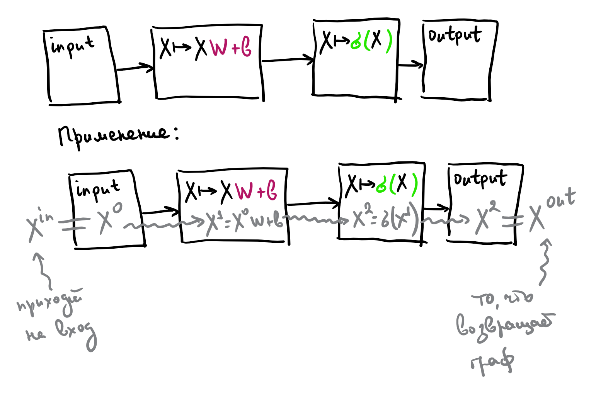

Графы могут быть и более сложными, в том числе нелинейными:
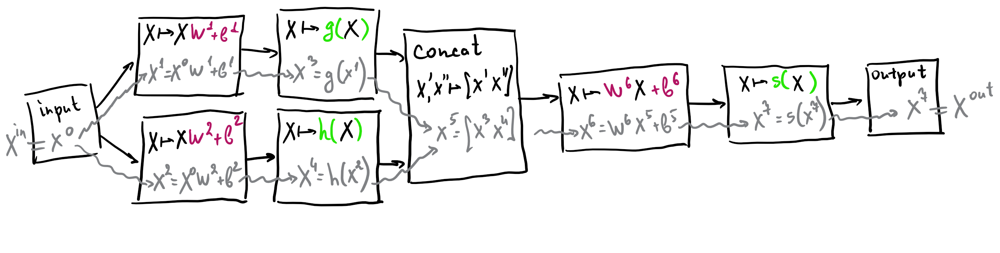

А вот и настоящий пример из реальной жизни. GoogLeNet (она же Inception-v1), показавшая SoTA результат на ILSVRC 2014 (ImageNet challenge), выглядит так:

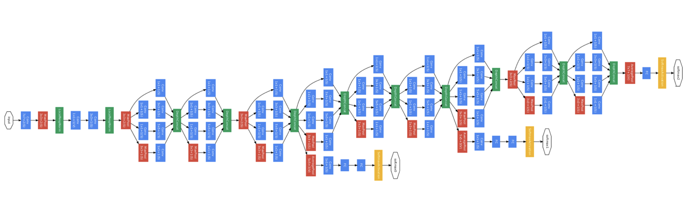{: .center style="width:50vw"}

Современные же сети часто выглядят и ещё сложней, но почти все они собираются из достаточно простых кирпичиков-слоёв.

_Примечание: Стоит отметить, впрочем, что в общем случае нейронная сеть представляет собой просто некоторую сложную функцию (или, что эквивалентно, граф вычислений), и в некоторых (достаточно нетривиальных) случаях её нет смысла разбивать на слои. В качестве иллюстрации ниже приведены структуры агностических нейронных сетей WANN, представленных в работе [Weight Agnostic Neural Networks, NeurIPS 2019](https://weightagnostic.github.io)._

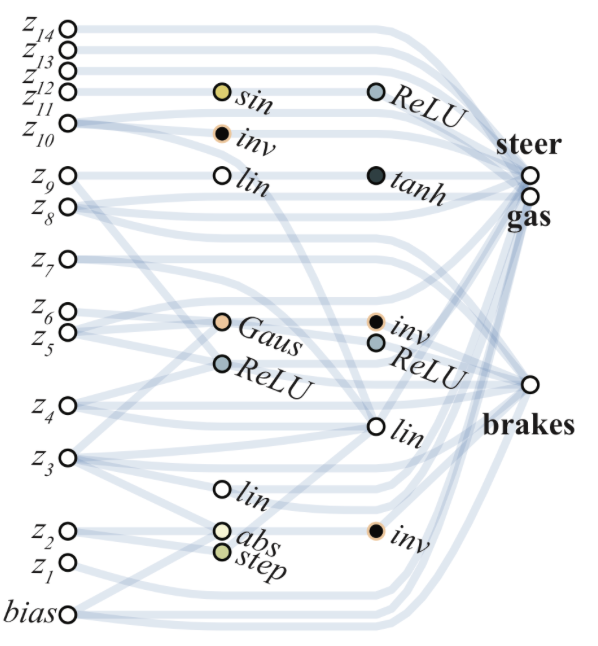{: .center style="width:500px"}

# Forward & backward propagation

Информация может течь по графу в двух направлениях.

Применение нейронной сети к данным часто называют **прямым проходом** или же **forward propagation**. На этом этапе происходит преобразование исходного представления данных в целевое и последовательно строятся _промежуточные (внутренние) представления_ данных – результаты применения слоев к предыдущим представлениям. Именно поэтому проход называют прямым.
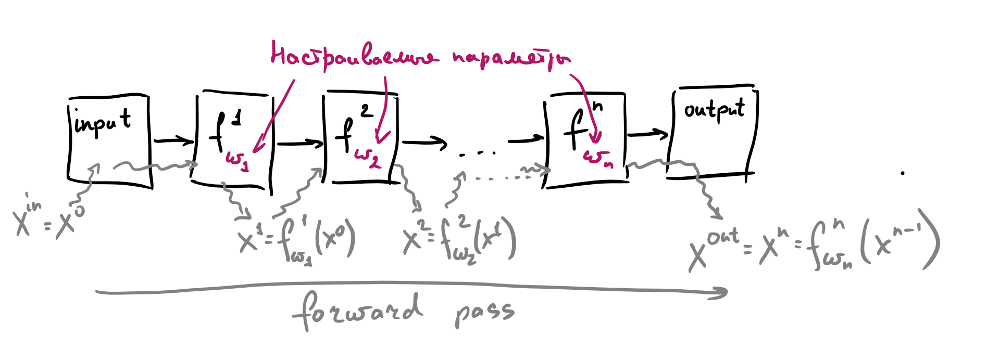{: .center style="width:60vw"}

При **обратном проходе** или же **backward propagation** информация (обычно об ошибке предсказания целевого представления) движется от финального представления (а чаще даже от функции потерь) к исходному через все преобразования. Механизм обратного распространения ошибки, играющий важнейшую роль в обучении нейронных сетей, как раз предполагает _обратное_ движение по вычислительному графу сети.
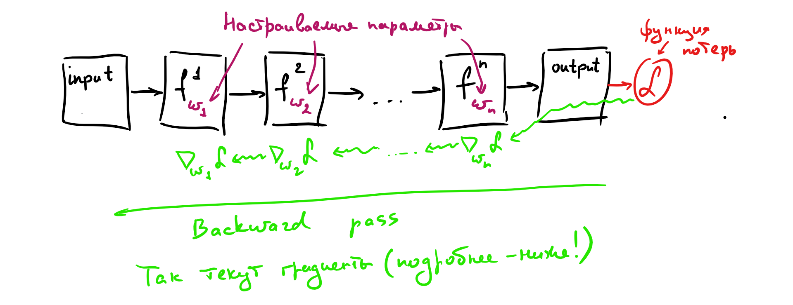{: .center style="width:60vw"}

Данные понятия еще не раз встретятся нам в дальнейшем повествовании и будут рассмотрены подробнее. Рассмотрим пока механизм применения нейронных сетей и ответим на следующий вопрос:

&nbsp;

# Зачем нужны функции активации?

Казалось бы, можно последовательно выстраивать лишь линейные слои, но так не делают: после каждого линейного слоя обязательно вставляют функцию активации. Но зачем? Попробуем разобраться. Рассмотрим нейронную сеть из двух линейных слоев. Что произойдет, если между ними будет отсутствовать нелинейная функция активации?

{: .center style="width:500px"}

$$
\widehat{y} = X^{out} = X^{1}W^{2} + b^2 = (X^0W^1 + b^1)W^2 + b^2 = X^0\color{blue}{W^1W^2} + \color{green}{b^1W^2 + b^2} = X^0\color{blue}{\widetilde{W}} + \color{green}{\widetilde{b}}
$$

Линейная комбинация линейных отображений есть линейное отображение, т.е. два последовательных линейных слоя эквивалентны одному линейному слою.

Добавление функций активации после линейного слоя позволяет получить нелинейное преобразование и подобной проблемы уже не возникает. Вдобавок правильный выбор функции активации позволяет получить преобразование, обладающее подходящими свойствами.

В качестве функции активации может использоваться, например, уже знакомая вам из логистической регрессии сигмоида. Для начала ограничимся ей и рассмотрим простой пример. К более глубокому рассмотрению разновидностей и свойств различных функций активации вернемся позднее.

# Пример на реальных данных

Рассмотрим бинарную задачу классификации. Пусть нам доступна линейно неразделимая выборка в двумерном пространстве.

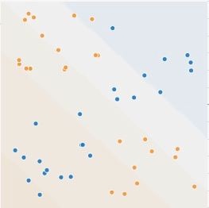{: .center style="width:250px"}

Логистическая регрессия не может решить задачу классификации корректно, ибо задает лишь одну разделяющую гиперплоскость (в данном случае прямую).

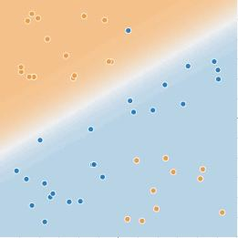{: .center style="width:250px"}

Попробуем решить данную задачу с помощью простой нейронной сети. Пусть данная нейронная сеть состоит из двух линейных преобразований (слоев), к каждому из которых применяется сигмоида в качестве функции активации. Свободный член $b$ опущен для упрощения выкладок.

$$
\widehat{y} = \sigma(X^1W^2) = \sigma\Big(\big(\sigma(X^0W^1)\big)W^2\Big)
$$

Сигмоида применяется поэлементно, т.е.

$$
\sigma(X) = [\sigma(x_{ij})].
$$

Несложно заметить, что приведенная модель является логистической регрессией над новым признаковым описанием:

$$
X^1 = \sigma(X^0W^1).
$$

Именно это признаковое описание и является результатом применения первого линейного слоя и функции активации к исходным данным.

Подобная модель представляет собой нейронную сеть с одним скрытым слоем, и она легко справляется с решением данной задачи классификации. Рисунок ниже иллюстрирует данный результат.

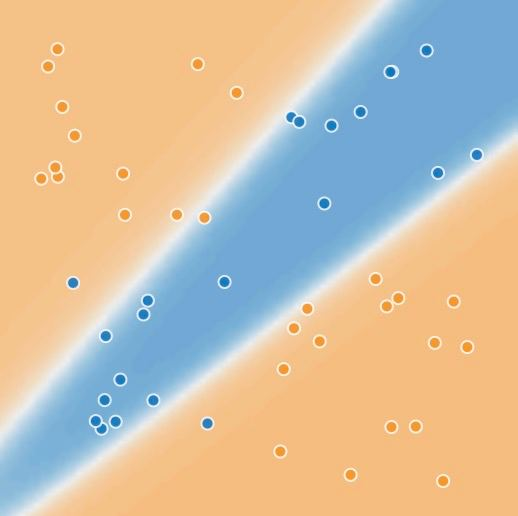{: .center style="width:250px"}

_Упражнение: Рекомендуем воспользоваться замечательной ["песочницей"](https://playground.tensorflow.org) и попробовать получить данный результат самостоятельно, используя 1 скрытый слой из 2 нейронов и сигмоиду в качестве функции активации._

Но для получения данного решения необходим метод автоматической настройки всех параметров нейронной сети – **метод обратного распространения ошибки**, или же **backpropagation**. Следующий параграф будет посвящён внмательному рассмотрению данного метода.

&nbsp;

# Метод обратного распространения ошибки

Нейронные сети обучаются с помощью тех или иных модификаций градиентного спуска, а чтобы применять его, нужно уметь эффективно вычислять градиенты функции потерь по всем обучающим параметрам. Казалось бы, для какого-нибудь запутанного вычислительного графа это может быть очень сложной задачей, но на помощь спешит метод обратного распространения ошибки.

Открытие метода обратного распространения ошибки стало одним из наиболее значимых событий в области искусственного интеллекта. В актуальном виде он был предложен в 1986 году [ Дэвидом И. Румельхартом, Дж. Е. Хинтоном и Рональдом Дж. Вильямсом](https://web.stanford.edu/class/psych209a/ReadingsByDate/02_06/PDPVolIChapter8.pdf) и независимо и одновременно красноярскими математиками С.И. Барцевым и В.А. Охониным. С тех пор для нахождения градиентов параметров нейронной сети используется метод вычисления производной сложной функции, и оценка градиентов параметров сети стала хоть сложной инженерной задачей, но уже не искусством. Несмотря на простоту используемого математического аппарата, его появление привело к значительному скачку в развитии искусственных нейронных сетей.

Суть его можно можно записать одной формулой, тривиально следующей из формулы производной сложной функции: если $f(x) = g_m(g_{m-1}(\ldots (g_1(x)) \ldots))$, то $\frac{\partial f}{\partial x} = \frac{\partial g_m}{\partial g_{m-1}}\frac{\partial g_{m-1}}{\partial g_{m-2}}\ldots \frac{\partial g_2}{\partial g_1}\frac{\partial g_1}{\partial x}$. Уже сейчас мы видим, что градиенты можно вычислять последовательно, в ходе одного обратного прохода, начиная с $\frac{\partial g_m}{\partial g_{m-1}}$ и умножая каждый раз на частные производные предыдущего слоя.

&nbsp;

## Backpropagation в одномерном случае

В одномерном случае всё выглядит особенно просто. Пусть $w_0$ -- переменная, по которой мы хотим продифференцировать, причём сложная функция имеет вид

$$
f(w_0) = g_m(g_{m-1}(\ldots g_1(w_0)\ldots)),
$$

где все $g_i$ скалярные, то

$$
f'(w_0) = g_m'(g_{m-1}(\ldots g_1(w_0)\ldots))\cdot g'_{m-1}(g_{m-2}(\ldots g_1(w_0)\ldots))\cdot\ldots g'_1(w_0)
$$

Суть этой формулы такова. Если мы уже совершили forward pass, то есть уже знаем

$$
g_1(w_0), g_2(g_1(w_0)),\ldots,g_{m-1}(\ldots g_1(w_0)\ldots)
$$

то мы действуем следующим образом:

- берём производную $g_m$ в точке $g_{m-1}(\ldots g_1(w_0)\ldots)$;

- умножаем на производную $g_{m-1}$ в точке $g_{m-2}(\ldots g_1(w_0)\ldots)$;

- и так далее, пока не дойдём до производной $g_1$ в точке $w_0$.

Проиллюстрируем это на картинке, расписав по шагам дифференцирование по весам $w_i$ функции потерь логистической регрессии на одном объекте (то есть для батча размера 1):

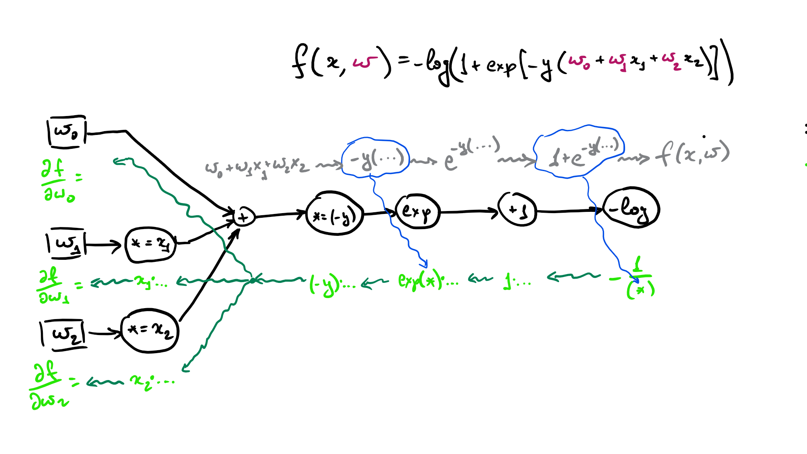

Собирая все множители вместе, получаем:

$$
\frac{\partial f}{\partial w_0} = (-y)\cdot\exp\left(-y(w_0 + w_1x_1 + w_2x_2)\right)\cdot\frac{-1}{1 + \exp\left(-y(w_0 + w_1x_1 + w_2x_2)\right)}
$$

$$
\frac{\partial f}{\partial w_1} = x_1\cdot(-y)\cdot\exp\left(-y(w_0 + w_1x_1 + w_2x_2)\right)\cdot\frac{-1}{1 + \exp\left(-y(w_0 + w_1x_1 + w_2x_2)\right)}
$$

$$
\frac{\partial f}{\partial w_2} = x_2\cdot(-y)\cdot\exp\left(-y(w_0 + w_1x_1 + w_2x_2)\right)\cdot\frac{-1}{1 + \exp\left(-y(w_0 + w_1x_1 + w_2x_2)\right)}
$$

Таким образом, мы видим, что сперва совершается forward pass для вычисления всех промежуточных значений (и да, их нужно будет хранить в памяти), а потом запускается backward pass, на котором в один проход вычисляются все градиенты.

&nbsp;

## Почему же нельзя просто пойти и начать везде вычислять производные?

Есть по крайней мере две трудности.

Во-первых, со всеми компонентами нейросети -- и с аргументами $X^i$, и с матрицами весов $W^j$, и с градиентами по ним -- важно работать именно как со структурированными объектами: векторами, матрицами, многомерными кубиками (тензорами). Почему? Очень просто: всё самописное -- это долго, а все операции линейной алгебры реализованы прекрасно оптимизированными библиотечными функциями, так что терять линейно-алгебраическую структуру компонент сети мы не можем себе позволить. И всё, что будет происходить дальше, преследует очень простую цель: научиться вычислять производные основных видов слоёв в удобном, векторно-матричном виде. А чтобы сделать это и не сойти с ума, мы должны ввести ясную систему обозначений, составляющую ядро техники матричного дифференцирования.

Во-вторых, с матричной производной в принципе не всегда хочется иметь дело. Рассмотрим простой пример. Допустим, что $X^r$ и $X^{r+1}$ -- два последовательных промежуточных представления $N\times M$ и $N\times K$, связанных функцией $X^{r+1} = f^{r+1}(X^r)$. Предположим, что мы как-то посчитали градиент $\frac{\partial\mathcal{L}}{\partial X^{r+1}_{ij}}$ функции потерь $\mathcal{L}$, тогда

$$
\frac{\partial\mathcal{L}}{\partial X^{r}_{st}} = \sum_{i,j}\frac{\partial f^{r+1}_{ij}}{\partial X^{r}_{st}}\frac{\partial\mathcal{L}}{\partial X^{r+1}_{ij}}
$$

И мы видим, что, хотя оба градиента $\frac{\partial\mathcal{L}}{\partial X_{ij}^{r+1}}$ и $\frac{\partial\mathcal{L}}{\partial X_{st}^{r}}$ являются просто матрицами, в ходе вычислений возникает <<четырёхмерный кубик>> $\frac{\partial f_{ij}^{r+1}}{\partial X_{st}^{r}}$, даже хранить который весьма болезненно: уж больно много памяти он требует ($N^2MK$ по сравнению с безобидными $NM + NK$, требуемыми для хранения градиентов). Поэтому _хочется промежуточные производные $\frac{\partial f^{r+1}}{\partial X^{r}}$ рассматривать не как вычисляемые объекты $\frac{\partial f_{ij}^{r+1}}{\partial X*{st}^{r}}$, а как преобразования, которые превращают $\frac{\partial\mathcal{L}}{\partial X*{ij}^{r+1}}$ в $\frac{\partial\mathcal{L}}{\partial X_{st}^{r}}$*. Целью следующих подразделов будет именно это: *понять, как преобразуется градиент в ходе error backpropagation при переходе через тот или иной слой\_.

&nbsp;

## Напоминание: матричные производные

Вспомним определение производной. Функция $f(x)$ дифференцируема в точке $x_0$, если

$$
f(x) = f(x_0) + \left[D_{x_0} f \right] (x-x_0) + \bar{\bar{o}} \left(\left| \left| x-x_0\right|\right|\right),
$$

где $D_{x_0} f$ -- **дифференциал** функции $f$: линейное отображение из мира $x$ -ов в мир значений $f$. Если $f$ -- скалярная функция (т.е. $f(x)$ -- число), то $D_{x_0} f$ -- это, соответственно, линейная функция.

Давайте рассмотрим несколько примеров и заодно разберёмся, какой вид может принимать выражение $\big[D_{x_0} f\big] (x-x_0)$ в зависимости от формы $x$. Начнём со случаев, когда $f$ -- скалярная функция.

<details>

{" "}

<summary>
  Примеры конкретных форм $\big[D_{x_0} f\big] (x-x_0)$, когда $f$ -- скалярная
  функция
</summary>

    1.  $f(x)$ -- скалярная функция, $x$ -- скаляр. Тогда

      $$
      f(x) - f (x_0) \approx f'(x_0) (x-x_0)
      $$

      $$
      \left[D_{x_0} f\right] (x-x_0) = f'(x_0) (x-x_0) = (x-x_0) \cdot f'(x_0)
      $$

      Здесь $(x-x_0)$ и $f'(x_0)$ -- просто числа.

    2.  $f(x)$ -- скалярная функция, $x$ -- вектор. Тогда

      $$
      f(x) - f(x_0) \approx \sum\limits_i \left.\frac{\partial f}{\partial x_i} \right|_{x=x_0} (x-x_0)_i
      $$

      то есть

      $$
        \left[D_{x_0} f\right](x-x_0) = \left(\nabla_{x_0} f\right)^T (x-x_0) = \left( \nabla_{x_0} f, x - x_0 \right),
      $$

      где $(\bullet, \bullet)$ -- операция скалярного произведения, а $\nabla_{x_0} f = \left(\frac{\partial f}{\partial x_1}, \ldots, \frac{\partial f}{\partial x_n}\right)$ -- градиент функции $f$.

    3.  $f(x)$ -- скалярная функция, $X$ -- матрица. Дифференциал скалярной функции по матричному аргументу определяется следующим образом:

        $$
        	f(x) - f(x_0) \approx \sum\limits_{i,j}\ \left.\frac{\partial f}{\partial X_{ij}} \right|_{X=X_0} (X-X_0)_{ij}
        $$

        Можно заметить, что это стандартное определение дифференциала функции многих переменных для случая, когда переменные -- элементы матрицы $X$. Заметим также один интересный факт:

        $$
            \sum_{ij} A_{ij} B_{ij} = \text{tr}\, A^T B,
        $$

        где $A$ и $B$ -- произвольные матрицы одинакового размера. Объединяя оба приведённых выше факта вместе, получаем:

        $$
            \left[D_{X_0} f \right] (X - X_0)
            = \sum \limits_{ij}
                \left.
                    \frac{\partial f}{\partial X_{ij}}
                \right|_{X = X_0}
                \left(
                    X - X_0
                \right)_{ij}
            = \text{tr}\,
                \left( \left[\left. \frac{\partial f}{\partial X_{ij}}\right|_{X=X_0}\right]^T (X-X_0)\right).
        $$

        Можно заметить, что здесь, по аналогии с примерами, где $x$ -- скаляр и где $x$ -- вектор (и $f(x)$ -- скалярная функция), получилось на самом деле скалярное произведение градиента функции $f$ по переменным $X_{ij}$ и приращения. Этот градиент, правда, записан для удобства в виде матрицы с теми же размерами, что матрица $X$.

</details>

Вообще, как мы знаем из курса матанализа и как мы могли увидеть в примерах выше, результат применения оператора производной скалярной функции равен

$$
    \left[D_{x_0} f \right] (x-x_0) = \left(\nabla_{x_0} f, x-x_0\right),
$$

где в последнем равенстве записано скалярное произведение градиента $\nabla_{x_0} f$ функции $f$ и приращения $x - x_0$. Просто, в отличие от стандартных случаев из курса матанализа, на вход функции могут идти не только векторы, но и матрицы, и вообще тензоры любой размерности. Но суть от этого не меняется: любой входной тензор -- это набор переменных, а дифференциал скалярной функции по нему -- это просто сумма дифференциалов по каждой переменной (как было показано в последнем примере с матрицей в качестве входного тензора). Поэтому градиент скалярной функции всегда можно воспринимать как вектор с длиной, равной числу элементов во входном тензоре. Однако для удобства вычислений его иногда записывают в виде тензора с таким же шейпом, как у входного тензора.

Рассмотрим ещё несколько примеров.

<details>
  <summary>Примеры конкретных форм $\big[D_{x_0} f\big] (x-x_0)$, когда $f$ -- вектор или матрица</summary>
    1.  $$f(x) = \begin{pmatrix} f(x_1)\\ \vdots\\ f(x_m) \end{pmatrix}$$, $x$ -- вектор. Тогда

    В последнем выражении происходит покомпонентное умножение.


    $$
    \left[D_{x_0} f\right] (x-x_0) = f'(x_0) \odot (x-x_0) = (x-x_0) \odot f'(x_0)
    $$


    2.  $f(X) = XW$, где $X$ и $W$ -- матрицы. Тогда


    $$
    f(X) - f(X_0) = XW - X_0 W = (X-X_0) W
    $$


    то есть


    $$
    \left[D_{X_0} f\right] (X - X_0) = (X- X_0) W
    $$


    3.  $f(W) = XW$, где $X$ и $W$ -- матрицы. Тогда


    $$
    f(W) - f(W_0) = XW - XW_0 = X(W-W_0)
    $$


    то есть


    $$
    \left[D_{W_0} f\right] (W-W_0) = X(W-W_0)
    $$


    4.  $f(x) = (f_1(x),\ldots,f_K(x))$ -- вектор-строка, $x = (x_1,\ldots,x_D)$ -- вектор-строка. Тогда


    $$
    \left[D_{x_0} f\right](x-x_0)
     = \left(\sum_j
        \left.
            \frac{\partial f_1}{\partial y_j}
         \right|_{y=x_0}(x - x_0)_j, \ldots, \sum_j \left. \frac{\partial f_K}{\partial y_j} \right|_{y=x_0}(x - x_0)_j \right) = \\
     = (x - x_0) \cdot
        \begin{pmatrix}
            \left.
                \frac{\partial f_1}{\partial y_1}
            \right|_{y=x_0} & \ldots &
            \left.
                \frac{\partial f_k}{\partial y_1}
            \right|_{y=x_0} \\
            \vdots & & \vdots \\
            \left.
                \frac{\partial f_1}{\partial y_D}
            \right|_{y=x_0} & \ldots &
            \left.
                \frac{\partial f_k}{\partial y_D}
            \right|_{y=x_0}\\
        \end{pmatrix}
        = (x - x_0) \cdot
        \left.
            \frac{\partial f}{\partial y}\right|_{y = x_0}
    $$


    Матрица, выписанная в предпоследней выкладке, -- это знакомая вам из курса матанализа матрица Якоби.

</details>

## Производная сложной функции в общем виде

Пусть $f(x) = g(h(x))$. Тогда

$$
f(x) - f(x_0) = g(h(x)) - g(h(x_0)) = \left[D_{h(x_0)} g \right] (h(x) - h(x_0)) = \left[D_{h(x_0)} g \right] \left( \left[D_{x_0} h\right] (x-x_0)\right).
$$

Здесь $D_{h(x_0)} g$ -- дифференциал $g$ в точке $h(x_0)$.

## Градиент сложной функции

Пусть $f(x) = g(h(x))$ -- скалярная функция. Тогда

$$
\left[D_{x_0} f \right] (x-x_0) = \left(\nabla_{x_0} f, x-x_0\right).
$$

С другой стороны,

$$
\left[D_{h(x_0)} g \right] \left(\left[D_{x_0}h \right] (x-x_0)\right) = \left(\nabla_{h_{x_0}} g, \left[D_{x_0} h\right] (x-x_0)\right) = \left(\left[D_{x_0} h\right]^* \nabla_{h(x_0)} g, x-x_0\right).
$$

То есть $\nabla_{x_0} f = \left[D_{x_0} h \right]^* \nabla_{h(x_0)}g$ -- применение сопряжённого к $D_{x_0} h$ линейного отображения к вектору $\nabla_{h(x_0)} g$.

Эта формула -- сердце механизма обратного распространения ошибки. Она говорит следующее: если мы каким-то образом получили градиент функции потерь по переменным из некоторого промежуточного представления $X^k$ нейронной сети и при этом знаем, как преобразуется градиент при проходе через слой $f^k$ между $X^{k-1}$ и $X^k$, то мы сразу же находим градиент и по переменным из $X^{k-1}$:

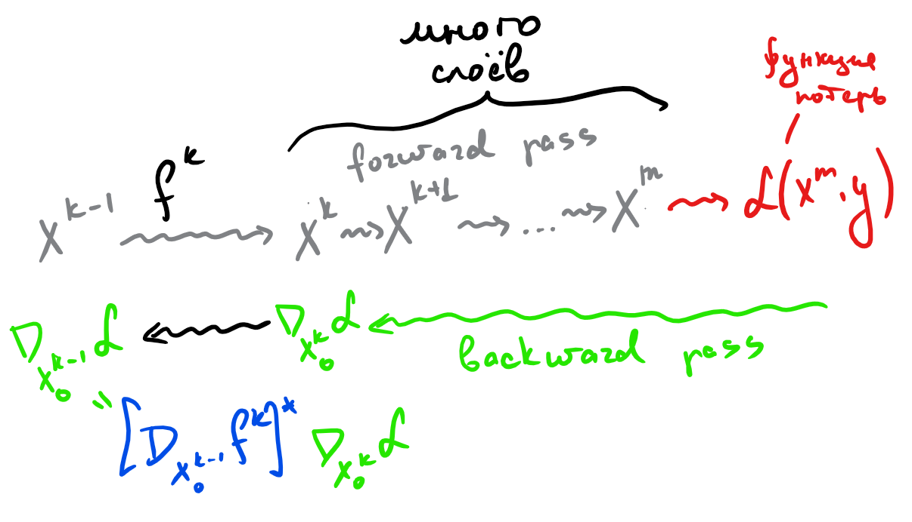{: .center }

Таким образом, слой за слоем мы посчитаем градиенты по всем $X^i$ вплоть до самых первых слоёв.

В следующем подразделе мы разберёмся, как именно преобразуются градиенты при переходе через некоторые распространённые слои.

## Градиенты для типичных слоёв

Градиенты функций $g$ и $f$,

$$
\nabla_{h(x_0)}g = \left.\left(\frac{\partial g}{\partial z_i}\right)\right|_{z = h(x_0)}, \nabla_{x_0}f = \left.\left(\frac{\partial f}{\partial x_i}\right)\right|_{x = x_0},
$$

cвязанных соотношением $f(x) = g(h(x))$, связаны друг с другом как

$$
\left.\left(\frac{\partial f}{\partial x_i}\right)\right|_{x = x_0} = \left.\left(\frac{\partial z_j}{\partial x_i}\right)\right|_{x = x_0}\cdot\left.\left(\frac{\partial g}{\partial z_j}\right)\right|_{z = h(x_0)}
$$

Казалось бы, можно использовать эту формулу -- почему нет? Но представьте, что $x$ и $z$ -- не просто векторы, а матрицы (то есть каждый из индексов $i$ и $j$ -- это на самом деле пара чисел). Тогда

$$
\left.\left(\frac{\partial z_j}{\partial x_i}\right)\right|_{x = x_0}
$$

содержит производные каждого матричного элемента $z$ по каждому матричному элементу $x$ и, таким образом, представляет из себя <<четырёхмерный кубик>>, а это не такой объект, с которым хотелось бы работать. С другой стороны, во всех типичных ситуациях преобразование $\left[D_{x_0} h \right]^*$ можно выписать явно и в довольно естественном виде.

Рассмотрим несколько важных примеров.

<details>
   <summary markdown="span">Примеры</summary>

    1.  $f(x) = g(h(x))$, где $x$ вектор, а $h(x)$ поэлементное применение $h$:


      $$
      h\begin{pmatrix}
      x_1 \\
      \vdots\\
      x_N
      \end{pmatrix}
      = \begin{pmatrix}
      h(x_1)\\
      \vdots\\
      h(x_N)
      \end{pmatrix}
      $$


      Из рассмотренных ранее примеров


      $$
      \left[D_{x_0} f\right] (x-x_0) = \left[\nabla_{x_0} f\right]^T (x-x_0).
      $$


      Тогда


      $$
      \begin{multline*}
      \left[D_{h(x_0)} g\right] \left( \left[ D_{x_0} h\right] (x-x_0)\right) = \left[\nabla_{h(x_0)} g\right]^T \left(h'(x_0) \cdot (x-x_0)\right) =\\[0.1cm]
      = \sum\limits_i \left[\nabla_{h(x_0)} g\right]_i h'(x_{0i}) (x_i - x_{0i})
      = \left( \left[\nabla_{h(x_0)} g \right] \odot h'(x_0)\right)^T (x-x_0) =\\
      = \left(\left[\nabla_{h(x_0)} g\right] \odot h'(x_0), x-x_0\right).
      \end{multline*}
      $$


      Следовательно


      $$
      \color{blue}{\nabla_{x_0} f = \left[\nabla_{h(x_0)}g\right] \odot h'(x_0) = h'(x_0) \odot \left[\nabla_{h(x_0)} g\right]}
      $$


      Отметим, что если $x$ и $h(x)$ -- это просто векторы, то мы могли бы вычислять всё и по формуле $\frac{\partial f}{\partial x_i} = \big(\frac{\partial z_j}{\partial x_i}\big)\cdot\big(\frac{\partial h}{\partial z_j}\big)$. В этом случае матрица $\big(\frac{\partial z_j}{\partial x_i}\big)$ была бы диагональной (так как $z_j$ зависит только от $x_j$: ведь $h$ берётся поэлементно), и матричное умножение приводило бы к тому же результату. Однако если $x$ и $h(x)$ -- матрицы, то $\big(\frac{\partial z_j}{\partial x_i}\big)$ представлялась бы уже <<четырёхмерным кубиком>>, и работать с ним было бы ужасно неудобно.

    2.  $f(X) = g(XW)$, где $X$ и $W$ матрицы. Из рассмотренных ранее примеров


      $$
      \left[D_{X_0} f \right] (X-X_0) = \text{tr}\, \left(\left[\nabla_{X_0} f\right]^T (X-X_0)\right).
      $$


      Тогда


      $$
      \begin{multline*}
      \left[ D_{X_0W} g \right]  \left(\left[D_{X_0} \left( \ast W\right)\right] (X-X_0)\right) = \text{tr}\, \left( \left[\nabla_{X_0W} g \right]^T \cdot (X-X_0) W \right) =\\
      =
       \text{tr} \, \left(W \left[\nabla_{X_0W} g \right]^T \cdot (X-X_0)\right) = \text{tr} \, \left( \left[\left[\nabla_{X_0W} g\right] W^T\right]^T (X-X_0)\right).
      \end{multline*}
      $$


      Здесь "$\ast W$" является отображением $Y \hookrightarrow  YW$, а в предпоследнем переходе использовалось следующее свойство следа:


      $$
          \text{tr} \, (A B C) = \text{tr} \, (C A B),
      $$


      где $A, B, C$ -- произвольные матрицы подходящих размеров (то есть допускающие перемножение в обоих приведённых порядках). Следовательно, получаем


      $$
      \color{blue}{\nabla_{X_0} f = \left[\nabla_{X_0W} g \right] \cdot W^T}
      $$


    3.  $f(W) = g(XW)$, где $W$ и $X$ матрицы. Из рассмотренных ранее примеров


      $$
          \left[D_{W_0} f \right] (W-W_0) = \text{tr} \, \left( \left[\nabla_{W_0} f \right]^T (W-W_0)\right).
      $$


      Тогда


      $$
      \begin{multline*}
      \left[D_{XW_0} g \right] \left( \left[D_{W_0} \left(X \ast\right) \right] (W-W_0)\right) = \text{tr} \, \left( \left[\nabla_{XW_0} g \right]^T \cdot X (W-W_0)\right) =\\
      =
       \text{tr}\, \left(\left[X^T \left[\nabla_{XW_0} g \right] \right]^T (W-W_0)\right); \quad \Longrightarrow \quad \nabla_{X_0} f = X^T \cdot \left[\nabla_{XW_0} g\right].
      \end{multline*}
      $$


      Здесь "$X \ast$" является отображением $Y \hookrightarrow XY$.

    4.  $f(X) = g(softmax(X))$, где $X$ -- матрица $N\times K$, а $softmax$ -- функция, которая вычисляется построчно, причём для каждой строки $x$


        $$
        softmax(x) = \left(\frac{e^{x_1}}{\sum_te^{x_t}},\ldots,\frac{e^{x_K}}{\sum_te^{x_t}}\right)
        $$


        В этом примере нам будет удобно воспользоваться формализмом с частными производными. Сначала вычислим $\frac{\partial s_l}{\partial x_j}$ для одной строки $x$, где через $s_l$ мы для краткости обозначим $softmax(x)_l = \frac{e^{x_l}}	{\sum_te^{x_t}}$. Нетрудно проверить, что


        $$
        \frac{\partial s_l}{\partial x_j} = \begin{cases}
        s_j(1 - s_j),\ & j = l,\\
        -s_ls_j,\ & j\ne l
        \end{cases}
        $$


        Так как softmax вычисляется независимо от каждой строчки, то


        $$
        \frac{\partial s_{rl}}{\partial x_{ij}} = \begin{cases}
        s_{ij}(1 - s_{ij}),\ & r=i, j = l,\\
        -s_{il}s_{ij},\ & r = i, j\ne l,\\
        0,\ & r\ne i
        \end{cases}
        $$


        где через $s_{rl}$ мы обозначили для краткости $softmax(X)_{rl}$.

        Теперь пусть $\nabla_{rl} = \nabla g = \frac{\partial\mathcal{L}}{\partial s_{rl}}$ (пришедший со следующего слоя, уже известный градиент). Тогда


        $$
        \frac{\partial\mathcal{L}}{\partial X_{ij}} = \sum_{r,l}\frac{\partial s_{rl}}{\partial x_{ij}} \nabla_{rl}
        $$


        Так как $\frac{\partial s_{rl}}{\partial x_{ij}} = 0$ при $r\ne i$, мы можем убрать суммирование по $r$:


        $$
        \ldots = \sum_{l}\frac{\partial s_{il}}{\partial x_{ij}} \nabla_{il} = -s_{i1}s_{ij}\nabla_{i1} - \ldots + s_{ij}(1 - s_{ij})\nabla_{ij}-\ldots - s_{iK}s_{ij}\nabla_{iK} =
        $$


        $$
        = -s_{ij}\sum_t s_{it}\nabla_{ij} + s_{ij}\nabla_{ij}
        $$


        Таким образом, если мы хотим хотим продифференцировать $f$ в какой-то конкретной точке $X_0$, то, смешивая математические обозначения с нотацией Python, мы можем записать:


        $$
        \nabla_{X_0}f = -softmax(X_0) \odot \text{sum}\left(\nabla_{softmax(X_0)}g,\text{ axis = 1}\right) + softmax(X_0)\odot \nabla_{softmax(X_0)}g
        $$

</details>

<!-- 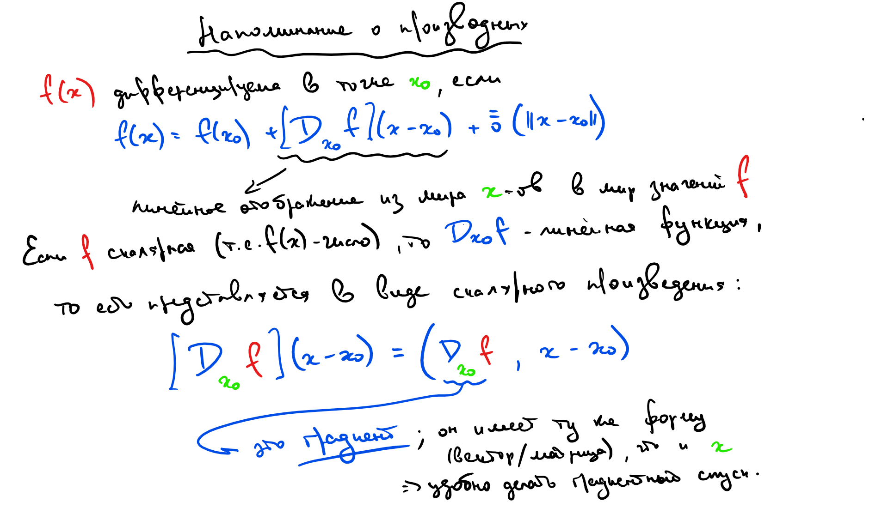
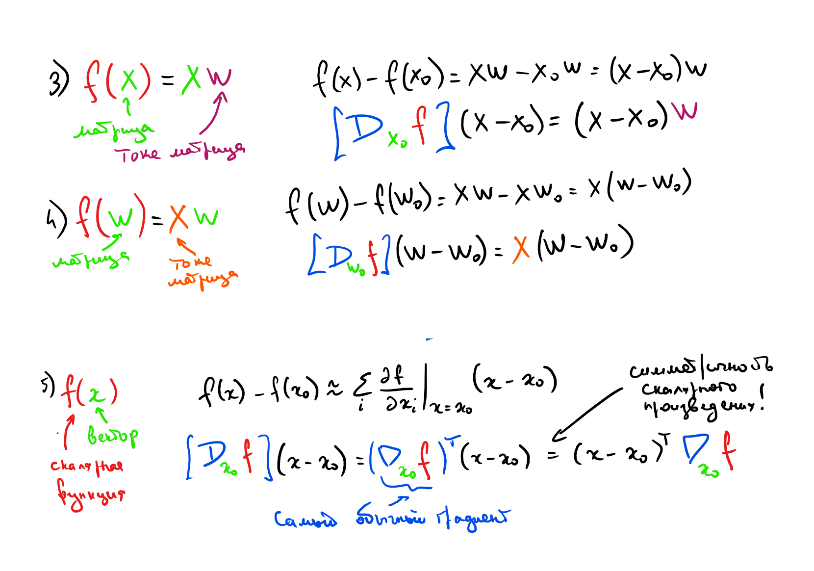
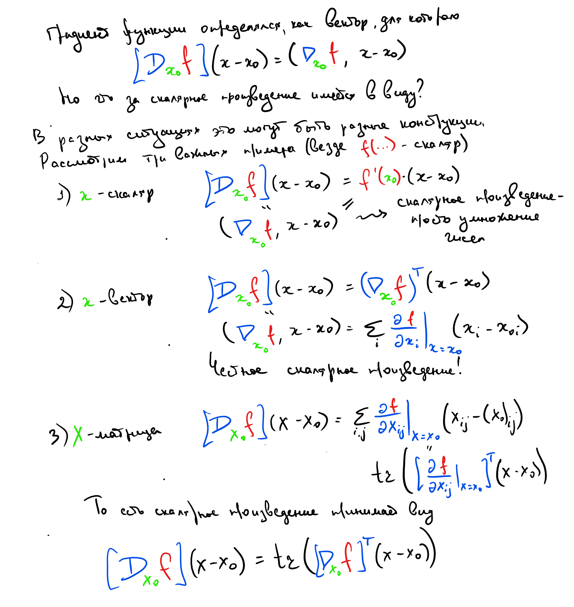
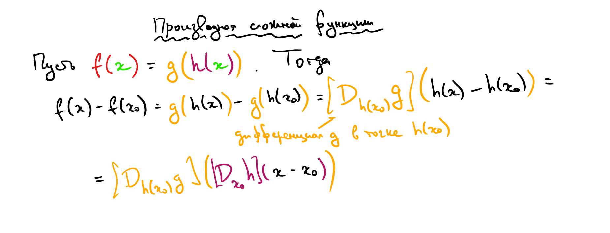
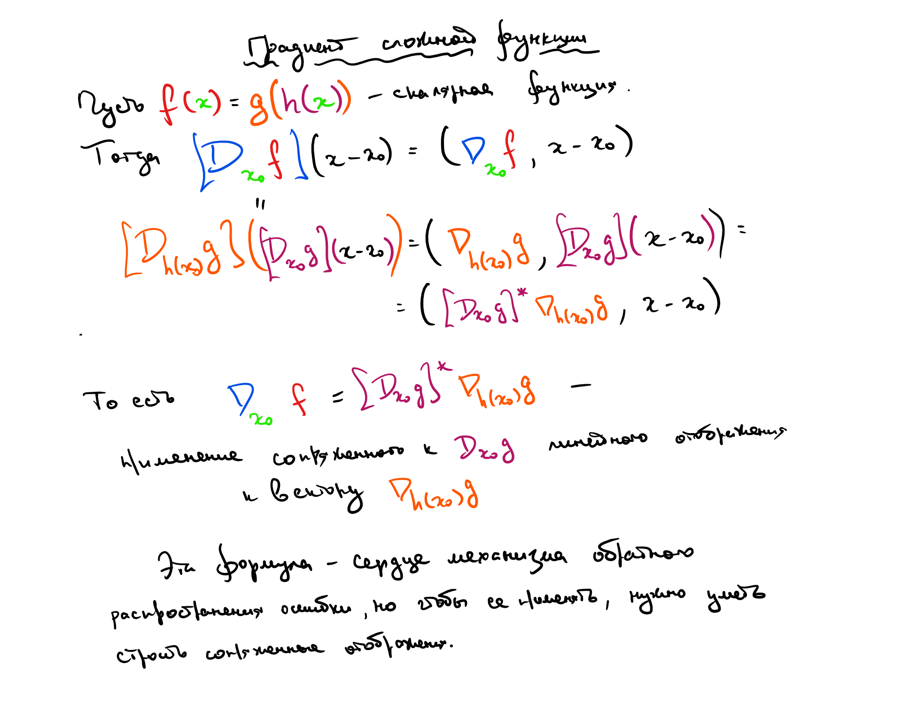
Примеры можно нати под катом
<mark> #TBD картинку под кат
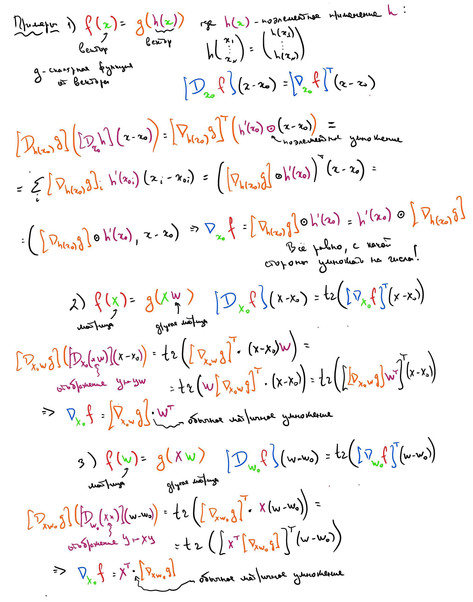
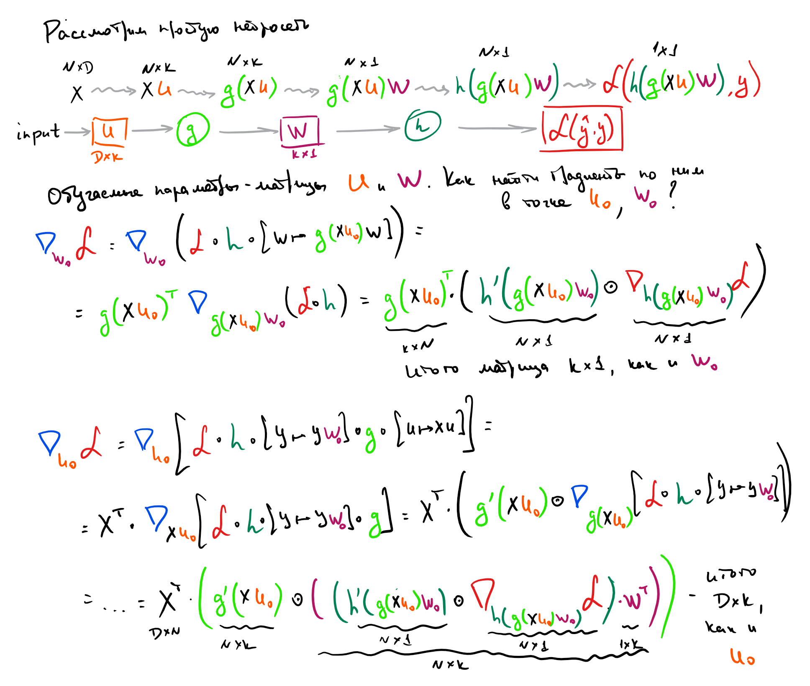
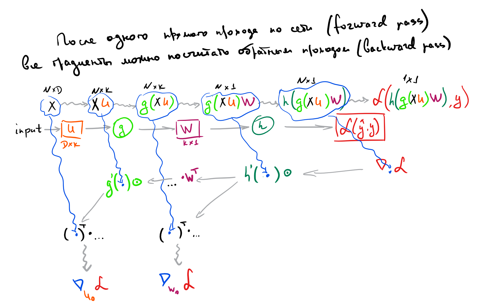
<mark> Предлагаю пока оставить картинками. Первые две затехал. -->

&nbsp;

## Backpropagation в общем виде

Подытожим предыдущее обсуждение, описав алгоритм _error backpropagation_ (обратного распространения ошибки). Допустим, у нас есть текущие значения весов $W^i_0$, и мы хотим совершить шаг SGD по минибатчу $X$. Мы должны сделать следующее:

1. Совершить forward pass, вычислив и запомнив все промежуточные представления $X = X^0, X^1, \ldots, X^m = \widehat{y}$;
2. Вычислить все градиенты с помощью backward pass;
3. С помощью полученных градиентов совершить шаг SGD.

Проиллюстрируем алгоритм на примере двуслойной нейронной сети со скалярным output'ом. Для простоты опустим свободные члены в линейных слоях.


Схематически это можно представить следующим образом:


&nbsp;

## Backpropagation для двуслойной нейронной сети

<details>
  <summary markdown="span">Если вы не уследили за вычислениями в предыдущем примере, давайте более подробно разберём его чуть более конкретную версию</summary>

    Рассмотрим двуслойную нейронную сеть для классификации. Мы уже встречали ее ранее при рассмотрении линейно неразделимой выборки. Предсказания получаются следующим образом:


    $$
    \widehat{y} = \sigma(X^1 W^2) = \sigma\Big(\big(\sigma(X^0 W^1 )\big) W^2 \Big).
    $$


    Пусть $W^1_0$ и $W^2_0$ -- текущее приближение матриц весов. Мы хотим совершить шаг по градиенту функции потерь, и для этого мы должны вычислить её градиенты по $W^1$ и $W^2$ в точке $(W^1_0, W^2_0)$.

    Прежде всего мы совершаем forward pass, в ходе которого мы должны запомнить все промежуточные представления: $X^1 = X^0 W^1_0$, $X^2 = \sigma(X^0 W^1_0)$, $X^3 = \sigma(X^0 W^1_0) W^2_0$, $X^4 = \sigma(\sigma(X^0 W^1_0) W^2_0) = \widehat{y}$. Они понадобятся нам дальше.

    Для полученных предсказаний вычисляется значение функции потерь:


    $$
    l = \mathcal{L}(y, \widehat{y}) = y \log(\widehat{y}) + (1-y) \log(1-\widehat{y}).
    $$


    Дальше мы шаг за шагом будем находить производные по переменным из всё более глубоких слоёв.

    1.  Градиент $\mathcal{L}$ по предсказаниям имеет вид


      $$
        \nabla_{\widehat{y}}l = \frac{y}{\widehat{y}} - \frac{1 - y}{1 - \widehat{y}} = \frac{y - \widehat{y}}{\widehat{y} (1 - \widehat{y})},
      $$


      где, напомним, $ \widehat{y} = \sigma(X^3) = \sigma\Big(\big(\sigma(X^0 W^1_0 )\big) W^2_0 \Big)$ (обратите внимание на то, что $W^1_0$ и $W^2_0$ тут именно те, из которых мы делаем градиентный шаг).

    2.  Следующий слой -- поэлементное взятие $\sigma$. Как мы помним, при переходе через него градиент поэлементно умножается на производную $\sigma$, в которую подставлено предыдущее промежуточное представление:


        $$
            \nabla_{X^3}l = \sigma'(X^3)\odot\nabla_{\widehat{y}}l = \sigma(X^3)\left( 1 - \sigma(X^3) \right) \odot \frac{y - \widehat{y}}{\widehat{y} (1 - \widehat{y})} =
        $$


        $$
            = \sigma(X^3)\left( 1 - \sigma(X^3) \right) \odot \frac{y - \sigma(X^3)}{\sigma(X^3) (1 - \sigma(X^3))} =
            y - \sigma(X^3)
        $$


    3.  Следующий слой -- умножение на $W^2_0$. В этот момент мы найдём градиент как по $W^2$, так и по $X^2$. При переходе через умножение на матрицу градиент, как мы помним, умножается с той же строны на транспонированную матрицу, а значит:


      $$
        \color{blue}{\nabla_{W^2_0}l} = (X^2)^T\cdot \nabla_{X^3}l = (X^2)^T\cdot(y - \sigma(X^3)) =
      $$


      $$
        = \color{blue}{\left( \sigma(X^0W^1_0) \right)^T \cdot (y - \sigma(\sigma(X^0W^1_0)W^2_0))}
      $$


      Аналогичным образом


      $$
        \nabla_{X^2}l = \nabla_{X^3}l\cdot (W^2_0)^T = (y - \sigma(X^3))\cdot (W^2_0)^T =
      $$


      $$
        = (y - \sigma(X^2W_0^2))\cdot (W^2_0)^T
      $$


    4.  Следующий слой -- снова взятие $\sigma$.


      $$
        \nabla_{X^1}l = \sigma'(X^1)\odot\nabla_{X^2}l = \sigma(X^1)\left( 1 - \sigma(X^1) \right) \odot \left( (y - \sigma(X^2W_0^2))\cdot (W^2_0)^T \right) =
      $$


      $$
        = \sigma(X^1)\left( 1 - \sigma(X^1) \right) \odot\left(  (y - \sigma(\sigma(X^1)W_0^2))\cdot (W^2_0)^T \right)
      $$


    5.  Наконец, последний слой -- это умножение $X^0$ на $W^1_0$. Тут мы дифференцируем только по $W^1$:


      $$
        \color{blue}{\nabla_{W^1_0}l} = (X^0)^T\cdot \nabla_{X^1}l = (X^0)^T\cdot \big( \sigma(X^1) \left( 1 - \sigma(X^1) \right) \odot (y - \sigma(\sigma(X^1)W_0^2))\cdot (W^2_0)^T\big) =
      $$


      $$
        = \color{blue}{(X^0)^T\cdot\big(\sigma(X^0W^1_0)\left( 1 - \sigma(X^0W^1_0) \right) \odot (y - \sigma(\sigma(X^0W^1_0)W_0^2))\cdot (W^2_0)^T\big) }
      $$


    Итоговые формулы для градиентов получились страшноватыми, но они были получены друг из друга итеративно с помощью очень простых операций: матричного и поэлементного умножения, в которые порой подставлялись значения заранее вычисленных промежуточных представлений.

</details>

&nbsp;

# Затухание градиента

Несмотря на эффективность и огромную значимость метода обратного распространения ошибки в обучении современных нейронных сетей, при его использовании может возникнуть множество проблем. Одна из них, свойственная всем глубоким нейронным сетям, связана с затуханием градиента. В данной главе мы рассмотрим лишь основные причины и способы борьбы с ним, так как глубокий разбор данной темы далеко выходит за рамки текущего повествования.

Рассмотрим нейронную сеть из нескольких линейных слоев с сигмоидой в качестве функции активации. Пусть

$$
    X^1 = \sigma(Z^1) = \sigma(W^1 X^0),
$$

где в качестве $Z^1$ обозначен результат применения линейного слоя. Свободный член, как и ранее, опущен для упрощения выкладок.

Рассмотрим график сигмоиды и ее производной:
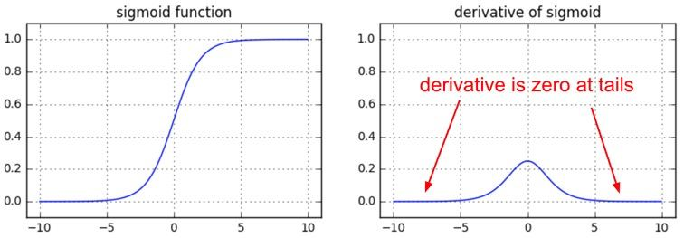{: .center style="width:40vw"}

На "хвостах" ее производная практически равна нулю (ведь сигмоида представляет собой почти константу). То есть если какое-то значение $Z^1$ было достаточно велико по абсолютной величине (например, $\vert z^1_k \vert = 7.4$), то градиент функции потерь для этой компоненты будет домножен на очень малое число, и фактически станет равным 0.

$$
\frac{\partial l}{\partial W^0_{k, :}} = \frac{\partial l}{\partial X^1_k}\frac{\partial X^1_k}{\partial Z^1_k} \frac{\partial Z^1_k}{\partial W^0_{k,:}} \approx \frac{\partial l}{\partial X^1_k} \cdot 0 \cdot \frac{\partial Z^1_k}{\partial W^0_{k,:}} \approx 0.
$$

Получается, что $k$ -ая строка матрицы $W^0$ не будет обновлена: ведь градиент равен нулю. Это может привести "отмиранию" нейрона: неудачное значение параметров приведёт к невозможности их обновления.

_Примечание: это одна из причин необходимости нормировки данных и выбора правильной инициализации для начальных значений параметров нейронной сети._

Но помимо явного обнуления градиента есть и вторая проблема: максимальное значение производной сигмоиды составляет $0.25$. Т.е. она всегда уменьшает значение градиента не менее чем в 4 раза. Если же представить себе глубокую сеть с 20+ слоями, то для каждого следующего (если считать с конца) слоя градиент будет домножаться на число, не превосходящее $0.25$. Так, для переменных из первого слоя коэффициент составит $4^{-20}$.

Пример выше был приведен для сигмоиды в качестве функции активации. Но затухание градиента происходит во всех нейронных сетях, и все глубокие нейронные сети "ощущают" следствие затухания градиентов.

_Примечание: Особенно сильно затухание градиентов проявляет себя в рекуррентных нейронных сетях. Они будут рассмотрены в дальнейшем_.

Использование различных функций активации обусловлено в том числе и борьбой с затуханием градиентов. Рассмотрим их далее.

&nbsp;

# Функции активации

{: .center style="width:30vw"}

1. **Sigmoid**, сигмоида

   $$
   \sigma(x) = \frac{1}{1 + \exp(-x)},
   $$

   $$
   \sigma: \mathbb{R} \to (0, 1).
   $$

   Одна из первых функций активации. Рассматривалась в том числе и как гладкая аппроксимация порогового правила, эмулирующая активацию естественного нейрона.

   К минусам сигмоиды можно отнести:

   - Область значений смещена относительно нуля
   - Сигмоида (как и ее производная) требует вычисления экспоненты, что является достаточно сложной вычислительной операцией. Ее приближенное значение вычисляется на основе ряда Тейлора или с помощью полиномов, StackOverflow [question 1](https://stackoverflow.com/questions/53419270/how-does-numpy-compute-an-exponential), [question 2](https://stackoverflow.com/questions/9799041/efficient-implementation-of-natural-logarithm-ln-and-exponentiation).
   - На “хвостах” обладает практически нулевой производной, что может привести к затуханию градиента.
   - Максимальное значение производной составляет $0.25$, что также приводит к затуханию градиента.

   На практике используется редко, чаще всего в случаях, когда внутри модели решается задача бинарной классификации (например, вероятность забывания информации в LSTM, что будет рассмотрено далее).

2. **Tanh**, гиперболический тангенс

   $$
   \tanh(x) = \frac{\exp(x) - \exp(-x)}{\exp(x) + \exp(-x)},
   $$

   $$
   \tanh: \mathbb{R} \to (-1, 1).
   $$

   Крайне похож на сигмоиду, но имеет симметричную область значений.

   Минусы:

   - требует вычисления экспоненты, что является достаточно сложной вычислительной операцией.
   - На “хвостах” обладает практически нулевой производной, что может привести к затуханию градиента.
     Используется в случаях, когда область значений должна быть ограничена, например, в рекуррентных нейронных сетях (будут рассмотрены далее).

3. **ReLU (Rectified Linear Unit)**

   $$
   \text{ReLU}(x) = \max(0, x),
   $$

   $$
   \text{ReLU}: \mathbb{R} \to [0, +\infty).
   $$

   ReLU представляет собой простую кусочно-линейную функцию. Одна из наиболее популярных функций активации. В нуле производная доопределяется нулевым значением.

   Минусы:

   - Область значений является смещенной относительно нуля.
   - Для отрицательных значений производная равна нулю, что может привести к затуханию градиента.

   Плюсы:

   - Простота вычисления активации и производной.

   ReLU и ее производная очень просты для вычисления: достаточно лишь сравнить значение с нулем. Благодаря этому использование ReLU позволяет достигать прироста в скорости до 4-6 раз относительно сигмоиды.

4. **Leaky ReLU**

   $$
   \text{Leaky ReLU}(x) = \max(\alpha x, x), \quad \alpha = \text{const}, 0 < \alpha \ll 1
   $$

   $$
   \text{Leaky ReLU}: \mathbb{R} \to (-\infty, +\infty).
   $$

   Гиперпараметр $\alpha$ обеспечивает небольшой уклон слева от нуля, что позволяет получить более симметричную относительно нуля область значений. Также меньше провоцирует затухание градиента благодаря наличию ненулевого градиента и слева, и справа от нуля.

5. **PReLU, Parametric ReLU**

   $$
   \text{PReLU}(x) = \max(\alpha x, x), \quad 0 < \alpha \ll 1
   $$

   $$
   \text{PReLU}: \mathbb{R} \to (-\infty, +\infty).
   $$

   Аналогична Leaky ReLU, но параметр $\alpha$ настраивается градиентными методами.

6. **ELU** – гладкая аппроксимация ReLU. Обладает более высокой вычислительной сложностью, достаточно редко используется на практике.

&nbsp;

# Интерактивный пример

Теперь, разобрав все базовые понятия и принципы работы нейронных сетей, вы можете попробовать поработать с замечательной интерактивной иллюстрацией нейронных сетей, доступной по [ссылке](https://playground.tensorflow.org).

Обратите внимание на области активации каждого из нейронов, которые указаны внутри соответствующих им ячеек. Оранжевый цвет соответствует положительным значениям, синий – отрицательным.

Также рекомендуем рассмотреть форму разделяющей поверхности при использовании линейной функции активации и нескольких слоев в нейронной сети.

**Упражнение:**
Для интереса можете решить задачу классификации для двойной спирали с помощью наименее сложной сети (4-5 слоев, без использования дополнительных признаков).

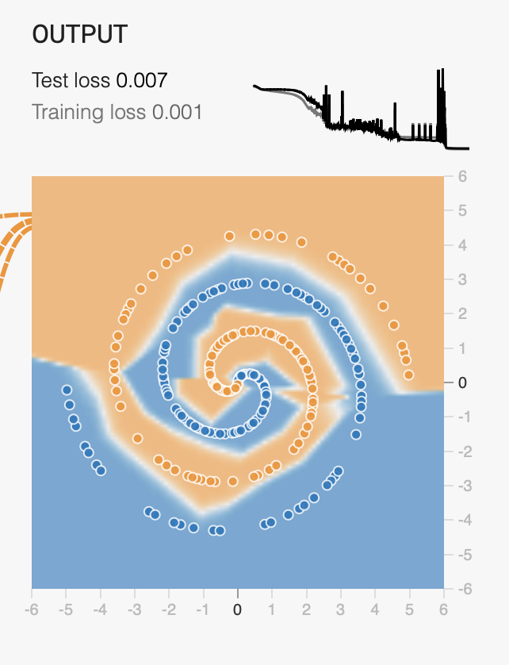{: .center style="width:300px"}

&nbsp;

# Differentiable programming, autograd

Итак, мы уже поняли, что нейросеть -- это вычислительный граф, составленный из дифференцируемых операций, для каждого параметра в котором довольно просто посчитать градиент, и с помощью метода обратного распространения ошибки изменить веса, или, другими словами, улучшить всю сеть, оптимизировав какую-то функцию потерь по параметрам. Теперь давайте попробуем понять, как это выглядит в коде, и почему с нейросетями столь весело работать.

Для начала наблюдение: метод обратного распространения ошибки прекрасен не тем, что он дает вычислить частные производные лосса по весам аналитически (хоть это и правда, но это и без него можно было сделать), а тем, что задачу построения процедуры вычисления градиентов для данного вычислительного графа можно полностью автоматизировать и легко реализовать в библиотеке. В самом деле, достаточно для каждого слоя реализовать прямой проход и обратный проход градиента -- и такие слои можно громоздить друг на друга в произвольном количестве. Более того, во многих случаях авторы библиотек для глубинного обучения уже о вас позаботились и создали средства для автоматического дифференцирования выражений. Поэтому, программируя нейросеть, вы почти всегда можете думать только о forward проходе, прямом преобразовании данных, и при условии, что у вас будет достаточно данных для обучения, это преобразование сможет обучиться. Это делает код нейросетей весьма понятным и выразительным (да, в реальности он тоже бывает большим и страшным, но сравните на досуге код какой-нибудь разухабистой нейросети и код градиентного бустинга на решающих деревьях и почувствуйте разницу).

Чтобы это проиллюстрировать, посмотрим на код. Давайте запрограммируем логистическую регрессию в виде нейросети на псевдокоде, похожем на питон, и в гипотетической библиотеке deep learning.

```python
import nn

X, y = get_data() # читаем данные, X - матрица, y - вектор
w = nn.Matrix(X.shape()[0], 1) # вектор весов модели

for i in range(100): # итерации градиентного спуска
    p = nn.sigmoid(nn.dot(w, x)) # предсказание модели. Обратите внимание, что собственно нейросеть задана именно в этой строчке
    loss = nn.logloss(p, y) # считаем ошибку

    dw = nn.grad(loss, w) # авторы библиотеки уже запрограммировали для нас backpropagation, а не только вычисление градиента
    w -= 1e-4 * dw  # обновление весов модели 1e-4 -- learning rate
```

Выглядит освежающе просто, не правда ли? Ясно, что в реальности алгоритм будет выглядеть чуть сложнее. Как минимум, стоило бы разбить обучающую выборку на батчи и сделать какую-то валидацию, но, тем не менее, это уже минимальный жизнеспособный пример.

Попробуем развить идею и сделать нейросеть двуслойной.

```python
import nn

X, y = get_data()
w1 = nn.Matrix(X.shape()[0], 50) # теперь это матрица, 50 - размерность скрытого слоя
w2 = nn.Matrix(50, 1) # веса второго слоя

for i in range(100):
    first = nn.ReLU(nn.dot(w1, x)) # вычисляем первый слой и применяем функцию активации
    p = nn.ReLU(nn.dot(w2, first))
    loss = nn.logloss(p, y) # считаем ошибку

    dw1, dw2 = nn.grad(loss, w1, w2) # библиотека вычисляет градиенты и делает backpropagation
    w1 -= 1e-4 * dw1
    w2 -= 1e-4 * dw2
```

Концептуальные изменения огромные: алгоритм больше не линейный, в нем $$O(n^2)$$ параметров, а не $$O(n)$$, а цена этих изменений -- три строчки кода. В реальной же библиотеке их будет всего две, потому что описание шагов градиентного спуска довольно просто автоматизировать универсальным образом.

&nbsp;

# Архитектуры для различных задач и типов данных

Как мы уже упоминали выше, нейросети -- это универсальный конструктор, который из простых блоков позволяет собрать орудия для решения самых разных задач. Давайте посмотрим на конкретные примеры. Безусловно, мир намного разнообразнее того, что мы покажем вам в этом разделе, но с чего-то ведь надо начинать, не так ли?

&nbsp;

## Бинарная классификация

Для решения задачи бинарной классификации подойдёт любая архитектура, на выходе у которой одно число от 0 до 1, интерпретируемое как <<вероятность класса 1>>. Обычно этого добиваются, взяв

$$
\widehat{y} = \sigma(f(X^m))
$$

где $f$ --- некоторая функция, превращающая представление $X^m$ в число (если $X^m$ -- матрица, то подойдёт $f(X^m) = X^mw + b$, где $w$ -- вектор-столбец). При этом $X^m$ может получаться как угодно, лишь бы хватало оперативной памяти и не было переобучения.

&nbsp;

## Многоклассовая классификация

Раньше нам приходилось выдумывать сложные стратегии многоклассовой классификации; нейросети позволяют это делать легко и элегантно. Достаточно построить сеть, которая будет выдавать $K$ неотрицательных чисел, суммирующихся в 1 (где $K$ -- число классов); тогда им можно придать смысл вероятностей классов и предсказывать тот класс, <<вероятность>> которого максимальна (в главе про вероятностные модели мы обсудим, почему это не будут настоящие вероятности). Превратить произвольный набор из $K$ чисел в набор из неотрицательных чисел, суммирующихся в 1, позволяет, к примеру, функция

$$
\text{softmax}(x_1,\ldots,x_K) = \left( \frac{e^{x_1}}{\sum_ie^{x_i}},\ldots,\frac{e^{x_K}}{\sum_ie^{x_i}} \right)
$$

Наиболее популярные архитектуры для многоклассовой классификации имеют вид

$$
\widehat{y} = \text{softmax}(f(X^m))
$$

где $f$ -- функция, превращающая $X^m$ в матрицу $B\times K$ (где $B$ -- размер батча), а $X^m$ может быть получен любым приятным вам образом.

Но какой будет функция потерь для такой сети? Мы должны научиться сравнивать <<распределение вероятностей классов>> с истинным (в котором на месте истинного класса стоит 1, а в остальных местах 0). Сделать это позволяет _кросс-энтропия_ (она же _negative log likelihood_), которая является некоторым аналогом расстояния между распределениями:

$$
\mathcal{L}(\widehat{y}, y) = -\frac1B\sum_{i=1}^B\sum_{k=1}^Ky_{ik}\log{\widehat{y}_{ik}}
$$

где снова $B$ -- размер батча, а $K$ -- число классов. Легко видеть, что при $k = 2$ получается та самая функция потерь, которую мы использовали для обучения бинарной классификации.

&nbsp;

## (Множественная) регрессия

С помощью нейросетей легко создать модель, которая предсказывает не одно число, а сразу несколько (например, координаты ключевых точек лица -- кончика носа, уголков рта и так далее -- по фотографии). Достаточно сделать, чтобы последнее представление было матрицей $B\times M$, где $B$ -- размер батча, а $M$ -- количество предсказываемых чисел. Особенностью большинства моделей регрессии является то, что после последнего слоя (часто линейного) не ставят функций активации. Вы тоже этого не делайте, если только чётко не понимаете, зачем вам это. В качестве функции потерь можно брать, например, $MSE$ по всей матрице $B\times M$.

&nbsp;

## Всё вместе

Если вы используете нейросети, то ваши таргеты могут иметь и различную природу. Например, можно соорудить одну-единственную сеть, которая по фотографии нескольких котиков определяет их количество (регрессия) и породу каждого из них (множественная классификация). Лосс для такой модели может быть равен сумме лоссов для каждой из задач (правда, не факт, что это хорошая идея). Так что, по крайней мере в теории, сетям подвластны любые задачи. На практике, конечно, всё гораздо хитрей: для обучения слишком сложной сети у вас может не хватить данных или вычислительных мощностей.

&nbsp;

## Работа с данными сложной структуры

Линейные слои вместе с нелинейными функциями активации позволяют решить много задач, но всех их объединяет то, что на вход нейросети мы подаём вектор признаков. Если же мы имеем дело с чем-то более сложным, приходится эти признаковые описания обучать. При описании данных различной природы имеет смысл использовать параметрические преобразования, _учитывающие структуру и природу данных_, и здесь нейронные сети встают в полный рост. Проиллюстрируем это на классических примерах работы с текстами и изображениями.

### Тексты и последовательности

Область машинного обучения, посвящённая работе с текстами, называется **Natural Language Processing (NLP)**. Круг задач, рассматриваемых в этой области, очень широк. Среди них можно перечислить, например, такие задачи, как:

- Автоматический перевод текстов
- Классификация текстов. Например, является ли некоторое сообщение спамом, или нет
- Генерация текстов. Например, если вы разговариваете с Яндекс-Алисой на свободные темы, она должна вам как-то осмысленно отвечать
- Суммаризация текстов. Это задача генерации краткого содержания некоторого большого текста
- Извлечение именованных сущностей (NER). Именованные сущности -- это персоны, локации, организации, даты, денежные суммы и т.д. Важная задача -- уметь находить их в тексте
- Вопросно-ответные диалоговые системы. Классические примеры -- Алиса, Amazon Alexa, Google Assistant. Эти системы уже решают не одну задачу, а целый набор: сначала им нужно извлечь полезную информацию из запроса пользователя, затем обратиться в какую-то базу знаний на основе этого запроса, найти релевантный ответ, а затем сгенерировать ответ пользователю на естественном языке
- Генерация текстового описания картинки

Текст изначально не имеет численного представления, поэтому перед тем, как подать его в модели машинного обучения, это представление нужно получить. Представления слов в виде векторов вещественнных чисел называются **эмбеддингами**, получение хороших эмбеддингов -- отдельная большая и сложная задача (отличный иллюстрированный гайд по эмбеддингам можно найти [здесь](https://jalammar.github.io/illustrated-word2vec/)). После того, как эти представления были получены, они могут быть поданы в модель, и дальше отдельный большой этап -- построить наилучшую модель для решения вашей задачи.

Развернутый обзор архитектур, проблем и их решений в NLP доступен [здесь](nlp.md) и в замечательном [курсе по NLP](https://lena-voita.github.io/nlp_course.html) Лены Войта.

### Изображения

Достижения в области компьютерного зрения также являются важным примером того, как правильный выбор преобразований (учитывающих структуру данных) приводит к значимым результатам. Изображения, по факту, являются набором пикселей, и информация содержится именно в том, как они упорядочены. В отличие от текстов, пиксели могут быть упорядочены по двум направлениям (а в общем случае и по множеству, например, при работе с результатами трехмерного сканирования или с видео).

Обзор сверточных сетей и основных операций доступен [здесь](cnn).

Внимательные читатели обратят внимание, что операция пуллинга (особенно Average Pooling) очень похожа на операцию усреднения нескольких векторов слов. Это абсолютно верное замечание. Подходы в областях NLP и CV сильно пересекаются (в том числе благодаря сходной структуре данных) и открытия в одной области зачастую могут быть обусловлены на недавние достижения в другой. Усреднение нескольких векторов вдоль оси времени – классический global average pooling, который также позволяет справляться с непостоянной размерностью данных на входе (вдоль оси времени в последовательностях, вдоль длины и ширины в изображениях или же где-то еще в других случаях). Также в текстах применимы и операции свертки: одномерные свертки позволяют брать во внимание сразу несколько слов, а последовательность из нескольких сверточных блоков повышает receptive field – аналогично изображениям. В конце обычно стоит global average или же global max pooling, т.к. сам способ построения признакового описания для текста все еще должен давать вектор фиксированной размерности.

# Методы оптимизации в нейронных сетях.

Так как мы договорились, что нейросети представляют из себя параметризованные дифференцируемые функции, и для каждого параметра мы можем посчитать градиент, то так же, как и линейные модели, их можно настраивать с помощью градиентных методов. В главе про линейные модели мы под этим подразумевали обычно стохастический градиентный спуск на батчах, и это совершенно подходящий способ и для нейросетей тоже. Существует несколько эвристик, позволяющих ускорить его сходимость, мы их собрали в специальной [Главе](opt). Мы вам рекомендуем её изучить, чтобы слова _nesterov momentum_, _RMSProp_ и _Adam_ были вам в общих чертах знакомы.

&nbsp;

# Регуляризация нейронных сетей

Смысл термина "**регуляризация**" (англ. regularization) гораздо шире привычного вам прибавления $L_1$- или $L_2$- нормы вектора весов к функции потерь. Фактически он объединяет большое количество техник для борьбы с переобучением и для получения более подходящего решения с точки зрения эксперта. Каждая из них позволяет навязать модели определённые свойства, пусть даже и ценой некоторого снижения качества предсказания на обучающей выборке. Например, уже знакомая читателю $L_1$- или $L_2$-регуляризация в задаче линейной регресии (регуляризация Тихонова) позволяет исключить наименее значимые признаки (в для линейной модели) или же получить устойчивое (хоть и смещенное) решение в случае мультиколлинеарных признаков.

В нейронных сетях техники регуляризации можно разделить на три обширных группы:

- Связанные с изменением функции потерь
- Связанные с изменением структуры сети
- Связанные с изменением данных

Рассмотрим каждую из них подробнее.

&nbsp;

## Регуляризация через функцию потерь

Изменение функции потерь – классический способ получить решение, определенным условиям. В глубоком обучении часто используется техника Weight Decay, очень близкая к регуляризации Тихонова. Она представляет собой аналогичный штраф за высокие значения весов нейронной сети с коэффициентом регуляризации $\lambda$:

$$
L_\text{with regularization} = L_\text{original} + \lambda ||\mathbf{\theta}||_2
$$

Данная техника регуляризации была совмещена с методом градиентной оптимизации Adam, в результате чего был получен метод AdamW. Подробнее прочитать можно в [блоге Fast.ai](https://www.fast.ai/2018/07/02/adam-weight-decay/).

Также достаточно часто в качестве регуляризационного члена встречается энтропия распределения, предсказанного нейронной сетью. Представьте, что вы рекомендуете пользователю товары по истории его взаимодействия с сервисом, семплируя товары для показа в соответствии с распределением предсказанной релевантности. Вам может быть важно, чтобы рекомендации не были фиксированными (менялись при обновлении страницы), ведь это повысит вероятность того, что пользователь найдёт что-то интересное, а вы узнаете о нём что-нибудь новое. В такой ситуации при обучении модели вы можете потребовать, чтобы распределение предсказаний не сходилось к вырожденному, и в качестве дополнительной штрафной функции может выступать энтропия этого распределения. Энтропия дифференцируема, как и сами предсказанные величины, и может быть использована в качестве регуляризационного члена. Для задачи классификации он будет выглядеть следующим образом:

$$
\widehat{\mathbf{p}} = f(x; \mathbf{\theta}),
$$

$$
L_\text{with regularization} = L_\text{original} - \lambda \; \sum_k p_k \log p_k,
$$

где $\lambda$ – коэффициент регуляризации. Тем самым эксперт привносит своё знание непосредственно в процесс обучения модели в подходящей математической форме: <<предсказания должны быть разнообразными>> –> <<распределение не должно быть вырожденным>> –> <<энтропия не должна быть слишком низкой>>.

&nbsp;

## Регуляризация через ограничение структуры модели

Внесение подходящих преобразований в структуру сети также может быть хорошим способом добиться желаемых результатов. Огромное влияние на развитие нейронных сетей оказали техники [Dropout (2014)](https://jmlr.org/papers/v15/srivastava14a.html) и [Batch Normalization (2015)](https://arxiv.org/abs/1502.03167), позволившие сделать нейронные сети более устойчивыми к переобучению и многократно ускорить их сходимость соответственно.

**Dropout**
Обратимся к простым полносвязным (FC/Dense) сетям из нескольких слоев. Каждый из слоев порождает новое признаковое описание объекта $x^{k+1}$, который пришел на вход:

$$
x_{k+1} = f_k(x^{k+1}; x^{k}).
$$

Но как можно гарантировать, что модель будет эффективно использовать все доступные параметры, а не переобучится под использование лишь небольшого их подмножества, поделив для себя внутреннее представление на сигнал и шум?

$$
x^{k+1}_\text{overfitted} = [\text{signal}, \text{noise}].
$$

Для этого можно было бы случайным образом <<выключать>> доступ к некоторым координатам внутренних представлений на этапе обучения. Тогда при выключении <<полезных>> координат произойдет резкое изменение предсказаний модели, что приведет к увеличению ошибки, а полученные градиенты этой ошибки укажут, как ее исправить с использованием (и изменением) других координат.

{: .center style="width:600px"}

_Обращаем ваше внимание, что <<выключать>> можно как оригинальные признаки, так признаки, возникающие на любом другом уровне представления объектов. С точки зрения $(k+1)$-го слоя нейронной сети данные приходят откуда-то извне: при $k=0$ – из реального мира, а при $k > 1$ – с предыдущих слоев._

Технически это осуществляется следующим образом: после некоторые координаты внутреннего представления домножаются на ноль. Т.е. добавляется еще одно преобразование, которое представляет собой домножение выхода предыдущего слоя на маску из нулей и единиц.

$$
x^{k+1} = \frac1{1-p} x^{k} \odot \text{mask},
$$

$$
\text{mask}_{i} \sim \text{Bernoilli}(1 - p).
$$

где $(1-p)$ (вероятность обнуления координаты) является гиперпараметром слоя (отметим, что во многих фреймворках для глубинного обучения в качестве параметра слоя указывается именно вероятность обнуления, а не выживания). Данная маска участвует и при подсчёте градиентов:

$$
\nabla_{x^{k}}{\mathcal{L}} = \frac1{1-p}\nabla_{x^{k+1}}{\mathcal{L}} \odot \text{mask}
$$

Как правило, маска генерируется независимо на каждом шаге градиентного спуска. Важно отметить, что на этапе предсказания dropout ничего не меняет, то есть $x^{k+1} = x^k$.

Множитель $\frac1{1-p}$ нужен для того, чтобы распределение $x^{k+1}$ на этапе предсказания совпадало с распределением на этапе обучания. В самом деле, если даже математическое ожидание $x^k$ было равно нулю, выборочная дисперсия $x^k\odot\text{mask}$ ниже, чем у $x^k$: ведь часть значений обнулилась.

_Также при рассмотрении техники Dropout полезно провести аналогии с другим алгоритмом, использующем техники ансамблирования и метод случайных подпространств: речь о случайном лесе (Random Forest). При обучении сети на каждом шаге обучается лишь некоторая подсеть (некоторый подграф вычислений из исходного графа). При переходе в режим inference (т.е. применения к реальным данным с целью получения результата, а не обучения), активируются сразу все “подсети”, и их значения усредняются. Таким образом, сеть с Dropout можно рассматривать как ансамбль из экспоненциально большого числа сетей меньшего размера (подробнее можно прочитать [здесь](https://arxiv.org/abs/1706.06859)). Это приводит к получению более устойчивой оценки значений целевой переменной._

_В этом свойстве кроется и главное коварство Dropout (как и большинства других техник регуляризации): благодаря получению более устойчивой оценки целевой переменной путем <<усреднения>> множества подсетей, <<эффективная>> обобщаяющая способность итоговой сети снижается! В самом деле, пусть при обучении каждый раз модели была доступна лишь половина параметров. В таком случае итоговая модель представляет собой усреднение множества более слабых моделей, в которых вдвое меньше параметров. Ее предсказания будут более устойчивы к шуму, но при этом она не способна выучить столь сложные зависимости, как сеть аналогичной структуры, но без Dropout. Т.е. за более устойчивые предсказания (и получение менее переобученной модели) приходится расплачиваться и меньшей обобщающей способностью._

Стоит отметить, что Dropout может применяться и ко входных данным (т.е. слой Dropout может стоять первым в сети), и это может приводить к получению более качественных результатов. Например, если в данных множество мультикоррелирующих признаков или присутствует шум, наличие Dropout позволит избежать обуславливания модели на лишь их подмножество и позволит учитывать их все. Например, подобный подход может быть использован, если данные представляют собой сильно разреженные вектора высокой размерности (скажем, длинные тексты, представленные в виде мешка слов (Bag of Words)).

**Batch Normalization**

Появление техники Batch Normalization привело к значительному ускорению обучения нейронных сетей. В данной главе мы рассмотрим лишь основные принципы работы Batch Normalization. Дискуссия о свойствах и причинах эффективности Batch Normalization все еще ведутся, рекомендуем обратить внимание на [статью с NeurIPS 2018](https://arxiv.org/abs/1805.11604). Тем не менее, мы полезно знать и предложенное авторами подхода объяснение необходимости Batch Normalization.

<details>
   <summary markdown="span">Предложенная авторами мотивация</summary>

Обратимся к механизму обратного распространения ошибки. Пусть мы находимся на этапе обновления параметров $W^{k}$ некоторого $k$-ого слоя:

$$
x^k = f(x^{k-1}, W^{k}),
$$

где $f$ – некоторая функция, которая вычисляется на данном слое. В общем случае $W^{k}$ и $x^{k-1}$ не обязательно взаимодействуют линейным образом; функция $f$ может быть и нелинейной. В ходе error backpropagaton мы вычисляем градиент:

$$
\nabla_{W^{k}}\mathcal{L} = g(x^{k-1}, x^k, x^{k+1},\ldots;W^k),
$$

где $g$ – некоторая функция, в которой будут участвовать представления со слоёв, начиная с $(k-1)$-го (вычисленные в ходе forward pass и запомненные). Новое значение параметров примет вид:

$$
W^k_{\text{new}} = W^{k} - \alpha \nabla_{W^{k}} \mathcal{L} = W^{k} - \alpha g(x^{k-1},x^k,\ldots).
$$

После обновления параметров $W^{k}$ мы перейдем к обновлению параметров предыдущего слоя $W^{k-1}$ и обновим их аналогичным образом.

**Но это приведет к изменению представления, которое пришло на вход $k$ -ому слою, которое мы не учитываем**:

$$
x^k_{\text{new}} = f(x^{k-1}, W^{k}_{\text{new}}) = f(x^{k-1}, W^{k} + \phi),
$$

где $\phi$ – разница между предыдущими и новыми параметрами $W^{k}$.

Т.е. параметры $(k-1)$-ого слоя будут обновлены исходя из предположения, что данные приходят из некоторого распределения на $x^k$, которое параметризовалось $W^{k-1}$, но теперь параметры изменились и данные могут **обладать иными свойствами**. Например, могут существенно измениться среднее или дисперсия (что может привести, например, к попаданию на <<хвосты>> функции активации и затуханию градиента).

До появления Batch Normalization с этой проблемой боролись достаточно просто: использовали небольшие значения шага обучения (learning rate) $\alpha$. Благодаря этому изменения были не слишком большими, и можно было предположить, что и распределение внутренних представлений поменялось незначительно.

</details>

Использование Batch Normalization гарантирует, что каждая компонента представления на выходе будет иметь контролируемое среднее и дисперсию. Достигается это следующим образом:

1. Сперва идёт собственно слой _Batch Normalization_, на котором текущий батч приводится к нулевому среднему и единичной дисперсии:

   $$
   X^{k+1} = \frac{X^k - \mu}{\sqrt{\sigma}^2 + \varepsilon}
   $$

   где $\mu$ и $\sigma^2$ -- среднее и дисперсия признаков по обрабатываемому батчу, а $\varepsilon$ -- гиперпараметр слоя, небольшое положительное число, добавляемое для улучшения численной устойчивости. Отметим, что $\mu$ и $\sigma$, будучи функциями от $X^k$, тоже участвуют в вычислении градиентов.

   В ходе инференса (предсказания) использются фиксированные значения $\mu_{\ast}$ и $\sigma_{\ast}^2$, которые были получены в ходе обучения как скользящее среднее всех $\mu$ и $\sigma^2$. Более точно, на каждой итерации forward pass мы вычисляем

   $$
   \mu_{\ast} = \mu_{\ast} \lambda + \mu (1 - \lambda)
   $$

   $$
   \sigma^2_{\ast} = \sigma^2_{\ast} \lambda + \sigma^2 (1 - \lambda)
   $$

   где $\lambda$ также является гиперпараметром слоя.

2. Далее идёт слой _Channelwise Scaling_, который позволяет выучить оптимальное шкалирование для всех признаков $X^{k+2}$:

   $$
   X^{k+2} = \beta X^{k+1} + \gamma
   $$

   где $\beta$ и $\gamma$ -- обучаемые параметры, позволяющие настраивать в ходе обучения оптимальные значения матожидания и дисперсии выходного слоя $X^{k+2}$.

Ниже приведен алгоритм из [оригинальной статьи 2015 года за авторством Sergey Ioffe и Christian Szegedy](https://arxiv.org/abs/1502.03167).
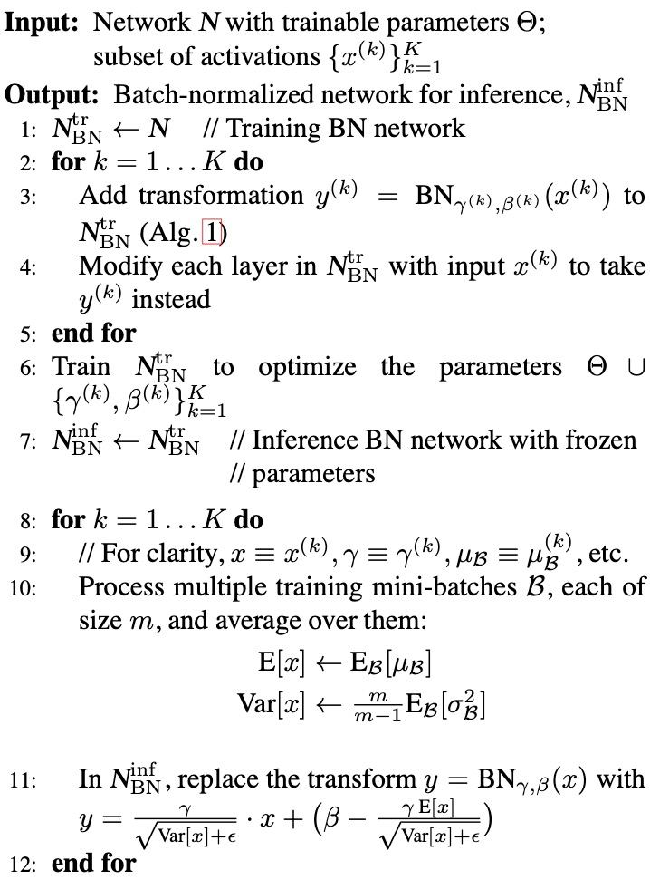{: .center style="width:20vw"}

Причина популярности Batch Normalization заключается в значительном ускорении обучения неронных сетей и в улучшении их сходимости в целом. Рассмотрим график из оригинальной статьи:
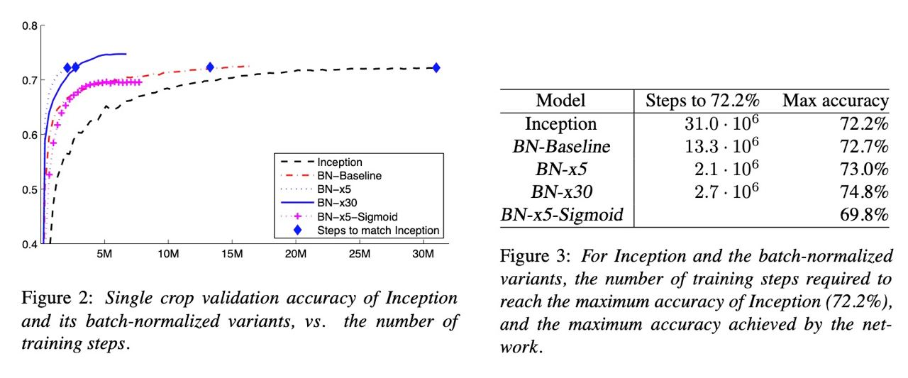{: .center style="width:50vw"}
Как видно на иллюстрации выше, использование Batch Normalization позволило ускорить обучение в несколько раз, и даже добиться лучших результатов, чем SoTA подход 2014 года Inception (структура которого была приведена на одной из иллюстраций в начале этой главы).

Значительное ускорение достигается в том числе благодаря использованию более высокого learning rate: благодаря нормировке "связь" между слоями не нарушается столь сильно.

Стоит заметить, что причины столь эффективной работы Batch Normalization до сих пор являются поводом для дискуссий, и строгого теоретического объяснения эффекта от Batch Normalization еще нет. Несмотря на это, он перевернул область глубокого обучения и вошел в стандартный инструментарий при обучении нейронных сетей.

_Примечание: Стоит заметить, что в настоящее время существуют и другие способы нормировать промежуточные представления: Instance Normalization, Layer Normalization и др.)_

В завершении, рекомендуем ознакомиться с [данной статьей о работе метода обратного распростарнения ошибки в Batch Normalization слое](https://kratzert.github.io/2016/02/12/understanding-the-gradient-flow-through-the-batch-normalization-layer.html).

## Регуляризация через изменение данных

Внесение изменений в данные (аугментации данных) также является популярной техникой регуляризации. Рассмотрим ее на примере. Пусть перед нами фотография самолета. Добавим мелкодисперсный шум к изображению. Мы все еще сможем увидеть на фотографии самолет, но с точки зрения модели машинного обучения (в данном случае – нейронной сети), полученное изображение является новым объектом! Повернем изображение самолета на 10 градусов по часовой стрелке. В нашем распоряжении еще одно изображение с известной целевой меткой (например, меткой класса “самолет”), в котором присутствует поворот. Таким образом, внесение новых данных позволяет “дать модели понять”, какие преобразования над данными являются допустимыми, и она уже будет более устойчивой к наличию небольшого шума в данных или к поворотам (к которым чувствительна операция свертки). Вдобавок аугментации позволяют значительно увеличить объем обучающей выборки. Особую популярность аугментации приобрели в области компьютерного зрения. В качестве примера приведем отличную библиотеку, позволяющую производить аугментацию изображений: https://github.com/albumentations-team/albumentations

<!-- К текстовым данным также часто применяются аугментации. Прочитать о них подробнее можно, например, здесь ***ссылка***
 -->

Стоит обратить внимание, что используемые аугментации должны быть адекватны решаемой задаче. Инвертирование цветов на фотографии, внесение значительного количества шумов или переворот изображения может привести и к негативным результатам (по сути, просто сделают выборку более зашумленной или даже заставит сеть учиться на данных, которые она никогда не встретит в реальности), т.к. обобщающая способность сети ограничена. Можно сказать, что аугментированные данные должны принадлежать той же генеральной совокупности, что и оригинальный датасет.

Итак, эксперт может привнести свое понимание задачи и на уровне аугментации данных: если данное преобразование является допустимым (т.е. преобразованный объект мог бы попасть в обучающую выборку и самостоятельно -- как фотография с другого устройства или запись речи другого человека с опечаткой), то модель должна быть устойчива к данным с подобными преобразованиями.

&nbsp;

# Код и реализация

От современной бибилотеки для обучения нейросетей ожидается примерно следующее:

1. Интерфейс в python, стало традицией что deep learning делают на питоне. Сама бибилотека часто реализована на чем-то более производительном вроде C++
2. Реализации для базовых нод вычислительного графа (матриц, функций активации, лоссов, арифметических операции, функциональных операций etc)
3. Автоградиент, об этом мы уже поговорили
4. Возможность работы на ускорителях -- обучение любой достаточно большой сети -- чрезвычайно затратная операция, но наибольшее время как правило тратится или на перемножение матриц, или на поэлементное применение какой-то функции к вектору. Такие операции легко поддаются паралелизму, а значит хорошо работают на видеокартах (о видеокарте можно думать как о процессоре с 2000 слабых ядер) или даже специальных ускорителях (наиболее известны TPU изобретенные в google, но есть и другие, например graphcore). Уважающая себя бибилиотека DL должна поддерживать работу и на таком сложном железе.
5. Развесистого набора готовых слоев и сетей.
6. Удобного способа задания вычислительного графа.
7. Оптимизированного способа примения модели. Не сразу очевидно, но если вы обучили 200-слойную модель 10Gb размером то применять её будет не так-то просто и быстро. Поэтому оптимизация примения обученной модели важна.

Чрезвычайно простой, практически декларативный, вид снаружи и крайне сложная, многопоточная и с обилием оптимизаций реализация внутри -- делает написание и поддержку такой библиотеки чрезвычайно нетривиальным делом, требующим большого числа инженеров. Поэтому две основные конкурирующие бибилотеки поддерживаются не столько opensource сообществом, сколько силами больших IT-корпораций. Самой популярной библиотекой уже многие годы остается [tensorflow](tensorflow), созданный в google, и [pytorch](pytorch.org), в основном развиваемый силами facebook и немного более популярный в среде ученых из-за своей простоты.

&nbsp;

# Заключение

Как уже было показано ранее, использование подходящих преобразований при построении нейронной сети (как и любой другой модели машинного обучения) позволяет добиваться лучших результатов. Можно сказать, что эксперт, занимающийся построением модели, вкладывает свои априорные знания о решаемой задаче непосредственно в решение: в структуру модели, в функцию потерь, начальную инициализацию параметров и т.д.). Нейронные сети способны к аппроксимации очень сложных зависимостей, но также склонны и к переобучению, и те или иные техники регуляризации присутствуют практически во всех существующих современных нейронных сетях.
