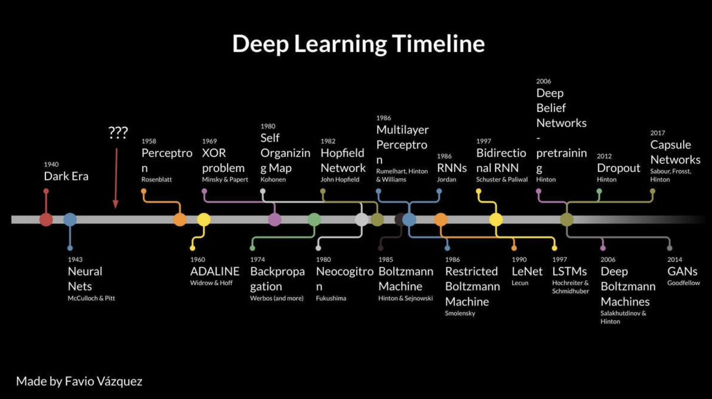

import Math from '../../../components/Math/Math';

## Связь нейронных сетей с другими моделями обучения с учителем

Многие идеи и механизмы, которые используются в нейронных сетях, присущи и другим моделям машинного обучения. Далее мы рассмотрим несколько популярных моделей и покажем, что общего у них с нейронными сетями.

### Логистическая регрессия

Логистическая регрессия показывает хорошие результаты, если классы достаточно хорошо разделяются гиперповерхностью. Линейные модели показывают отличные результаты, если рассматриваемые зависимости целевой переменной от используемых признаков близки к линейным.

Если рассмотреть формулы выше, то можно увидеть, что последнее преобразование в нейронных сетях зачастую и является линейной или логистической регрессией, которые работают с новым признаковым описанием.

[//]: # 'Если же наблюдаемые зависимости существенно нелинейные, необходимо найти более информативное признаковое описание.'
[//]: # 'Как в задачах обучения с учителем, так и в задачах обучения без учителя основной процесс можно представить в виде нескольких преобразований исходного признакового описания объекта или объектов обучающей выборки.'
[//]: # 'Как правило, эти преобразования позволяют отобразить объект в некое “более информативное или же более простое” пространство с точки зрения решаемой задачи, в котором, в свою очередь, поставленная задача легко разрешима.
В задачах обучения с учителем, зачастую, в этом целевом пространстве используется просто линейная модель для получения предсказания.'

mark это договаривались под кат вставлять, тк в курсе их еще не было и следовательно следующие 3 параграфа (до Differential computing) максимально неочевидны

### Метод ближайших соседей

В **методе ближайших соседей (k Nearest Neighbours, kNN)**, предсказание целевой переменной может быть получено как усредненное значение целевых переменных у $k$ ближайших объектов, где расстояние до них может выступать в качестве весового коэффициента. Т.е. предсказание целевой переменной представляет взвешенную сумму – _линейную комбинацию_ – значений целевых переменных у ближайших соседей.

<Math block>

$$
\hat{y_k} = \sum_i w_i y_i,
$$

</Math>

где индекс $i$ соответствует $i$-тому объекту обучающей выборки,

<Math block>

$$
w_i = \rho(\mathbf{x_i}, \mathbf{x_k})
$$

</Math>

Каждый объект теперь может быть описан в терминах _расстояний до других объектов обучающей выборки_ и _соответствующих значений целевой переменной_. Выбор конкретной метрики (например, Евклидовой или Минковского) влияет на то, как учитывается семантика близости между объектами. Новое признаковое описание объектов (в терминах этих расстояний) достаточно информативно для решения даже очень сложных задач.

В то же время, построение “новых признаков” требует серьезных трудозатрат: для каждого объекта необходимо оценить расстояние до всех остальных. Это может быть особенно затруднительно в пространствах высокой размерности, в том числе из-за [проклятия размерности](http://www.machinelearning.ru/wiki/index.php?title=Проклятие_размерности).

### Решающие деревья

В случае работы с _решающими деревьями_ предсказанное значение целевой переменной $\hat{y}$ также может быть представлено в качестве линейной комбинации всех возможных значений в листьях дерева $w_j$, умноженных на индикаторную функцию принадлежности объекта определенному листу $J_j$.

<Math block>

$$
\hat{y} = \sum_j w_j [\mathbf{x} \in J_j],
$$

</Math>

где индекс $j$ соответствует $j$-тому листу дерева.

Можно сказать, что каждый объект описывается тем, в какой лист (т.е. в какую подобласть исходного признакового пространства) он попал. Данное признаковое описание также является достаточно информативным.

К сожалению, его построение может вызывать сложности. При построении решающих деревьев использование градиентных методов оптимизации затруднено, ведь дерево представляет кусочно-постоянную функцию. Деревья, как правило, строятся жадным образом, что накладывает некоторые ограничения. Подробнее принципы работы решающих деревьев и механизмы их построение рассмотрены в [соответствующей главе]().
#TBD: статья о похожести kNN и Random Forest

### Метод опорных векторов

**Метод опорных векторов (Support Vector Machine, SVM)** также позволяет перейти к более информативным описаниям используя подходящее ядро $K$. Но выбор подходящего ядра ложится на плечи эксперта.

Конечно, эксперт может обратиться к опыту, к познаниям в предметной области решаемой задачи или к собственной интуиции и предложить преобразования исходных признаков, которые будут достаточно информативны для получения качественного решения. Но подобный подход слабо масштабируется и, как правило, требует глубоких познаний в предметной области. В качестве примера могут выступать задачи из области биологии или химии **_ссылка на работу Александра Гущина_**.

### Ансамбли моделей: стекинг, блендинг

Применение последовательности преобразований – не новая идея. Ансамбли типа _бустинг_ и [_стэкинг_](http://machine-learning.martinsewell.com/ensembles/stacking/Wolpert1992.pdf) шаг за шагом преобразуют признаковое описание, что позволяет получить отличные результаты. Появление механизма градиентного бустинга **_ссылка_** в 2001 [Friedman] (наряду с несколькими другими факторами) привело к значительному снижению интереса к нейронным сетям в начале двадцать первого века. Стекинг **_ссылка_** же не раз приводит специалистов по машинному обучению к призовым местам в соревнованиях (например, на платформе kaggle).

_Примечание: Стоит отметить, что в стекинге на каждой итерации стекинга явным образом строится новое признаковое пространство на основе предсказаний моделей, обученных на предыдущем шаге. В градиентном бустинге меняется целевая переменная и функция потерь. Рекомендуем к прочтению [статью о стекинге и блендинге в блоге Александра Дъяконова](https://dyakonov.org/2017/03/10/cтекинг-stacking-и-блендинг-blending/)._

---

Нейронные сети позволяют порождать информативные описания для широкого класса объектов и для данных различной природы. Благодаря своей гибкости, они отлично подходят для работы с различными структурированными данными (тексты, изображения, видео, облака точек и др.) и показывают State of The Art результаты во множестве задач.

Внимательный читатель заметит, что сама структура вышеперечисленных моделей определяет некоторые преобразования признакового пространства. Использование новых признаковых описаний позволяет этим моделям аппроксимировать сложные зависимости и показывать качественные результаты при решении многих задач.

Но зачастую эти преобразования выучиваются последовательно, что приводит к потере обратной связи между этапами преобразований. Новые преобразования не могут повлиять на те, что были построены ранее. Нейронные сети же позволяют _вернуть обратную связь между последовательными преобразованиями признакового пространства_ и выучивать их совместно. По сравнению с другими алгоритмами, нейронные сети предоставляют более гибкий механизм настройки этих преобразований.

---

## Backup

### История развития искусственных нейронных сетей.

Нейронные сети являются далеко не новыми моделями. О создании искусственного сознания философы и ученые задумывались с древних времен. Сам термин “нейрон” был введен для обозначения нервных клеток в 1891 году Г.В.Вальдейром (в обнаружении нейронов сыграл роль метод Гольджи, предложенный в 1873 году для окрашивания отдельных клеток живых тканей). Психолог Уильям Джеймс _(несмотря на то, что некоторые его идеи были отвергнуты или переработаны его последователями, часто его называют одним из основателей современной психологии)_ предположил, что за формирование памяти и накопление опыта отвечают связи между нейронами.

В двадцатом веке первая группа кибернетиков “Проект человек-машина” (состоящая, преимущественно, из математиков и психологов) также задалась вопросом построения искусственного сознания.
...
**_ описание истории развития нейронных сетей _**
...

---

В основе механизма обратного распространения ошибки стоит классический метод вычисления производной сложной функции. От каждого из преобразований, которые входят в нейронную сеть, требуется дифференцируемость как по аргументу $\mathbf{x}^l$, так и по параметрам $\mathbf{\theta}^k$ (в случае их наличия). Рассмотрим два последовательных преобразования, в результате применения которых к вектору $\mathbf{x}^0$ было получено значение $l$:

<Math block>

$$
u = f^1\big(f^0(\mathbf{x}^0; \mathbf{\theta}^0); \mathbf{\theta}^1 \big) = f^1(\mathbf{x}^1; \mathbf{\theta}^1).
$$

</Math>

Попробуем продифференцировать $u$ по параметрам $\mathbf{\theta}^0$ для вычисления градиента:

<Math block>

$$
\frac{\partial u}{\partial \mathbf{\theta}^0} = \frac{\partial u}{\partial \mathbf{x}^1} \frac{\partial \mathbf{x}^1}{\partial \mathbf{\theta}^0} = \frac{\partial u}{\partial f^0(\mathbf{x}^0; \mathbf{\theta}^0)} \frac{\partial f^0(\mathbf{x}^0; \mathbf{\theta}^0)}{\mathbf{\theta}^0}.
$$

</Math>

Т.е. вычисления производной $\frac{\partial u}{\partial \mathbf{\theta}^0}$ можно разбить два шага, каждый из которых включает лишь дифференцирование по аргументам или параметрам функций $f^1$ или $f^0$. Если бы преобразований было не два, а десять, нам бы понадобилось вычислить десять частных производных, но сам механизм остался бы тем же, и для вычисления каждой из производных нам бы понадобился лишь аргумент "слева" и уже посчитанный градиент "справа".

---

Также заметим, что производная сигмоиды имеет следующий вид:

<Math block>

$$
\frac{\partial \sigma(x)}{\partial x} = \sigma(x)(1 - \sigma(x)).
$$

</Math>

Пусть размерность матрицы $\mathbf{W}^0$ составляет $(2, 2)$, размерность матрицы $\mathbf{W}^1$ составляет $(2, 1)$. Пусть на объекте $\mathbf{x} = [1.1, 0.7]^T$ была получена ошибка $l$, и производная ошибки по предсказанию сети $\hat{y}$ равна $3$:

<Math block>

$$
\frac{\partial l}{\partial \hat{y}} = 3.
$$

</Math>

---
