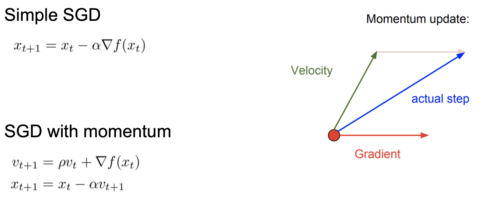
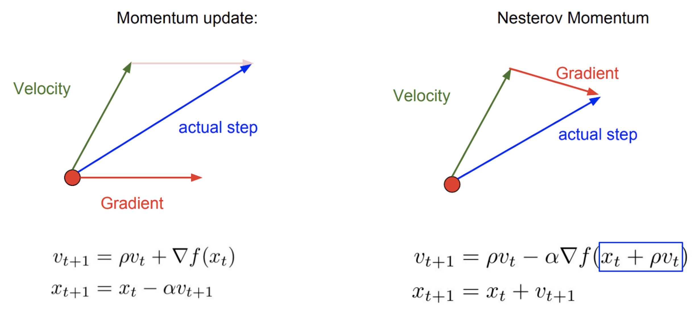
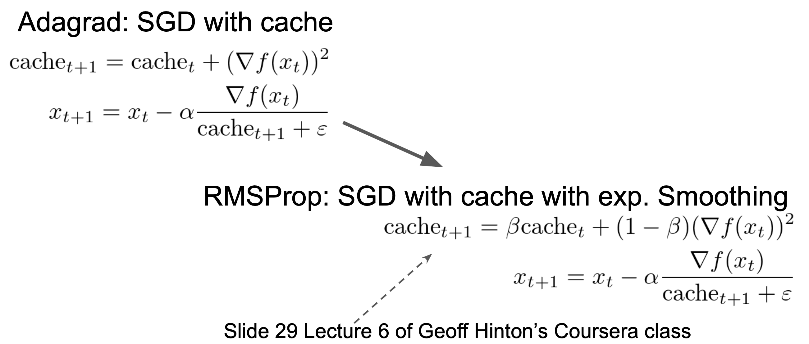
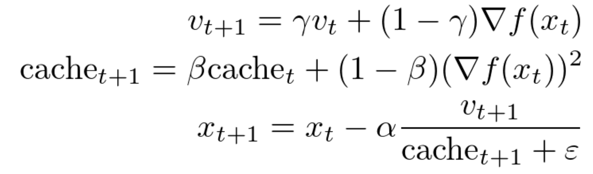
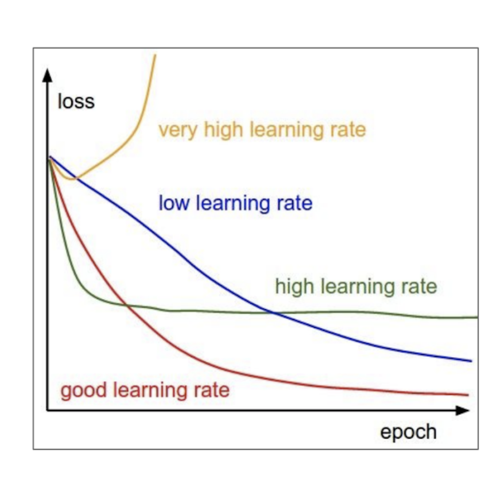
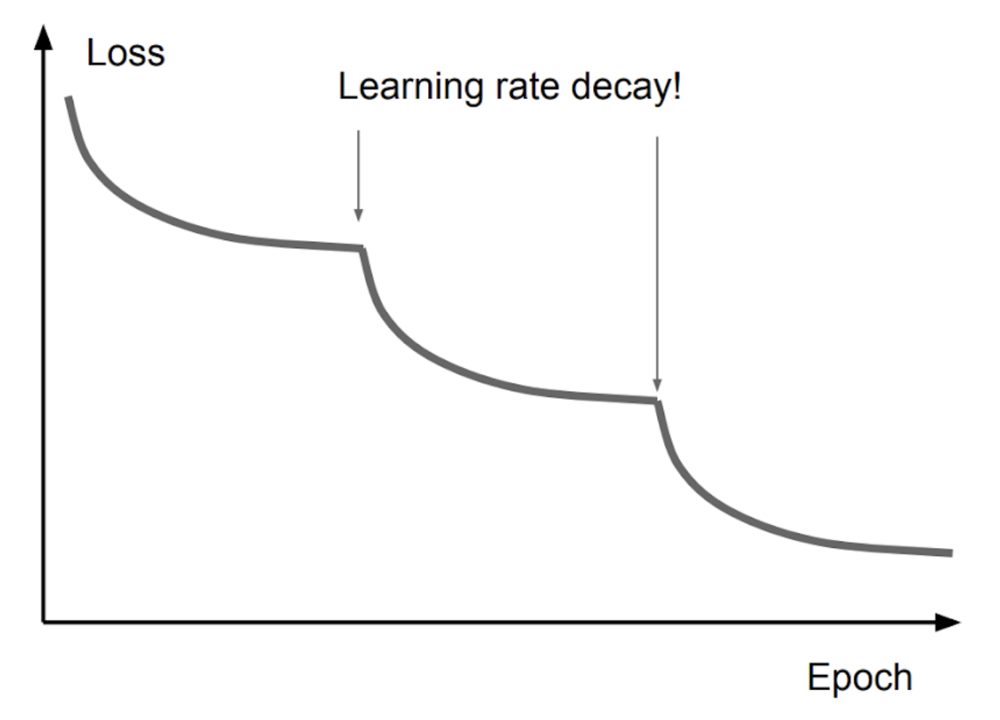

# Оптимизация

### Метод инерции, momentum

У классического градиентного спуска несколько проблем. Одной из серьезных проблем является необходимость выбора специальной константы – learning rate. Также одной из проблем градиентного спуска могут являться локальные минимумы и седловые точки. Если функция потерь попала в одну из них, то дальнейшая оптимизация градиентными методами затруднена (или вовсе невозможна в локальных минимумах ввиду нулевых градиентов). Частично справиться с этими двумя проблемами можно с помощью простой физической аналогии.

Представим себе мячик, который катится с горы. В данном случае гора – это (гипер)поверхность функции потерь в пространстве параметров нашей модели, а мячик – их текущее значение. Реальный мячик не застрянет перед небольшой кочкой т.к. у него есть некоторая масса и уже накопленный импульс – некоторое время он способен двигаться даже вверх по склону. Аналогичный прием может быть использован и в градиентной оптимизации. В англоязычной литературе он называется **Momentum**.

{: .center style="width:40vw"}

<!-- #TBD: перерисовать иллюстрацию в другой нотации -->

На иллюстрации выше $\mathbf{\theta}_t$ выступает в качестве текущего значения параметров, $\nabla f(\mathbf{\theta}_t)$ – градиент функции потерь, а $\mathbf{v}_t$ – накопленный “импульс” к шагу t. Константа $\rho$ выбирается из полуинтервала $[0; 1)$ и отвечает за сглаживание и “скорость забывания” накопленного импульса. Внимательные слушатели могут заметить сходство с экспоненциальным сглаживанием.

Механизм классического метода Momentum следующий:

1. Оценить градиент для текущих значений параметров $\mathbf{\theta}_t$.
2. Обновить текущее значение импульса $\mathbf v_t$ с учетом новых градиентов и сохранить в $\mathbf{v}_{t+1}$
3. Обновить параметры с учетом нового импульса (т.е. градиента в точке $\mathbf \theta_t$ и уже накопленного на предыдущем шаге импульса $\mathbf{v}_{t})$.

Благодаря накопленному импульсу в процессе оптимизации удастся не только миновать локальные минимумы (если они не являются слишком глубокими), но и адаптировать learning rate! У вектора градиента огромное количество компонент, и каждая из них соответствует определенным параметрам рассматриваемой модели. Если на протяжении нескольких шагов градиент по некоторому подмножеству параметров направлен в одну и ту же сторону, то благодаря накопленному импульсу на каждом шаге данные параметры будут обновляться более значительно, т.е. можно сказать, что их эффективный learning rate будет повышен! В целом, Momentum – один из классических способов ускорения сходимости. Далее рассмотрим небольшое улучшение данного метода.

### Nesterov Momentum

Предположим, что накопленный импульс достаточно велик. В таком случае после смещения “по инерции” параметры модели могут существенно различаться с теми параметрами, для которых оценивался градиент. Т.е. градиент в точке $\mathbf \theta_t + \rho \mathbf{v}_{t}$ существенно отличается от градиента в точке $\mathbf \theta_t$. Исправить эту досадную оплошность достаточно просто. Данный метод носит имя Нестерова: **Nesterov momentum**, и достаточно часто применяется на практике. Внесем небольшие изменения в алгоритм:

1. Оценить градиент для значений параметров $\mathbf{\theta}_t + \rho \mathbf{v}_t$.
2. Обновить текущее значение импульса $\mathbf v_t$ с учетом новых градиентов и сохранить в $\mathbf{v}_{t+1}$.
3. Обновить параметры с учетом градиента в точке $\mathbf \theta_t + \rho \mathbf v_t$ и обновленного значения импульса $\mathbf{v}_{t+1}$.

{: .center style="width:40vw"}

Т.е. Nesterov momentum учитывает уже накопленный импульс, что позволяет “превентивно” внести поправку (т.е. внести поправку не на следующем шаге оптимизации, а уже на текущем).

_Комментарий: из-за этого иногда упоминается, что Nesterov Momentum “заглядывает в будущее” и исправляет ошибки на данном шаге оптимизации. Конечно, никто не заглядывает в будущее в буквальном смысле._

Nesterov Momentum позволяет значительно повысить устойчивость и скорость сходимости в некоторых случаях. Но, конечно, он не является серебряной пулей в задачах оптимизации.

### RMSProp

Гиперповерхности функций потерь зачастую не являются выпуклыми, и вдобавок могут быть серьезно “вытянуты” в одном из направлений. Второй факт оказывает особое влияние на процедуру оптимизации.

_Для упрощения понимания данного механизма также может быть полезно задаться следующим вопросом: “Что если задаться целью подобрать для каждого из параметров собственное значение learning rate?”_.

{: .center style="width:600px"}

<!-- #TBD: байка про лекцию Хинтона на Coursera. -->

### Adam

На протяжении последних нескольких лет Adam часто выступает решением по умолчанию во множестве задач. Его название является сокращением от ADAptive Momentum и во многом он объединяет идеи методов Momentum и RMSProp, рассмотренных выше.
{: .center style="width:500px"}

<!-- #TBD: развить мысль -->

Стоит обратить внимание, что даже при использовании Adam или RMSProp необходим правильный выбор learning rate. Неудачный выбор learning rate может привести к преждевременному выходу функции потерь на плато (если learning rate не позволяет более точно настроить параметры) или и вовсе к расхождению модели. Пример приведен на иллюстрации ниже.
{: .center style="width:500px"}

Часто learning rate понижают итеративно: каждые условные 5 эпох (LRScheduler в Pytorch) или же при выходе функции потерь на плато.

<!-- #TBD: это уже лучше рассматривать на практике -->

{: .center style="width:500px"}

Зачастую, при начале работы с реальными данными начинают со значения learning rate равного 3e-4. История данного значения достаточно забавна: в 2016 году Андрей Карпатый (Andrej Karpathy) опубликовал шутливый [пост в Twitter](https://twitter.com/karpathy/status/801621764144971776).

{: .center style="width:40vw"}

После чего сообщество подхватило эту идею (до такой степени, что иногда число 3e-4 называют Karpathy constant).

Обращаем ваше внимание, что при работе с учебными данными зачастую полезно выбирать более высокий (на 1-2 порядка) начальный learning rate (например, при классификации MNIST, Fashion MNIST, CIFAR или при обучении языковой модели на примере поэзии выбранного поэта).

Также стоит помнить, что Adam требует хранения как параметров модели (10 условных байт), градиентов (10 байт), накопленного импульса (10 байт) и нормировочных констант (cache) (еще 10 байт). Т.е. достижение более быстрой (с точки зрения количества итераций/объема рассмотренных данных) сходимости требует больших объемов памяти. Кроме того, если вы решите продолжить обучение модели, остановленное на некоторой точке, необходимо восстановить из чекпоинта не только веса модели, но и накопленные параметры Adam. В противном случае оптимизатор начнёт сбор всех своих статистик с нуля, что может сильно сказаться на качестве дообучения. То же самое касается вообще всех описанных выше методов, так как каждый из них накапливает какие-то статистики во время обучения.

В последние годы также появляются новые методы оптимизации например Look Ahead (#todo ссылка) (требует еще больше памяти). Или же AdamW, который включает в себя регуляризацию и будет рассмотрен далее.
