- Этот список будет заменен оглавлением, за вычетом заголовка "Contents",
  к которому добавлен класс `no_toc`.
  {:toc}

В этой главе мы посмотрим на, казалось бы, те же самые модели машинного обучения с другой стороны, проинтерпретировав их, как вероятностные. В первом разделе мы расскажем, как обращаться с вероятностными моделями, и покажем, что привычный вам подбор параметров модели с помощью минимизации функции потерь соответствует их подбору методом максимального правдоподобия, что даст возможность транслировать в мир ML известные результаты о свойствах оценок максимального правдоподобия, но в то же время и обнажит их недостатки. Это позволит нам по-новому взглянуть на логистическую регрессию и с новым пониманием сформулировать её обобщение – generalized linear model (GLM). По ходу дела выяснится, что большинство классификаторов, хоть и делают вид, что предсказывают корректные вероятности, на самом деле вводят в заблуждение, и в третьем разделе мы поговорим о том, как проверить отклонение предсказанных значений от истинных вероятностей и как поправить ситуацию. Далее, мы обсудим генеративный подход к классификации и разберём несколько примеров генеративных моделей, после чего перейдём к байесовскому подходу оценивания параметров, который, хоть зачастую и трудно осуществим вычислительно, однако обладает большей теоретической стройностью, позволяет оценивать распределение параметров и предсказаний – то есть, например, уверенность в нашей оценке – а, кроме того, дает нам возможность измерить качество модели, не прибегая к проверке на тестовой выборке.

# Дискриминативные вероятностные модели

## Случайность как источник несовершенства модели

Практически любая модель, которую мы строим, несовершенна. Но объяснять это несовершенство можно по-разному. Рассмотрим, например, модель линейной регрессии $$y\simeq Xw$$. Можно говорить, что

- Зависимость не точная из-за того, что мы не угадали её истинную форму (она была квадратичной, кусочно линейной, с логарифмами, ещё какой-то..), но уж мы постараемся приблизить чем есть.

- Зависимость не точная из-за погрешности – а именно, из-за того, что $$y$$ искажён случайным шумом.

В первом случае мы получаем простой инженерный подход к машинному обучению: есть формула, в которой присутствуют некоторые параметры ($$w$$), есть формализация того, что такое <<приблизить>> (функция потерь) – и мы бодро решаем задачу оптимизации по параметрам.

Во втором наша логика выглядит немного по-другому. Мы заменяем приближённое равенство $$y\simeq Xw$$ на точное

<<<<<<< develop
<<<<<<< develop
<<<<<<< develop
=======
<Math block>

>>>>>>> feat: pass formulas to Math component
=======
>>>>>>> fix: use MathLayout instead Math
$$
y = \left(Xw, \mbox{искажённое шумом $\varepsilon$}\right)
$$

<<<<<<< develop
<<<<<<< develop
Например, это может быть аддитивный шум (чаще всего так и делают):

$$
y = Xw + \varepsilon
$$
=======
$$y = \left(Xw, \mbox{искажённое шумом $\varepsilon$}\right)$$

Например, это может быть аддитивный шум (чаще всего так и делают):

$$y = Xw + \varepsilon$$
>>>>>>> chore: added prob_ML (part)
=======
</Math>

=======
>>>>>>> fix: use MathLayout instead Math
Например, это может быть аддитивный шум (чаще всего так и делают):

$$
y = Xw + \varepsilon
$$

<<<<<<< develop
</Math>
>>>>>>> feat: pass formulas to Math component

=======
>>>>>>> fix: use MathLayout instead Math
где $$\varepsilon$$ – некоторая случайная величина, которая представляет этот самый случайный шум. Тогда получается, что для каждого конкретного объекта $$x_i$$ соответствующий ему истинный таргет – это сумма $$(x_i, w)$$ и конкретной реализации шума $$\varepsilon$$.

Теперь, однако же, наша модель приобретает ещё одну степень свободы: мы можем выбирать различные распределения шума, кодируя тем самым, какой может быть ошибка. Чаще всего выбирают гауссовский шум: $$\varepsilon\sim\mathcal{N}(0,\sigma^2)$$ с некоторой дисперсией $$\sigma^2$$ – но могут быть и другие варианты. Дальше в этой главе мы увидим, что разные гипотезы о распределении этого шума соответствуют на самом деле выбору различных функций потерь. Да и вообще окажется, что эти два подхода – инженерный и вероятностный – не только не противоречат друг другу, а глубинным образом связаны.

## Условное распределение на таргет, непрерывный случай

Допустим, что мы исследуем вероятностную модель таргета с аддитивным шумом

<<<<<<< develop
<<<<<<< develop
<<<<<<< develop
=======
<Math block>

>>>>>>> feat: pass formulas to Math component
=======
>>>>>>> fix: use MathLayout instead Math
$$
y = f_w(X) + \varepsilon,
$$

<<<<<<< develop
<<<<<<< develop
где $$f_w$$ – некоторая функция с (неизвестными пока) параметрами $$w$$, а $$\varepsilon$$ – случайный шум с плотностью распределения $$\varepsilon\sim p_{\varepsilon}(t)$$. Для каждого конкретного объекта $$x_i$$ значение $$f_w(x_i)$$ является просто константой, но $$y_i$$ превращается в случайную величину, зависящую от $$x_i$$ (и ещё от $$w$$ на самом деле). Таким образом, можно говорить об условном распределении

$$
p_y(y \vert x, w)
$$
=======
$$y = f_w(X) + \varepsilon,$$

где $$f_w$$ – некоторая функция с (неизвестными пока) параметрами $$w$$, а $$\varepsilon$$ – случайный шум с плотностью распределения $$\varepsilon\sim p_{\varepsilon}(t)$$. Для каждого конкретного объекта $$x_i$$ значение $$f_w(x_i)$$ является просто константой, но $$y_i$$ превращается в случайную величину, зависящую от $$x_i$$ (и ещё от $$w$$ на самом деле). Таким образом, можно говорить об условном распределении

$$p_y(y \vert x, w)$$
>>>>>>> chore: added prob_ML (part)
=======
</Math>

=======
>>>>>>> fix: use MathLayout instead Math
где $$f_w$$ – некоторая функция с (неизвестными пока) параметрами $$w$$, а $$\varepsilon$$ – случайный шум с плотностью распределения $$\varepsilon\sim p_{\varepsilon}(t)$$. Для каждого конкретного объекта $$x_i$$ значение $$f_w(x_i)$$ является просто константой, но $$y_i$$ превращается в случайную величину, зависящую от $$x_i$$ (и ещё от $$w$$ на самом деле). Таким образом, можно говорить об условном распределении

$$
p_y(y \vert x, w)
$$

<<<<<<< develop
</Math>
>>>>>>> feat: pass formulas to Math component

=======
>>>>>>> fix: use MathLayout instead Math
Для каждого конкретного $$x_i$$ и $$w$$ распределение соответствующего $$y_i$$ – это просто $$p_{\varepsilon}(y - f_{w}(x_i))$$, ведь $$y - f_w(X) = \varepsilon$$.

## Вероятностные модели произвольного вида

На самом деле, мы можем для нашей задачи придумывать любую вероятностную модель $$p_y(y \vert x, w)$$, не обязательно вида $$y = f_w(X) + \varepsilon$$.

Представьте, что мы хотим предсказывать точку в плоскости штанг, в которую попадает мячом бьющий по воротам футболист. Можно предположить, что она имеет нормальное распределение со средним (цель удара), которое определяется ситуацией на поле и состянием игрока, и некоторой дисперсией (т.е. скалярной ковариационной матрицей), которая тоже зависит от состояния игрока и ещё разных сложных факторов, которые мы объявим случайными. Состояние игрока – это сложное понятие, но, вероятно, мы можем выразить его, зная пульс, давление и другие физические показатели. В свою очередь, ситуацию на поле можно описать, как функцию от позиций и движений других игроков, судьи и зрителей – но всего не перечислишь, поэтому нам снова придётся привлекать случайность. Таким образом, мы получаем то, что называется **графической моделью**:

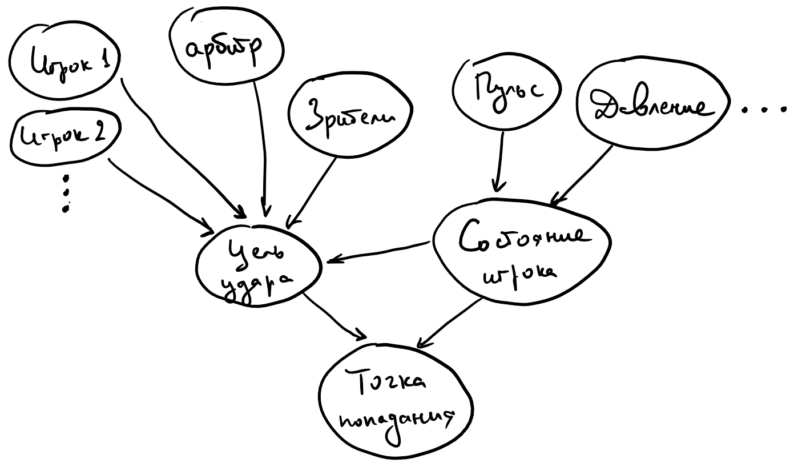{: .center}

Здесь стрелки означают статистические зависимости, а отсутствие стрелок – допущение о статистической независимости. Конечно же, это лишь допущение, принятое нами для ограничения сложности модели: ведь пульс человека и давление взаимосвязаны, равно как и поведение различных игроков на поле. Но мы уже обсуждали, что каждая модель, в том числе и вероятностная, является лишь приблизительным отражением бесконечно сложного мира. Впрочем, если у нас много вычислительных ресурсов, то никто не мешает нам попробовать учесть и все пропущенные сейчас зависимости.

Расписав всё по определению условной вероятности, мы получаем следующую вероятностную модель:

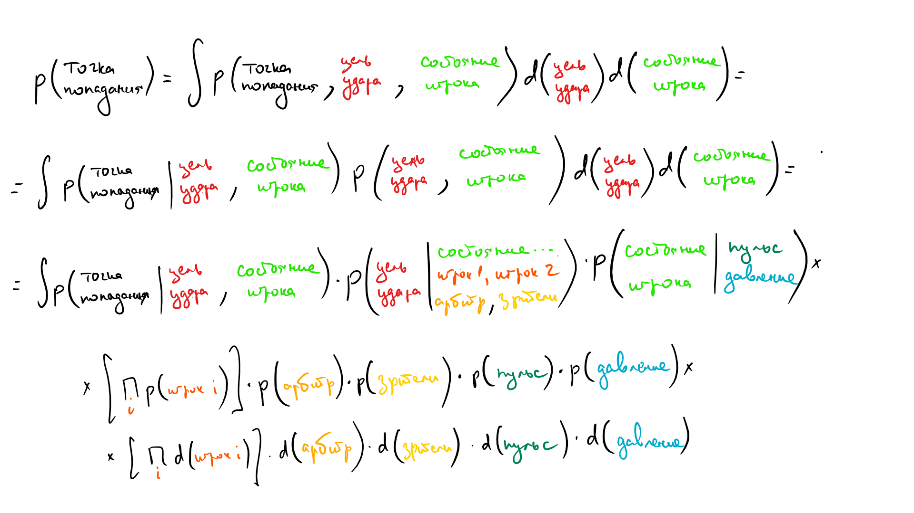{: .center}

в которой, конечно же, мы должны все вероятности расписать через какие-то понятные и логически обоснованные распределения – но пока воздержимся от этого.

## Предсказание в вероятностных моделях

О том, как подбираются параметры модели, мы расскажем ниже в соответствующем разделе, а пока представим, что параметры подобраны, и подумаем о том, как же теперь делать предсказания.

Рассмотрим модель линейной регрессии

<<<<<<< develop
<<<<<<< develop
<<<<<<< develop
=======
<Math block>

>>>>>>> feat: pass formulas to Math component
=======
>>>>>>> fix: use MathLayout instead Math
$$
y = Xw + \varepsilon,\quad\varepsilon\sim\mathcal{N}(0,\sigma^2)
$$

<<<<<<< develop
<<<<<<< develop
Если $w$ известен, то для нового объекта $x_0$ соответствующий таргет имеет вид

$$
y_0 = x_0w + \varepsilon\sim\mathcal{N}(x_0w, \sigma^2)
$$
=======
$$y = Xw + \varepsilon,\quad\varepsilon\sim\mathcal{N}(0,\sigma^2)$$

Если $w$ известен, то для нового объекта $x_0$ соответствующий таргет имеет вид

$$y_0 = x_0w + \varepsilon\sim\mathcal{N}(x_0w, \sigma^2)$$
>>>>>>> chore: added prob_ML (part)
=======
</Math>

=======
>>>>>>> fix: use MathLayout instead Math
Если $w$ известен, то для нового объекта $x_0$ соответствующий таргет имеет вид

$$
y_0 = x_0w + \varepsilon\sim\mathcal{N}(x_0w, \sigma^2)
$$

<<<<<<< develop
</Math>
>>>>>>> feat: pass formulas to Math component

=======
>>>>>>> fix: use MathLayout instead Math
Таким образом, $y_0$ дан нам не точно, а в виде распределения (и логично: ведь мы оговорились выше, что ответы у нас искажены погрешностью, проинтерпретированной, как нормальный шум). Но что делать, если требуют назвать конкретное число? Наверное, имеет смысл дать моду распределения (точку с максимальным значением плотности распределения), которая в данном случае будет равна $\mathbb{E}(y_0\vert x_0, w)$, но на самом деле может и отличаться от условного матожидания, если будет выбрана какая-то другая модель шума.

Аналогичные соображения можно применять и для более сложных моделей, выдавая предсказание в виде моды условного распределения, то есть $$\underset{y_0}{\operatorname{argmax}}\log{p(y_0\vert x_0, w)}$$, или условного математического ожидания $$\mathbb{E}(y_0\vert x_0, w)$$, или условной медианы, или ещё чего-то такого, что вам кажется правильным.

## Условное распределение на таргет, дискретный случай

Допустим, мы имеем дело с задачей классификации с $$K$$ классами. Как мы можем её решать? Самый наивный вариант – научиться по каждому объекту $$x_i$$ предсказывать некоторый некоторое число для каждого класса, и у кого число больше – тот класс и выбираем! Наверное, так можно сделать, если мы придумаем хорошую функцию потерь. Но сразу в голову приходит мысль: почему бы не начать предсказывать не просто число, а вероятность?

Таким образом, задача классификации сводится к предсказанию

<<<<<<< develop
<<<<<<< develop
<<<<<<< develop
$$
P(y_i = k \vert x_i)
$$
=======
$$P(y_i = k \vert x_i)$$
>>>>>>> chore: added prob_ML (part)
=======
<Math block>

=======
>>>>>>> fix: use MathLayout instead Math
$$
P(y_i = k \vert x_i)
$$

<<<<<<< develop
</Math>
>>>>>>> feat: pass formulas to Math component

=======
>>>>>>> fix: use MathLayout instead Math
и как будто бы выбору класса с наибольшей вероятностью (как мы увидим дальше, всё не всегда работает так просто).

Одну такую модель – правда, только для бинарной классификации – вы уже знаете. Это логистическая регрессия:

<<<<<<< develop
<<<<<<< develop
<<<<<<< develop
$$
P(y_i = 1 \vert x_i,w) = \frac{1}{1+e^{-\langle x_i, w\rangle}},\quad P(y_i = 0 \vert x_i,w) = \frac{e^{-(x_i, w)}}{1+e^{-\langle x_i, w\rangle}} = \frac{1}{1+e^{\langle x_i, w\rangle}}
$$

которую также можно записать в виде

$$
y_i \vert x_i \sim \color{red}{Bern}\left(\frac{1}{1+e^{\langle x_i, w\rangle}}\right)
$$

=======
$$P(y_i = 1 \vert x_i,w) = \frac{1}{1+e^{-\langle x_i, w\rangle}},\quad P(y_i = 0 \vert x_i,w) = \frac{e^{-(x_i, w)}}{1+e^{-\langle x_i, w\rangle}} = \frac{1}{1+e^{\langle x_i, w\rangle}}$$

которую также можно записать в виде

$$y_i \vert x_i \sim \color{red}{Bern}\left(\frac{1}{1+e^{\langle x_i, w\rangle}}\right)$$
>>>>>>> chore: added prob_ML (part)
=======
<Math block>

=======
>>>>>>> fix: use MathLayout instead Math
$$
P(y_i = 1 \vert x_i,w) = \frac{1}{1+e^{-\langle x_i, w\rangle}},\quad P(y_i = 0 \vert x_i,w) = \frac{e^{-(x_i, w)}}{1+e^{-\langle x_i, w\rangle}} = \frac{1}{1+e^{\langle x_i, w\rangle}}
$$

которую также можно записать в виде

$$
y_i \vert x_i \sim \color{red}{Bern}\left(\frac{1}{1+e^{\langle x_i, w\rangle}}\right)
$$

<<<<<<< develop
</Math>

>>>>>>> feat: pass formulas to Math component
=======
>>>>>>> fix: use MathLayout instead Math
где $\color{red}{Bern}(p)$ – распределение Бернулли с параметром $p$.

Отметим, что, если забыть, как мы пришли к модели логистической регрессии, оказывается, что это просто

$$
x_i\xrightarrow{\begin{smallmatrix}\mbox{Какое-то}\\\mbox{отображение}\end{smallmatrix}}
\left(-\langle x_i, w\rangle, \langle x_i, w\rangle\right)\xrightarrow{\ \sigma\ }\left(\sigma(-\langle x_i, w\rangle),
\sigma(\langle x_i, w\rangle)\right)
$$

где, напомним, $$\sigma$$ – это сигмоида:

<<<<<<< develop
<<<<<<< develop
<<<<<<< develop
$$
\sigma(t) = \frac{1}{1+e^{-t}}
$$
=======
$$\sigma(t) = \frac{1}{1+e^{-t}}$$
>>>>>>> chore: added prob_ML (part)
=======
<Math block>

=======
>>>>>>> fix: use MathLayout instead Math
$$
\sigma(t) = \frac{1}{1+e^{-t}}
$$

<<<<<<< develop
</Math>
>>>>>>> feat: pass formulas to Math component

=======
>>>>>>> fix: use MathLayout instead Math
Сигмоида тут не просто так. Она обладает теми счастливыми свойствами, что

- монотонно возрастает;

- отображает всю числовую прямую на интервал $$(0,1)$$;

- $$\sigma(-x) = 1 - \sigma(x)$$.

Вот такой вид имеет её график:

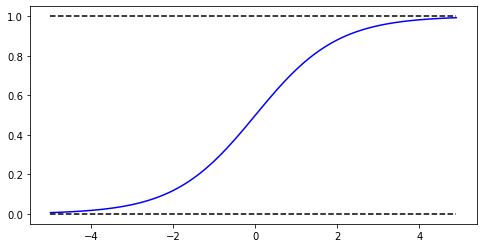{: .center style="width:30vw"}

Иными словами, с помощью сигмоиды можно делать ''вероятности'' из чего угодно, то есть более или менее для любого отображения $$f_w$$ (из признакового пространства в $$\mathbb{R}$$) с параметрами $$w$$ построить модель бинарной классификации

<<<<<<< develop
<<<<<<< develop
<<<<<<< develop
$$
P(y_i = 0 \vert x_i, w) = \sigma(f_w(-x_i)),\quad P(y_i = 1 \vert x_i, w) = \sigma(f_w(x_i))
$$

Как и в случае логистической регрессии, такая модель равносильна утверждению о том, что

$$
f_w(x_i) = \log{\frac{p(y = 1 \vert x_i,w)}{p(y = 0 \vert x_i, w)}}
$$

Похожим способом можно строить и модели для многоклассовой классификации; в этом нам поможет обобщение сигмоиды, которое называется **softmax**:

$$
softmax(t_1,\ldots,t_K) = \left(\frac{e^{t_1}}{\sum_{k=1}^Ke^{t_k}},\ldots,\frac{e^{t_K}}{\sum_{k=1}^Ke^{t_k}}\right)
$$

А именно, для любого отображения $$f_w$$ из пространства признаков в $$\mathbb{R}^K$$ мы можем взять модель

$$
\left(P(y_i = k \vert x_i, w)\right)^K_{k=1} = softmax(f_w(x_i))
$$

Если все наши признаки – вещественные числа, а $$f_w(x_i) = x_iW$$ – просто линейное отображение, то мы получаем однослойную нейронную сеть

$$
\left(P(y_i = k \vert x_i, w)\right)^K_{k=1} = softmax(x_iW)
$$
=======
$$P(y_i = 0 \vert x_i, w) = \sigma(f_w(-x_i)),\quad P(y_i = 1 \vert x_i, w) = \sigma(f_w(x_i))$$
=======
<Math block>

=======
>>>>>>> fix: use MathLayout instead Math
$$
P(y_i = 0 \vert x_i, w) = \sigma(f_w(-x_i)),\quad P(y_i = 1 \vert x_i, w) = \sigma(f_w(x_i))
$$

<<<<<<< develop
</Math>
>>>>>>> feat: pass formulas to Math component

=======
>>>>>>> fix: use MathLayout instead Math
Как и в случае логистической регрессии, такая модель равносильна утверждению о том, что

$$
f_w(x_i) = \log{\frac{p(y = 1 \vert x_i,w)}{p(y = 0 \vert x_i, w)}}
$$

Похожим способом можно строить и модели для многоклассовой классификации; в этом нам поможет обобщение сигмоиды, которое называется **softmax**:

$$
softmax(t_1,\ldots,t_K) = \left(\frac{e^{t_1}}{\sum_{k=1}^Ke^{t_k}},\ldots,\frac{e^{t_K}}{\sum_{k=1}^Ke^{t_k}}\right)
$$

А именно, для любого отображения $$f_w$$ из пространства признаков в $$\mathbb{R}^K$$ мы можем взять модель

$$
\left(P(y_i = k \vert x_i, w)\right)^K_{k=1} = softmax(f_w(x_i))
$$

Если все наши признаки – вещественные числа, а $$f_w(x_i) = x_iW$$ – просто линейное отображение, то мы получаем однослойную нейронную сеть

<<<<<<< develop
<<<<<<< develop
$$\left(P(y_i = k \vert x_i, w)\right)^K_{k=1} = softmax(x_iW)$$
>>>>>>> chore: added prob_ML (part)
=======
<Math block>

=======
>>>>>>> fix: use MathLayout instead Math
$$
\left(P(y_i = k \vert x_i, w)\right)^K_{k=1} = softmax(x_iW)
$$

<<<<<<< develop
</Math>
>>>>>>> feat: pass formulas to Math component

=======
>>>>>>> fix: use MathLayout instead Math
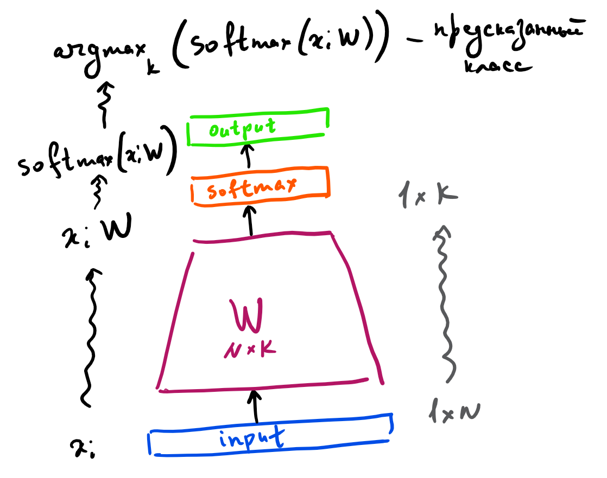{: .center style="width:40vw"}

**Предостережение**. Всё то, что мы описали выше, вполне работает на практике (собственно, классификационные нейросети зачастую так и устроены), но корректным не является. В самом деле, мы говорим, что строим оценки вероятностей $$P(y_i = k \vert x_i, w)$$, но для подбора параметров используем не эмпирические вероятности, а только лишь значения $$\underset{k}{\operatorname{argmax}} \ P(y_i = k \vert x_i, w)$$, то есть метки предсказываемых классов. Таким образом, мы не сможем различить ситуации

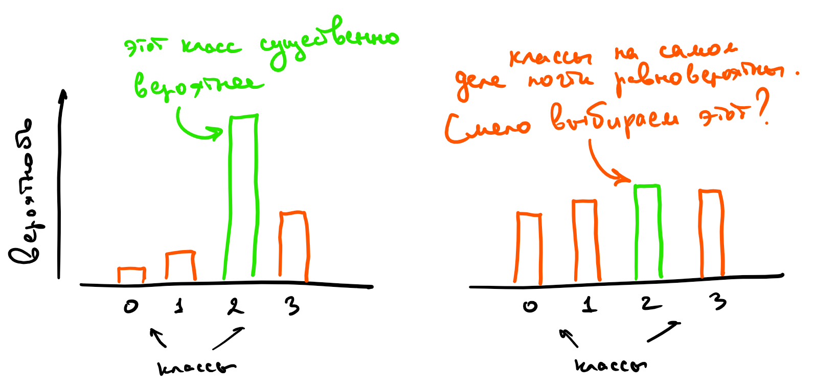{: .center}

Это говорит нам о некоторой неполноценности такого подхода.

Заметим ещё вот что. В случае бинарной классификации выбор предсказываемого класса как $$\underset{k}{\operatorname{argmax}} P(y_i=k \vert x_i,w)$$ равносилен выбору того класса, для которого $$P(y_i=k \vert x_i,w) > \frac{1}{2}$$. Но если наши оценки вероятностей неадекватны, то этот вариант проваливается, и мы встаём перед проблемой выбора порога: каким должно быть значение $$\widehat{t}$$, чтобы мы могли приписать класс 1 тем объектам $$x_i$$, для которых $$\sigma(f_w(x_i)) > \widehat{t}$$?

В одном из следующих разделов текущей главы мы обсудим, как всё-таки правильно предсказывать вероятности.

# Обобщенные линейные модели

В этом разделе мы рассмотрим достаточно широкий класс моделей – обобщённые линейные модели (generalized linear models, GLM). К ним относятся, в частности, линейная и логистическая регрессии. В итоге мы научимся подбирать подходящую регрессионную модель для самых разных типов данных.
Вероятностную модель линейной регрессии можно записать как $Y \vert X \sim\color{red}{\mathcal N}(Xw, \sigma^2)$, а вероятностную модель логистической регрессии – как $Y \vert X \sim \color{red}{Bern}(\color{blue}{sigmoid}(Xw))$ (где $\color{red}{Bern}(p)$ – распределение Бернулли с параметром $p$, а $\color{blue}{sigmoid}(u) = \frac{1}{1+e^{-u}}$).

Итак, чем в этих терминах отличаются вероятностные модели линейной и логистической регрессии?

1. Параметризованное семейство распределений для $Y \vert X$, а именно, $\color{red}{\mathcal N}(\*, \sigma^2)$ в случае линейной регрессии и $\color{red}{Bern}$ в случае логистической.

2. Для каждой из задач мы выбрали функцию $g$ такую, что $g(\mathbb E(Y \vert X)) = Xw$. Эта функция называется _функцией связи (link function)_. В случае линейной регрессии $g(u) = u$. В случае логистической регрессии $$g(u) = \text{sigmoid}^{-1}(u) = \text{logit}(u) = \log\frac{u}{1-u}$$.

Обобщая, можно сказать, что, если данные таковы, что $\mathbb E(Y \vert X)$ не является линейной функцией от $x$, мы линеаризуем $\mathbb E(Y \vert X)$ с помощью функции связи $g$.

**Замечание:** Вообще говоря, нормальное распределение определяется не только своим мат. ожиданием, но и стандартным отклонением. То есть, в отличие от логистической регрессии, обученная модель линейной регрессии не позволяет для данного $x$ оценить распределение $y \vert x$. К счастью, выбор значения $\sigma$ в нормальном распределении не влияет ни на оптимальный вектор весов $w$, ни на итоговые предсказания $\mathbb E(Y \vert X)$, которые выдаёт обученная модель.

Задав эти две составляющие, мы получим GLM. Для нового объекта $x$ она выдаст предсказание $g^{-1}(xw)$, а выбор класса $Y \vert X$ потребуется нам для подбора весов $w$. В принципе, можно выбрать любой класс распределений $Y \vert X$ и монотонную функцию связи $g$, получив некоторую вероятностную модель. Однако обычно для упрощения поиска оптимальных весов $w$ в GLM предполагают, что $Y \vert X$ принадлежит **экспоненциальному семейству распределений**.

Семейство распределений называют экспоненциальным (или семейством из экспоненциального класса), если все принадлежащие ему распределения могут быть записаны в виде:

<<<<<<< develop
<<<<<<< develop
<<<<<<< develop
$$
p(y \vert \theta, \phi) = \exp\left(\frac{y\theta - a(\theta)}{\phi} + b(y, \phi)\right)
$$
=======
$$p(y \vert \theta, \phi) = \exp\left(\frac{y\theta - a(\theta)}{\phi} + b(y, \phi)\right)$$
>>>>>>> chore: added prob_ML (part)
=======
<Math block>

=======
>>>>>>> fix: use MathLayout instead Math
$$
p(y \vert \theta, \phi) = \exp\left(\frac{y\theta - a(\theta)}{\phi} + b(y, \phi)\right)
$$

<<<<<<< develop
</Math>
>>>>>>> feat: pass formulas to Math component

=======
>>>>>>> fix: use MathLayout instead Math
где $\theta, \phi$ – вещественнозначные параметры, а $a, b$ – произвольные функции, которые считаются известными (лишь бы итоговая функция в самом деле была вероятностной мерой, то есть суммировалась или интегрировалась в единицу). Число $\phi$ называют "scale parameter", так как оно отвечает за разброс распределения.

Нетрудно показать, что математическое ожидание распределения из экспоненциального семейства равно $\mu = a'(\theta)$.

<<<<<<< develop
  
Доказательство

    Заметим, что

<<<<<<< develop
<<<<<<< develop
    $$
    \exp\left(\frac{y\theta - a(\theta)}{\phi} + b(y, \phi)\right) = \frac{\exp\left(\frac{y\theta}{\phi} + b(y, \phi)\right)}{\exp\left(\frac{a(\theta)}{\phi}\right)},
    $$

    откуда

    $$
    \exp\left(\frac{a(\theta)}{\phi}\right) = \int\exp\left(\frac{y\theta}{\phi} + b(y, \phi)\right)dy
    $$

    Следовательно,

    $$
    a(\theta) = \phi\log\int\exp\left(\frac{y\theta}{\phi} + b(y, \phi)\right)dy
    $$

    Дифференцируя, получаем

    $$
    a'(\theta) = \frac{\phi}{\int\exp\left(\frac{y\theta}{\phi} + b(y, \phi)\right)dy}\cdot\int\frac{\partial}{\partial\theta}\,\exp\left(\frac{y\theta}{\phi} + b(y, \phi)\right)dy=
    $$

    $$
    =\frac{\phi}{\exp\left(\frac{a(\theta)}{\phi}\right)}\int \frac{y}{\phi}\cdot\exp\left(\frac{y\theta}{\phi} + b(y, \phi)\right)dy=\int{p(y\vert\theta,\phi)y dy} = \mathbb{E}p(y\vert\theta,\phi)
    $$

    что и завершает доказательство.
=======
  
Доказательство

  Заметим, что

    $$\exp\left(\frac{y\theta - a(\theta)}{\phi} + b(y, \phi)\right) = \frac{\exp\left(\frac{y\theta}{\phi} + b(y, \phi)\right)}{\exp\left(\frac{a(\theta)}{\phi}\right)},$$
=======
    <Math block>

=======
>>>>>>> fix: use MathLayout instead Math
    $$
    \exp\left(\frac{y\theta - a(\theta)}{\phi} + b(y, \phi)\right) = \frac{\exp\left(\frac{y\theta}{\phi} + b(y, \phi)\right)}{\exp\left(\frac{a(\theta)}{\phi}\right)},
    $$

<<<<<<< develop
    </Math>
>>>>>>> feat: pass formulas to Math component
=======

>>>>>>> fix: use MathLayout instead Math

    откуда

    $$
    \exp\left(\frac{a(\theta)}{\phi}\right) = \int\exp\left(\frac{y\theta}{\phi} + b(y, \phi)\right)dy
    $$

    Следовательно,

    $$
    a(\theta) = \phi\log\int\exp\left(\frac{y\theta}{\phi} + b(y, \phi)\right)dy
    $$

    Дифференцируя, получаем

    $$
    a'(\theta) = \frac{\phi}{\int\exp\left(\frac{y\theta}{\phi} + b(y, \phi)\right)dy}\cdot\int\frac{\partial}{\partial\theta}\,\exp\left(\frac{y\theta}{\phi} + b(y, \phi)\right)dy=
    $$

    $$
    =\frac{\phi}{\exp\left(\frac{a(\theta)}{\phi}\right)}\int \frac{y}{\phi}\cdot\exp\left(\frac{y\theta}{\phi} + b(y, \phi)\right)dy=\int{p(y\vert\theta,\phi)y dy} = \mathbb{E}p(y\vert\theta,\phi)
    $$

что и завершает доказательство.
>>>>>>> chore: added prob_ML (part)

В модели GLM мы предполагаем, что $g(\mu) = Xw$, т.е. $\mu = g^{-1}(Xw) = a'(\theta)$. Если дополнительно положить $\theta = Xw$, то мы сможем однозначно определить функцию связи $g = (a')^{-1}$. Такая функция связи называется **канонической (canonical link function)**.

Даже если мы решили использовать каноническую функцию связи, т.е. положили $\theta = Xw$, непонятно, как на практике подбирать $\phi, a, b$, чтобы по классу распределений $Y \vert X$ определить каноническую функцию связи. Чтобы разобраться, рассмотрим несколько примеров.

**Пример 1** Пусть мы решили применить к данным линейную регрессию. Тогда

<<<<<<< develop
<<<<<<< develop
<<<<<<< develop
$$
p(y \vert \mu, \sigma^2) = \frac{1}{\sqrt{2\pi}\sigma}\exp\left(-\frac{(y-\mu)^2}{2\sigma^2}\right)
$$

Чтобы увидеть в этой формуле плотности экспоненциальное семейство распределений, занесём всё внутрь экспоненты:

$$
p(y \vert \mu, \sigma^2) = \exp\left(-\frac{(y-\mu)^2 }{2\sigma^2}- \log(2\pi\sigma^2)\right)
$$

В формуле экспоненциального семейства распределений единственная часть, не зависящая от $\theta$ - функция $b$. Поскольку $\mu=a'(\theta)$, функция $b$ также не должна зависеть от $\mu$. Так что внутри экспоненты выделим в качестве функции $b$ всё, что не зависит от $\mu$:

$$
p(y \vert \mu, \sigma^2) = \exp\left(\frac{y\mu - \mu^2/2}{\sigma^2} - \left(\frac{y^2}{2\sigma^2} + \log(2\pi\sigma^2)\right)\right)
$$
=======
$$p(y \vert \mu, \sigma^2) = \frac{1}{\sqrt{2\pi}\sigma}\exp\left(-\frac{(y-\mu)^2}{2\sigma^2}\right)$$
=======
<Math block>

=======
>>>>>>> fix: use MathLayout instead Math
$$
p(y \vert \mu, \sigma^2) = \frac{1}{\sqrt{2\pi}\sigma}\exp\left(-\frac{(y-\mu)^2}{2\sigma^2}\right)
$$

<<<<<<< develop
</Math>
>>>>>>> feat: pass formulas to Math component

=======
>>>>>>> fix: use MathLayout instead Math
Чтобы увидеть в этой формуле плотности экспоненциальное семейство распределений, занесём всё внутрь экспоненты:

$$
p(y \vert \mu, \sigma^2) = \exp\left(-\frac{(y-\mu)^2 }{2\sigma^2}- \log(2\pi\sigma^2)\right)
$$

В формуле экспоненциального семейства распределений единственная часть, не зависящая от $\theta$ - функция $b$. Поскольку $\mu=a'(\theta)$, функция $b$ также не должна зависеть от $\mu$. Так что внутри экспоненты выделим в качестве функции $b$ всё, что не зависит от $\mu$:

<<<<<<< develop
<<<<<<< develop
$$p(y \vert \mu, \sigma^2) = \exp\left(\frac{y\mu - \mu^2/2}{\sigma^2} - \left(\frac{y^2}{2\sigma^2} + \log(2\pi\sigma^2)\right)\right)$$
>>>>>>> chore: added prob_ML (part)
=======
<Math block>

=======
>>>>>>> fix: use MathLayout instead Math
$$
p(y \vert \mu, \sigma^2) = \exp\left(\frac{y\mu - \mu^2/2}{\sigma^2} - \left(\frac{y^2}{2\sigma^2} + \log(2\pi\sigma^2)\right)\right)
$$

<<<<<<< develop
</Math>
>>>>>>> feat: pass formulas to Math component

=======
>>>>>>> fix: use MathLayout instead Math
Эта формула уже похожа на формулу экспоненциального семейства распределений и видно, что $\phi=\sigma^2$, $\theta=g(\mu)=\mu$ (коэффициент при $y$), $a(\theta) = \mu^2/2 = \theta^2/2$, $b(y, \phi) = -\frac{y^2}{2\sigma^2} - \log(2\pi\sigma^2)$

**Пример 2** Проделаем то же самое, но теперь для распределения Бернулли. Имеем функцию массы

<<<<<<< develop
<<<<<<< develop
<<<<<<< develop
$$
p(y \vert \mu) = \mu^y(1-\mu)^{1-y} = \exp\left(y\log\left(\frac{\mu}{1-\mu}\right) + \log\left(1-\mu\right)\right)
$$
=======
$$p(y \vert \mu) = \mu^y(1-\mu)^{1-y} = \exp\left(y\log\left(\frac{\mu}{1-\mu}\right) + \log\left(1-\mu\right)\right)$$
>>>>>>> chore: added prob_ML (part)
=======
<Math block>

=======
>>>>>>> fix: use MathLayout instead Math
$$
p(y \vert \mu) = \mu^y(1-\mu)^{1-y} = \exp\left(y\log\left(\frac{\mu}{1-\mu}\right) + \log\left(1-\mu\right)\right)
$$

<<<<<<< develop
</Math>
>>>>>>> feat: pass formulas to Math component

=======
>>>>>>> fix: use MathLayout instead Math
Т.е. $\phi=1$, $\theta = g(\mu) = \log\frac{\mu}{1-\mu}$ (как и ожидалось, получили функцию связи $\text{logit}$, используемую в логистической регрессии), $a(\theta) = -\log\left(1-\mu\right) = \log\left(1 + \exp(\theta)\right)$, $b=0$.

**Пример 3** Хорошо, про линейную и логистическую регрессию мы и так знали. Давайте попробуем решить с помощью GLM новую задачу. Пусть мы хотим по каким-то признакам $X$ предсказать количество "лайков", которое пользователи поставят посту в социальной сети за первые 10 минут после публикации. Конечно, можно использовать для этого линейную регрессию. Однако предположение линейной регрессии, что $Y \vert X\sim\mathcal N$, в данном случае странное по нескольким причинам. Во-первых, количество лайков заведомо не может быть отрицательным, а нормальное распределение всегда будет допускать ненулевую вероятность отрицательного значения. Во-вторых, количество лайков – всегда целое число. В-третьих, у распределения количества лайков, скорее всего, положительный коэффициент асимметрии (skewness). То есть, если модель предсказывает, что под постом будет 100 лайков, мы скорее можем ожидать, что под ним окажется 200 лайков, чем 0. Нормальное распределение симметрично и не может описать такие данные. С другой стороны, если мы предположим, что в первые 10 минут после публикации есть какая-то постоянная частота (своя для каждого поста, зависящая от $x$), с которой пользователи ставят лайк, мы получим, что количество лайков имеет распределение Пуассона. Распределение Пуассона не имеет описанных выше проблем:

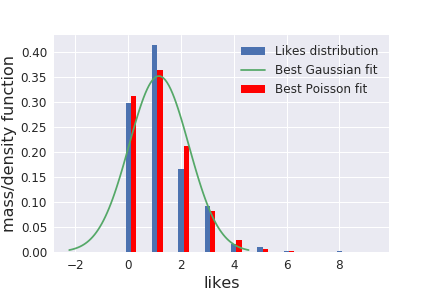{: .center style="width:40vw"}

Но какая будет каноническая функция связи, если мы считаем, что $Y \vert X\sim\text{Poisson}$? Аналогично примерам 1, 2:

<<<<<<< develop
<<<<<<< develop
<<<<<<< develop
$$
p(y \vert \mu) = \frac{e^{-\mu}\mu^y}{y!} = \exp\left(y\log\mu - \mu - \log y!\right)
$$
=======
$$p(y \vert \mu) = \frac{e^{-\mu}\mu^y}{y!} = \exp\left(y\log\mu - \mu - \log y!\right)$$
>>>>>>> chore: added prob_ML (part)
=======
<Math block>

=======
>>>>>>> fix: use MathLayout instead Math
$$
p(y \vert \mu) = \frac{e^{-\mu}\mu^y}{y!} = \exp\left(y\log\mu - \mu - \log y!\right)
$$

<<<<<<< develop
</Math>
>>>>>>> feat: pass formulas to Math component

=======
>>>>>>> fix: use MathLayout instead Math
Откуда $\phi=1$, $\theta = g(\mu) = \log\mu$, $a(\theta) = \mu = \exp(\theta)$, $b(y, \phi) = -\log y!$

Значит, эта модель, называемая Пуассоновской регрессией, будет предсказывать с помощью формулы $\mathbb E(y \vert x) = g^{-1}(x^Tw)= \exp(x^Tw)$.

Как мы увидели, к экспоненциальным семействам относятся как непрерывные, так и дискретные распределения. Вообще, к ним относится большая часть распределений, которыми Вам на практике может захотеться описать $Y \vert X$. В том числе,

- нормальное
- распределение Пуассона
- экспоненциальное
- биномиальное, мультиномиальное (с фиксированным числом испытаний)
- геометрическое
- $\chi^2$-распределение
- бета-распределение
- гамма-распределение
- распределение Дирихле

К экспоненциальным семействам не относятся: равномерное распределение на отрезке, $t$-распределение Стьюдента, распределение Коши, смесь нормальных распределений.

Теперь, когда мы разобрались, как по задаче построить вероятностную модель GLM, встаёт вопрос, как учить такую модель, т.е. как подбирать веса $w$. Подбору параметров вероятностной модели посвящён следующий раздел. Когда будете его читать, обратите внимание, что в функцию потерь войдёт логарифм плотности (или функции массы) $y \vert x, w$. Логарифмировать плотность распределений из экспоненциальных семейств одно удовольствие: достаточно убрать экспоненту, так что оптимизационная задача в итоге получится простая. Это одна из причин, почему в GLM используются именно экспоненциальные семейства распределений.

# Подбор параметров вероятностной модели

## Оценка максимального правдоподобия и оптимизация функции потерь

Мы хотим подобрать такие значения параметров $$w$$, для которых модель $$p_y(y \vert x, w)$$ была бы наиболее адекватна обучающим данным. Суть **метода максимального правдоподобия** (**maximum likelihood estimation**) состоит в том, чтобы найти такое $$w$$, для которого вероятность (а в данном, непрерывном, случае плотность вероятности) появления выборки $$\{y_1, \ldots, y_N\}$$ была бы максимальной, то есть

<<<<<<< develop
<<<<<<< develop
<<<<<<< develop
$$
\widehat{w}_{MLE} = \underset{w}{\operatorname{argmax}}p(y \vert X, w)
$$

Величина $$p(y \vert X, w)$$ называется **функцией правдоподобия** (**likelihood**). Если мы считаем, что все объекты независимы, то функция правдоподобия распадается в произведение:

$$
p(y \vert X, w) = p(y_1 \vert x_1, w) \cdot\ldots\cdot p(y_i \vert x_i, w)
$$

Теперь, поскольку перемножать сложно, а складывать легко (и ещё поскольку мы надеемся, что, раз наши объекты всё-таки наблюдаются в природе, их правдоподобие отлично от нуля), мы переходим к логарифму функции правдоподобия:

$$
l(y \vert X,w) = \log{p(y_1 \vert x_1, w)} + \ldots + \log{p(y_i \vert x_i, w)}
$$
=======
$$\widehat{w}_{MLE} = \underset{w}{\operatorname{argmax}}p(y \vert X, w)$$
=======
<Math block>

=======
>>>>>>> fix: use MathLayout instead Math
$$
\widehat{w}_{MLE} = \underset{w}{\operatorname{argmax}}p(y \vert X, w)
$$

<<<<<<< develop
</Math>
>>>>>>> feat: pass formulas to Math component

=======
>>>>>>> fix: use MathLayout instead Math
Величина $$p(y \vert X, w)$$ называется **функцией правдоподобия** (**likelihood**). Если мы считаем, что все объекты независимы, то функция правдоподобия распадается в произведение:

$$
p(y \vert X, w) = p(y_1 \vert x_1, w) \cdot\ldots\cdot p(y_i \vert x_i, w)
$$

Теперь, поскольку перемножать сложно, а складывать легко (и ещё поскольку мы надеемся, что, раз наши объекты всё-таки наблюдаются в природе, их правдоподобие отлично от нуля), мы переходим к логарифму функции правдоподобия:

<<<<<<< develop
<<<<<<< develop
$$l(y \vert X,w) = \log{p(y_1 \vert x_1, w)} + \ldots + \log{p(y_i \vert x_i, w)}$$
>>>>>>> chore: added prob_ML (part)
=======
<Math block>

=======
>>>>>>> fix: use MathLayout instead Math
$$
l(y \vert X,w) = \log{p(y_1 \vert x_1, w)} + \ldots + \log{p(y_i \vert x_i, w)}
$$

<<<<<<< develop
</Math>
>>>>>>> feat: pass formulas to Math component

=======
>>>>>>> fix: use MathLayout instead Math
эту функцию мы так или иначе максимизируем по $$w$$, находя оценку максимального правдоподобия $$\hat{w}$$.

В прошлой главе мы видели, что оценка максимального правдоподобия для регрессионной модели $$y\sim Xw+\varepsilon$$, где $$\varepsilon\sim\mathcal{N}(0, \sigma^2)$$ совпадает с решением задачи линейной регрессии с квадратичной функцией потерь. В общем случае это тоже верно: ведь
<<<<<<< develop
<<<<<<< develop
=======

<<<<<<< develop
<Math block>
>>>>>>> feat: pass formulas to Math component

=======
>>>>>>> fix: use MathLayout instead Math
$$
l(y \vert X,w) = \sum\limits_{i=1}^N\log{p_{\varepsilon}(y_i - f_w(x_i))}
$$

<<<<<<< develop
<<<<<<< develop
=======
$$l(y \vert X,w) = \sum\limits_{i=1}^N\log{p_{\varepsilon}(y_i - f_w(x_i))}$$
>>>>>>> chore: added prob_ML (part)
=======
</Math>

>>>>>>> feat: pass formulas to Math component
=======
>>>>>>> fix: use MathLayout instead Math
что является некоторой функцией потерь, которую можно оптимизировать совершенно в духе инженерного подхода.

## Состоятельность оценки максимального правдоподобия

Понятно, что, имея на руках лишь несколько обучающих примеров, мы не сможем удовлетворительно оценить истинное значение $$w^{\ast}$$ параметра $$w$$. Тем не менее, хочется надеяться, что при больших $$N$$ наша оценка будет близка к точной.

В теории вероятностей это свойство известно под названием **состоятельность оценки**. А именно, оценка называется **состоятельной**, если при $$n\rightarrow\infty$$ оценка $$\widehat{w}_{MLE}$$ стремится к $$w^{\ast}$$ по вероятности.

Поясним, что тут имеется в виду. Вообще говоря, мы не имеем дело со всем универсумом возможных данных $$\mathbb{X}$$, и нам доступна лишь конечная обучающая выборка $$X$$, которую можно считать случайно выбранным подмножеством. И смысл сходимости по вероятности следующий: для любого заранее выбранного $$\delta$$ с ростом $$N$$ вероятность получить на руки такую неудачную выборку $$X$$, для которой $$\vert \widehat{w}_{MLE} - w^{\ast}\vert > \delta$$, стремится к нулю.

Так вот, оценка максимального правдоподобия является состоятельной. Давайте попробуем не то чтобы доказать, но понять, почему так происходит.

<<<<<<< develop
<<<<<<< develop
<<<<<<< develop
$$
l(y \vert X,w) \xrightarrow{N\rightarrow\infty} \sum_{y_{\ast}}\log{p(y_{\ast} \vert x_{\ast}, w)} = \mathbb{E}_{y_{\ast}\sim p(y_{\ast} \vert x_{\ast},w^{\ast})}\log{p(y_{\ast} \vert x_{\ast}, w)} =
$$

$$
= \mathbb{E}_{y_{\ast}\sim p(y*{\ast} \vert x*{\ast},w^{\ast})}\log\left(\frac{p(y*{\ast} \vert x*{\ast},w)}{p(y*{\ast} \vert x*{\ast},w^{\ast})}\cdot p(y*{\ast} \vert x*{\ast}, w^{\ast})\right) =
$$

$$
= - KL\left(p(y_{\ast} \vert x_{\ast},w^{\ast}) \| p(y_{\ast} \vert x_{\ast}, w)\right) + \mathbb{E}_{y_{\ast}\sim p(y_{\ast} \vert x_{\ast},w^{\ast})}\log{p(y_{\ast} \vert x_{\ast},w^{\ast})}
$$
=======
$$l(y \vert X,w) \xrightarrow{N\rightarrow\infty} \sum_{y_{\ast}}\log{p(y_{\ast} \vert x_{\ast}, w)} = \mathbb{E}_{y_{\ast}\sim p(y_{\ast} \vert x_{\ast},w^{\ast})}\log{p(y_{\ast} \vert x_{\ast}, w)} = $$
=======
<Math block>

=======
>>>>>>> fix: use MathLayout instead Math
$$
l(y \vert X,w) \xrightarrow{N\rightarrow\infty} \sum_{y_{\ast}}\log{p(y_{\ast} \vert x_{\ast}, w)} = \mathbb{E}_{y_{\ast}\sim p(y_{\ast} \vert x_{\ast},w^{\ast})}\log{p(y_{\ast} \vert x_{\ast}, w)} =
$$

<<<<<<< develop
</Math>
>>>>>>> feat: pass formulas to Math component

<Math block>

<<<<<<< develop
$$= - KL\left(p(y_{\ast} \vert x_{\ast},w^{\ast}) \| p(y_{\ast} \vert x_{\ast}, w)\right) + \mathbb{E}_{y_{\ast}\sim p(y_{\ast} \vert x_{\ast},w^{\ast})}\log{p(y_{\ast} \vert x_{\ast},w^{\ast})} $$
>>>>>>> chore: added prob_ML (part)
=======
=======
>>>>>>> fix: use MathLayout instead Math
$$
= \mathbb{E}_{y_{\ast}\sim p(y*{\ast} \vert x*{\ast},w^{\ast})}\log\left(\frac{p(y*{\ast} \vert x*{\ast},w)}{p(y*{\ast} \vert x*{\ast},w^{\ast})}\cdot p(y*{\ast} \vert x*{\ast}, w^{\ast})\right) =
$$

$$
= - KL\left(p(y_{\ast} \vert x_{\ast},w^{\ast}) \| p(y_{\ast} \vert x_{\ast}, w)\right) + \mathbb{E}_{y_{\ast}\sim p(y_{\ast} \vert x_{\ast},w^{\ast})}\log{p(y_{\ast} \vert x_{\ast},w^{\ast})}
$$

<<<<<<< develop
</Math>
>>>>>>> feat: pass formulas to Math component

=======
>>>>>>> fix: use MathLayout instead Math
Иными словами, при $$N$$, стремящемся к бесконечности, $$\widehat{w}_{MLE}$$ минимизирует расстояние Кульбака-Лейблера между $$p(y_{\ast} \vert x_{\ast},w^{\ast})$$ и $$p(y_{\ast} \vert x_{\ast},w)$$, откуда и можно сделать вывод, что $$\widehat{w}_{MLE}$$ стремится к $$w^{\ast}$$.

Тем не менее, мы всегда имеем дело с конечными $$N$$, и это значит, что $$\widehat{w}_{MLE}$$ будет отлично от $$w^{\ast}$$. А проверить, насколько мы получили адекватную оценку, мы можем, измерив правдоподобие тестовой выборки – то есть значение функции потерь на ней (это не то чтобы прекрасно обосновано теоретически, но работает).

## Преимущества вероятностного подхода

А если получилось то же самое, что и в инженерном подходе, то зачем такие сложности?

Безусловно, инженерный подход весьма могущественен и эффективен, но чем дальше, тем он больше может начать напоминать вам парад странных эвристик, осмыслить, понять и простить которые как раз и помогает вероятностная интерпретация.

Но есть и более практические приложения. Например, мы уже обсуждали, что в ''наивных'' моделях классификации вида

<<<<<<< develop
<<<<<<< develop
<<<<<<< develop
$$
y = \underset{k}{\operatorname{argmax}}\,softmax(f_w(X))
$$
=======
$$y = \underset{k}{\operatorname{argmax}}\,softmax(f_w(X))$$
>>>>>>> chore: added prob_ML (part)
=======
<Math block>

=======
>>>>>>> fix: use MathLayout instead Math
$$
y = \underset{k}{\operatorname{argmax}}\,softmax(f_w(X))
$$

<<<<<<< develop
</Math>
>>>>>>> feat: pass formulas to Math component

=======
>>>>>>> fix: use MathLayout instead Math
мы не можем обоснованно различать ситуации, когда модель ''уверенно'' выбирает тот или иной класс и когда модель присваивает всем классам практически одинаковые вероятности, так что класс-победитель становится таковым, быть может, лишь благодаря погрешности вычислений. Использование вероятностных моделей может позволить нам корректно предсказывать не только метку класса, но и её распределение, тем самым определяя и эту неуверенность. Об этом мы поговорим в одном из следующих разделов.

**При этом данные должны быть из одного распределения!**

Один из способов выстрелить себе в ногу при работе с моделями машинного обучения – это применять их к данным не из того распределения, которое использовалось при обучении. Например, если вы обучили модель, предсказывающую спрос на товары, на данных за весну и лето, в канун Нового Года она вряд ли будет выдавать что-то адекватное: ведь все ринутся за подарками. Точно так же система машинного перевода, обученная исключительно на классической литературе, вряд ли пригодится для перевода технических инструкций. Не стоит забывать и о том, что даже самая хорошая модель будет ''протухать'' с течением времени: ведь мир вокруг меняется, и её нужно обновлять.

В дальнейшем вам предстоит познакомиться с комплексом подходов, которые позволяют адаптировать модель к новым условиям (например, научить распознающую лица нейросеть распознавать ещё и эмоции) – эта область машинного обучения называется **transfer learning** (**перенос обучения**).

## Асимптотическая нормальность и компромисс между качеством и сложностью модели

Ещё одним известным свойством оценки максимального правдоподобия является **асимптотическая нормальность**. Если оценивать наши веса $$w$$ по различным наборам из $$N$$ обучающих примеров, причём считать, что наборы выбираются случайно (не будем уточнять, как именно), то оценка $$\widehat{w}_{MLE}$$ тоже превращается в случайную величину, которая как-то распределена. Теория утверждает, что при $N\rightarrow\infty$

<<<<<<< develop
<<<<<<< develop
<<<<<<< develop
$$
\quad \widehat{w}\_{MLE}\sim\mathcal{N}\left(w^{\ast}, I_N({w}^{\ast})^{-1}\right)
$$

где $$w^{\ast}$$ – истинное значение весов, а $$I_N({w}^{\ast})$$ – матрица информации Фишера, которая определяется как

$$
I_N({w}^{\ast}) = \mathbb{E}\left[\left(\left.\frac{\partial}{\partial w_i}\log{p(y \vert X,w)}\right|_{w^{\ast}}\right)\left(\left.\frac{\partial}{\partial w_j}\log{p(y \vert X,w)}\right|_{w^{\ast}}\right)\right]
$$

что при некоторых не слишком обременительных ограничениях равно

$$
I_N({w}^{\ast}) = -\mathbb{E}\left[\left.\frac{\partial^2}{\partial w_i\partial w_j}\log{p(y \vert X,w)}\right|_{w^{\ast}}\right]
$$
=======
$$ \quad \widehat{w}\_{MLE}\sim\mathcal{N}\left(w^{\ast}, I_N({w}^{\ast})^{-1}\right)$$
=======
<Math block>

=======
>>>>>>> fix: use MathLayout instead Math
$$
\quad \widehat{w}\_{MLE}\sim\mathcal{N}\left(w^{\ast}, I_N({w}^{\ast})^{-1}\right)
$$

<<<<<<< develop
</Math>
>>>>>>> feat: pass formulas to Math component

=======
>>>>>>> fix: use MathLayout instead Math
где $$w^{\ast}$$ – истинное значение весов, а $$I_N({w}^{\ast})$$ – матрица информации Фишера, которая определяется как

$$
I_N({w}^{\ast}) = \mathbb{E}\left[\left(\left.\frac{\partial}{\partial w_i}\log{p(y \vert X,w)}\right|_{w^{\ast}}\right)\left(\left.\frac{\partial}{\partial w_j}\log{p(y \vert X,w)}\right|_{w^{\ast}}\right)\right]
$$

что при некоторых не слишком обременительных ограничениях равно

<<<<<<< develop
<<<<<<< develop
$$I_N({w}^{\ast}) = -\mathbb{E}\left[\left.\frac{\partial^2}{\partial w_i\partial w_j}\log{p(y \vert X,w)}\right|_{w^{\ast}}\right]$$
>>>>>>> chore: added prob_ML (part)
=======
<Math block>

=======
>>>>>>> fix: use MathLayout instead Math
$$
I_N({w}^{\ast}) = -\mathbb{E}\left[\left.\frac{\partial^2}{\partial w_i\partial w_j}\log{p(y \vert X,w)}\right|_{w^{\ast}}\right]
$$

<<<<<<< develop
</Math>
>>>>>>> feat: pass formulas to Math component

=======
>>>>>>> fix: use MathLayout instead Math
При этом поскольку $$\log{p(y \vert X,w)} = \sum_{i=1}^N\log{p(y_i \vert x_i, w)}$$, матрица тоже распадается в сумму, и получается, что $$I_N({w}^{\ast}) = NI_1(w^{\ast})$$, то есть с ростом $$N$$ ковариация $$(NI_1(w^{\ast}))^{-1}$$ оценки максимального правдоподобия стремится к нулю.

На интуитивном уровне можно сказать, что матрица информации Фишера показывает, сколько информации о весах $$w$$ содержится в $$X$$.

Заметим, что в реальной ситуации мы не знаем $$w^{\ast}$$ и тем более не можем посчитать матрицу Фишера. Это одна из проблем с оценками максимального правдоподобия (в сравнении с апостериорными байесовскими оценками, о которых пойдёт речь в третьем разделе): всякие теоретические штуки невозможно честно вычислить на практике, и приходится заменять их оценками. Ясно, что вместо $$w^{\ast}$$ можно взять просто $$\widehat{w}$$, а вместо $$I_N(w^{\ast})$$ – матрицу $$I_N(\widehat{w})$$, которую можно даже при желании определить как

<<<<<<< develop
<<<<<<< develop
<<<<<<< develop
$$
-\left(\left.\frac{\partial^2}{\partial w_i\partial w_j}\log(p(y \vert X, w))\right|_{w^{\ast}}\right)
$$
=======
$$-\left(\left.\frac{\partial^2}{\partial w_i\partial w_j}\log(p(y \vert X, w))\right|_{w^{\ast}}\right)$$
>>>>>>> chore: added prob_ML (part)
=======
<Math block>

=======
>>>>>>> fix: use MathLayout instead Math
$$
-\left(\left.\frac{\partial^2}{\partial w_i\partial w_j}\log(p(y \vert X, w))\right|_{w^{\ast}}\right)
$$

<<<<<<< develop
</Math>
>>>>>>> feat: pass formulas to Math component

=======
>>>>>>> fix: use MathLayout instead Math
безо всякого математического ожидания.

Эти инструменты позволяют построить доверительный интервал для оцениваемых параметров, но следует помнить, что по ходу нами было сделано много упрощений: мы предположили, что асимптотическая оценка распределения уже достигнута, от $$w^{\ast}$$ перешли к $$\widehat{w}$$, а для полноты чувств ещё и избавились от математического ожидания.

### Сложность модели и количество данных

Попробуем очень нестрого понять, как влияет число весов на скорость сходимости модели. Асимптотически $$\widehat{w}_{MLE}\sim\mathcal{N}\left(w^{\ast}, (NI_1({w}^{\ast}))^{-1}\right)$$, то есть стандартное отклонение каждого из $$\widehat{w}_{j}$$ убывает примерно как $$\frac{1}{\sqrt{N}}$$. В свою очередь, $$\|\widehat{w} - w^{\ast}\|$$ будет с хорошей вероятностью ограничено чем-то в духе $$\frac{D}{\sqrt{N}}$$. То есть, условно говоря, если мы увеличиваем число параметров в $$m$$ раз и не просесть по качеству, то мы должны быть готовы взять в $$m^2$$ больше данных. Повторимся, это совсем нестрогие рассуждения, но они помогают понять, почему взлёт нейронных сетей начался, лишь когда стали появляться очень большие датасеты (ну, и сильная вычислительная техника, конечно).

**Пример**. Рассмотрим модель линейной регрессии $$y\sim Xw + \varepsilon$$, $$\varepsilon\sim\mathcal{N}(0, \sigma^2)$$. Для неё

<<<<<<< develop
<<<<<<< develop
<<<<<<< develop
$$
\log{p(y \vert X,w)} = -\frac{N}{2\log(2\pi\sigma^2)} - \frac{1}{2\sigma^2}(y - Xw)^T(y - Xw)
$$

Нетрудно убедиться, что

$$
\nabla_w\log{p(y \vert X,w)} = \frac{1}{\sigma^2}X^T(y - Xw)
$$

$$
\nabla^2_w\log{p(y \vert X,w)} = -\frac{1}{\sigma^2}X^TX
$$

Соответственно,

$$
I_N(\widehat{w}) = \frac{1}{\sigma^2}X^TX
$$

где $$\widehat{w}$$ – это полученная по датасету $$X$$ оценка весов. Заметим, что $$X^TX$$ – это с точностью до коэффициента $$\frac{1}{N}$$ оценка ковариационной матрицы признаков нашего датасета (элементы $$X^TX$$ – это скалярные произведения столбцов $$X$$, то есть столбцов признаков). Можно легко убедиться, что

$$
\frac{1}{\sigma^2}X^TX = \frac{1}{\sigma^2}\sum_{i=1}^Nx_i^Tx_i
$$

По-хорошему, нам надо было бы ещё взять математическое ожидание. Найти его мы не можем, но можем очень наивно оценить как $$C = \frac1N\sum_{i=1}^Nx_i^Tx_i$$. Тогда получаем, что $$I_N(\widehat{w}) = \frac{N}{\sigma^2}C$$. Таким образом, имея один датасет $$X$$ и одну посчитанную по нему оценку $$\widehat{w}$$, мы можем довольно грубо оценить распределение оценок максимального правдоподобия для заданного $$N$$ как

$$
\mathcal{N}\left(\widehat{w}, \frac{N}{\sigma^2}C\right)
$$
=======
$$\log{p(y \vert X,w)} = -\frac{N}{2\log(2\pi\sigma^2)} - \frac{1}{2\sigma^2}(y - Xw)^T(y - Xw)$$
=======
<Math block>

=======
>>>>>>> fix: use MathLayout instead Math
$$
\log{p(y \vert X,w)} = -\frac{N}{2\log(2\pi\sigma^2)} - \frac{1}{2\sigma^2}(y - Xw)^T(y - Xw)
$$

<<<<<<< develop
</Math>
>>>>>>> feat: pass formulas to Math component

=======
>>>>>>> fix: use MathLayout instead Math
Нетрудно убедиться, что

$$
\nabla_w\log{p(y \vert X,w)} = \frac{1}{\sigma^2}X^T(y - Xw)
$$

$$
\nabla^2_w\log{p(y \vert X,w)} = -\frac{1}{\sigma^2}X^TX
$$

Соответственно,

$$
I_N(\widehat{w}) = \frac{1}{\sigma^2}X^TX
$$

где $$\widehat{w}$$ – это полученная по датасету $$X$$ оценка весов. Заметим, что $$X^TX$$ – это с точностью до коэффициента $$\frac{1}{N}$$ оценка ковариационной матрицы признаков нашего датасета (элементы $$X^TX$$ – это скалярные произведения столбцов $$X$$, то есть столбцов признаков). Можно легко убедиться, что

$$
\frac{1}{\sigma^2}X^TX = \frac{1}{\sigma^2}\sum_{i=1}^Nx_i^Tx_i
$$

По-хорошему, нам надо было бы ещё взять математическое ожидание. Найти его мы не можем, но можем очень наивно оценить как $$C = \frac1N\sum_{i=1}^Nx_i^Tx_i$$. Тогда получаем, что $$I_N(\widehat{w}) = \frac{N}{\sigma^2}C$$. Таким образом, имея один датасет $$X$$ и одну посчитанную по нему оценку $$\widehat{w}$$, мы можем довольно грубо оценить распределение оценок максимального правдоподобия для заданного $$N$$ как

<<<<<<< develop
<<<<<<< develop
$$\mathcal{N}\left(\widehat{w}, \frac{N}{\sigma^2}C\right)$$
>>>>>>> chore: added prob_ML (part)
=======
<Math block>

=======
>>>>>>> fix: use MathLayout instead Math
$$
\mathcal{N}\left(\widehat{w}, \frac{N}{\sigma^2}C\right)
$$

<<<<<<< develop
</Math>
>>>>>>> feat: pass formulas to Math component

=======
>>>>>>> fix: use MathLayout instead Math
**Пример в примере**. Давайте рассмотрим задачу аппроксимации функции одной переменной (чьи значения в обучающей выборке искажены нормальным шумом) многочленом степени не выше $$3$$. Положим в вероятностной модели $$\sigma^2 = 1$$. Тогда различный выбор обучающих датасетов будет приводить к различным результатам:

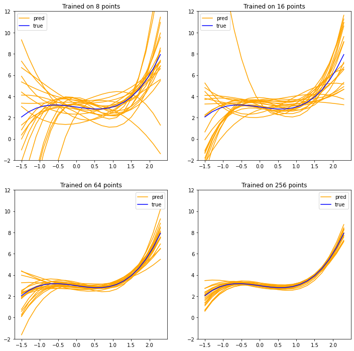{: .center style="width:37vw"}

Но разброс результатов падает с ростом $$N$$.

**Ещё пример в примере**. Рассмотрим ещё одну задачу регрессии с двумя признаками (в которой всё так же будем полагать $$\sigma^2 = 1$$), для которой оценим распределение $$w_0$$ через первую компоненту $$\mathcal{N}(\widehat{w}, I_N(\widehat{w})^{-1})$$ для одного конкретного $$\widehat{w}$$ и нарисуем несколько различных $$\widehat{w}$$, полученных из других датасетов той же мощности:

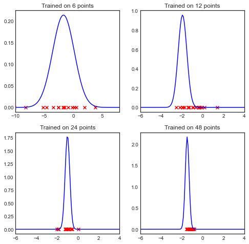{: .center style="width:37vw"}

Видим, что средние оцененного распределения сходятся к истинному значению $$-1$$; при этом дисперсия падает. Красные крестики не вполне подчиняются синему распределению, но мы от них ждём лишь приближённой согласованности, которая имеет место.

# Оценка вероятностей

Мы уже упоминали, что оценивать вероятности классов как $$softmax(f_w(x_i))$$ для какой-то произвольной функции $$f_w$$ – это дело подозрительное. В этом разделе мы поговорим о том, как это делать хорошо и правильно.

## Что такое вероятность класса?

Ограничимся пока случаем двуклассовой классификации с классами 0 и 1. Пожалуй, если утверждается, что мы предсказываем корректную вероятность класса 1 (обозначим её $$q(x_i)$$), то прогноз <<объект $$x_i$$ принадлежит классу 1 с вероятностью $$\frac23$$>> должен сбываться в $$\frac23$$ случаев. То есть, условно говоря, если мы возьмём все объекты, которым мы предсказали вероятностью $$\frac23$$, то среди них что-то около двух третей действительно имеет класс 1. На математическом языке это можно сформулировать так: **Если $$\widehat{p}$$ – предсказанная вероятность класса 1, то $$P(y_i = 1 \vert q(x_i) = \widehat{p}) = \widehat{p}$$**.

К сожалению, в реальной жизни $$\widehat{p}$$ – это скорее всего вещественные числа, которые будут различными для различных $$y_i$$, и никаких вероятностей мы не посчитаем, но мы можем разбить отрезок $$[0,1]$$ на бины, внутри каждого из которых уже вычислить, каковая там доля объектов класса 1, и сравнить эту долю со средним значением вероятности в бине:

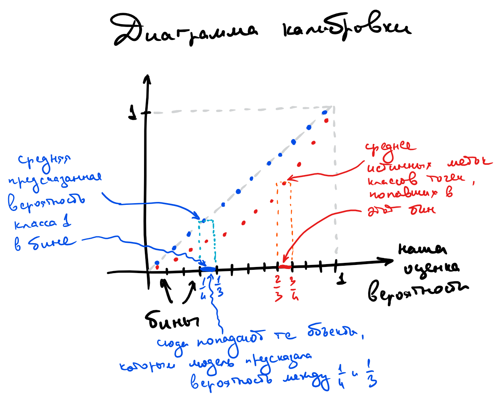{: .center}

У модели, которая идеально предсказывает вероятности (как обычно говорят, у идеально калиброванной модели) красные точки на диаграме калибровки должны совпадать с синими.

А вот на картинке выше это не так: красные точки всегда ниже синих. Давайте поймём, что это значит. Получается, что наша модель систематически завышает предсказанную вероятность (синие точки), и порог отсечения нам, выходит, тоже надо было бы сдвинуть вправо:

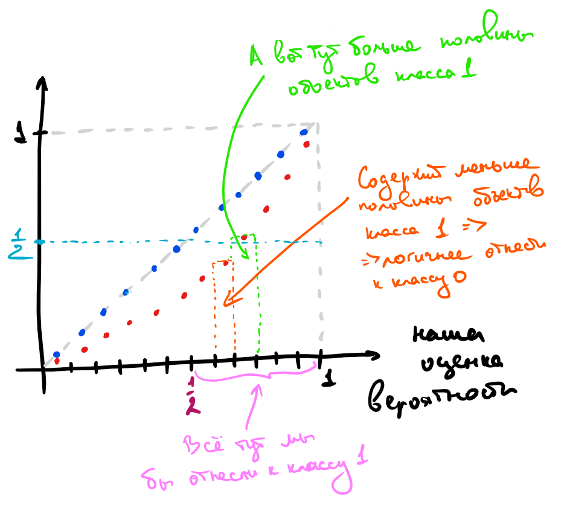{: .center}

Но такая картинка, пожалуй, говорит о какой-то серьёзной патологии классификатора; гораздо чаще встречаются следующие две ситуации:

- Слишком уверенный (**overconfident**) классификатор:
  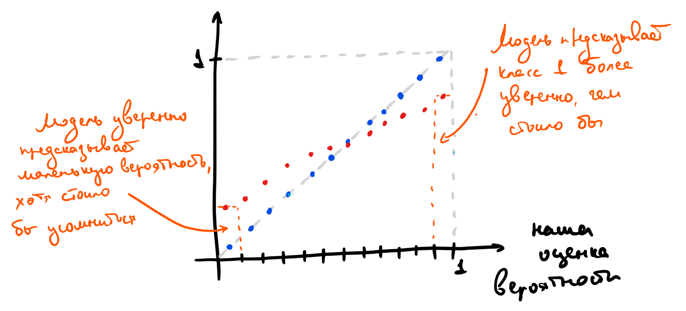{: .center}
  Такое случается с сильными классификаторыми (например, нейросетями), которые учились на метки классов, а не на вероятности: тем самым процесс обучения стимулировал их всегда давать как можно более близкий к 0 или 1 ответ.

- Неуверенный (**underconfident**) классификатор:
  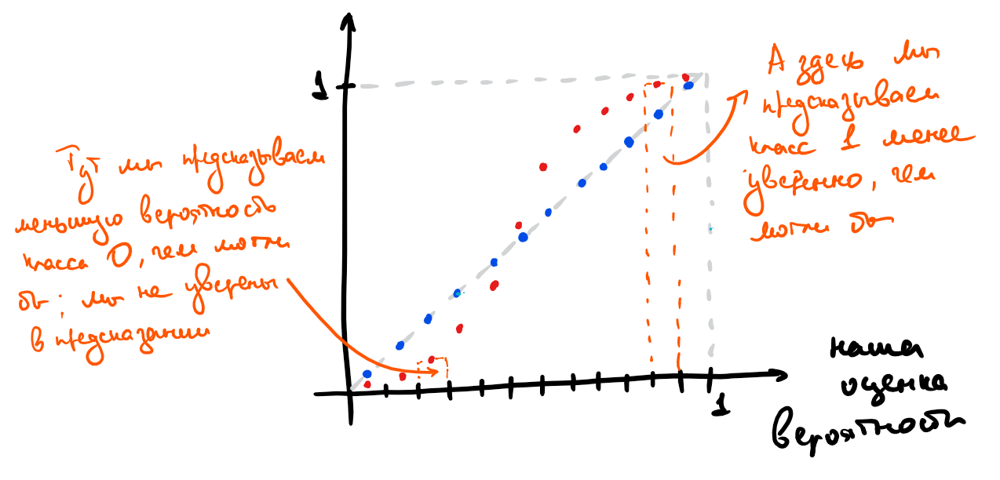{: .center}

Такое может случиться, например, если мы слишком много обращаем внимания на трудные для классификации объекты на границе классов (как, скажем, в SVM), в каком-то смысле в ущерб более однозначно определяемым точкам. Этим же могут и грешить модели на основе бэггинга (например, случайный лес). Грубо говоря, среднее нескольких моделей предскажет что-то близкое к единице только если все слагаемые предскажут что-то, близкое к единице – но из-за дисперсии моделей это будет случаться реже, чем могло бы. См. [статью](https://www.cs.cornell.edu/~alexn/papers/calibration.icml05.crc.rev3.pdf).

## Предсказание вероятностей с помощью логистической регрессии

Вам скажут: логистическая регрессия корректно действительно предсказывает вероятности.

Вам даже будут приводить какие-то обоснования. Важно понимать, что происходит на самом деле, и не дать ввести себя в заблуждение. В качестве противоядия от иллюзий предлагаем рассмотреть два примера.

- Рассмотрим датасет c двумя классами (ниже на картинке обучающая выборка)

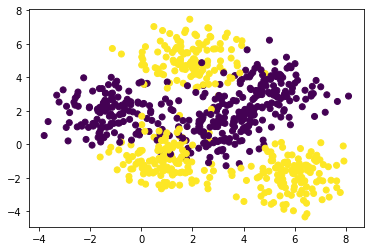{: .center style="width:30vw"}

Обучим на нём логистическую регрессию из sklearn безо всяких параметров (то есть $$L^2$$-регуляризованную, но это не так важно). Классы не так-то просто разделить, вот и логистическая регрессия так себе справляется. Ниже изображена часть тестовой выборки вместе с предсказанными вероятностями классов для всех точек области

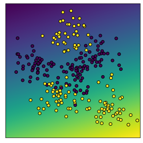{: .center style="width:30vw"}

Видим, что модель не больно-то уверена в себе, и ясно почему: признаковое описание достаточно бедное и не позволяет нам хорошо разделить классы, хотя, казалось бы, это можно довольно неплохо сделать.

- Попробуем поправить дело, добавив полиномиальные фичи, то есть все $$x^jy^k$$ для $$0\leqslant j,k\leqslant 5$$ в качестве признаков, и обучив поверх этих данных логистическую регрессию. Снова нарисуем некоторые точки тестовой выборки и предсказания вероятностей для всех точек области:

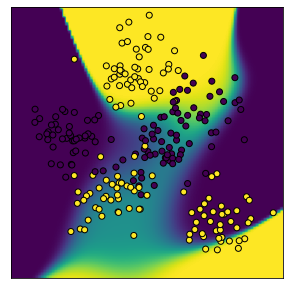{: .center style="width:30vw"}

Видим, что имеет место сочетание двух проблем: неуверенности посередине и очень уверенных ошибок по краям.

Нарисуем теперь калибровочные кривые для обеих моделей:

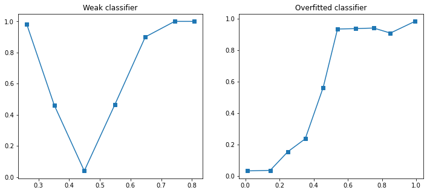{: .center}

Калибровочные кривые весьма примечательны; в любом случае ясно, что с предсказанием вероятностей всё довольно плохо. Посмотрим ещё, какие вероятности наши классификаторы чаще приписывают объектам:

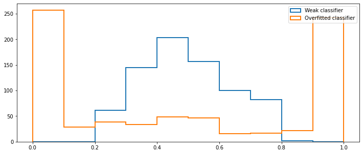{: .center}

Как и следовало ожидать, предсказания слабого классификатора тяготеют к серединке (та самая неуверенность), а среди предсказаний переобученного очень много крайне уверенных (и совсем не всегда правильных).

## Скалиброванность логистической регрессии

Но почему же все твердят, что логистическая регрессия хорошо калибрована?!

Попробуем понять и простить её.

Как мы помним, логистическая регрессия учится путём минимизации функционала

<<<<<<< develop
<<<<<<< develop
<<<<<<< develop
$$
l(X, y) = -\sum_{i=1}^N(y_i\log(\sigma(\langle w, x_i\rangle)) + (1 - y_i)\log(1 - \sigma(\langle w, x_i\rangle)))
$$
=======
$$l(X, y) = -\sum_{i=1}^N(y_i\log(\sigma(\langle w, x_i\rangle)) + (1 - y_i)\log(1 - \sigma(\langle w, x_i\rangle)))$$
>>>>>>> chore: added prob_ML (part)
=======
<Math block>

=======
>>>>>>> fix: use MathLayout instead Math
$$
l(X, y) = -\sum_{i=1}^N(y_i\log(\sigma(\langle w, x_i\rangle)) + (1 - y_i)\log(1 - \sigma(\langle w, x_i\rangle)))
$$

<<<<<<< develop
</Math>
>>>>>>> feat: pass formulas to Math component

=======
>>>>>>> fix: use MathLayout instead Math
Отметим между делом, что каждое слагаемое – это кроссэнтропия распределения $$P$$, заданного вероятностями $$P(0) = 1 - \log(\sigma(\langle w, x_i\rangle))$$ и $$P(1) = \log(\sigma(\langle w, x_i\rangle))$$, и тривиального распределения, которое равно $$y_i$$ с вероятностью $$1$$.

Допустим, что мы обучили по всему универсуму данных $$\mathbb{X}$$ идеальную логистическую регрессию с идеальными весами $$w^{\ast}$$. Пусть, далее, оказалось, что у нас есть $$n$$ объектов $$x_1,\ldots,x_n$$ с одинаковым признаковым описанием (то есть по сути представленных одинаковыми векторами $$x_i$$), но, возможно, разными истинными метками классов $$y_1,\ldots,y_n$$. Тогда соответствующий им кусок функции потерь имеет вид

<<<<<<< develop
<<<<<<< develop
<<<<<<< develop
$$
-\left(\sum_{i=1}^ny_i\right)\log(\sigma(\langle w, x_1\rangle)) -\left(\sum_{i=1}^n (1 - y_i)\right)\log(1 - \sigma(\langle w, x_1\rangle)) =
$$

$$
=-n\left(\vphantom{\frac12}p_1\log(\sigma(\langle w, x_1\rangle)) + p_0\log(1 - \sigma(\langle w, x_1\rangle))\right)
$$

где $$p_j$$ – частота $$j$$-го класса среди истинных меток. В скобках также стоит кросс-энтропия распределения, задаваемого частотой меток истинных классов, и распределения, предсказываемого логистической регрессией. Максимальное значение кросс-энтропии (и минимум функции потерь) достигается, когда

$$
\sigma(\langle w, x_1\rangle) = p_1,\quad 1 - \sigma(\langle w, x_1\rangle) = p_0
$$
=======
$$-\left(\sum_{i=1}^ny_i\right)\log(\sigma(\langle w, x_1\rangle)) -\left(\sum_{i=1}^n (1 - y_i)\right)\log(1 - \sigma(\langle w, x_1\rangle)) =$$
=======
<Math block>
>>>>>>> feat: pass formulas to Math component

=======
>>>>>>> fix: use MathLayout instead Math
$$
-\left(\sum_{i=1}^ny_i\right)\log(\sigma(\langle w, x_1\rangle)) -\left(\sum_{i=1}^n (1 - y_i)\right)\log(1 - \sigma(\langle w, x_1\rangle)) =
$$

$$
=-n\left(\vphantom{\frac12}p_1\log(\sigma(\langle w, x_1\rangle)) + p_0\log(1 - \sigma(\langle w, x_1\rangle))\right)
$$

где $$p_j$$ – частота $$j$$-го класса среди истинных меток. В скобках также стоит кросс-энтропия распределения, задаваемого частотой меток истинных классов, и распределения, предсказываемого логистической регрессией. Максимальное значение кросс-энтропии (и минимум функции потерь) достигается, когда

<<<<<<< develop
<<<<<<< develop
$$\sigma(\langle w, x_1\rangle) = p_1,\quad 1 - \sigma(\langle w, x_1\rangle) = p_0$$
>>>>>>> chore: added prob_ML (part)
=======
<Math block>

=======
>>>>>>> fix: use MathLayout instead Math
$$
\sigma(\langle w, x_1\rangle) = p_1,\quad 1 - \sigma(\langle w, x_1\rangle) = p_0
$$

<<<<<<< develop
</Math>
>>>>>>> feat: pass formulas to Math component

=======
>>>>>>> fix: use MathLayout instead Math
Теперь, если признаковое описание данных достаточно хорошее (то есть классы не перемешаны как попало и всё-таки близки к разделимым) и в то же время модель не переобученная (то есть, в частности, предсказания вероятностей не скачут очень уж резко – вспомните второй пример), то результат, полученный для $$n$$ совпадающих точек будет приблизительно верным и для $$n$$ достаточно близких точек: на всех них модель будет выдавать примерно долю положительных, то есть тоже хорошую оценку вероятности.

## Методы калибровки

Пусть наша модель (бинарной классификации) для каждого объекта $$x_i$$ выдаёт некоторое число $$q(x_i)\in[0,1]$$. Как же эти числа превратить в корректные вероятности?

- **Гистограммная калибровка**. Мы разбиваем отрезок $$[0,1]$$ на бины $$\mathbb{B}_1,\ldots,\mathbb{B}_k$$ (одинаковой ширины или равномощные) и хотим на каждом из них предсказывать всегда одну и ту же вероятность: $$\theta_j$$, если $$q(x_i)\in \mathbb{B}_j$$. Вероятности $$\theta_i$$ подбираются так, чтобы они как можно лучше приближали средние метки классов на соответствующих бинах; иными словами, мы решаем задачу

<<<<<<< develop
<<<<<<< develop
<<<<<<< develop
$$
\sum_{j=1}^k\left|\frac{\sum_{i=1}^N\mathbb{I}\{q(x_i)\in\mathbb{B}_j\}}{ \vert \mathbb{B}_j \vert } - \theta_j\right|\longrightarrow\min\limits_{(\theta_1,\ldots,\theta_k)}
$$
=======
$$\sum_{j=1}^k\left|\frac{\sum_{i=1}^N\mathbb{I}\{q(x_i)\in\mathbb{B}_j\}}{ \vert \mathbb{B}_j \vert } - \theta_j\right|\longrightarrow\min\limits_{(\theta_1,\ldots,\theta_k)}$$
>>>>>>> chore: added prob_ML (part)
=======
<Math block>

=======
>>>>>>> fix: use MathLayout instead Math
$$
\sum_{j=1}^k\left|\frac{\sum_{i=1}^N\mathbb{I}\{q(x_i)\in\mathbb{B}_j\}}{ \vert \mathbb{B}_j \vert } - \theta_j\right|\longrightarrow\min\limits_{(\theta_1,\ldots,\theta_k)}
$$

<<<<<<< develop
</Math>
>>>>>>> feat: pass formulas to Math component

=======
>>>>>>> fix: use MathLayout instead Math
Вместо модуля разности можно рассматривать и квадрат разности.

Метод довольно простой и понятный, но требует подбора числа бинов и предсказывает лишь дискретное множество вероятностей.

- **Изотоническая регрессия**. Этот метод похож на предыдущий, только мы будем, во-первых, настраивать и границы $$0=b_0,b_1,\ldots,b_k = 1$$ бинов $$\mathbb{B}_j = \{t \vert  b_{j-1}\leqslant b_j\}$$, а кроме того, накладываем условие $$\theta_1\leqslant\ldots\leqslant\theta_k$$. Искать $$b_j$$ и $$\theta_j$$ мы будем, приближая $$y_i$$ кусочно постоянной функцией $$g$$ от $$q(x_i)$$:

<<<<<<< develop
<<<<<<< develop
<<<<<<< develop
$$
\sum_{i=1}^N(y_i - g(q(x_i)))^2\longrightarrow\min_{g}
$$
=======
$$\sum_{i=1}^N(y_i - g(q(x_i)))^2\longrightarrow\min_{g}$$
>>>>>>> chore: added prob_ML (part)
=======
<Math block>

=======
>>>>>>> fix: use MathLayout instead Math
$$
\sum_{i=1}^N(y_i - g(q(x_i)))^2\longrightarrow\min_{g}
$$

<<<<<<< develop
</Math>
>>>>>>> feat: pass formulas to Math component

=======
>>>>>>> fix: use MathLayout instead Math
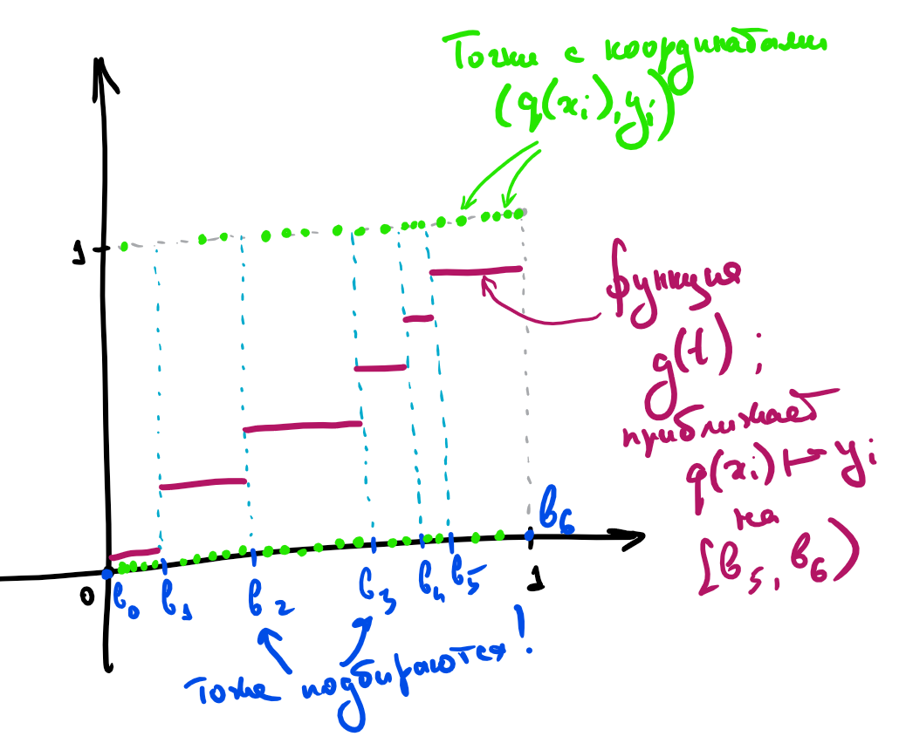{: .center style="width:47vw"}

Минимизация осуществляется при помощи pool adjacent violators algorithm, и эти страницы слишком хрупки, чтобы выдержать его формулировку.

- **Калибровка Платта** представляет собой по сути применение сигмоиды поверх другой модели (то есть самый наивный способ получения ''вероятностей''). Более точно, если $$q(x_i)$$ – предсказанная вероятность, то мы полагаем

<<<<<<< develop
<<<<<<< develop
<<<<<<< develop
$$
P(y_i = 1\mid x_i) = \sigma(aq(x_i) + b) = \frac1{1 + e^{-aq(x_i) - b}}
$$

где $$a$$ и $$b$$ подбираются методом максимального правдоподобия на отложенной выборке:

$$
-\sum_{i=1}^N(\vphantom{\frac12}y_i\log(\sigma(q(x_i)) + (1 - y_i)\log(1 - \sigma(aq(x_i) + b)))\longrightarrow\min\limits_{a,b}
$$

Для избежания переобучения Платт предлагал также заменить метки $$0$$ и $$1$$ на регуляризованные оценки вероятностей:

$$
t_0 = \frac1{\#\{i \vert y_i = 0\} + 2},\quad t_1 = \frac{\#\{i \vert y_i = 1\} + 1}{\#\{i \vert y_i = 1\} + 2}
$$
=======
$$P(y_i = 1\mid x_i) = \sigma(aq(x_i) + b) = \frac1{1 + e^{-aq(x_i) - b}}$$
=======
<Math block>

=======
>>>>>>> fix: use MathLayout instead Math
$$
P(y_i = 1\mid x_i) = \sigma(aq(x_i) + b) = \frac1{1 + e^{-aq(x_i) - b}}
$$

<<<<<<< develop
</Math>
>>>>>>> feat: pass formulas to Math component

=======
>>>>>>> fix: use MathLayout instead Math
где $$a$$ и $$b$$ подбираются методом максимального правдоподобия на отложенной выборке:

$$
-\sum_{i=1}^N(\vphantom{\frac12}y_i\log(\sigma(q(x_i)) + (1 - y_i)\log(1 - \sigma(aq(x_i) + b)))\longrightarrow\min\limits_{a,b}
$$

Для избежания переобучения Платт предлагал также заменить метки $$0$$ и $$1$$ на регуляризованные оценки вероятностей:

<<<<<<< develop
<<<<<<< develop
$$t_0 = \frac1{\#\{i \vert y_i = 0\} + 2},\quad t_1 = \frac{\#\{i \vert y_i = 1\} + 1}{\#\{i \vert y_i = 1\} + 2}$$
>>>>>>> chore: added prob_ML (part)
=======
<Math block>

=======
>>>>>>> fix: use MathLayout instead Math
$$
t_0 = \frac1{\#\{i \vert y_i = 0\} + 2},\quad t_1 = \frac{\#\{i \vert y_i = 1\} + 1}{\#\{i \vert y_i = 1\} + 2}
$$

<<<<<<< develop
</Math>
>>>>>>> feat: pass formulas to Math component

=======
>>>>>>> fix: use MathLayout instead Math
Калибровка Платта неплохо справляется с выколачиванием вероятностей из SVM, но для более хитрых классификаторов может спасовать. В целом, можно показать, что этот метод хорошо работает, если для каждого из истинных классов предсказанные вероятности $$q(x_i)$$ распределы нормально с одинаковыми дисперсиями. Подробнее об этом вы можете почитать в [этой статье](https://research-information.bris.ac.uk/ws/portalfiles/portal/154625753/Full_text_PDF_final_published_version_.pdf). Там же описано обобщение данного подхода – бета-калибровка.

С большим количеством других методов калибровки вы можете познакомиться в [этой статье](https://dyakonov.org/2020/03/27/проблема-калибровки-уверенности)

## Измерение качества калибровки

Калибровочные кривые хорошо показывают, что есть проблемы, но как оценить наши потуги по улучшению предсказания вероятностей? Хочется иметь какую-то численную метрику. Мы упомянем две разновидности, которые по сути являются прямым воплощением описанных выше идей.

- **Expected/Maximum calibration error**. Самый простой способ, впрочем, является наследником идеи с калибровочной кривой. А именно, разобьём отрезок $$[0,1]$$ на бины $$\mathbb{B}_1,\ldots,\mathbb{B}_k$$ по предсказанным вероятностям и вычислим

<<<<<<< develop
<<<<<<< develop
<<<<<<< develop
=======
<Math block>

>>>>>>> feat: pass formulas to Math component
=======
>>>>>>> fix: use MathLayout instead Math
$$
\sum_{j=1}^k\frac{\#\mathbb{B}_j}{N}\left|\overline{y}(\mathbb{B}_j) - \overline{q}(\mathbb{B}_j)\right|
$$

<<<<<<< develop
<<<<<<< develop
или

$$
\max\limits_{j=1,\ldots,k}\left|\overline{y}(\mathbb{B}_j) - \overline{q}(\mathbb{B}_j)\right|
$$
=======
$$\sum_{j=1}^k\frac{\#\mathbb{B}_j}{N}\left|\overline{y}(\mathbb{B}_j) - \overline{q}(\mathbb{B}_j)\right|$$

или

$$\max\limits_{j=1,\ldots,k}\left|\overline{y}(\mathbb{B}_j) - \overline{q}(\mathbb{B}_j)\right|$$
>>>>>>> chore: added prob_ML (part)
=======
</Math>

=======
>>>>>>> fix: use MathLayout instead Math
или

$$
\max\limits_{j=1,\ldots,k}\left|\overline{y}(\mathbb{B}_j) - \overline{q}(\mathbb{B}_j)\right|
$$

<<<<<<< develop
</Math>
>>>>>>> feat: pass formulas to Math component

=======
>>>>>>> fix: use MathLayout instead Math
где $$\overline{y}(\mathbb{B}_j)$$ – среднее значение $$y_i$$, а $$\overline{q}(\mathbb{B}_j)$$ – среднее значение $$q(x_i)$$ для $$x_i$$, таких что $$q(x_i)\in\mathbb{B}_j$$. Проблема этого способа в том, что мы можем очень по-разному предсказывать в каждом из бинов вероятности (в том числе константой) без ущерба для метрики.

- Одна из популярных метрик – это **Brier score**, которая попросту измеряет разницу между предсказанными вероятностями и $$ y_i $$:

<<<<<<< develop
<<<<<<< develop
<<<<<<< develop
$$
\sum_{i=1}^N(y_i - q(x_i))^2
$$
=======
$$\sum_{i=1}^N(y_i - q(x_i))^2$$
>>>>>>> chore: added prob_ML (part)
=======
<Math block>

=======
>>>>>>> fix: use MathLayout instead Math
$$
\sum_{i=1}^N(y_i - q(x_i))^2
$$

<<<<<<< develop
</Math>
>>>>>>> feat: pass formulas to Math component

=======
>>>>>>> fix: use MathLayout instead Math
Казалось бы, в чём смысл? Немного подрастить мотивацию помогает следующий пример. Допустим, наши таргеты совершенно случайны, то есть $$P(y_i = 1 \vert x_i) = P(y_i)$$. Тогда хорошо калиброванный классификатор должен для каждого $$x_i$$ предсказывать вероятность $$\frac12$$; соответственно, его brier score равен $$\frac14$$. Если же классификатор хоть в одной точке выдаёт вероятность $$p>\frac12$$, то в маленькой окрестности он должен выдавать примерно такие же вероятности; поскольку же таргет случаен, локальный кусочек суммы из brier score будет иметь вид $$\frac{N'}{2}p^2 + \frac{N'}{2}(1-p)^2 < \frac{N'}2$$, что хуже, чем получил бы всегда выдающий $$\frac12$$ классификатор.

Не обязательно брать квадратичную ошибку; сгодится и наш любимый log-loss:

<<<<<<< develop
<<<<<<< develop
<<<<<<< develop
$$
\sum_{i=1}^N\left(\vphantom{\frac12}y_i\log{q(x_i)} + (1 - y_i)\log(1 - q(x_i))\right)
$$
=======
$$\sum_{i=1}^N\left(\vphantom{\frac12}y_i\log{q(x_i)} + (1 - y_i)\log(1 - q(x_i))\right)$$
>>>>>>> chore: added prob_ML (part)
=======
<Math block>

=======
>>>>>>> fix: use MathLayout instead Math
$$
\sum_{i=1}^N\left(\vphantom{\frac12}y_i\log{q(x_i)} + (1 - y_i)\log(1 - q(x_i))\right)
$$

<<<<<<< develop
</Math>
>>>>>>> feat: pass formulas to Math component

=======
>>>>>>> fix: use MathLayout instead Math
Это же и помогает высветить ограничения подхода, если вспомнить рассуждения о калиброванности логистической регрессии. Для достаточно гладких классификатора и датасета briar score и log-loss будут адекватными средствами оценки, но если нет – возможно всякое.

**Вопрос на засыпку**: а как быть, если у нас классификация не бинарная, а многоклассовая? Что такое хорошо калиброванный классификатор? Как это определить численно? Как заставить произвольный классификатор предсказывать вероятности?

Мы не будем про это рассказывать, но призываем читателя подумать над этим самостоятельно или, например, посмотреть [туториал с ECML KDD 2020](https://classifier-calibration.github.io/).

# Генеративный подход

## Генеративный и дискриминативный подходы к обучению

Классификационные модели, которые мы рассматривали в предыдущих главах, нацелены непосредственно на оценку $P(Y \vert X)$. Такие модели называются **дискриминативными**. К ним относится, например, логистическая регрессия: она предлагает оценку $$ \hat P(y=1 \vert x) = \sigma(w^Tx) $$. В процессе обучения дискриминативные модели подбирают разделяющую поверность (гиперплоскость в случае логистической регрессии). Новые объекты дискриминативная модель классифицирует в зависимости от того, по какую сторону от разделяющей поверности они лежат. Например, обучившись на изображениях домашних кошек (y=0) и рысей (y=1), дискриминативная модель будет определять, новое изображение больше похоже на кошку или на рысь. При этом, если на вход такой модели дать изображение собаки (объект класса, которого не было в обучении, выброс), дискриминативная модель заведомо не сможет обнаружить, что это и не кошка, и не рысь, и отнесёт такой объект к одному из ''знакомых'' ей классов.

В этой главе мы поговорим о другой группе моделей, которые нацелены на оценку $P(X, Y) = P(X \vert Y)P(Y)$. Такая модель описала бы, как обычно выглядят кошки, как они могут выглядеть, а каких кошек точно не бывает. Так же она описала бы и рысей. Она также определила бы по обучающим данным, насколько изображения кошек встречаются чаще, чем изображения рысей, т.е. оценила бы $P(Y)$. Если модель позволила точно оценить распределение $P(X \vert Y)$, с её помощью можно генерировать объекты из этого условного распределения, в нашем примере -- изображения кошек и рысей соответственно. А вместе распределение $P(X, Y)$ дало бы нам возможность генерировать изображения и кошек, и рысей, причём именно в той пропорции, в которой они встречаются в реальном мире. Поэтому модели, оценивающие $P(X, Y)$, называют **генеративными**. Ещё одно достоинство генеративных моделей -- их способность находить выбросы в данных: объект $x$ можно считать выбросом, если $P(x \vert y)$ мало для каждого класса $y$.

Заметим, что находить выбросы с помощью генеративной модели можно и когда класс всего один (т.е. никакие метки классов не доступны). Такая задача называется одноклассовой классификацией. Например, если у нас есть не размеченный датасет с аудиозаписями речи людей, то, обучив на нём генеративную модель, оценивающую в данном случае $P(X \vert Y)=P(X)$, мы сможем для нового аудио $x$ определить, похоже ли оно на аудиозапись человеческой речи (значение $P(x)$ велико), или это что-то другое: синтезированная речь, посторонний шум и т.п. ($P(x)$ мало). Тем не менее, если мы знаем, что "выбросы", с которыми модели предстоит сталкиваться, -- как правило, синтезированная речь, то, дополнив датасет вторым классов, состоящим из синтезированной речи и смоделировав также распределение этого класса, мы можем существенно увеличить качество детектирования таких выбросов.
Чтобы использовать генеративную модель для классификации, необходимо выразить $P(Y \vert X)$ через $P(X \vert Y)$ и $P(Y)$. Сделать это позволяет формула Байеса:

$$
P(y \vert x) = \frac{P(x, y)}{\sum\limits_{y'\in Y} P(y')P(x \vert y')} = \frac{P(y)P(x \vert y)}{\sum\limits_{y'\in Y} P(y')P(x \vert y')}
$$

Классификация в генеративных моделях осуществляется с помощью $$ \textit{байесовского классификатора} $$:

<<<<<<< develop
<<<<<<< develop
<<<<<<< develop
=======
<Math block>

>>>>>>> feat: pass formulas to Math component
=======
>>>>>>> fix: use MathLayout instead Math
$$
a(x) = \arg\max\limits_{y\in Y} P(y \vert x) = \arg\max\limits_{y\in Y} \frac{P(y)P(x \vert y)}{\sum\limits_{y'\in Y} P(y')P(x \vert y')} = \arg\max\limits_{y\in Y} P(y)P(x \vert y)
$$

<<<<<<< develop
<<<<<<< develop
Оценить $P(Y)$, как правило, несложно. Для этого используют частотные оценки, полученные обучающей выборке:

$$
\hat P(Y=y) = \frac{\#(Y=y)}{N} \label{eq:class_proba_estimation} \tag{1}
$$
=======
$$a(x) = \arg\max\limits_{y\in Y} P(y \vert x) = \arg\max\limits_{y\in Y} \frac{P(y)P(x \vert y)}{\sum\limits_{y'\in Y} P(y')P(x \vert y')} = \arg\max\limits_{y\in Y} P(y)P(x \vert y)$$

Оценить $P(Y)$, как правило, несложно. Для этого используют частотные оценки, полученные обучающей выборке:

$$\hat P(Y=y) = \frac{\#(Y=y)}{N} \label{eq:class_proba_estimation} \tag{1}$$
>>>>>>> chore: added prob_ML (part)
=======
</Math>

=======
>>>>>>> fix: use MathLayout instead Math
Оценить $P(Y)$, как правило, несложно. Для этого используют частотные оценки, полученные обучающей выборке:

$$
\hat P(Y=y) = \frac{\#(Y=y)}{N} \label{eq:class_proba_estimation} \tag{1}
$$

<<<<<<< develop
</Math>
>>>>>>> feat: pass formulas to Math component

=======
>>>>>>> fix: use MathLayout instead Math
Отметим ещё раз, что использование генеративного подхода позволяет внедрять в модель априорные знания о $P(y)$. Это не очень впечатляет, когда речь идёт о бинарной классификации, но всё меняется, если рассмотреть задачу ASR (автоматического распознавания речи), в которой по записи голоса восстанавливается произносимый текст. Таргетами здесь могут быть любые предложения или даже более развёрнутые тексты. При этом размеченных данных (запись, текст) обычно намного меньше, чем доступных текстов, и обученная на большом чисто текстовом корпусе языковая модель, которая будет оценивать вероятность того или иного предложения, может стать большим подспорьем, позволив из нескольких фонетически корректных наборов слов выбрать тот, который в большей степени похож на настоящее предложение.

Но как смоделировать распределение $P(X, Y)$? Пространство всех возможных функций распределения $P(X, Y)$ бесконечномерно, из-за чего оценить произвольное распределение с помощью конечной выборки невозможно. Поэтому перед оценкой $P(X, Y)$ на это распределение накладывают дополнительные ограничения. Некоторые простые примеры таких ограничений мы рассмотрим в следующих разделах.

### Gaussian discriminant analysis
<<<<<<< develop

Модель гауссовского (или квадратичного) дискриминантного анализа (GDA) строится в предположении, что распределение объектов каждого класса $y$ подчиняется многомерному нормальному закону со средним $\mu_y$ и ковариационной матрицей $\Sigma_y$:

<<<<<<< develop
<<<<<<< develop
$$
p(x \vert y) = \frac{1}{(2\pi)^{n/2} \vert \Sigma_y \vert ^{1/2}}\exp\left(-\frac{1}{2}(x-\mu_y)^T\Sigma_y^{-1} (x-\mu_y)\right) \label{eq:multivariate_normal}
$$

Тогда функция правдоподобия

=======
<Math block>

=======
>>>>>>> fix: use MathLayout instead Math
$$
p(x \vert y) = \frac{1}{(2\pi)^{n/2} \vert \Sigma_y \vert ^{1/2}}\exp\left(-\frac{1}{2}(x-\mu_y)^T\Sigma_y^{-1} (x-\mu_y)\right) \label{eq:multivariate_normal}
$$

Тогда функция правдоподобия

<<<<<<< develop
<Math block>

>>>>>>> feat: pass formulas to Math component
=======
>>>>>>> fix: use MathLayout instead Math
$$
\mathcal L(P(Y), \mu, \Sigma) = \prod_{i=1}^N p(x_i \vert y_i; \mu_{y_i}, \Sigma_{y_i})P(y_i)
$$

<<<<<<< develop
<<<<<<< develop
=======
</Math>

>>>>>>> feat: pass formulas to Math component
=======
>>>>>>> fix: use MathLayout instead Math
достигает максимума при

$$
\hat\mu_y = \frac{\sum\limits_{i=1}^N{x_i\unicode{x1D7D9}_{y_i=y}}}{\sum\limits_{i=1}^N\unicode{x1D7D9}_{y_i=y}},\hspace{5mm}
\hat\Sigma_y = \frac{\sum\limits_{i=1}^N{(x_i - \hat\mu_{y})(x_i - \hat\mu_{y})^T \unicode{x1D7D9}_{y_i=y}}}{\sum\limits_{i=1}^N\unicode{x1D7D9}_{y_i=y}}
$$

И $\hat P(Y)$, представленной выше см. выражение [$(1)$](#eq:class_proba_estimation).

Рассмотрим, как выглядит разделяющая поверхность в модели GDA. На поверхности, разделяющей классы $y_i$ и $y_j$ выполняется

<<<<<<< develop
<<<<<<< develop
=======
<Math block>

>>>>>>> feat: pass formulas to Math component
=======
>>>>>>> fix: use MathLayout instead Math
$$
P(y_i \vert x)=P(y_j \vert x) \Leftrightarrow
$$

<<<<<<< develop
<<<<<<< develop
=======
</Math>

<Math block>

>>>>>>> feat: pass formulas to Math component
=======
>>>>>>> fix: use MathLayout instead Math
$$
p(x \vert y_i)P(y_i) = p(x \vert y_j)P(y_j)\Leftrightarrow
$$

<<<<<<< develop
<<<<<<< develop
$$
\log p(x \vert y_i) + \log P(y_i) - \log p(x \vert y_j) - \log P(y_j) = 0\Leftrightarrow
$$

=======
</Math>

<Math block>

=======
>>>>>>> fix: use MathLayout instead Math
$$
\log p(x \vert y_i) + \log P(y_i) - \log p(x \vert y_j) - \log P(y_j) = 0\Leftrightarrow
$$

<<<<<<< develop
</Math>

<Math block>

>>>>>>> feat: pass formulas to Math component
=======
>>>>>>> fix: use MathLayout instead Math
$$
name="eq:GDA_boundary"

\begin{equation}
-\frac{1}{2}(x-\mu*{y_i})^T\Sigma*{y*i}^{-1} (x-\mu*{y*i})-\log (2\pi)^{n/2}|\Sigma*{y*i}|^{1/2} + \log P(y_i) +
\frac{1}{2}(x-\mu*{y*j})^T\Sigma*{y*j}^{-1} (x-\mu*{y*j}) + \log (2\pi)^{n/2}|\Sigma*{y_j}|^{1/2} - \log P(y_j) = 0
\label{eq:GDA_boundary} \tag{2}
\end{equation}
$$
<<<<<<< develop
=======

<<<<<<< develop
</Math>
>>>>>>> feat: pass formulas to Math component

=======
>>>>>>> fix: use MathLayout instead Math
Поскольку левая часть уравнения [$ (2) $](#eq:GDA_boundary) квадратична по $x$, разделяющая поверность между двумя классами будет представлять из себя гиперповерность порядка 2. Пример разделяющей поверхности многоклассовой модели GDA приведён [на рис.](#fig:GDA_boundary)

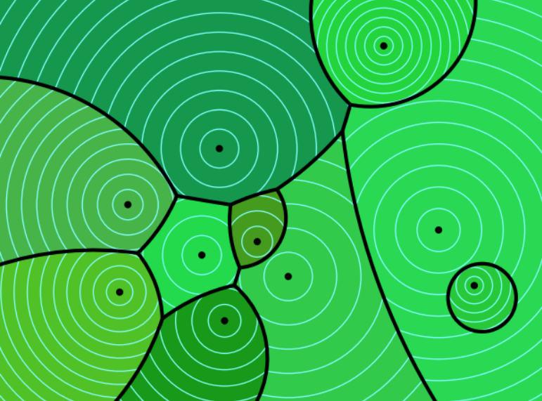{: .center style="width:30vw" #fig:GDA_boundary}

Плотность классов и разделяющая поверхность в многоклассовой модели LDA [см. рисунок](#fig:LDA_boundary).

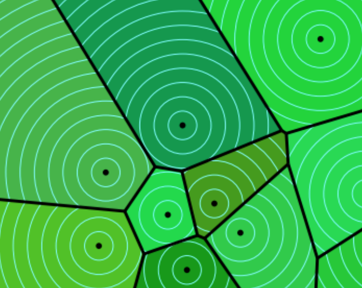{: .center style="width:30vw" #fig:LDA_boundary}

name="ss:GDA"

### Linear Discriminant Analysis

В выражении [$ (2) $](#eq:GDA_boundary) член второго порядка $x^T (\Sigma_{y_j}^{-1} - \Sigma_{y_i}^{-1})x$ зануляется при $\Sigma_{y_i}=\Sigma_{y_j}$. Таким образом, если дополнительно предположить, что все классы имеют общую ковариационную матрицу $\Sigma$, разделяющая поверхность между любыми двумя классами будет линейной ([см. рисунок](#fig:LDA_boundary)). Поэтому такая модель называется линейным дискриминантным анализом (LDA).

На этапе обучения единственное отличие модели LDA от GDA состоит в оценке ковариационной матрицы:

<<<<<<< develop
<<<<<<< develop
$$
\hat \Sigma = \frac{1}{N}\sum\limits_{i=1}^N{(x_i - \hat\mu_{y_i})(x_i - \hat\mu_{y_i})^T}
$$
=======
<Math block>

=======
>>>>>>> fix: use MathLayout instead Math
$$
\hat \Sigma = \frac{1}{N}\sum\limits_{i=1}^N{(x_i - \hat\mu_{y_i})(x_i - \hat\mu_{y_i})^T}
$$

<<<<<<< develop
</Math>
>>>>>>> feat: pass formulas to Math component

=======
>>>>>>> fix: use MathLayout instead Math
Заметим, что в модели GDA для каждого класса требовалось оценить порядка $d^2$ параметров. Это может привести к переобучению в случае, если размерность пространства признаков велика, а некоторые классы представлены в обучающей выборке малым количеством объектов. В LDA для каждого класса требуется оценить лишь порядка $d$ параметров (значение $P(y)$ и элементы вектора $\mu_y$), и ещё $d^2$ общих для всех классов параметров (элементы матрицы $\Sigma$). Таким образом, основное преимущество модели LDA перед GDA -- её меньшая склонность к переобучению, недостаток -- линейная разделяющая поверхность.

## Метод наивного байеса

Предположим, что признаки $X$ объектов каждого класса $y$ -- независимые случайные величины:

<<<<<<< develop
<<<<<<< develop
=======
<Math block>

>>>>>>> feat: pass formulas to Math component
=======
>>>>>>> fix: use MathLayout instead Math
$$
\forall y\in Y \hspace{2mm} \forall U, V: U\sqcup V = \{1, ... d\}, \hspace{2mm} \forall x^u\subset \mathbb R^{|U|}, x^v\subset \mathbb R^{|V|}
$$

<<<<<<< develop
<<<<<<< develop
$$
P(X^U\in x^u, X^V\in x^v|Y=y) = P(X^U\in x^u|Y=y)P(X^V\in x^u|Y=y).
$$

В таком случае говорят, что величины $X$ условно независимы отностиельно $Y$. Тогда справедливо

=======
</Math>

<Math block>

=======
>>>>>>> fix: use MathLayout instead Math
$$
P(X^U\in x^u, X^V\in x^v|Y=y) = P(X^U\in x^u|Y=y)P(X^V\in x^u|Y=y).
$$

В таком случае говорят, что величины $X$ условно независимы отностиельно $Y$. Тогда справедливо

<<<<<<< develop
<Math block>

>>>>>>> feat: pass formulas to Math component
=======
>>>>>>> fix: use MathLayout instead Math
$$
name="eq:cond_independent"

\begin{equation}\label{eq:cond_independent}
P(X \vert Y) = P(X^1, X^2, ..., X^d \vert Y) = P(X^1 \vert Y)P(X^2, ..., X^d \vert Y) = ... = P(X^1 \vert Y)P(X^2 \vert Y)...P(X^d \vert Y) \tag{3}
\end{equation}
$$
<<<<<<< develop
=======

<<<<<<< develop
</Math>
>>>>>>> feat: pass formulas to Math component

=======
>>>>>>> fix: use MathLayout instead Math
То есть для того, чтобы оценить плотность многомерного распределения $P(X \vert Y)$ достаточно оценить плотности одномерных распределений $P(X^i \vert Y)$, [см. рисунок](#fig:blobs_density).

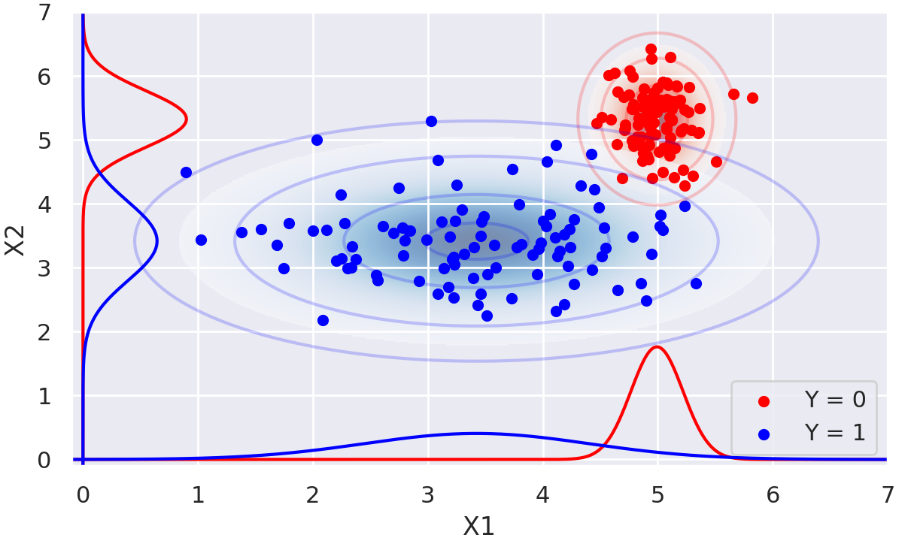{: .center style="width:40vw" #fig:blobs_density}

На рисунке приведён пример условно независимых относительно $Y$ случайных величин $X^1, X^2$. Для оценки плотности двумерных распределений объектов классов достаточно оценить плотности маргинальных распределений, изображённые графиками вдоль осей.

Рассмотрим пример. Пусть решается задача классификации отзывов об интернет-магазине на 2 категории: $Y=0$ -- отрицательный отзыв, клиент остался не доволен, и $Y=1$ -- положительный отзыв. Пусть признак $X^w$ равен 1, если слово $w$ присутствует в отзыве, и 0 иначе. Тогда условие [ $ (3) $](#eq:cond_independent) означает, что, в частности, наличие или отсутствие слова ''дозвониться'' в отрицательном отзыве не влияет на вероятность наличия в этом отзыве слова ''телефон''.

На практике в процессе feature engineering почти всегда создаётся много похожих признаков, и условно независимые признаки можно встретить очень редко. Поэтому генеративную модель, построенную в предположении условия [$ (3) $](#eq:cond_independent), называют наивным байесовским классификатором (Naive Bayes classifier, NB).

Обучение модели NB заключается в оценке распределений $P(Y)$ и $P(X^i \vert Y)$. Для $P(Y)$ можно использовать частотную оценку [$ (1) $](#eq:class_proba_estimation). $P(X^i \vert y)$ -- одномерное распределение. Рассмотрим несколько способов оценки одномерного распределения.

## Оценка одномерного распределения

Пусть мы хотим оценить одномерное распределение $P(X)$.

### Случай дискретного распределения

Если распределение $P(X)$ дискретное, требуется оценить его функцию массы, т.е. вероятность того, что величина $X$ примет значение $x_j$. Метод максимума правдоподобия приводит к частотной оценке:

name="eq:freq_estimation"

$$
\hat P(X = x_j) = \frac{\#(X = x_j)}{N} \tag{4}
$$

Где $N$ -- размер выборки, по которой оцениватеся распределение $X$ (количество объектов класса $y$ в случае оценки плотности класса $y$).

При этом может оказаться, что некоторое значение $x_j$ ни разу не встречается в обучающей выборке. Например, в случае классификации отзывов методом Наивного Байеса, слово ''амбивалентно'' не встретилось ни в одном положительном отзыве, но встретилось в отрицательных. Тогда использование [оценки](#eq:freq_estimation) приведёт к тому, что все отзывы с этим словом будут определяться NB как отрицательные с вероятностью 1. Чтобы избежать принятия таких радикальных решений при недостатке статистики, используют сглаживание Лапласа:

<<<<<<< develop
<<<<<<< develop
$$
\hat P(X = x_j) = \frac{\#(X = x_j) + \alpha}{N + m\alpha},
$$
=======
<Math block>

=======
>>>>>>> fix: use MathLayout instead Math
$$
\hat P(X = x_j) = \frac{\#(X = x_j) + \alpha}{N + m\alpha},
$$

<<<<<<< develop
</Math>
>>>>>>> feat: pass formulas to Math component

=======
>>>>>>> fix: use MathLayout instead Math
где $m$ -- количество различных значений, принимаемых случайной величиной $X$, $\alpha$ -- гиперпараметр.

### Случай абсолютно непрерывного распределения

Для оценки плотности $p$ абсолютно непрерывного распределения в точке $a$ можно разделить долю объектов обучающей выборки в окрестности точки $a$ на размер этой окрестности:

<<<<<<< develop
<<<<<<< develop
$$
\hat p(a) = \frac{\frac{1}{N}\sum\limits_{j=1}^{N}\unicode{x1D7D9}_{a - h < X_j < a + h}}{2h} = \frac{1}{N}\sum\limits_{j=1}^{N}\frac{\unicode{x1D7D9}_{-h < X_j - a < h}}{2h}.
$$

Обычно объекты, лежащие дальше от точки $a$, учитывают с меньшим весом. Таким образом, оценка плотности приобретает вид

$$
\hat p(a) = \frac{1}{N}\sum\limits_{j=1}^{N}K_h(X_j - a)
$$

Поскольку ожидаемое количество объектов выборки из абсолютно непрерывного распределения, попавших в небольшую окрестность, пропорционально размеру этой окрестности, обычно семейство функций $K_h$ строят по формуле

$$
K_h(t) = \frac{1}{h}K_1(\frac{t}{h})
$$
=======
<Math block>

=======
>>>>>>> fix: use MathLayout instead Math
$$
\hat p(a) = \frac{\frac{1}{N}\sum\limits_{j=1}^{N}\unicode{x1D7D9}_{a - h < X_j < a + h}}{2h} = \frac{1}{N}\sum\limits_{j=1}^{N}\frac{\unicode{x1D7D9}_{-h < X_j - a < h}}{2h}.
$$

Обычно объекты, лежащие дальше от точки $a$, учитывают с меньшим весом. Таким образом, оценка плотности приобретает вид

$$
\hat p(a) = \frac{1}{N}\sum\limits_{j=1}^{N}K_h(X_j - a)
$$

Поскольку ожидаемое количество объектов выборки из абсолютно непрерывного распределения, попавших в небольшую окрестность, пропорционально размеру этой окрестности, обычно семейство функций $K_h$ строят по формуле

$$
K_h(t) = \frac{1}{h}K_1(\frac{t}{h})
$$

<<<<<<< develop
</Math>
>>>>>>> feat: pass formulas to Math component

=======
>>>>>>> fix: use MathLayout instead Math
Где $K_1=K$ -- некоторая неотрицательная функция, называемая ядром. $K_h$ называют взвешенным ядром ([примеры используемых функций $K_h$ на рисунке](#fig:kernels.png)).
Такой способ оценки плотности называют непарамерическим.

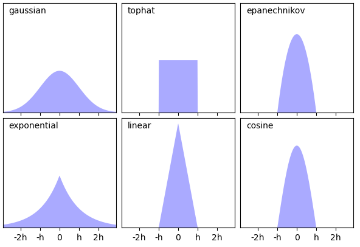{: .center style="width:50vw" #fig:kernls}

Результат оценки плотности с разными ядрами. Использованы [изображения из:](https://scikit-learn.org/stable/auto_examples/neighbors/plot_kde_1d.html)

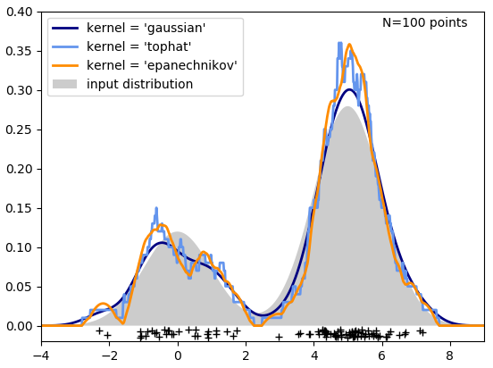{: .center style="width:40vw" #fig:KDE}

### Параметрическая оценка

При параметрической оценке плотности предполагают, что искомое распределение лежит в параметризованном классе, и подбирают значения параметров при помощи метода максимума правдоподобия. Например, предположим, что искомое распределение нормальное. Тогда функция его плотности имеет вид

<<<<<<< develop
<<<<<<< develop
$$
p(x) = \frac{1}{\sigma\sqrt{2\pi}}\exp\left(-\frac{(x-\mu)^2}{2\sigma^2}\right)
$$
=======
<Math block>

=======
>>>>>>> fix: use MathLayout instead Math
$$
p(x) = \frac{1}{\sigma\sqrt{2\pi}}\exp\left(-\frac{(x-\mu)^2}{2\sigma^2}\right)
$$

<<<<<<< develop
</Math>
>>>>>>> feat: pass formulas to Math component

=======
>>>>>>> fix: use MathLayout instead Math
Таким образом, чтобы оценить плотность $p(x)$, достаточно оценить параметры $\mu, \sigma$. Метод максимума правдоподобия в этом случае даст такие оценки:

$\hat\mu = \overline X$ -- выборочное среднее, $\hat\sigma = \sqrt{\frac{1}{N}\sum_{j=1}^N \left(X_j - \overline X\right)^2}$ -- выборочное стандартное отклонение.

Если в модели NB распределения всех признаков объектов каждого класса нормальные, оценив параметры этих распределений, мы сможем каждый класс $y$ описать нормальным распределением со средним $\mu_p$ и диагональной ковариационной матрицей, значения на диагонали которой обозначим $\sigma_p$. Таким образом, полученная модель (Gaussian Naive Bayes, GNB) эквивалентна модели [GDA](#ss:GDA) с дополнительным ограничением на диагональность ковариационных матриц.

## Наивный байесовский подход и логистическая регрессия

Предположим теперь, что в модели GNB класса всего 2, причём соответствующие им ковариационные матрицы совпадают, как это было в модели LDA. Таким образом $\sigma_0 = \sigma_1 = \sigma$.

Посмотрим, как будет выглядеть $P(Y \vert X)$ в этом случае. По теореме Байеса имеем

<<<<<<< develop
<<<<<<< develop
$$
P(Y=1 \vert X) = \frac{P(Y = 1)P(X \vert Y = 1)}{P(Y = 1)P(X \vert Y = 1) + P(Y = 0)P(X \vert Y = 0)}
$$

Разделим числитель и знаменатель полученного выражения на числитель:

$$
P(Y=1 \vert X) = \frac{1}{1 + \frac{P(Y = 0)P(X \vert Y = 0)}{P(Y = 1)P(X \vert Y = 1)}} = \frac{1}{1 + \exp\left(\ln\frac{P(Y=0)P(X \vert Y=0)}{P(Y=1)P(X \vert Y=1)}\right)}
$$

Из условной независимости $X^i$ относительно $Y$ получаем

=======
<Math block>

=======
>>>>>>> fix: use MathLayout instead Math
$$
P(Y=1 \vert X) = \frac{P(Y = 1)P(X \vert Y = 1)}{P(Y = 1)P(X \vert Y = 1) + P(Y = 0)P(X \vert Y = 0)}
$$

Разделим числитель и знаменатель полученного выражения на числитель:

$$
P(Y=1 \vert X) = \frac{1}{1 + \frac{P(Y = 0)P(X \vert Y = 0)}{P(Y = 1)P(X \vert Y = 1)}} = \frac{1}{1 + \exp\left(\ln\frac{P(Y=0)P(X \vert Y=0)}{P(Y=1)P(X \vert Y=1)}\right)}
$$

Из условной независимости $X^i$ относительно $Y$ получаем

<<<<<<< develop
<Math block>

>>>>>>> feat: pass formulas to Math component
=======
>>>>>>> fix: use MathLayout instead Math
$$
name="eq:posterior"

\begin{equation}\label{eq:posterior}
P(Y=1 \vert X) = \frac{1}{1 + \exp\left(\ln\frac{P(Y=0)}{P(Y=1)} + \sum\limits\_{i=1}^d \ln\frac{P(X^i \vert Y=0)}{P(X^ \vert Y=1)}\right)} \tag{5}
\end{equation}
$$
<<<<<<< develop

Перепишем сумму в знаменателе, воспользовавшись формулой плотности нормального распределения

$$
\sum\limits_{i=1}^d \ln\frac{P(X^i \vert Y=0)}{P(X^i \vert Y=1)} = \sum\limits_{i=1}^d \ln\frac{\frac{1}{\sqrt{2\pi\sigma_i^2}}\exp \left(\frac{-(X^i - \mu_{0,i})^2}{2\sigma_i^2}\right)}{\frac{1}{\sqrt{2\pi\sigma_i^2}}\exp \left(\frac{-(X^i - \mu_{1,i})^2}{2\sigma_i^2}\right)}
$$
=======

Перепишем сумму в знаменателе, воспользовавшись формулой плотности нормального распределения

$$
\sum\limits_{i=1}^d \ln\frac{P(X^i \vert Y=0)}{P(X^i \vert Y=1)} = \sum\limits_{i=1}^d \ln\frac{\frac{1}{\sqrt{2\pi\sigma_i^2}}\exp \left(\frac{-(X^i - \mu_{0,i})^2}{2\sigma_i^2}\right)}{\frac{1}{\sqrt{2\pi\sigma_i^2}}\exp \left(\frac{-(X^i - \mu_{1,i})^2}{2\sigma_i^2}\right)}
$$

<<<<<<< develop
</Math>

<Math block>
>>>>>>> feat: pass formulas to Math component

=======
>>>>>>> fix: use MathLayout instead Math
$$
= \sum\limits_{i=1}^d \frac{\left(X^i - \mu_{1, i}\right)^2 - \left(X^i - \mu_{0, i}\right)^2}{2\sigma_i^2}=
\sum\limits_{i=1}^d \left(\frac{\mu_{0, i} - \mu_{1, i}}{\sigma_i^2}X^i + \frac{\mu_{1, i} ^ 2 - \mu_{0, i} ^ 2}{2\sigma_i^2}\right)
$$

Подставляя это выражение в формулу [$ (5) $](#eq:posterior), получаем

<<<<<<< develop
<<<<<<< develop
$$
P(Y=1 \vert X) = \frac{1}{1 + \exp\left(\ln\frac{P(Y=0)}{P(Y=1)} + \sum\limits_{i=1}^d \left(\frac{\mu_{0, i} - \mu_{1, i}}{\sigma_i^2}X^i + \frac{\mu_{1, i} ^ 2 - \mu_{0, i} ^ 2}{2\sigma_i^2}\right)\right)}
$$

Таким образом, $P(Y=1 \vert X)$ представляется в GNB с общей ковариационной матрицей в таком же виде, как в модели логистической регрессии:

=======
<Math block>

=======
>>>>>>> fix: use MathLayout instead Math
$$
P(Y=1 \vert X) = \frac{1}{1 + \exp\left(\ln\frac{P(Y=0)}{P(Y=1)} + \sum\limits_{i=1}^d \left(\frac{\mu_{0, i} - \mu_{1, i}}{\sigma_i^2}X^i + \frac{\mu_{1, i} ^ 2 - \mu_{0, i} ^ 2}{2\sigma_i^2}\right)\right)}
$$

Таким образом, $P(Y=1 \vert X)$ представляется в GNB с общей ковариационной матрицей в таком же виде, как в модели логистической регрессии:

<<<<<<< develop
<Math block>

>>>>>>> feat: pass formulas to Math component
=======
>>>>>>> fix: use MathLayout instead Math
$$
name="eq:logreg"

\begin{equation} \label{eq:logreg}
P(Y=1 \vert X) = \frac{1}{1 + \exp\left(w*0 + \sum\limits*{i=1}^d w_i X^i\right)} \tag{6}
\end{equation}
$$
<<<<<<< develop
=======

<<<<<<< develop
</Math>
>>>>>>> feat: pass formulas to Math component

=======
>>>>>>> fix: use MathLayout instead Math
где в случае GNB

$$
w_0 = \ln\frac{P(Y=1)}{P(Y=0)} +\sum\limits_{i=1}^d\frac{\mu_{1, i} ^ 2 - \mu_{0, i} ^ 2}{2\sigma_i^2}, \quad
w_i = \frac{\mu_{0, i} - \mu_{1, i}}{\sigma_i^2} \hspace{1cm} i=1, \dots, l
$$

Однако это не значит, что модели эквивалентны: модель логистической регрессии накладывает менее строгие ограничения на распределение $P(X, Y)$, чем GNB. Так, $X^i$ могут не являться условно независимыми относительно $Y$, а распределения $P(X \vert Y=y)$ могут не удовлетворять нормальному закону, но $P(y \vert X)$ может при этом всё равно представляться в виде [$ (6) $](#eq:logreg). В этом случае использование метода логистической регрессии предпочтительнее. С другой стороны, если есть основания полагать, что требования GNB выполняются, то от GNB можно ожидать более высокого качества классификации по сравнению с логистической регрессией.

# Байесовский подход к оцениванию

Начнём с простого вопроса: как нам внести в модель априорные знания.

## Мотивация

Представьте, что мы обучаем модель линейной регрессии $$y\sim Xw + \varepsilon$$, $$\varepsilon\sim\mathcal{N}(0,\sigma^2)$$. С помощью MLE мы получили некоторую оценку $$\widehat{w}$$ на веса $$w$$ – всякие ли их значения мы встретим с покорностью и смирением? Наверное, мы удивимся, если какие-то компоненты вектора $$\widehat{w}$$ будут очень большими по сравнению с элементами $$X$$: пожалуй, наша физическая интуиция будет бунтовать против этого, мы задумаемся о том, что из-за потенциальных ошибок сокращения вычисление предсказаний $$(x_i, \widehat{w})$$ окажутся неточным – в общем, хотелось бы по возможности избежать этого. Но как?

Будь мы приверженцами чисто инженерного подхода, мы бы сделали просто: прибавили бы к функции потерь слагаемое $$+\alpha\|w\|^2$$, или $$+\alpha \vert w \vert^2$$, или ещё что-то такое – тогда процедура обучения стала бы компромиссом между минимизацией исходного лосса и этой добавки, что попортило бы слегка близость $$y\sim Xw$$, но зато позволило бы лучше контролировать масштаб $$\widehat{w}$$. Надо думать, вы узнали в этой конструкции старую добрую регуляризацию.

Но наша цель – зашить наше априорное знание о том, что компоненты $$w$$ не слишком велики по модулю, в вероятностную модель. Введение в модель априорного знания соответствует введению априорного распределения на $$w$$. Какое распределение выбрать? Ну, наверное, компоненты $$w$$ будут независимыми (ещё нам не хватало задавать взаимосвязи между ними!), а каждая из них будет иметь какое-то непрерывное распределение, в котором небольшие по модулю значения более правдоподобны, а совсем большие очень неправдоподобны. Мы знаем такие распределения? Да, и сразу несколько. Например, нормальное. Логично было бы определить

<<<<<<< develop
<<<<<<< develop
$$
p(w) = \prod_{i=1}^D\mathcal{N}(w_i \vert 0,\tau^2)
$$
=======
<Math block>

=======
>>>>>>> fix: use MathLayout instead Math
$$
p(w) = \prod_{i=1}^D\mathcal{N}(w_i \vert 0,\tau^2)
$$

<<<<<<< develop
</Math>
>>>>>>> feat: pass formulas to Math component

=======
>>>>>>> fix: use MathLayout instead Math
где $$\tau^2$$ – какая-то дисперсия, которую мы возьмём с потолка или подберём по валидационной выборке.

Контроль масштаба весов – это, вообще говоря, не единственное, что мы можем потребовать. Например, мы можем из каких-то физических соображений знать, что тот или иной вес в линейной модели непременно должен быть неотрицательным. Тогда в качестве априорного на этот вес мы можем взять, например, показательное распределение.

## Оценка не значения параметра, а его распределения

Раз уж мы начали говорить о распределении на веса $$w$$, то почему бы не пойти дальше. Решая задачу классификации, мы уже столкнулись с тем, что может быть важна не только предсказанная метка класса, но и вероятности. Аналогичное верно и для задачи регрессии. Давайте рассмотрим две следующих ситуации, в каждой из которых мы пытаемся построить регрессию $$y\sim ax + b$$:

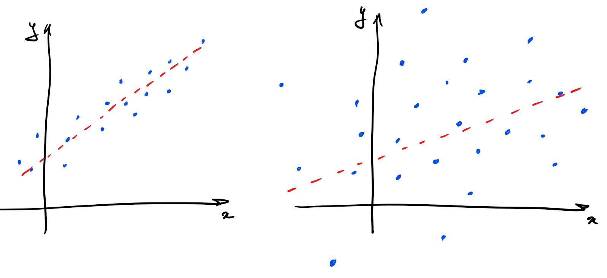{: .center}

Несмотря на то, что в каждом из случаев ''точная формула'' или градиентный спуск выдадут нам что-то, степень нашей уверенности в ответе совершенно различная. Но как это формализовать?

Один из вариантов – построение доверительных интервалов для коэффициентов $$a$$ и $$b$$. Для линейных моделей это довольно неплохо умеют делать (для более сложных моделей скорее нет, хотя может помогать бутстреп). Мы не будем обсуждать этот подход, но отметим, что доверительный интервал – это лишь два-три числа, тогда как на самом деле мы можем оценить распределение на параметры. Для примеров выше распределения на параметр $$a$$ могли бы иметь какой-то такой вид:

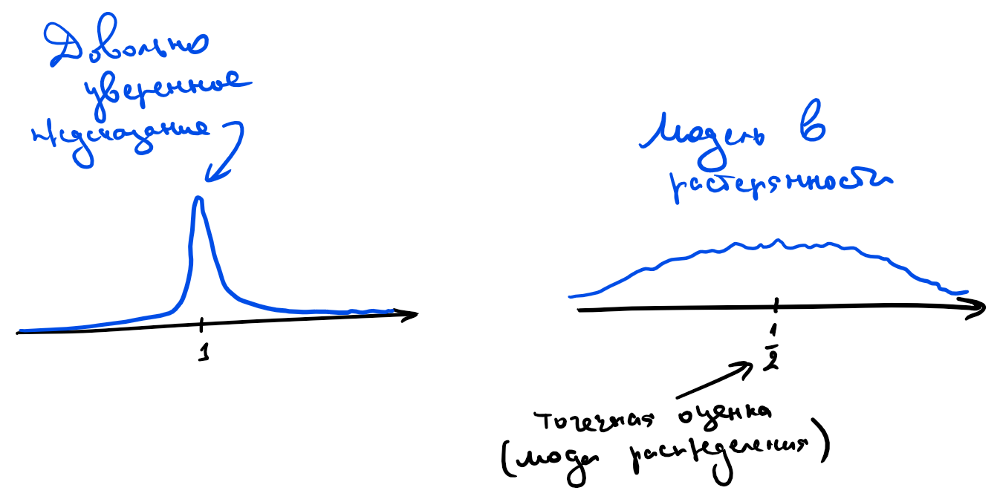{: .center}

## Оценка апостериорного максимума (MAP)

Распределение весов модели – это

<<<<<<< develop
<<<<<<< develop
$$
p(w \vert X, y)
$$

Как его посчитать? Применим формулу Байеса:

$$
\color{blue}{p(w \vert X, y) = \frac{p(y, w \vert X)}{p(y\vert X)} = \frac{p(y \vert X, w)p(w)}{p(y\vert X)}}
$$
=======
<Math block>

=======
>>>>>>> fix: use MathLayout instead Math
$$
p(w \vert X, y)
$$

Как его посчитать? Применим формулу Байеса:

$$
\color{blue}{p(w \vert X, y) = \frac{p(y, w \vert X)}{p(y\vert X)} = \frac{p(y \vert X, w)p(w)}{p(y\vert X)}}
$$

<<<<<<< develop
</Math>
>>>>>>> feat: pass formulas to Math component

=======
>>>>>>> fix: use MathLayout instead Math
Важное замечание: **$$\color{blue}{p(w)}$$ – это то самое априорное распределение на веса $$\color{blue}{w}$$**.

То есть что получается: **у нас было некоторое априорное представление $$\color{blue}{p(w)}$$ о распределении весов $$\color{blue}{w}$$, а теперь, посмотрев на данные, мы уточняем своё понимание, формулируя апостериорное представление $$p(w \vert X, y)$$**.

Оценить $$p(y\vert X)$$ в такой модели довольно трудно: ведь $$p(y\vert X) = \int p(y, w' \vert X)dw'$$, каковой интеграл вовсе не факт что вычисляется в формулах (хотя для важного класса распределения – экспоненциального – это получается, как вы увидите дальше). Поэтому само распределение $$p(w \vert X, y)$$ мы не всегда сможем выписать точно. Это, однако же, не мешает нам найти самое вероятное значение $$w$$ (ведь $$p(y)$$ от $$w$$ не зависит):
$$\color{blue}{\widehat{w}_{MAP} = \underset{w}{\operatorname{argmax}}{p(w \vert X,y)} = \underset{w}{\operatorname{argmax}}{p(y \vert X, w)p(w)}}$$
Это и есть **оценка апостериорного максимума (MAP)**.

Если же перейти к логарифмам, то мы получим кое-что, до боли напоминающее старую добрую регуляризацию:

<<<<<<< develop
<<<<<<< develop
$$
\underset{w}{\operatorname{argmax}}{p(y \vert X, w)p(w)} = \underset{w}{\operatorname{argmax}}\log(p(y \vert X, w)p(w)) =
$$

$$
=\underset{w}{\operatorname{argmax}}\left(\vphantom{\frac12}\log{p(y \vert X, w)} + \log{p(w)}\right)
$$
=======
<Math block>

=======
>>>>>>> fix: use MathLayout instead Math
$$
\underset{w}{\operatorname{argmax}}{p(y \vert X, w)p(w)} = \underset{w}{\operatorname{argmax}}\log(p(y \vert X, w)p(w)) =
$$

$$
=\underset{w}{\operatorname{argmax}}\left(\vphantom{\frac12}\log{p(y \vert X, w)} + \log{p(w)}\right)
$$

<<<<<<< develop
</Math>
>>>>>>> feat: pass formulas to Math component

=======
>>>>>>> fix: use MathLayout instead Math
## Связь MAP- и MLE-оценок

Оценка максимального правдоподобия является частным случаем апостериорной оценки. В самом деле, если априорное распределение является равномерным, то есть $$p(w)$$ не зависит $$w$$ (если веса $$w$$ вещественные, могут потребоваться дополнительные усилия, чтобы понять, как такое вообще получается), и тогда

<<<<<<< develop
<<<<<<< develop
=======
<Math block>

>>>>>>> feat: pass formulas to Math component
=======
>>>>>>> fix: use MathLayout instead Math
$$
\widehat{w}_{MAP} = \underset{w}{\operatorname{argmax}}\log{p(y \vert X,w)p(w)} = \underset{w}{\operatorname{argmax}}\left(\log{p(y \vert X,w)} + \underbrace{\log{p(w)}}_{=const}\right) =
$$

<<<<<<< develop
<<<<<<< develop
$$
= \underset{w}{\operatorname{argmax}}\log{p(y \vert X,w)} = \widehat{w}_{MLE}
$$
=======
</Math>

<Math block>

=======
>>>>>>> fix: use MathLayout instead Math
$$
= \underset{w}{\operatorname{argmax}}\log{p(y \vert X,w)} = \widehat{w}_{MLE}
$$

<<<<<<< develop
</Math>
>>>>>>> feat: pass formulas to Math component

=======
>>>>>>> fix: use MathLayout instead Math
## Пример: линейная регрессия с $$L^2$$-регуляризацией

В модели линейной регрессии $$y = Xw + \varepsilon$$, $$\varepsilon\sim\mathcal{N}(0, \sigma^2)$$ введём априорное распределение на веса вида

<<<<<<< develop
<<<<<<< develop
$$
\color{blue}{p(w) = \mathcal{N}(w  \vert  0, \tau^2I) = \prod_{j=1}^D \mathcal{N}(w_j \vert  0, \tau^2) = \prod_{j=1}^D p(w_j)}
$$

Тогда $$\widehat{w}_{MAP}$$ является точкой минимума следующего выражения:

$$
-\log{p(y \vert X, w)} - \log{p(w)} =-\sum_{i=1}^N\log{p(y_i \vert x_i, w)} - \sum_{j=1}^D\log{p(w_j)} =
$$
=======
<Math block>

=======
>>>>>>> fix: use MathLayout instead Math
$$
\color{blue}{p(w) = \mathcal{N}(w  \vert  0, \tau^2I) = \prod_{j=1}^D \mathcal{N}(w_j \vert  0, \tau^2) = \prod_{j=1}^D p(w_j)}
$$

Тогда $$\widehat{w}_{MAP}$$ является точкой минимума следующего выражения:

$$
-\log{p(y \vert X, w)} - \log{p(w)} =-\sum_{i=1}^N\log{p(y_i \vert x_i, w)} - \sum_{j=1}^D\log{p(w_j)} =
$$

<<<<<<< develop
</Math>

<Math block>
>>>>>>> feat: pass formulas to Math component

=======
>>>>>>> fix: use MathLayout instead Math
$$
=-\sum_{i=1}^N\left(-\frac12\log(2\pi\sigma^2) - \frac{(y_i - (w, x_i))^2}{2\sigma^2}\right)
-\sum_{j=1}^D\left(-\frac12\log(2\pi\tau^2) - \frac{w_j^2}{2\tau^2}\right)=
$$

<<<<<<< develop
<<<<<<< develop
$$
= \frac1{2\sigma^2}\sum_{i=1}^N(y_i - (w, x_i))^2 + \frac1{2\tau^2}\sum_{j=1}^D w_j^2+\mbox{ не зависящие от $w$ члены}
$$

Получается, что

$$
\color{blue}{\widehat{w}_{MAP} = \underset{w}{\operatorname{argmin}}\left(\vphantom{\frac12}\sum_{i=1}^N(y_i - (w, x_i))^2 + \frac{\sigma^2}{\tau^2}\|w\|^2\right)}
$$

а это же функция потерь для линейной регрессии с $$L^2$$-регуляризацией! Напомним на всякий случай, что у этой задачи есть ''точное'' решение

$$
\color{blue}{\widehat{w}_{MAP} = \left(X^TX + \frac{\sigma^2}{\tau^2}I\right)^{-1}X^Ty}
$$

Для этого примера мы можем вычислить и апостериорное распределение $$p(w \vert X, y)$$. В самом деле, из написанного выше мы можем заключить, что

=======
</Math>

<Math block>

=======
>>>>>>> fix: use MathLayout instead Math
$$
= \frac1{2\sigma^2}\sum_{i=1}^N(y_i - (w, x_i))^2 + \frac1{2\tau^2}\sum_{j=1}^D w_j^2+\mbox{ не зависящие от $w$ члены}
$$

Получается, что

$$
\color{blue}{\widehat{w}_{MAP} = \underset{w}{\operatorname{argmin}}\left(\vphantom{\frac12}\sum_{i=1}^N(y_i - (w, x_i))^2 + \frac{\sigma^2}{\tau^2}\|w\|^2\right)}
$$

а это же функция потерь для линейной регрессии с $$L^2$$-регуляризацией! Напомним на всякий случай, что у этой задачи есть ''точное'' решение

$$
\color{blue}{\widehat{w}_{MAP} = \left(X^TX + \frac{\sigma^2}{\tau^2}I\right)^{-1}X^Ty}
$$

Для этого примера мы можем вычислить и апостериорное распределение $$p(w \vert X, y)$$. В самом деле, из написанного выше мы можем заключить, что

<<<<<<< develop
<Math block>

>>>>>>> feat: pass formulas to Math component
=======
>>>>>>> fix: use MathLayout instead Math
$$
\log{p(w \vert X, y)} = \log(p(y \vert X, w)p(w)) - \log{p(y)} =
$$

<<<<<<< develop
<<<<<<< develop
$$
=\frac1{2\sigma^2}(y - Xw)^T(y - Xw) + \frac1{2\tau^2}w^Tw+\mbox{ не зависящие от $w$ члены}
$$

Таким образом, $$\log{p(w \vert X, y)}$$ – это квадратичная функция от $$w$$, откуда следует, что апостериорное распределение является нормальным. Чтобы найти его параметры, нужно немного преобразовать полученное выражение:

$$
\ldots=\frac1{2\sigma^2}(y^Ty - w^TX^Ty - y^TWx + w^TX^TXw) + \frac1{2\tau^2}w^Tw+\mathrm{const}(w) =
$$

$$
=w^T\left(\frac1{2\sigma^2}X^TX + \frac1{2\tau^2}I\right)w - \frac{1}{2\sigma^2}w^TX^Ty - \frac1{2\sigma^2}y^TWx + \mathrm{const}(w) =
$$

$$
=\frac12\left(w - \widehat{w}_{MAP}\right)^T\left(\frac1{\sigma^2}X^TX + \frac1{\tau^2}I\right)\left(w - \widehat{w}_{MAP}\right) + \mathrm{const}(w)=
$$

Таким образом,

$$
\color{blue}{p(w \vert X,y) = \mathcal{N}\left(\widehat{w}_{MAP}, \left(\frac1{\sigma^2}X^TX + \frac1{\tau^2}I\right)^{-1}  \right)}
$$
=======
</Math>

<Math block>

=======
>>>>>>> fix: use MathLayout instead Math
$$
=\frac1{2\sigma^2}(y - Xw)^T(y - Xw) + \frac1{2\tau^2}w^Tw+\mbox{ не зависящие от $w$ члены}
$$

Таким образом, $$\log{p(w \vert X, y)}$$ – это квадратичная функция от $$w$$, откуда следует, что апостериорное распределение является нормальным. Чтобы найти его параметры, нужно немного преобразовать полученное выражение:

$$
\ldots=\frac1{2\sigma^2}(y^Ty - w^TX^Ty - y^TWx + w^TX^TXw) + \frac1{2\tau^2}w^Tw+\mathrm{const}(w) =
$$

$$
=w^T\left(\frac1{2\sigma^2}X^TX + \frac1{2\tau^2}I\right)w - \frac{1}{2\sigma^2}w^TX^Ty - \frac1{2\sigma^2}y^TWx + \mathrm{const}(w) =
$$

$$
=\frac12\left(w - \widehat{w}_{MAP}\right)^T\left(\frac1{\sigma^2}X^TX + \frac1{\tau^2}I\right)\left(w - \widehat{w}_{MAP}\right) + \mathrm{const}(w)=
$$

Таким образом,

$$
\color{blue}{p(w \vert X,y) = \mathcal{N}\left(\widehat{w}_{MAP}, \left(\frac1{\sigma^2}X^TX + \frac1{\tau^2}I\right)^{-1}  \right)}
$$

<<<<<<< develop
</Math>
>>>>>>> feat: pass formulas to Math component

=======
>>>>>>> fix: use MathLayout instead Math
Как видим, от априорного распределения оно отличается корректировкой как матожидания $$0\mapsto\widehat{w}_{MAP}$$, так и ковариационной матрицы $$\left(\frac1{\tau^2}I\right)^{-1}\mapsto\left(\frac1{\sigma^2}X^TX + \frac1{\tau^2}I\right)^{-1}$$. Отметим, что $$X^TX$$ – это, с точностью до численного множителя, оценка ковариационной матрицы признаков нашего датасета (элементы матрицы $$X^TX$$ – это скалярные произведения столбцов $$X$$, то есть столбцов значений признаков).

**Иллюстрация**. Давайте на простом примере (датасет с двумя признаками) посмотрим, как меняется апостериорное распределение $$w$$ с ростом размера обучающей выборки:

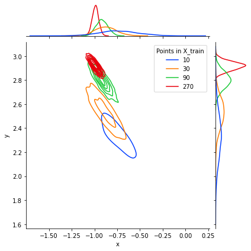{: .center style="width:35vw"}

Как видим, не только мода распределения, то есть $$\widehat{w}_{MAP}$$ приближается к своему истинному значению, но и дисперсия распределения постепенно уменьшается.

**Ещё иллюстрация**. Теперь рассмотрим задачу аппроксимации неизвестной функции одной переменной (чьи значения в обучающей выборке искажены нормальным шумом) многочленом третьей степени. Её, разумеется, тоже можно решать, как задачу линейной регрессии на коэффициенты многочлена. Давайте нарисуем, как будут выглядеть функции, сгенерированные из распределения $${p(w \vert X,y)}$$ для разного объёма обучающей выборки:

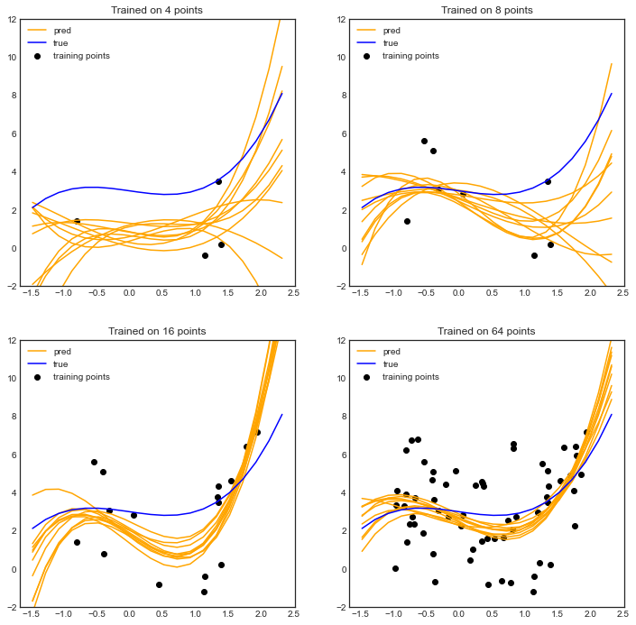{: .center}

Тут тоже видим, что функции не только становятся ближе к истинной, но и разброс их уменьшается.

## Пример: линейная регрессия с $$L^1$$-регуляризацией

Другим распределением, которое тоже может кодировать наше желание, чтобы небольшие значения $$w_j$$ были правдоподобными, а большие не очень, является распределение Лапласа. Посмотрим, что будет, если его взять в качестве априорного распределения на веса.

<<<<<<< develop
<<<<<<< develop
$$
\color{blue}{p(w) = \prod_{j=1}^D p(w_j) = \prod_{j=1}^D\frac{\lambda}{2}\exp(-\lambda|w_m|)}
$$

Проводя такое же вычисление, получаем, что

$$
\color{blue}{\widehat{w}_{MAP} = \underset{w}{\operatorname{argmax}}\left(\vphantom{\frac12}\sum_{i=1}^N(y_i - (w, x_i))^2 + \lambda\sum_{j=1}^D|w_j|\right)}
$$
=======
<Math block>

=======
>>>>>>> fix: use MathLayout instead Math
$$
\color{blue}{p(w) = \prod_{j=1}^D p(w_j) = \prod_{j=1}^D\frac{\lambda}{2}\exp(-\lambda|w_m|)}
$$

Проводя такое же вычисление, получаем, что

$$
\color{blue}{\widehat{w}_{MAP} = \underset{w}{\operatorname{argmax}}\left(\vphantom{\frac12}\sum_{i=1}^N(y_i - (w, x_i))^2 + \lambda\sum_{j=1}^D|w_j|\right)}
$$

<<<<<<< develop
</Math>
>>>>>>> feat: pass formulas to Math component

=======
>>>>>>> fix: use MathLayout instead Math
а это же функция потерь для линейной регрессии с $$L^1$$-регуляризацией!

## Если мы нашли распределение $$w$$, как делать предсказания?

Все изложенные выше рассуждения проводились в ситуации, когда $$X = X_{train}$$ – обучающая выборка. Для неё мы можем посчитать

<<<<<<< develop
<<<<<<< develop
$$
p(w \vert X_{train}, y_{train}) = \frac{(y \vert X,w)p(w)}{p(y)}
$$
=======
<Math block>

=======
>>>>>>> fix: use MathLayout instead Math
$$
p(w \vert X_{train}, y_{train}) = \frac{(y \vert X,w)p(w)}{p(y)}
$$

<<<<<<< develop
</Math>
>>>>>>> feat: pass formulas to Math component

=======
>>>>>>> fix: use MathLayout instead Math
и точечную апостериорную оценку $$\widehat{w}_{MAP} = \underset{w}{\operatorname{argmax}}{p(y \vert X,w)p(y)}$$. А теперь пусть нам дан новый объект $$x_0\in\mathbb{X}$$. Какой таргет $$y_0$$ мы для него предскажем?

Было бы естественным, раз уж мы предсказываем распределение для $$w$$, и для $$y_0$$ тоже предсказывать распределение. Делается это следующим образом:

<<<<<<< develop
<<<<<<< develop
$$
p(y_0 \vert x_0, X_{train}, y_{train}) = \int{p(y_0 \vert x_0,w)p(w \vert X_{train}, y_{train})}dw
$$

Надо признать, что вычисление этого интеграла не всегда является посильной задачей, поэтому зачастую приходится ''просто подставлять $$\widehat{w}_{MAP}$$''. В вероятностных терминах это можно описать так: вместо сложного апостериорного распределения $$p(w \vert X_{train}, y_{train})$$ мы берём самое грубое на свете приближение

$$
p(w \vert X_{train}, y_{train})\approx\delta(w - \widehat{w}_{MAP}),
$$

где $$\delta(t)$$ – дельта-функция, которая не является честной функцией (а является тем, что математики называют обобщёнными функциями), которая определяется тем свойством, что $$\int f(t)\delta(t)dt = f(0)$$ для достаточно разумных функций $$f$$. Если не мудрствовать лукаво, то это всё значит, что

$$
p(y_0 \vert x_0,X_{train}, y_{train})\approx p(y_0 \vert x_0,\widehat{w}_{MAP})
$$

**Пример**. Пусть $$y\sim Xw + \varepsilon$$, $$\varepsilon\sim\mathcal{N}(0,\sigma)^2$$ – модель линейной регрессии с априорным распределением $$p(w) = \mathcal{N}(0,\tau^2)$$ на параметры. Тогда, как мы уже видели раньше,

$$
p(w \vert X,y) = \mathcal{N}\left(w \vert \widehat{w}_{MAP}, \left(\frac1{\sigma^2}X^TX + \frac1{\tau^2}I\right)^{-1}  \right)
$$
=======
<Math block>

=======
>>>>>>> fix: use MathLayout instead Math
$$
p(y_0 \vert x_0, X_{train}, y_{train}) = \int{p(y_0 \vert x_0,w)p(w \vert X_{train}, y_{train})}dw
$$

Надо признать, что вычисление этого интеграла не всегда является посильной задачей, поэтому зачастую приходится ''просто подставлять $$\widehat{w}_{MAP}$$''. В вероятностных терминах это можно описать так: вместо сложного апостериорного распределения $$p(w \vert X_{train}, y_{train})$$ мы берём самое грубое на свете приближение

$$
p(w \vert X_{train}, y_{train})\approx\delta(w - \widehat{w}_{MAP}),
$$

где $$\delta(t)$$ – дельта-функция, которая не является честной функцией (а является тем, что математики называют обобщёнными функциями), которая определяется тем свойством, что $$\int f(t)\delta(t)dt = f(0)$$ для достаточно разумных функций $$f$$. Если не мудрствовать лукаво, то это всё значит, что

$$
p(y_0 \vert x_0,X_{train}, y_{train})\approx p(y_0 \vert x_0,\widehat{w}_{MAP})
$$

**Пример**. Пусть $$y\sim Xw + \varepsilon$$, $$\varepsilon\sim\mathcal{N}(0,\sigma)^2$$ – модель линейной регрессии с априорным распределением $$p(w) = \mathcal{N}(0,\tau^2)$$ на параметры. Тогда, как мы уже видели раньше,

$$
p(w \vert X,y) = \mathcal{N}\left(w \vert \widehat{w}_{MAP}, \left(\frac1{\sigma^2}X^TX + \frac1{\tau^2}I\right)^{-1}  \right)
$$

<<<<<<< develop
</Math>
>>>>>>> feat: pass formulas to Math component

=======
>>>>>>> fix: use MathLayout instead Math
Попробуем для новой точки $$x_0$$ посчитать распределение на $$y_0$$. Рекомендуем читателю попробовать самостоятельно посчитать интеграл или же обратиться к пункту 7.6.2 книжки ''Machine Learning A Probabilistic Perspective'' автора Kevin P. Murphy, убедившись, что

$$
p(y_0 \vert x_0, X_{train}, y_{train}) = \mathcal{N}\left(y_0 \vert x_0\widehat{w}_{MAP},
\sigma^2 + \sigma^2x_0^T\left(X^TX + \frac{\sigma^2}{\tau^2}I\right)^{-1}x_0\right)
$$

что, очевидно, более содержательно, чем оценка, полученная с помощью приближения $$p(w \vert X_{train}, y_{train})\approx\delta(w - \widehat{w}_{MAP})$$:

$$
p(y_0 \vert x_0, \widehat{w}_{MAP}) = \mathcal{N}\left(y_0\left \vert x_0\widehat{w}_{MAP},
\sigma^2\right.\right)
$$

**Пример в примере**. Рассмотрим полюбившуюся уже нам задачу приближения функции многочленом степени не выше $$3$$ (в которой мы строим модели с $$\sigma^2 = \tau^2 = 1$$). Для $$N = 8$$ мы получали такую картинку:

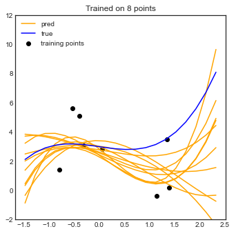{: .center style="width:30vw"}

Если оценить по приведённым выше формулам $$p(y_0 \vert x_0, X_{train}, y_{train})$$ для разных $$x_0$$, то можно убедиться, что модель в большей степени уверена в предсказаниях для точек из областей, где было больше точек из обучающей выборки:

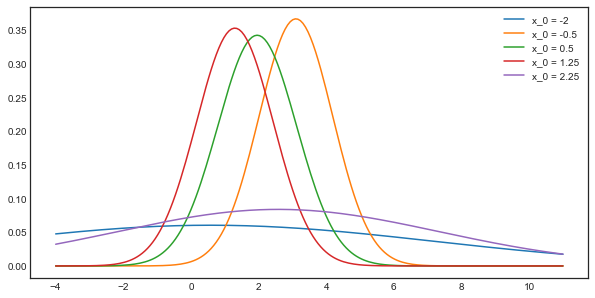{: .center style="width:40vw"}

## Байесовский подход и дообучение моделей

До сих пор мы в основном рассуждали о моделях машинного обучения как о чём-то, что один раз обучается и дальше навсегда застывает в таком виде, но в жизни такое скорее редкость. Мы пока не будем обсуждать изменчивость истинных зависимостей во времени, но даже если истина неизменна, к нам могут поступать новые данные, которые очень хотелось бы использовать для дообучения модели.

Обычные, не байесовские вероятностные модели не предоставляют таких инструментов. Оценку максимального правдоподобия придётся пересчитывать заново (хотя, конечно, можно схитрить, использовав старое значение в качестве начального приближения при итеративной оптимизации). Байесовский же подход позволяет оформить дообучения в виде простой и элегантной формулы: при добавлении новых данных $(x_{N+1}, y_{N+1}),\ldots,(x_M, y_M)$ имеем

<<<<<<< develop
<<<<<<< develop
$$
p\left(w\vert (x_i, y_i)_{i=1}^M\right) = \frac{p\left((y_i)_{i=N+1}^M\vert (x_i)_{i=N+1}^M\right) p\left(w\vert (x_i, y_i)_{i=1}^N\right)}{p\left( (y_i)_{i=N+1}^M \right)}
$$
=======
<Math block>

=======
>>>>>>> fix: use MathLayout instead Math
$$
p\left(w\vert (x_i, y_i)_{i=1}^M\right) = \frac{p\left((y_i)_{i=N+1}^M\vert (x_i)_{i=N+1}^M\right) p\left(w\vert (x_i, y_i)_{i=1}^N\right)}{p\left( (y_i)_{i=N+1}^M \right)}
$$

<<<<<<< develop
</Math>
>>>>>>> feat: pass formulas to Math component

=======
>>>>>>> fix: use MathLayout instead Math
## Байесовский подход к выбору модели: мотивация

Нам часто приходится выбирать: дерево или случайный лес, линейная модель или метод ближайших соседей; да, собственно, и внутри наших вероятностных моделей есть параметры (скажем, дисперсия шума $$\sigma^2$$ и $$\tau^2$$), которые надо бы подбирать. Но как?

В обычной ситуации мы выбираем модель, обученную на выборке $$(X_{train}, y_{train})$$ в зависимости от того, как она себя ведёт на валидационной выборке $$(X_{val}, y_{val})$$ (сравниваем правдоподобие или более сложные метрики) – или же делаем кросс-валидацию. Но как сравнивать модели, выдающие распределение?

Ответим вопросом на вопрос: а как вообще сравнивать модели? Назначение любой модели – объяснять мир вокруг нас, и её качество определяется именно тем, насколько хорошо она справляется с этой задачей. Тестовая выборка – это хороший способ оценки, потому что она показывает, насколько вписываются в модель новые данные. Но могут быть и другие соображения, помогающие оценить качество модели.

**Пример**

Аналитик Василий опоздал на работу. Своему руководителю он может предложить самые разные объяснения – и это будет выработанная на одном обучающем примере модель, описывающая причины опоздания (и потенциально позволяющая руководителю принять решение о том, карать ли Василия). Конечно, руководитель мог бы принять изложенную Василием модель к сведению, подождать, пока появятся другие опоздавшие, и оценить её, так скажем, на тестовой выборке, но стоит ли? Давайте рассмотрим несколько конкретных примеров:

- Модель ''Василий не опоздал'' очень проста, но не соответствует наблюдаемой реальности.

- Модель ''Василий опоздал, потому что рядом с его домом открылся портал в другой мир, где шла великая битва орков с эльфами, и он почувствовал, что посто обязан принять в ней участие на стороне орков, которых привёл к победе, завоевав руку и сердце орочьей принцессы, после чего был перенсён обратно в наш скучный мир завистливым шаманом''. Чем же она плоха? Битва с эльфами – это, безусловно, важное и нужное дело, и на месте руководителя мы бы дружно согласились, что причина уважительная. Но заметим, что в рамках этой модели можно объяснить множество потенциальных исходов, среди которых довольно маловероятным представляется наблюдаемый: тот, в котором Василий не погиб в бою, не остался со своей принцессой и не был порабощён каким-нибудь завистливым шаманом. Отметим и другой недостаток этой модели: её невозможно провалидировать. Если в совершенно случайной модели можно оценить вероятность опоздания и впоследствии, когда накопятся ещё примеры, проверить, правильно ли мы её посчитали, то в мире, где открываются порталы и любой аналитик может завоевать сердце орочьей принцессы, возможно всё, и даже если больше никто не попадёт в такую ситуацию, Василий всё равно сможет бить себя в грудь кулаком и говорить, что он избранный. Так что, наверное, это тоже не очень хорошая модель.

- Модель ''Василий опоздал, потому что проспал'' достаточно проста, чтобы в неё поверить, и в то же время даёт руководителю возможность принять решение, что делать с Василием.

**Пример**

Обратимся к примеру из машинного обучения. Сравним три модели линейной регрессии:

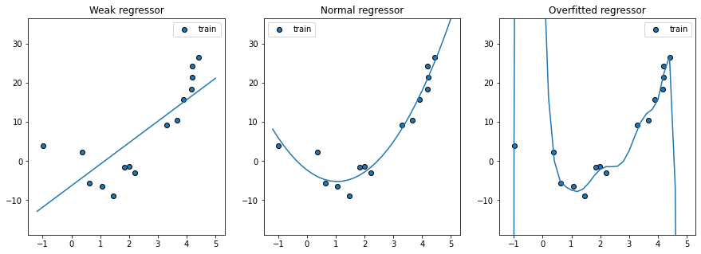{: .center}

Даже и не заправшивая тестовую выборку, мы можем сделать определённые выводы о качестве этих моделей. Средняя (квадратичная) явно лучше левой (линейной), потому что она лучше объясняет то, что мы видим: тот факт, что облако точек обучающей выборки выглядит вогнутым вниз.

А что с правым, почему мы можем утверждать, что он хуже? Есть много причин критиковать его. Начнём вот с какой. На средней картинке у нас приближение квадратичной функцией, а на правой – многочленом довольно большой степени (на самом деле, десятой). А ради интереса: как выглядит график квадратичной функции и как – многочлена десятой степени со случайно сгенерированными коэффициентами? Давайте сгенерируем несколько и отметим их значения в точках обучающей выборки:

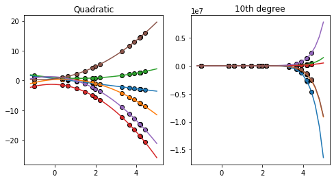{: .center}

Обратите внимание на масштаб на графиках справа. И какова вероятность, что нам достался именно тот многочлен десятой степени, у которого значения в обучающих точках по модулю в пределах сотни? Очевидно, она очень мала. Поэтому мы можем сказать, что выбор в качестве модели многочлена десятой степени не очень обоснован.

**Резюме**

Слишком простая модель плохо объясняет наблюдаемые нами данные, тогда как слишком сложная делает это хорошо, но при этом описывает слишком многообразный мир, в котором имеющиеся у нас данные оказываются уже слишком частным случаем. В каком-то смысле наш способ выбора модели оказывается переформулировкой **бритвы Оккама**: из моделей, пристойно описывающих наблюдаемые явления, следует выбирать наиболее минималистичную.

## Байесовский подход к выбору модели: формализация

Пусть у нас есть некоторое семейство моделей $$\mathcal{J}$$ и для каждого $$j\in\mathcal{J}$$ задана какая-то своя вероятностная модель. В духе байесовского подхода было бы оценить условное распределение моделей

<<<<<<< develop
<<<<<<< develop
$$
p(j \vert y, X) = \frac{p(y \vert X,j)p(j)}{\sum\limits_{j\in\mathcal{J}}p(j, y \vert X)}
$$

и в качестве наилучшей модели взять её моду. Если же считать все модели равновероятными, то мы сводим всё к максимизации только лишь $$p(y \vert X,j) = p_j(y \vert X)$$:

$$
\color{blue}{\widehat{\jmath} = \underset{j}{\operatorname{argmax}}\int{p_j(y \vert X,w)p_j(w)}dw =\underset{j}{\operatorname{argmax}}p_j(y \vert X)}
$$
=======
<Math block>

=======
>>>>>>> fix: use MathLayout instead Math
$$
p(j \vert y, X) = \frac{p(y \vert X,j)p(j)}{\sum\limits_{j\in\mathcal{J}}p(j, y \vert X)}
$$

и в качестве наилучшей модели взять её моду. Если же считать все модели равновероятными, то мы сводим всё к максимизации только лишь $$p(y \vert X,j) = p_j(y \vert X)$$:

$$
\color{blue}{\widehat{\jmath} = \underset{j}{\operatorname{argmax}}\int{p_j(y \vert X,w)p_j(w)}dw =\underset{j}{\operatorname{argmax}}p_j(y \vert X)}
$$

<<<<<<< develop
</Math>
>>>>>>> feat: pass formulas to Math component

=======
>>>>>>> fix: use MathLayout instead Math
Величина $$p_j(y \vert X)$$ называется **обоснованностью** (**evidence, marginal likelihood**) модели.

Отметим, что такое определение вполне согласуется с мотивацией из предыдущего подраздела: ведь $$p_j(y \vert X)$$ как раз описывает, насколько обоснован выбор модели наблюдаемыми данными. Слишком простая модель плохо их описывает, и потому будет отвергнута. В свою очередь, слишком сложная модель способна описывать гораздо большее многообразие явлений, чем нам было бы достаточно. Таким образом, компромисс между качеством описания и сложностью и даёт нам оптимальную модель.

**Пример**

Вернёмся к нашей любимой задаче аппроксимации функции одной переменной многочленом небольшой степени по нескольким точкам, значение в которых было искажено нормальным шумом. Построим несколько моделей, приближающих многочленом степени не выше некоторого $$\mathrm{deg}$$ (будет принимать значения 1, 3 и 6), положив в вероятностной модели $$\sigma^2 = \tau^2 = 1$$.

Мы не будем приводить полный вывод обоснованности для задачи регрессии $$p(y \vert X,w) = \mathcal{N}(y \vert Xw,\sigma^2I)p(w \vert \tau^2I)$$, а сразу выпишем ответ:

<<<<<<< develop
<<<<<<< develop
$$
p(y \vert X) = \mathcal{N}\left(0, \sigma^2I + \tau^2XX^T\right)
$$
=======
<Math block>

=======
>>>>>>> fix: use MathLayout instead Math
$$
p(y \vert X) = \mathcal{N}\left(0, \sigma^2I + \tau^2XX^T\right)
$$

<<<<<<< develop
</Math>
>>>>>>> feat: pass formulas to Math component

=======
>>>>>>> fix: use MathLayout instead Math
Посмотрим, какой будет обоснованность для разного числа обучающих точек:

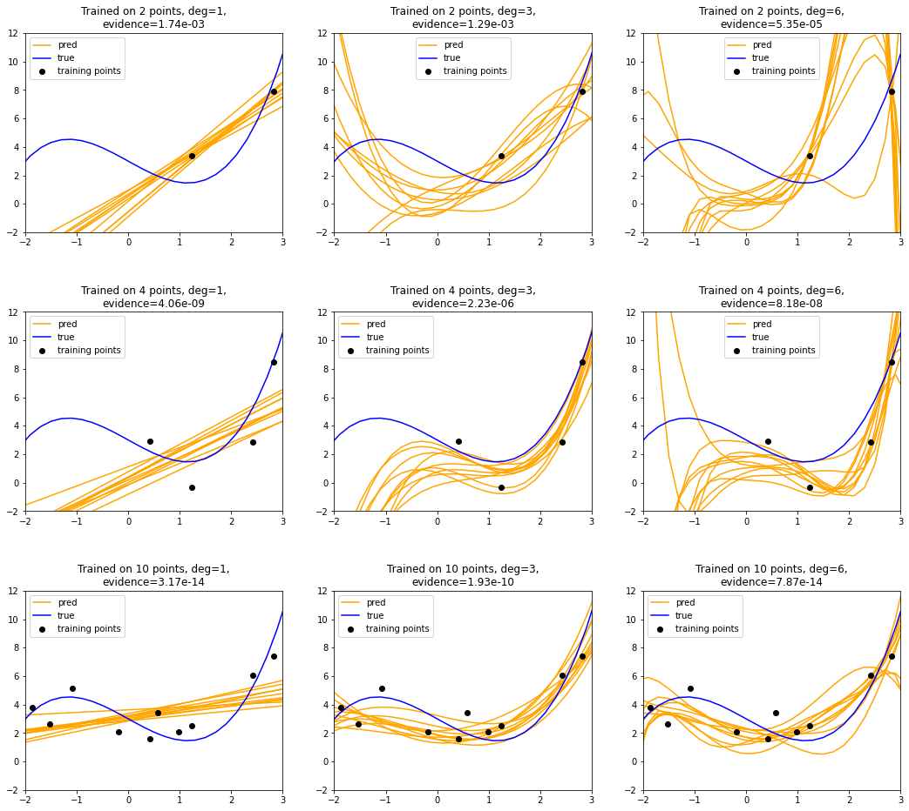{: .center}

Можно убедиться, что для регрессии по двум точкам наиболее обоснованной является линейная модель (и неудивительно), тогда как с ростом числа точек более обоснованной становится модель с многочленом третьей степени; слишком сложная же модель шестой степени всегда плетётся в хвосте.

### Аппроксимация обоснованности и байесовский информационный критерий

Точно вычислить обоснованность может быть трудной задачей (попробуйте проделать это сами хотя бы для линейной регрессии!). Есть разные способы посчитать её приближённо; мы рассмотрим самый простой. Напомним, что

<<<<<<< develop
<<<<<<< develop
$$
p(y \vert X) = \int{p(y \vert X,w)p(w)}dw
$$

Разложим $$p(y \vert X,w)$$ (как функцию от $$w$$) вблизи своего максимума, то есть вблизи $$\widehat{w} := \widehat{w}_{MLE}$$ в ряд Тейлора:

$$
\log{p(y \vert X,w)} \approx \log{p(y \vert X,\widehat{w})} - \frac12(w - \widehat{w})^TI_N(\widehat{w})(w - \widehat{w}),
$$
=======
<Math block>

=======
>>>>>>> fix: use MathLayout instead Math
$$
p(y \vert X) = \int{p(y \vert X,w)p(w)}dw
$$

Разложим $$p(y \vert X,w)$$ (как функцию от $$w$$) вблизи своего максимума, то есть вблизи $$\widehat{w} := \widehat{w}_{MLE}$$ в ряд Тейлора:

$$
\log{p(y \vert X,w)} \approx \log{p(y \vert X,\widehat{w})} - \frac12(w - \widehat{w})^TI_N(\widehat{w})(w - \widehat{w}),
$$

<<<<<<< develop
</Math>
>>>>>>> feat: pass formulas to Math component

=======
>>>>>>> fix: use MathLayout instead Math
где линейный член отсутствует, поскольку разложение делается в точке локального экстремума, а $$I(\widehat{w})$$ – знакомая нам матрица Фишера $$I_N(\widehat{w}) = -\mathbb{E}\nabla^2_w\log{p(y \vert X,w)}\vert_{\widehat{w}} = NI_1(\widehat{w})$$.

Далее, $$p(w)$$ мы можем с точностью до второго порядка приблизить $$p(\widehat{w}_{MAP})$$. Получается, что

<<<<<<< develop
<<<<<<< develop
$$
p(y \vert X)\approx\int e^{\log{p(y \vert X,\widehat{w})} - \frac{N}2(w - \widehat{w})^TI_1(\widehat{w})(w - \widehat{w})}p(\widehat{w}_{MAP})dw =
$$
=======
<Math block>

=======
>>>>>>> fix: use MathLayout instead Math
$$
p(y \vert X)\approx\int e^{\log{p(y \vert X,\widehat{w})} - \frac{N}2(w - \widehat{w})^TI_1(\widehat{w})(w - \widehat{w})}p(\widehat{w}_{MAP})dw =
$$

<<<<<<< develop
</Math>

<Math block>
>>>>>>> feat: pass formulas to Math component

=======
>>>>>>> fix: use MathLayout instead Math
$$
= e^{\log{p(y \vert X,\widehat{w})}}p(\widehat{w}_{MAP})\int e^{ - \frac{N}{2}(w - \widehat{w})^TI_1(\widehat{w})(w - \widehat{w})}dw =
$$
<<<<<<< develop
=======

<<<<<<< develop
</Math>

<Math block>
>>>>>>> feat: pass formulas to Math component

=======
>>>>>>> fix: use MathLayout instead Math
$$
= e^{\log{p(y \vert X,\widehat{w})}}p(\widehat{w}_{MAP})\cdot (2\pi)^{D/2}\frac{|I_1(\widehat{w})|^{-\frac12}}{N^{D/2}} =
$$

<<<<<<< develop
<<<<<<< develop
$$
=\exp\left(\log{p(y \vert X,\widehat{w})} - \frac{D}2\log{N} + \mbox{всякие штуки}\right)
$$

Несмотря на то, что $$p(\widehat{w}_{MAP})$$ и $$\vert I_1(\widehat{w})\vert^{-\frac12}$$, сгруппированные нами во ''всякие штуки'', существенным образом зависят от модели, при больших $$N$$ они вносят в показатель гораздо меньше вклада, чем первые два слагаемых. Таким образом, мы можем себе позволить вместо трудновычисляемых $$p(y \vert X)$$ использовать для сравнения модели $$ \color{blue} { \mbox{байесовский информационный критерий (BIC)}:} $$

$$
\color{blue}{BIC = D\log{N} - 2\log{p(y \vert X,\widehat{w})}}
$$
=======
>>>>>>> chore: added prob_ML (part)
=======
</Math>

<Math block>

=======
>>>>>>> fix: use MathLayout instead Math
$$
=\exp\left(\log{p(y \vert X,\widehat{w})} - \frac{D}2\log{N} + \mbox{всякие штуки}\right)
$$

Несмотря на то, что $$p(\widehat{w}_{MAP})$$ и $$\vert I_1(\widehat{w})\vert^{-\frac12}$$, сгруппированные нами во ''всякие штуки'', существенным образом зависят от модели, при больших $$N$$ они вносят в показатель гораздо меньше вклада, чем первые два слагаемых. Таким образом, мы можем себе позволить вместо трудновычисляемых $$p(y \vert X)$$ использовать для сравнения модели $$ \color{blue} { \mbox{байесовский информационный критерий (BIC)}:} $$

$$
\color{blue}{BIC = D\log{N} - 2\log{p(y \vert X,\widehat{w})}}
$$
<<<<<<< develop

</Math>
>>>>>>> feat: pass formulas to Math component
=======
>>>>>>> fix: use MathLayout instead Math
